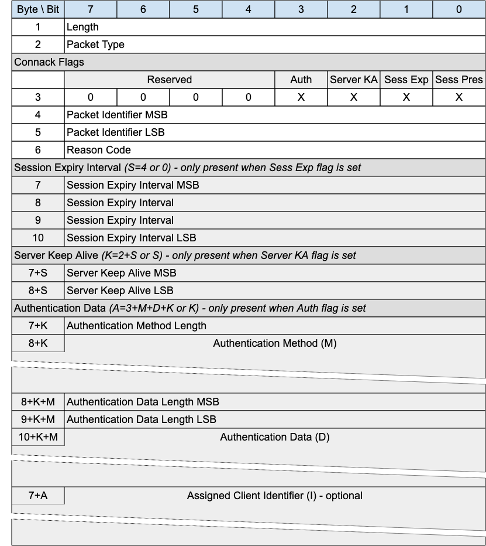
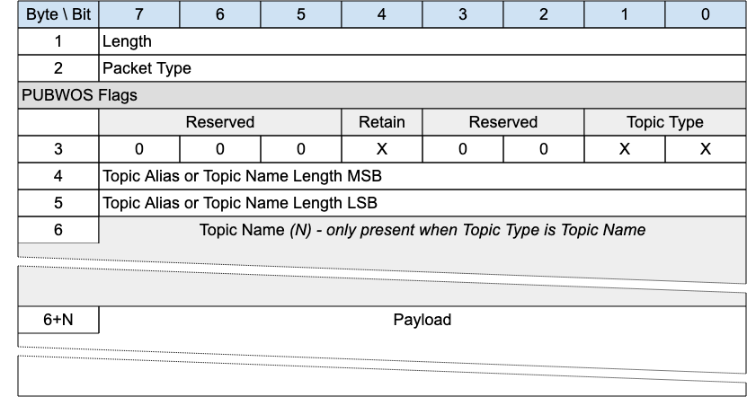
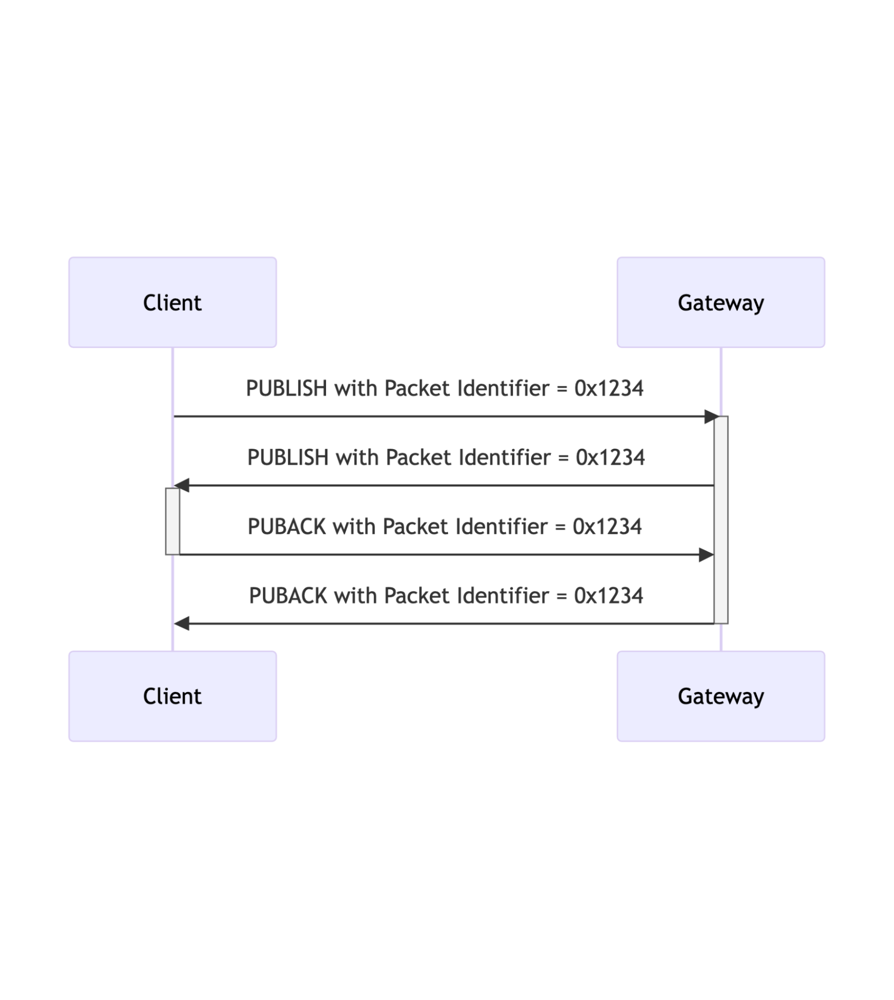

# 1 Introduction

\[[All text is normative unless otherwise labeled]{.mark}\]

## 1.0 Intellectual property rights policy

This specification is provided under the [[Non-Assertion]](https://www.oasis-open.org/policies-guidelines/ipr#Non-Assertion-Mode) Mode of the [[OASIS IPR Policy]](https://www.oasis-open.org/policies-guidelines/ipr), the mode chosen when the Technical Committee was established. For information on whether any patents have been disclosed that may be essential to implementing this specification, and any offers of patent licensing terms, refer to the Intellectual Property Rights section of the TC's web page ([[https://www.oasis-open.org/committees/mqtt/ipr.php]](https://www.oasis-open.org/committees/mqtt/ipr.php)).

## 1.1 Changes from earlier Versions

Here is a description of significant differences from previously published, differently numbered Versions of this specification.

### 1.1.1 MQTT-SN 1.2

- Some terminology has been changed to match MQTT 5.0. For example:

  - Topic Id becomes Topic Alias

  - Message Id becomes Packet Identifier

  - Message Type becomes Packet Type

- The concept of Virtual Connection has been introduced, corresponding to the TCP connection of MQTT.

- The Will Message Packets are removed - setting the Will Message is now done in the CONNECT Packet, as in MQTT.

- The Enhanced Authentication of MQTT 5.0 is supported in CONNECT and CONNACK, and the introduction of the AUTH Packet.

- The *going to sleep* function of DISCONNECT is now the responsibility of a separate Packet - SLEEPREQ, and the response SLEEPRESP. As a result, DISCONNECT never has a response.

- The Short Topic Name has been removed - all publish packets now support full Topic Names as well as Topic Aliases.

- All responses allow a Reason Code to be returned. DISCONNECT also allows a Reason String for enhanced diagnostics. A set of Reason Codes and their use is included.

- Inspired by OSCORE, a Protection Encapsulation is introduced to provide lightweight authentication and encryption.

- Session Expiry, Maximum Packet Size, Assigned Client Identifier and Subscribe Options (No Local, Retain Handling, Retain as Published) have been adopted from MQTT.

## 1.2 Organization of the MQTT-SN specification

The specification is split into six chapters:

- [Chapter](#_heading=h.2bxgwvm) 1 -- Introduction

- Chapter 2 -- MQTT-SN Control Packet format

- Chapter 3 -- MQTT-SN Control Packets

- Chapter 4 -- Operational Behavior

- Chapter 5 - Security

- Chapter 6 -- Conformance

## 1.3 Terminology

The keywords \"MUST\", \"MUST NOT\", \"REQUIRED\", \"SHALL\", \"SHALL NOT\", \"SHOULD\", \"SHOULD NOT\", \"RECOMMENDED\", \"MAY\", and \"OPTIONAL\" in this specification are to be interpreted as described in IETF RFC 2119 \[RFC2119\], except where they appear in text that is marked as non-normative.

**Datagram:**

An independent, self-contained sequence of bytes. If received, the contents of a datagram must be correct.

**Underlying Network:**

The underlying network which provides the means to send datagrams from one network endpoint to another.

**Network Address:**

A unique label provided by the Underlying Network to identify a network endpoint.

To receive datagrams, an MQTT-SN Client or Server listens to the network for packets addressed to a specific Network Address.

**Network Identity:**

The identity used to establish that a sequence of datagrams originates from the same sender. This could be, for example:

- A Network Address

- A DTLS connection ID

- An MQTT-SN Protection Packet Sender Identifier

**Virtual Connection:**

An MQTT-SN construct corresponding to the network connection in MQTT. It associates a Network Identity with a Session, by means of the Client Identifier.

**Application Message:**

The data carried by the MQTT-SN (or MQTT) protocols across the network for the application. When an Application Message is transported by MQTT-SN (or MQTT) it contains payload data, a Quality of Service (QoS), and a Topic Name.

**Client:**

A program or device that uses MQTT-SN. An MQTT-SN Client does one or more of the following:

- creates a Virtual Connection to a Server, then:

  - publishes Application Messages that other Clients might be interested in.

  - subscribes to request Application Messages that it is interested in receiving.

  - unsubscribes to remove a request for Application Messages.

  - deletes the Virtual Connection to the Server.

- without using a Virtual Connection

  - publishes Application Messages to one or more recipients.

**Server:**

A program or device that acts as an intermediary between Clients which publish Application Messages and Clients which have made Subscriptions.

A Server does one or more of the following:

- accepts CONNECT requests from Clients and then:

  - accepts Application Messages published by Clients.

  - processes Subscribe and Unsubscribe requests from Clients.

  - forwards Application Messages that match Client Subscriptions.

  - accepts DISCONNECT requests from connected Clients.

- without using a Virtual Connection:

  - accepts Application Messages.

- opens an MQTT Network Connection to an MQTT Server, then:

  - accepts Application Messages from the MQTT Server and forwards some or all to MQTT-SN Clients.

  - accepts Application Messages from MQTT-SN Clients and forwards some or all to the MQTT Server.

- opens an MQTT Network Connection to an MQTT Server when an MQTT-SN CONNECT request is received, then:

  - forwards equivalent MQTT packets to the MQTT Server for each MQTT-SN packet received

  - forwards equivalent MQTT-SN packets to the MQTT-SN Client for each MQTT packet received

  - closes the MQTT Network Connection when the MQTT-SN Virtual Connection is deleted

<!-- -->

-

- accepts Application Messages from MQTT-SN Clients and forwards some or all to the MQTT Server.

**Gateway:**

An MQTT-SN Server that uses one or more TCP connections to communicate with an MQTT Server.

**MQTT Client:**

A program or device that uses MQTT. An MQTT Client:

- opens the Network Connection to the MQTT Server.

- publishes Application Messages that other MQTT (or MQTT-SN) Clients might be interested in.

- subscribes to request Application Messages that it is interested in receiving.

- unsubscribes to remove a request for Application Messages.

- closes the Network Connection to the Server.

**MQTT Server:**

A program or device that acts as an intermediary between MQTT Clients which publish Application Messages and MQTT Clients which have made Subscriptions.

Also known informally as an MQTT **Broker**.

An MQTT Server:

- accepts Network Connections from MQTT Clients.

- accepts Application Messages published by MQTT Clients.

- processes Subscribe and Unsubscribe requests from MQTT Clients.

- forwards Application Messages that match MQTT Client Subscriptions.

- closes the Network Connection from the MQTT Client.

**Client Identifier:**

A UTF-8 encoded character string which uniquely identifies every Client connecting to a Server.

**Session:**

A stateful interaction between a Client and a Server which is associated with a Client Identifier. Some Sessions last only as long as the Virtual Connection, others can span multiple consecutive Virtual Connections between a Client and a Server.

**Session State:**

The set of data that describes a Session. The Session State held by a Client is different to that held by a Server. See [[4.1 Session state]](#session-state) for details.

**Subscription:**

A Subscription comprises a Topic Filter and a maximum QoS. A Subscription is associated with a single Session. A Session can contain more than one Subscription. Each Subscription within a Session has a different Topic Filter.

**Wildcard Subscription:**

A Wildcard Subscription is a Subscription with a Topic Filter containing one or more wildcard characters. This allows the subscription to match more than one Topic Name. Refer to [[4.7.1.1 Topic wildcards]](#topic-wildcards) for a description of wildcard characters in a Topic Filter.

**Topic Name:**

A label attached to an Application Message which is matched against the Subscriptions known to the Server.

**Topic Alias:**

A Topic Alias is a Two Byte Integer value that is used to identify the Topic instead of using the Topic Name. This reduces Packet sizes, and is useful when the Topic Names are long and the same Topic Names are used repetitively within a Virtual Connection.

**Topic Filter:**

An expression contained in a Subscription to indicate an interest in one or more topics. A Topic Filter can include wildcard characters and can match more than one Topic Name.

**MQTT-SN Control Packet:**

A packet of information that is sent to a Network Address.

**Malformed Packet:**

A Control Packet that cannot be parsed according to this specification. Refer to [[4.12 Handling errors]](#handling-errors) for information about error handling.

**Protocol Error:**

An error that is detected after the packet has been parsed and found to contain data that is not allowed by the protocol or is inconsistent with the state of the Client or Server. Refer to [[4.12 Handling errors]](#handling-errors) for information about error handling.

**Will Message:**

An Application Message which is published by the Server after the Virtual Connection is deleted in cases where the Virtual Connection is not deleted normally. Refer to [[3.1.3 Will Flags]](#will-flags) for information about Will Messages.

**Retained Message:**

An Application Message which is stored by the Server for a Topic Name. When a Client subscribes to a topic which has a Retained Message set, the Server sends the Retained Message to the Client, depending on the setting of the Retain Handling Subscribe Flags. Refer to [[3.7.2 SUBSCRIBE Flags]](#subscribe-flags) and [[4.13 Retained Messages]](#retained-messages) for more information about Retained Messages.

**Disallowed Unicode code point:**

The set of Unicode Control Codes and Unicode Noncharacters which should not be included in a UTF-8 Encoded String. Refer to [[1.7.4 UTF-8 Encoded String]](#utf-8-encoded-string) for more information about the Disallowed Unicode code points.

## 1.4 Normative references

[\[Required section.\]]{.mark}

[This appendix contains the normative and informative references that are used in this document.]{.mark}

[While any hyperlinks included in this appendix were valid at the time of publication, OASIS cannot guarantee their long-term validity.]{.mark}

[Note: Any normative work cited in the body of the text as needed to implement the work product must be listed in the Normative References section below. Each reference to a separate document or artifact in this work must be listed here and must be identified as either a Normative or an Informative Reference.]{.mark}

[For all References -- Normative and Informative:]{.mark}

[Recommended approach: Set up **\[Reference\]** label elements as \"Bookmarks\", then create hyperlinks to them within the document at locations from which the references are cited. Citations in the body of the text should be hyperlinked to the appropriate Reference entry, not directly to targets which are not a part of this Work Product.]{.mark}

[The proper format for citation of technical work produced by an OASIS TC (whether Standards Track or Non-Standards Track) is:]{.mark}

[**\[Citation Label\]**]{.mark}

[Work Product title (italicized). Edited by Albert Alston, Bob Ballston, and Calvin Carlson. Approval date (DD Month YYYY). OASIS Stage Identifier and Revision Number (e.g., OASIS Committee Specification Draft 01). Principal URI (stage-specific URI, e.g., with stage component: somespec-v1.0-csd01.html). Latest stage: (static URI, without stage identifiers, used as a symbolic link to most recently published stage of this Version).]{.mark}

[]{.mark}

[For example:]{.mark}

[]{.mark}

**[\[OpenDoc-1.2\]]{.mark}**

[Open Document Format for Office Applications (OpenDocument) Version 1.2. Edited by Patrick Durusau and Michael Brauer. 19 January 2011. OASIS Committee Specification Draft 07. https://docs.oasis-open.org/office/v1.2/csd07/OpenDocument-v1.2-csd07.html. Latest stage: https://docs.oasis-open.org/office/v1.2/OpenDocument-v1.2.html.]{.mark}

[]{.mark}

[Reference sources:]{.mark}

[For references to IETF RFCs, use the approved citation formats at:]{.mark}

[[[https://docs.oasis-open.org/templates/ietf-rfc-list/ietf-rfc-list.html]](https://docs.oasis-open.org/templates/ietf-rfc-list/ietf-rfc-list.html).]{.mark}

[The most recent IETF RFC references are listed by the IETF at [[https://www.rfc-editor.org/in-notes/rfc-ref.txt]](https://www.rfc-editor.org/in-notes/rfc-ref.txt).]{.mark}

[For references to W3C Recommendations, use the approved citation formats at:]{.mark}

[[[https://docs.oasis-open.org/templates/w3c-recommendations-list/w3c-recommendations-list.html]](https://docs.oasis-open.org/templates/w3c-recommendations-list/w3c-recommendations-list.html).]{.mark}

[Remove this note before submitting for publication.]{.mark}

**\[RFC2119\]**

Bradner, S., \"Key words for use in RFCs to Indicate Requirement Levels\", BCP 14, RFC 2119, DOI 10.17487/RFC2119, March 1997,

[[http://www.rfc-editor.org/info/rfc2119]](http://www.rfc-editor.org/info/rfc2119)

[\[RFC8174\]]{.mark}

[Leiba, B., \"Ambiguity of Uppercase vs Lowercase in RFC 2119 Key Words\", BCP 14, RFC 8174, DOI 10.17487/RFC8174, May 2017, \<[[https://www.rfc-editor.org/info/rfc8174]](https://www.rfc-editor.org/info/rfc8174)\>.]{.mark}

**\[RFC3629\]**

Yergeau, F., \"UTF-8, a transformation format of ISO 10646\", STD 63, RFC 3629, DOI 10.17487/RFC3629, November 2003,

[[http://www.rfc-editor.org/info/rfc3629]](http://www.rfc-editor.org/info/rfc3629)

**\[RFC6455\]**

Fette, I. and A. Melnikov, \"The WebSocket Protocol\", RFC 6455, DOI 10.17487/RFC6455, December 2011,

[[http://www.rfc-editor.org/info/rfc6455]](http://www.rfc-editor.org/info/rfc6455)

**\[Unicode\]**

The Unicode Consortium. The Unicode Standard,

[[http://www.unicode.org/versions/latest/]](http://www.unicode.org/versions/latest/)

## 1.5 Informative References

[\[RFC3552\]]{.mark}

[Rescorla, E. and B. Korver, \"Guidelines for Writing RFC Text on Security Considerations\", BCP 72, RFC 3552, DOI 10.17487/RFC3552, July 2003, \<[[https://www.rfc-editor.org/info/rfc3552]](https://www.rfc-editor.org/info/rfc3552)\>.]{.mark}

[\[Reference\]]{.mark}

[\[Full reference citation\]]{.mark}

## 1.6 MQTT For Sensor Networks (MQTT-SN)

Sensor Networks are simple, low cost and easy to deploy. They are typically used to provide event detection, monitoring, automation, process control and more. Sensor Networks often comprise many battery-powered sensors and actuators, each containing a limited amount of storage and processing capability. They usually communicate wirelessly.

Sensor Networks are typically self-forming, continually changing, and do not have any central control. The wireless network connections and processing nodes will fail, and the batteries will run out. The nodes will be replaced, added or removed in an unplanned way. The identities of the devices are usually created when they are manufactured, this avoids the need for specialist configuration when they are deployed. Applications running outside the Sensor Network do not need to know the details of the devices in it. The applications consume information from the sensors and send instructions to actuators based only on labels created by the application designers. The labels are called Topic Names in the MQTT and MQTT-SN protocols. The MQTT-SN implementation carries information between a set of applications and the correct set of devices based on its knowledge of the network and the applications designer's choice of Topic Names.

Consider an example of a medicine tracking application. The application needs to know the location and temperature of the medicine, but it does not want to concern itself with the network details of the devices providing the data. It may be that the number and types of the devices changes over time. There may also be other applications using the same sensor data for other purposes. The model is that the devices and applications produce and consume data addressed by the Topics rather than the other devices and applications.

This MQTT-SN specification is a variant of the MQTT version 5 specification. It is adapted to exploit low power and low bandwidth wireless networks. Low power wireless radio links typically have higher numbers of transmission errors compared to more powerful networks because they are more susceptible to interference and fading of the radio signals. They also have lower transmission rates.

For example, wireless networks based on the IEEE 802.15.4 standard used by Zigbee have a maximum bandwidth of 250 kbit/s in the 2.4 GHz band. To reduce transmission errors the packets are kept short. The maximum packet length at the physical layer is 128 bytes and half of these may be used for Media Access Control and security.

The MQTT-SN protocol is optimized for implementation on low-cost, battery-operated devices with limited processing and storage resources. The capabilities are kept simple and the specification allows partial implementations.

### 1.6.1 Differences Between MQTT-SN and MQTT

To facilitate interoperation MQTT-SN is similar in many ways to MQTT, but the two are independent of each other.

MQTT-SN can work isolated from other networks or in conjunction with MQTT. The main differences between MQTT-SN and MQTT are:

1.  In addition to Topic Alias and long Topic Names MQTT-SN allows Predefined Topic Aliases.

2.  Support for sleeping clients allows battery operated devices to enter a low power mode. In this state, Application Messages for the Client are buffered by the Server and delivered when the client wakes.

3.  A new Quality of Service level (WITHOUT SESSION) is introduced in MQTT-SN, allowing devices to publish without a session having been established.

4.  MQTT-SN has fewer requirements on the underlying transport and it can use connectionless network transports such as User Datagram Protocol (UDP).

5.  MQTT-SN introduces the PROTECTION packet for packet-based security based on symmetric-key cryptography.

6.  If the network supports sending messages to more than one recipient at once, Gateway Advertisement and Discovery can be implemented.

## 1.7 Data representation

### 1.7.1 Bits (Byte)

Bits in a byte are labeled 7 to 0. Bit number 7 is the most significant bit, the least significant bit is assigned bit number 0.

### 1.7.2 Two Byte Integer

Two Byte Integer data values are 16-bit unsigned integers in big-endian order: the high order byte precedes the lower order byte. This means that a 16-bit word is presented on the network as Most Significant Byte (MSB), followed by Least Significant Byte (LSB).

### 1.7.3 Four Byte Integer

Four Byte Integer data values are 32-bit unsigned integers in big-endian order: the high order byte precedes the successively lower order bytes. This means that a 32-bit word is presented on the network as Most Significant Byte (MSB), followed by the next most Significant Byte (MSB), followed by the next most Significant Byte (MSB), followed by Least Significant Byte (LSB).

### 1.7.4 UTF-8 Encoded String

Text fields within the MQTT-SN Control Packets are encoded as fixed length UTF-8 strings. UTF-8 [\[RFC3629\]](#RFC3629) is an efficient encoding of Unicode [\[Unicode\]](#Unicode) characters that optimizes the encoding of ASCII characters in support of text-based communications.

Unless stated otherwise all variable length UTF-8 encoded strings can have any length in the range 0 to 65,535 bytes.

*Figure 1-1 -- Structure of UTF-8 Encoded Strings*

{width="6.5in" height="1.0277777777777777in"}

«<mark title="Requirement MQTT-SN-1.7.4-1">The character data in a UTF-8 Encoded String MUST be well-formed UTF-8 as defined by the Unicode specification [\[Unicode\]](#Unicode) and restated in RFC 3629 [\[RFC3629\]](#RFC3629). In particular, the character data MUST NOT include encodings of code points between U+D800 and U+DFFF</mark>»\[MQTT‑SN‑1.7.4‑1].

If the Client or Server receives an MQTT-SN Control Packet containing ill-formed UTF-8 it is a Malformed Packet. Refer to [[4.12 Handling errors]](#handling-errors) for information about handling errors.

«<mark title="Requirement MQTT-SN-1.7.4-2">A UTF-8 Encoded String MUST NOT include an encoding of the null character U+0000</mark>»\[MQTT‑SN‑1.7.4‑2]. If a receiver (Server or Client) receives an Control Packet containing U+0000 in a UTF-8 Encoded String it is a Malformed Packet.

UTF-8 Encoded Strings SHOULD NOT include the Unicode \[Unicode\] code points listed below. If a receiver (Server or Client) receives an MQTT-SN Control Packet with UTF-8 Encoded Strings containing any of them it MAY treat it as a Malformed Packet. These are the Disallowed Unicode code points.

- U+0001..U+001F control characters

- U+007F..U+009F control characters

- Code points defined in the Unicode specification [\[Unicode\]](#Unicode) to be non-characters (for example U+0FFFF)

«<mark title="Requirement MQTT-SN-1.7.4-3">A UTF-8 encoded sequence 0xEF 0xBB 0xBF is always interpreted as U+FEFF (\"ZERO WIDTH NO-BREAK SPACE\") wherever it appears in a string and MUST NOT be skipped over or stripped off by a packet receiver</mark>»\[MQTT‑SN‑1.7.4‑3].

> **Informative example**
>
> For example, the string A𪛔 which is LATIN CAPITAL Letter A followed by the code point U+2A6D4 (which represents a CJK IDEOGRAPH EXTENSION B character) is encoded as follows:

*Figure 1-2 -- Fixed Length UTF-8 Encoded String informative example*

> {width="6.5in" height="2.5972222222222223in"}

# 2 MQTT-SN Control Packet format

## 2.1 Structure of an MQTT-SN Control Packet

The MQTT-SN protocol operates by exchanging a series of MQTT-SN Control Packets in a defined way. This section describes the format of these packets.

An MQTT-SN Control Packet consists of up to two parts, always in the following order as shown below.

*Figure 2-1 －Structure of an MQTT-SN Control Packet*

  -----------------------------------------------------------------------------------------------------------------------------------------------------
  Control Packet Header, present in all MQTT-SN Control Packets
  -----------------------------------------------------------------------------------------------------------------------------------------------------
  Control Packet Variable Part, present in some MQTT-SN Control Packets

  -----------------------------------------------------------------------------------------------------------------------------------------------------

### 2.1.1 Packet Header

Each MQTT-SN Control Packet contains a Header of format 1 or format 2 as shown below.

*Figure 2-2 -- Packet Header Format 1*

{width="6.5in" height="0.7222222222222222in"}

*Figure 2-3 -- Packet Header Format 2*

{width="6.5in" height="1.1944444444444444in"}

### 2.1.2 Length

The *Length* field is either 1-byte or 3-byte integer and specifies the total number of bytes contained in the packet (including the *Length* field itself).

If the first byte of the *Length* field is coded "0x01" then the *Length* field is 3-bytes long; in this case, the two following bytes specify the total number of bytes of the packet (most-significant byte first). Otherwise, the *Length* field is only 1-byte long and specifies itself the total number of bytes contained in the packet.

The 3-byte format allows the encoding of packet lengths up to 65,535 bytes. It is more efficient to use the shorter 1-byte format for packets with lengths up to and including 255 bytes.

«<mark title="Requirement MQTT-SN-2.1.2-1">A Client or Server receiving MQTT-SN control packets MUST be able to process both 1-byte and 3-byte length formats</mark>»\[MQTT‑SN‑2.1.2‑1].

**Informative comment**

> MQTT-SN does not support packet fragmentation and reassembly, the maximum packet length that could be used in a network is governed by the maximum packet size that is supported by that network, and not by the maximum length that could be encoded by MQTT-SN.

### 2.1.3 MQTT-SN Control Packet Type

The MQTT-SN Control Packet Type field is a 1-byte unsigned value, the values are shown below.

*Figure 2-4 -- MQTT-SN Control Packet Types*

+------------------------------+-------------------+---------------------------------+--------------------------------------------------------------+
| **Name**                     | **Value**         | **Direction of flow**           | **Description**                                              |
+------------------------------+-------------------+---------------------------------+--------------------------------------------------------------+
| **Reserved**                 | 0x00              | Forbidden                       | Reserved                                                     |
+------------------------------+-------------------+---------------------------------+--------------------------------------------------------------+
| **CONNECT**                  | 0x01              | Client to Server                | Virtual Connection request                                   |
+------------------------------+-------------------+---------------------------------+--------------------------------------------------------------+
| **CONNACK**                  | 0x02              | Server to Client                | Virtual Connection acknowledgement                           |
+------------------------------+-------------------+---------------------------------+--------------------------------------------------------------+
| **PUBLISH**                  | 0x03              | Client to Server or             | Publish message                                              |
|                              |                   |                                 |                                                              |
|                              |                   | Server to Client                |                                                              |
+------------------------------+-------------------+---------------------------------+--------------------------------------------------------------+
| **PUBACK**                   | 0x04              | Client to Server or             | Publish acknowledgment (QoS 1) or Publish error (Any QoS).   |
|                              |                   |                                 |                                                              |
|                              |                   | Server to Client                |                                                              |
+------------------------------+-------------------+---------------------------------+--------------------------------------------------------------+
| **PUBREC**                   | 0x05              | Client to Server or             | Publish received (QoS 2 delivery part 1)                     |
|                              |                   |                                 |                                                              |
|                              |                   | Server to Client                |                                                              |
+------------------------------+-------------------+---------------------------------+--------------------------------------------------------------+
| **PUBREL**                   | 0x06              | Client to Server or             | Publish release (QoS 2 delivery part 2)                      |
|                              |                   |                                 |                                                              |
|                              |                   | Server to Client                |                                                              |
+------------------------------+-------------------+---------------------------------+--------------------------------------------------------------+
| **PUBCOMP**                  | 0x07              | Client to Server or             | Publish complete (QoS 2 delivery part 3)                     |
|                              |                   |                                 |                                                              |
|                              |                   | Server to Client                |                                                              |
+------------------------------+-------------------+---------------------------------+--------------------------------------------------------------+
| **SUBSCRIBE**                | 0x08              | Client to Server                | Subscribe request                                            |
+------------------------------+-------------------+---------------------------------+--------------------------------------------------------------+
| **SUBACK**                   | 0x09              | Server to Client                | Subscribe acknowledgment                                     |
+------------------------------+-------------------+---------------------------------+--------------------------------------------------------------+
| **UNSUBSCRIBE**              | 0x0A              | Client to Server                | Unsubscribe request                                          |
+------------------------------+-------------------+---------------------------------+--------------------------------------------------------------+
| **UNSUBACK**                 | 0x0B              | Server to Client                | Unsubscribe acknowledgment                                   |
+------------------------------+-------------------+---------------------------------+--------------------------------------------------------------+
| **PINGREQ**                  | 0x0C              | Client to Server                | PING request                                                 |
+------------------------------+-------------------+---------------------------------+--------------------------------------------------------------+
| **PINGRESP**                 | 0x0D              | Server to Client                | PING response                                                |
+------------------------------+-------------------+---------------------------------+--------------------------------------------------------------+
| **DISCONNECT**               | 0x0E              | Client to Server or             | Disconnect notification                                      |
|                              |                   |                                 |                                                              |
|                              |                   | Server to Client                |                                                              |
+------------------------------+-------------------+---------------------------------+--------------------------------------------------------------+
| **AUTH**                     | 0x0F              | Client to Server or Server to   | Authentication handshake                                     |
|                              |                   | Client                          |                                                              |
+------------------------------+-------------------+---------------------------------+--------------------------------------------------------------+
| **REGISTER**                 | 0x10              | Client to Server                | Request topic alias                                          |
+------------------------------+-------------------+---------------------------------+--------------------------------------------------------------+
| **REGACK**                   | 0x11              | Server to Client                | Supply topic alias                                           |
+------------------------------+-------------------+---------------------------------+--------------------------------------------------------------+
| **PUBWOS**                   | 0x12              | Client to Server or             | Publish packet for out of session messages which have no     |
|                              |                   |                                 | session on the receiver                                      |
|                              |                   | Server to Client                |                                                              |
+------------------------------+-------------------+---------------------------------+--------------------------------------------------------------+
| **SLEEPREQ**                 | 0x13              | Client to Server                | Sleep request                                                |
+------------------------------+-------------------+---------------------------------+--------------------------------------------------------------+
| **SLEEPRESP**                | 0x14              | Server to Client                | Sleep response                                               |
+------------------------------+-------------------+---------------------------------+--------------------------------------------------------------+
| **WAKEUP**                   | 0x15              | Server to Client                | Wake up request                                              |
+------------------------------+-------------------+---------------------------------+--------------------------------------------------------------+
| **ADVERTISE**                | 0x16              | Server to Clients               | Advertise the Server presence                                |
+------------------------------+-------------------+---------------------------------+--------------------------------------------------------------+
| **SEARCHGW**                 | 0x17              | Client to Servers               | Client GWINFO request                                        |
+------------------------------+-------------------+---------------------------------+--------------------------------------------------------------+
| **GWINFO**                   | 0x18              | Server to Client                | Response to a SEARCHGW                                       |
+------------------------------+-------------------+---------------------------------+--------------------------------------------------------------+
| **Reserved**                 | 0x19-0xFC         | Forbidden                       | Reserved                                                     |
+------------------------------+-------------------+---------------------------------+--------------------------------------------------------------+
| **Forwarder Encapsulation**  | 0xFD              | Forwarder to Client or          | MQTT-SN packet envelope to add addressing information for    |
|                              |                   |                                 | Forwarders                                                   |
|                              |                   | Forwarder to Server             |                                                              |
+------------------------------+-------------------+---------------------------------+--------------------------------------------------------------+
| **Session Encapsulation**    | 0xFE              | Client to Server                | MQTT-SN Packet envelope to add session identification        |
+------------------------------+-------------------+---------------------------------+--------------------------------------------------------------+
| **Protection Encapsulation** | 0xFF              | Client to Server or Server to   | A protection envelope that can encapsulate any MQTT-SN       |
|                              |                   | Client                          | packet with the exception of Forwarder-Encapsulation packet  |
|                              |                   |                                 | (0xFE)                                                       |
+==============================+===================+=================================+==============================================================+

## 2.2 Packet Identifier

The Variable Header component of many of the MQTT-SN Control Packet types includes a Two Byte Integer Packet Identifier field. MQTT-SN Control Packets that require a Packet Identifier are shown in Figure 2-5.

*Figure 2-5 -- Packets with Packet Identifier*

  -------------------------------------------------------------------------
  **MQTT-SN Control Packet**         **Packet Identifier field**
  ---------------------------------- --------------------------------------
  ADVERTISE                          NO

  AUTH                               YES

  CONNACK                            YES

  CONNECT                            YES

  DISCONNECT                         OPTIONAL

  FORWARDER ENCAPSULATION            NO

  GWINFO                             NO

  PINGREQ                            YES

  PINGRESP                           YES

  PROTECTION ENCAPSULATION           NO

  PUBACK                             YES

  PUBCOMP                            YES

  PUBLISH                            YES (If QoS \> 0)

  PUBREC                             YES

  PUBREL                             YES

  PUBWOS                             NO

  REGACK                             YES

  REGISTER                           YES

  SEARCHGW                           NO

  SLEEPREQ                           YES

  SLEEPRESP                          YES

  SUBACK                             YES

  SUBSCRIBE                          YES

  UNSUBACK                           YES

  UNSUBSCRIBE                        YES

  WAKEUP                             NO
  -------------------------------------------------------------------------

«<mark title="Requirement MQTT-SN-2.2-1">Each time a Client sends a new MQTT-SN Control Packet which is identified in Figure 2-5 as requiring a Packet Identifier, it MUST assign it a non-zero Packet Identifier that is currently unused</mark>»\[MQTT‑SN‑2.2‑1].

«<mark title="Requirement MQTT-SN-2.2-2">A PUBLISH packet MUST NOT contain a Packet Identifier if its QoS value is set to 0</mark>»\[MQTT‑SN‑2.2‑2],

«<mark title="Requirement MQTT-SN-2.2-3">Each time a Server sends a new PUBLISH (with QoS greater than 0) MQTT-SN Control Packet it MUST assign it a non zero Packet Identifier that is currently unused</mark>»\[MQTT‑SN‑2.2‑3].

Packet Identifiers used with PUBLISH, SUBSCRIBE and UNSUBSCRIBE packets form a single, unified set of identifiers separately for the Client and the Server in a Session. A Packet Identifier cannot be used by more than one Packet at any time.

The Packet Identifier becomes available for reuse after the sender has processed the corresponding acknowledgement packet, defined as follows. In the case of a QoS 1 PUBLISH, this is the corresponding PUBACK; in the case of QoS 2 PUBLISH it is PUBCOMP or a PUBREC with a Reason Code of 0x80 or greater. For SUBSCRIBE or UNSUBSCRIBE it is the corresponding SUBACK or UNSUBACK.

«<mark title="Requirement MQTT-SN-2.2-4">A PUBACK, PUBREC , PUBREL, or PUBCOMP packet MUST contain the same Packet Identifier as the PUBLISH packet that was originally sent. A SUBACK and UNSUBACK MUST contain the Packet Identifier that was used in the corresponding SUBSCRIBE and UNSUBSCRIBE packet respectively</mark>»\[MQTT‑SN‑2.2‑4].

The Client and Server assign Packet Identifiers independently of each other. As a result, Client-Server pairs can participate in concurrent Packet exchanges using the same Packet Identifiers.

> **Informative comment**
>
> It is possible for a Client to send a PUBLISH packet with Packet Identifier 0x1234 and then receive a different PUBLISH packet with Packet Identifier 0x1234 from its Server before it receives a PUBACK for the PUBLISH packet that it sent.

*Figure 2-6 - Publishes with the same Packet Identifier*{width="5.2in" height="3.2303029308836395in"}

## 2.3 Reason Code

A Reason Code is a one byte unsigned value that indicates the result of an operation. Reason Codes less than 0x80 indicate successful completion of an operation. The normal Reason Code for success is 0x00. Reason Code values of 0x80 or greater indicate failure.

The Reason Codes share a common set of values as shown below.

*Figure 2-7 -- Reason Codes*

+---------------------------+---------------------------------------+------------------------------------+--------------------------------------------------+
| **Identifier**            | **Name**                              | **Packets**                        | **Description**                                  |
+-------------+-------------+                                       |                                    |                                                  |
| Dec         | Hex         |                                       |                                    |                                                  |
+-------------+-------------+---------------------------------------+------------------------------------+--------------------------------------------------+
| 0           | 0x00        | Success                               | CONNACK, SUBACK, UNSUBACK, REGACK, | The operation was successful.                    |
|             |             |                                       | PUBACK, PUBREC, PUBREL, PUBCOMP,   |                                                  |
|             |             |                                       | SLEEPRESP, AUTH (server only)      |                                                  |
+-------------+-------------+---------------------------------------+------------------------------------+--------------------------------------------------+
| 0           | 0x00        | Normal disconnection                  | DISCONNECT                         | Delete the Virtual Connection normally. Do not   |
|             |             |                                       |                                    | send the Will Message.                           |
+-------------+-------------+---------------------------------------+------------------------------------+--------------------------------------------------+
| 0           | 0x00        | Granted QoS 0                         | SUBACK                             | The subscription is accepted and the maximum QoS |
|             |             |                                       |                                    | sent will be QoS 0. This might be a lower QoS    |
|             |             |                                       |                                    | than was requested.                              |
+-------------+-------------+---------------------------------------+------------------------------------+--------------------------------------------------+
| 1           | 0x01        | Granted QoS 1                         | SUBACK                             | The subscription is accepted and the maximum QoS |
|             |             |                                       |                                    | sent will be QoS 1. This might be a lower QoS    |
|             |             |                                       |                                    | than was requested.                              |
+-------------+-------------+---------------------------------------+------------------------------------+--------------------------------------------------+
| 2           | 0x02        | Granted QoS 2                         | SUBACK                             | The subscription is accepted and any received    |
|             |             |                                       |                                    | QoS will be sent to this subscription.           |
+-------------+-------------+---------------------------------------+------------------------------------+--------------------------------------------------+
| 4           | 0x04        | Disconnect with will message          | DISCONNECT (client only)           | The Client wishes to disconnect but requires     |
|             |             |                                       |                                    | that the Server also publishes its Will Message. |
+-------------+-------------+---------------------------------------+------------------------------------+--------------------------------------------------+
| 16          | 0x10        | No matching subscribers               | PUBACK, PUBREC                     | The Application Message is accepted but there    |
|             |             |                                       |                                    | are no subscribers. If the Server knows that     |
|             |             |                                       |                                    | there are no matching subscribers, it MAY use    |
|             |             |                                       |                                    | this Reason Code instead of 0x00 (Success).      |
+-------------+-------------+---------------------------------------+------------------------------------+--------------------------------------------------+
| 17          | 0x11        | No subscription existed               | UNSUBACK                           | No matching Topic Filter is being used by the    |
|             |             |                                       |                                    | Client.                                          |
+-------------+-------------+---------------------------------------+------------------------------------+--------------------------------------------------+
| 24          | 0x18        | Continue authentication               | AUTH                               | Continue the authentication with another step.   |
+-------------+-------------+---------------------------------------+------------------------------------+--------------------------------------------------+
| 25          | 0x19        | Re-authenticate                       | AUTH (client only)                 | Initiate a re-authentication.                    |
+-------------+-------------+---------------------------------------+------------------------------------+--------------------------------------------------+
| 26          | 0x1A        | Topic Alias Exists                    | REGACK                             | A Session Topic Alias was requested, but a       |
|             |             |                                       |                                    | Session or Predefined Topic Alias already        |
|             |             |                                       |                                    | exists.                                          |
|             |             |                                       |                                    |                                                  |
|             |             |                                       |                                    | (MQTT-SN only)                                   |
+-------------+-------------+---------------------------------------+------------------------------------+--------------------------------------------------+
| 128         | 0x80        | Unspecified error                     | CONNACK, PUBACK, PUBREC, SUBACK,   | The receiver does not accept the request but     |
|             |             |                                       | UNSUBACK, DISCONNECT               | either does not want to reveal the reason, or it |
|             |             |                                       |                                    | does not match one of the other values.          |
+-------------+-------------+---------------------------------------+------------------------------------+--------------------------------------------------+
| 129         | 0x81        | Malformed packet                      | CONNACK, DISCONNECT                | The received packet does not conform to this     |
|             |             |                                       |                                    | specification.                                   |
+-------------+-------------+---------------------------------------+------------------------------------+--------------------------------------------------+
| 130         | 0x82        | Protocol error                        | CONNACK, DISCONNECT                | An unexpected or out of order packet was         |
|             |             |                                       |                                    | received.                                        |
+-------------+-------------+---------------------------------------+------------------------------------+--------------------------------------------------+
| 131         | 0x83        | Implementation specific error         | CONNACK, PUBACK, PUBREC, REGACK,   | The packet received is valid but cannot be       |
|             |             |                                       | SUBACK, UNSUBACK, DISCONNECT       | processed by this implementation.                |
+-------------+-------------+---------------------------------------+------------------------------------+--------------------------------------------------+
| 132         | 0x84        | Unsupported Protocol Version          | CONNACK                            | The Server does not support the version of the   |
|             |             |                                       |                                    | MQTT or MQTT-SN protocol requested by the        |
|             |             |                                       |                                    | Client.                                          |
+-------------+-------------+---------------------------------------+------------------------------------+--------------------------------------------------+
| 133         | 0x85        | Client identifier not valid           | CONNACK                            | The Client Identifier is a valid string but is   |
|             |             |                                       |                                    | not allowed by the Server.                       |
+-------------+-------------+---------------------------------------+------------------------------------+--------------------------------------------------+
| 134         | 0x86        | Bad user name or password             | CONNACK                            | The Server does not accept the User Name or      |
|             |             |                                       |                                    | Password specified by the Client                 |
+-------------+-------------+---------------------------------------+------------------------------------+--------------------------------------------------+
| 135         | 0x87        | Not authorized                        | CONNACK, PUBACK, PUBREC, REGACK,   | The request is not authorized.                   |
|             |             |                                       | SUBACK, UNSUBACK, DISCONNECT       |                                                  |
|             |             |                                       | (server only)                      |                                                  |
+-------------+-------------+---------------------------------------+------------------------------------+--------------------------------------------------+
| 136         | 0x88        | Server unavailable                    | CONNACK                            | The MQTT-SN Server is not available or, in the   |
|             |             |                                       |                                    | case of a Transparent gateway, the MQTT server   |
|             |             |                                       |                                    | is not available.                                |
+-------------+-------------+---------------------------------------+------------------------------------+--------------------------------------------------+
| 137         | 0x89        | Server busy                           | CONNACK, DISCONNECT (server only)  | The Server is busy and cannot continue           |
|             |             |                                       |                                    | processing requests from this Client.            |
+-------------+-------------+---------------------------------------+------------------------------------+--------------------------------------------------+
| 138         | 0x8A        | Banned                                | CONNACK                            | This Client has been banned by administrative    |
|             |             |                                       |                                    | action. Contact the server administrator.        |
+-------------+-------------+---------------------------------------+------------------------------------+--------------------------------------------------+
| 139         | 0x8B        | Server shutting down                  | DISCONNECT (server only)           | The Server is shutting down.                     |
+-------------+-------------+---------------------------------------+------------------------------------+--------------------------------------------------+
| 140         | 0x8C        | Bad authentication method             | CONNACK, DISCONNECT                | The authentication method is not supported or    |
|             |             |                                       |                                    | does not match the authentication method         |
|             |             |                                       |                                    | currently in use.                                |
+-------------+-------------+---------------------------------------+------------------------------------+--------------------------------------------------+
| 141         | 0x8D        | Keep alive timeout                    | DISCONNECT (server only)           | The Connection is closed because no packet has   |
|             |             |                                       |                                    | been received for 1.5 times the Keepalive time.  |
+-------------+-------------+---------------------------------------+------------------------------------+--------------------------------------------------+
| 142         | 0x8E        | Session taken over                    | DISCONNECT (server only)           | Another Connection using the same Client         |
|             |             |                                       |                                    | Identifier has connected causing this Connection |
|             |             |                                       |                                    | to be closed.                                    |
+-------------+-------------+---------------------------------------+------------------------------------+--------------------------------------------------+
| 143         | 0x8F        | Topic filter invalid                  | SUBACK, UNSUBACK, DISCONNECT       | The Topic Filter is correctly formed, but is not |
|             |             |                                       | (server only)                      | accepted by this Server.                         |
+-------------+-------------+---------------------------------------+------------------------------------+--------------------------------------------------+
| 144         | 0x90        | Topic name invalid                    | CONNACK, PUBACK, PUBREC,           | The Topic Name is correctly formed, but is not   |
|             |             |                                       | DISCONNECT (server only)           | accepted by this Client or Server.               |
+-------------+-------------+---------------------------------------+------------------------------------+--------------------------------------------------+
| 145         | 0x91        | Packet identifier in use              | PUBACK, PUBREC, SUBACK, UNSUBACK,  | The specified Packet Identifier is already in    |
|             |             |                                       |                                    | use.                                             |
|             |             |                                       | REGACK, PINGRESP, SLEEPRESP        |                                                  |
+-------------+-------------+---------------------------------------+------------------------------------+--------------------------------------------------+
| 146         | 0x92        | Packet identifier not found           | PUBREL, PUBCOMP                    | The Packet Identifier is not known. This is not  |
|             |             |                                       |                                    | an error during recovery, but at other times     |
|             |             |                                       |                                    | indicates a mismatch between the Session State   |
|             |             |                                       |                                    | on the Client and Server.                        |
+-------------+-------------+---------------------------------------+------------------------------------+--------------------------------------------------+
| 147         | 0x93        | Receive maximum exceeded              | DISCONNECT                         | The Client or Server has received more than      |
|             |             |                                       |                                    | Receive Maximum publication for which it has not |
|             |             |                                       |                                    | sent PUBACK or PUBCOMP.                          |
+-------------+-------------+---------------------------------------+------------------------------------+--------------------------------------------------+
| 148         | 0x94        | Topic alias invalid                   | DISCONNECT (server only)           | The Client or Server has received a PUBLISH      |
|             |             |                                       |                                    | packet containing a Topic Alias which is greater |
|             |             |                                       |                                    | than the Maximum Topic Alias it sent in the      |
|             |             |                                       |                                    | CONNECT or CONNACK packet.                       |
|             |             |                                       |                                    |                                                  |
|             |             |                                       |                                    | (Transparent gateway only)                       |
+-------------+-------------+---------------------------------------+------------------------------------+--------------------------------------------------+
| 149         | 0x95        | Packet too large                      | CONNACK,                           | The packet size is greater than Maximum Packet   |
|             |             |                                       |                                    | Size for this Client or Server.                  |
|             |             |                                       | DISCONNECT                         |                                                  |
+-------------+-------------+---------------------------------------+------------------------------------+--------------------------------------------------+
| 150         | 0x96        | Packet rate too high                  | DISCONNECT                         | The received data rate is too high.              |
+-------------+-------------+---------------------------------------+------------------------------------+--------------------------------------------------+
| 151         | 0x97        | Quota exceeded                        | REGACK, SUBACK, DISCONNECT         | An implementation or administrative imposed      |
|             |             |                                       |                                    | limit has been exceeded.                         |
+-------------+-------------+---------------------------------------+------------------------------------+--------------------------------------------------+
| 152         | 0x98        | Administrative action                 | DISCONNECT                         | The Virtual Connection is deleted due to an      |
|             |             |                                       |                                    | administrative action.                           |
+-------------+-------------+---------------------------------------+------------------------------------+--------------------------------------------------+
| 153         | 0x99        | Payload format invalid                | PUBACK, PUBREC, DISCONNECT (server | The MQTT payload format does not match the one   |
|             |             |                                       | only)                              | specified by the Payload Format Indicator.       |
|             |             |                                       |                                    |                                                  |
|             |             |                                       |                                    | (Transparent gateway only)                       |
+-------------+-------------+---------------------------------------+------------------------------------+--------------------------------------------------+
| 154         | 0x9A        | Retain not supported                  | CONNACK, DISCONNECT (server only)  | The MQTT Server does not support retained        |
|             |             |                                       |                                    | messages.                                        |
|             |             |                                       |                                    |                                                  |
|             |             |                                       |                                    | (Transparent gateway only)                       |
+-------------+-------------+---------------------------------------+------------------------------------+--------------------------------------------------+
| 155         | 0x9B        | QoS not supported                     | CONNACK, DISCONNECT (server only)  | The Client specified a QoS greater than the QoS  |
|             |             |                                       |                                    | specified in a Maximum QoS in the MQTT CONNACK.  |
|             |             |                                       |                                    |                                                  |
|             |             |                                       |                                    | (Transparent gateway only)                       |
+-------------+-------------+---------------------------------------+------------------------------------+--------------------------------------------------+
| 156         | 0x9C        | Use another server                    | CONNACK, DISCONNECT (server only)  | The Client should temporarily change its Server. |
+-------------+-------------+---------------------------------------+------------------------------------+--------------------------------------------------+
| 157         | 0x9D        | Server moved                          | CONNACK, DISCONNECT (server only)  | The Server is moved and the Client should        |
|             |             |                                       |                                    | permanently change its server location.          |
+-------------+-------------+---------------------------------------+------------------------------------+--------------------------------------------------+
| 158         | 0x9E        | Shared subscription not supported     | SUBACK, DISCONNECT (server only)   | The MQTT Server does not support Shared          |
|             |             |                                       |                                    | Subscriptions.                                   |
|             |             |                                       |                                    |                                                  |
|             |             |                                       |                                    | (Transparent gateway only)                       |
+-------------+-------------+---------------------------------------+------------------------------------+--------------------------------------------------+
| 159         | 0x9F        | Connection rate exceeded              | CONNACK, DISCONNECT (server only)  | This Virtual Connection is deleted because the   |
|             |             |                                       |                                    | connection rate is too high.                     |
+-------------+-------------+---------------------------------------+------------------------------------+--------------------------------------------------+
| 160         | 0xAD        | Maximum connect time                  | DISCONNECT (server only)           | The maximum connection time authorized for this  |
|             |             |                                       |                                    | Virtual Connection has been exceeded.            |
+-------------+-------------+---------------------------------------+------------------------------------+--------------------------------------------------+
| 161         | 0xA1        | Subscription identifiers not          | SUBACK, DISCONNECT (server only)   | The MQTT Server does not support Subscription    |
|             |             | supported                             |                                    | Identifiers; the subscription is not accepted.   |
|             |             |                                       |                                    |                                                  |
|             |             |                                       |                                    | (Transparent gateway only)                       |
+-------------+-------------+---------------------------------------+------------------------------------+--------------------------------------------------+
| 162         | 0xA2        | Wildcard subscription not supported   | SUBACK, DISCONNECT (server only)   | The MQTT Server does not support Wildcard        |
|             |             |                                       |                                    | Subscriptions; the subscription is not accepted. |
|             |             |                                       |                                    |                                                  |
|             |             |                                       |                                    | (Transparent Gateway only)                       |
+-------------+-------------+---------------------------------------+------------------------------------+--------------------------------------------------+
| 230         | 0xE6        | Only PROTECTION packet supported      | Any packet except PROTECTION and   | The Receiver was expecting a packet to be        |
|             |             | (Note 1)                              | Forwarder Encapsulation            | Protection Encapsulated.                         |
|             |             |                                       |                                    |                                                  |
|             |             |                                       |                                    | (MQTT-SN only)                                   |
+-------------+-------------+---------------------------------------+------------------------------------+--------------------------------------------------+
| 231         | 0xE7        | Protection scheme invalid             | DISCONNECT                         | Specific to MQTT-SN                              |
+-------------+-------------+---------------------------------------+------------------------------------+--------------------------------------------------+
| 232         | 0xE8        | Unknown Sender Id                     | DISCONNECT                         | Specific to MQTT-SN                              |
+-------------+-------------+---------------------------------------+------------------------------------+--------------------------------------------------+
| 240         | 0xF0        | Unknown Topic Alias                   | PUBACK, PUBREC, SUBACK, UNSUBACK,  | Specific to MQTT-SN                              |
|             |             |                                       | REGACK                             |                                                  |
+-------------+-------------+---------------------------------------+------------------------------------+--------------------------------------------------+
| 241         | 0xF1        | Congestion                            | SUBACK, REGACK, CONNACK, PUBACK,   | Try again later. See [[C.3 Server                |
|             |             |                                       | PUBREC                             | Congestion]](#c.2-server-congestion) |
|             |             |                                       |                                    |                                                  |
|             |             |                                       |                                    | (MQTT-SN only)                                   |
+-------------+-------------+---------------------------------------+------------------------------------+--------------------------------------------------+
| 242         | 0xF2        | Protection packet not supported       | DISCONNECT                         | Specific to MQTT-SN                              |
+-------------+-------------+---------------------------------------+------------------------------------+--------------------------------------------------+
| 243         | 0xF3        | Forwarder Encapsulation not supported | DISCONNECT                         | Specific to MQTT-SN                              |
+-------------+-------------+---------------------------------------+------------------------------------+--------------------------------------------------+
| 244         | 0xF4        | No Virtual Connection exists          | DISCONNECT                         | Specific to MQTT-SN                              |
+-------------+-------------+---------------------------------------+------------------------------------+--------------------------------------------------+
| 245         | 0xF5        | Reserved for MQTT-SN                  |                                    | Specific to MQTT-SN                              |
|             |             |                                       |                                    |                                                  |
| \-          | \-          |                                       |                                    |                                                  |
|             |             |                                       |                                    |                                                  |
| 255         | 0xFF        |                                       |                                    |                                                  |
+=============+=============+=======================================+====================================+==================================================+

Note(s):

1.  It is used by a receiver to indicate that it expected a packet to be protected and it wasn\'t.

2.  The MQTT-SN dedicated range of reason codes is from 0xE6 (230) to 0xFF(255).
