::: {}
[]{.c2}
:::

[MQTT for Sensor Networks (MQTT-SN) Version 2.0]{.c17 .c270 .c75 .c44
.c32 .c283}

[Committee Specification Draft 01]{.c17 .c120 .c75 .c44 .c32}

[0]{.c48 .c44}[9]{.c44 .c270}[ October 2025]{.c48 .c44}

[This stage:]{.c48 .c17 .c44 .c32}

[...]{.c48 .c17 .c44 .c32}

[Previous stage:]{.c48 .c17 .c44 .c32}

[N/A]{.c48 .c17 .c44 .c32}

[Latest stage:]{.c48 .c17 .c44 .c32}

[...]{.c48 .c17 .c44 .c32}

[Technical Committee:]{.c48 .c17 .c44}

[[OASIS Message Queuing Telemetry Transport (MQTT)
TC](https://www.google.com/url?q=https://www.oasis-open.org/committees/mqtt/&sa=D&source=editors&ust=1759864763412429&usg=AOvVaw3WOwFz3Qg-HOHyqU7_YgGj){.c4}]{.c9
.c17 .c154}

[Chairs:]{.c48 .c17 .c44}

[Ian Craggs (]{.c3 .c17
.c32}[[icraggs@gmail.com](mailto:icraggs@gmail.com){.c4}]{.c3 .c17
.c32}[), Individual]{.c3 .c17 .c32}

[Simon Johnson (]{.c3 .c17}[simon.johnson@hivemq.com]{.c3 .c297}[),
]{.c3 .c17}[HiveMQ GmbH]{.c3}

[Editors:]{.c48 .c17 .c44}

[Andrew B]{.c3 .c17}[anks ]{.c3}[(andrewdjbanks@gmail.com]{.c3}[),
Individual]{.c3 .c17}

[Ian Craggs
(]{.c12}[[icraggs@gmail.com](mailto:icraggs@gmail.com){.c4}]{.c12}[),
Individual]{.c3 .c17}

[Rahul Gupta
(]{.c3}[[rahul.gupta@us.ibm.com](mailto:rahul.gupta@us.ibm.com){.c4}]{.c3}[),
]{.c3}[[IBM](https://www.google.com/url?q=http://www.ibm.com&sa=D&source=editors&ust=1759864763413381&usg=AOvVaw3uUIc9aKb_YR75HvoT6PIi){.c4}]{.c3}

[Stefan Hagen
(]{.c3}[[stefan@hagen.link](mailto:stefan@hagen.link){.c4}]{.c3}[),
Individual]{.c3 .c17}

[Simon Johnson
(]{.c12}[[simon](mailto:simon622@gmail.com){.c4}]{.c12}[.johnson@hivemq.com),
HiveMQ GmbH]{.c3 .c17}

[Davide Lenzarini
(]{.c12}[[davide.lenzarini@u-blox.com](mailto:davide.lenzarini@u-blox.com){.c4}]{.c12}[),
u-blox AG]{.c3 .c17}

[Andy Stanford-Clark (andysc@uk.ibm.com), IBM]{.c3 .c17}

[Tara E. Walker
(]{.c3}[[tara.walker@microsoft.com](mailto:tara.walker@microsoft.com){.c4}]{.c3}[),
]{.c3}[[Microsoft
Corporation](https://www.google.com/url?q=http://www.microsoft.com/&sa=D&source=editors&ust=1759864763414108&usg=AOvVaw34ebJD7tptKCb95j7vTMzN){.c4}]{.c3}

[]{#id.2et92p0}

[Related work:]{.c48 .c17 .c44}

[This specification is related to:]{.c3 .c17}

- [MQTT Version 5.0]{.c3 .c111 .c36}[. Edited by Andrew Banks, Ed
  Briggs, Ken Borgendale, and Rahul Gupta. OASIS Standard. Latest
  version: ]{.c3
  .c17}[[https://docs.oasis-open.org/mqtt/mqtt/v5.0/mqtt-v5.0.html](https://www.google.com/url?q=https://docs.oasis-open.org/mqtt/mqtt/v5.0/mqtt-v5.0.html&sa=D&source=editors&ust=1759864763414578&usg=AOvVaw24b42uqLLMNVBjcWR5Hzyp){.c4}]{.c9
  .c17 .c154}[.]{.c9 .c17 .c154}
- [MQTT Version 3.1.1]{.c3 .c36 .c111}[. Edited by Andrew Banks and
  Rahul Gupta. OASIS Standard. Latest version: ]{.c3
  .c17}[[http://docs.oasis-open.org/mqtt/mqtt/v3.1.1/mqtt-v3.1.1.html](https://www.google.com/url?q=http://docs.oasis-open.org/mqtt/mqtt/v3.1.1/mqtt-v3.1.1.html&sa=D&source=editors&ust=1759864763414916&usg=AOvVaw2dQz0zJNtyNyRpyNyvGxTn){.c4}]{.c9
  .c17 .c154}[.]{.c3 .c17}
- [MQTT-SN Version 1.2]{.c3 .c111 .c36}[ by Andy Stanford-Clark and Hong
  Linh Truong. Link: ]{.c3
  .c17}[[https://www.oasis-open.org/committees/download.php/66091/MQTT-SN_spec_v1.2.pdf](https://www.google.com/url?q=https://www.oasis-open.org/committees/download.php/66091/MQTT-SN_spec_v1.2.pdf&sa=D&source=editors&ust=1759864763415246&usg=AOvVaw3dxelGig1dC12ZWgTfb6aG){.c4}]{.c9
  .c17 .c154}[.]{.c3 .c17}

[Abstract:]{.c17 .c44 .c48}

[This specification defines the MQTT for Sensor Networks protocol
(MQTT-SN). It is closely related to the MQTT v3.1.1 and MQTT v5.0
standards. MQTT-SN is optimized for implementation on low-cost,
battery-operated devices with limited processing and storage resources.
It is designed so that it will work over a variety of networking
technologies and bridge to an MQTT network.]{.c3 .c17}

[Status:]{.c48 .c17 .c44}

[This ]{.c3 .c17}[document was last revised or approved by the OASIS
Message Queuing Telemetry Transport (MQTT) TC on the above
date.]{.c9}[ ]{.c3 .c17}[The level of approval is also listed above.
Check the \"Latest stage\" location noted above for possible later
revisions of this document. Any other numbered Versions and other
technical work produced by the Technical Committee (TC) are listed at
]{.c9}[[https://www.oasis-open.org/committees/tc_home.php?wg_abbrev=mqtt#technical](https://www.google.com/url?q=https://www.oasis-open.org/committees/tc_home.php?wg_abbrev%3Dmqtt%23technical&sa=D&source=editors&ust=1759864763416665&usg=AOvVaw2FVhv4alJP5Dyh0RW1HjMb){.c4}]{.c6
.c9}[ .]{.c3 .c17}

[TC members should send comments on this document to the TC\'s email
list. Others should send comments to the TC\'s public comment list,
after subscribing to it by following the instructions at the
\"]{.c9}[[Send A
Comment](https://www.google.com/url?q=https://www.oasis-open.org/committees/comments/index.php?wg_abbrev%3Dmqtt&sa=D&source=editors&ust=1759864763417292&usg=AOvVaw3ReegCOU1igxLZ9soBEKiI){.c4}]{.c6
.c9}[\" button on the TC\'s web page at
]{.c9}[[https://www.oasis-open.org/committees/mqtt/](https://www.google.com/url?q=https://www.oasis-open.org/committees/mqtt/&sa=D&source=editors&ust=1759864763417587&usg=AOvVaw2YED1Na1xoYtncuC4MV0-Z){.c4}]{.c6
.c9}[.]{.c2}

[This specification is provided under the ]{.c3
.c17}[[Non-Assertion](https://www.google.com/url?q=https://www.oasis-open.org/policies-guidelines/ipr%23Non-Assertion-Mode&sa=D&source=editors&ust=1759864763417943&usg=AOvVaw1sEOyoM6jvh8WsmK_K1put){.c4}]{.c9
.c17 .c154}[ Mode of the ]{.c3 .c17}[[OASIS IPR
Policy](https://www.google.com/url?q=https://www.oasis-open.org/policies-guidelines/ipr&sa=D&source=editors&ust=1759864763418139&usg=AOvVaw0P7zDxQwp10xGxvyuT_lqw){.c4}]{.c9
.c17 .c154}[, the mode chosen when the Technical Committee was
established. For information on whether any patents have been disclosed
that may be essential to implementing this specification, and any offers
of patent licensing terms, refer to the Intellectual Property Rights
section of the TC's web page (]{.c3
.c17}[[https://www.oasis-open.org/committees/mqtt/ipr.php](https://www.google.com/url?q=https://www.oasis-open.org/committees/mqtt/ipr.php&sa=D&source=editors&ust=1759864763418704&usg=AOvVaw0EAgtggukWOBFxJ_-tNVg-){.c4}]{.c9
.c17 .c154}[).]{.c9 .c17 .c154}

[Note that any machine-readable content (]{.c3 .c17}[[Computer Language
Definitions](https://www.google.com/url?q=https://www.oasis-open.org/policies-guidelines/tc-process%23wpComponentsCompLang&sa=D&source=editors&ust=1759864763418949&usg=AOvVaw3NLusdrU9D4bwPOAim-qAn){.c4}]{.c9
.c17 .c154}[) declared Normative for this Work Product is provided in
separate plain text files. In the event of a discrepancy between any
such plain text file and display content in the Work Product\'s prose
narrative document(s), the content in the separate plain text file
prevails.]{.c3 .c17}

[Citation format]{.c48 .c44}[:]{.c48 .c17 .c44}

[When referencing this document, the following citation format should be
used:]{.c2}

[\[MQTT-SN-v2.0\]]{.c16 .c75 .c44 .c32 .c49}

[MQTT for Sensor Networks Version 2.0]{.c3 .c36}[. Edited by Andrew
Banks, Davide Lenzarini, Ian Craggs, Rahul Gupta, Simon Johnson, Stefan
Hagen, and Tara E. Walker. 01 May 2025. OASIS Committee Specification
Draft 01.
]{.c3}[[https://docs.oasis-open.org/mqtt/mqtt-sn/v2.0/csd01/mqtt-sn-v2.0-csd01.docx](https://www.google.com/url?q=https://docs.oasis-open.org/mqtt/mqtt-sn/v12.30/csd01/mqtt-sn-v12.30-csd01.docx&sa=D&source=editors&ust=1759864763420051&usg=AOvVaw1CLW0Uq01zInLdzigB6Mik){.c4}]{.c3
.c63}[. Latest stage:
]{.c3}[[https://docs.oasis-open.org/mqtt/mqtt-sn/v2.0/mqtt-sn-v2.0.docx](https://www.google.com/url?q=https://docs.oasis-open.org/mqtt/mqtt-sn/v12.30/mqtt-sn-v12.30.docx&sa=D&source=editors&ust=1759864763420256&usg=AOvVaw2BeFO-KfRwIWbk1holUwR-){.c4}]{.c3
.c63}^[\[a\]](#cmnt1){#cmnt_ref1}^

[(]{.c3 .c17 .c30}[Note:]{.c17 .c12 .c75 .c44 .c30 .c49}[ Publication
URIs are managed by OASIS TC Administration; please don\'t modify. The
]{.c3 .c17 .c30}[[OASIS TC
Process](https://www.google.com/url?q=https://www.oasis-open.org/policies-guidelines/tc-process%23wpComponentsGeneral&sa=D&source=editors&ust=1759864763420555&usg=AOvVaw0RVqM9ptoQmuG_uyWpHVTO){.c4}]{.c3
.c17 .c30}[ requires that Work Products at any level of approval must
use the ]{.c3 .c17 .c30}[[OASIS file naming
scheme](https://www.google.com/url?q=https://docs.oasis-open.org/specGuidelines/ndr/namingDirectives.html&sa=D&source=editors&ust=1759864763420762&usg=AOvVaw1ObwZjShkbiPgoKUQQBnJj){.c4}]{.c3
.c17 .c30}[, and must include the OASIS copyright notice. The URIs above
have been constructed according to the file naming scheme. Remove this
note before submitting for publication.)]{.c3 .c17 .c30}

[Notices]{.c17 .c120 .c75 .c44}

[Copyright © OASIS Open 2025. All Rights Reserved.]{.c2}

[All capitalized terms in the following text have the meanings assigned
to them in the OASIS Intellectual Property Rights Policy (the \"OASIS
IPR Policy\"). The full
]{.c9}[[Policy](https://www.google.com/url?q=https://www.oasis-open.org/policies-guidelines/ipr/&sa=D&source=editors&ust=1759864763421387&usg=AOvVaw3w-eySMG9CJf75FqjxuDqn){.c4}]{.c6
.c9}[ may be found at the OASIS website:
\[]{.c9}[[https://www.oasis-open.org/policies-guidelines/ipr/](https://www.google.com/url?q=https://www.oasis-open.org/policies-guidelines/ipr/&sa=D&source=editors&ust=1759864763421572&usg=AOvVaw0dQzS4e5FGADcB5GyzAhOn){.c4}]{.c6
.c9}[\].]{.c2}

[This document and translations of it may be copied and furnished to
others, and derivative works that comment on or otherwise explain it or
assist in its implementation may be prepared, copied, published, and
distributed, in whole or in part, without restriction of any kind,
provided that the above copyright notice and this section are included
on all such copies and derivative works. However, this document itself
may not be modified in any way, including by removing the copyright
notice or references to OASIS, except as needed for the purpose of
developing any document or deliverable produced by an OASIS Technical
Committee (in which case the rules applicable to copyrights, as set
forth in the OASIS IPR Policy, must be followed) or as required to
translate it into languages other than English.]{.c2}

[The limited permissions granted above are perpetual and will not be
revoked by OASIS or its successors or assigns.]{.c2}

[This document and the information contained herein is provided on an
\"AS IS\" basis and OASIS DISCLAIMS ALL WARRANTIES, EXPRESS OR IMPLIED,
INCLUDING BUT NOT LIMITED TO ANY WARRANTY THAT THE USE OF THE
INFORMATION HEREIN WILL NOT INFRINGE ANY OWNERSHIP RIGHTS OR ANY IMPLIED
WARRANTIES OF MERCHANTABILITY OR FITNESS FOR A PARTICULAR PURPOSE. OASIS
AND ITS MEMBERS WILL NOT BE LIABLE FOR ANY DIRECT, INDIRECT, SPECIAL OR
CONSEQUENTIAL DAMAGES ARISING OUT OF ANY USE OF THIS DOCUMENT OR ANY
PART THEREOF.]{.c2}

[As stated in the OASIS IPR Policy, the following three paragraphs in
brackets apply to OASIS Standards Final Deliverable documents (Committee
Specifications, OASIS Standards, or Approved Errata).]{.c2}

[\[OASIS requests that any OASIS Party or any other party that believes
it has patent claims that would necessarily be infringed by
implementations of this OASIS Standards Final Deliverable, to notify
OASIS TC Administrator and provide an indication of its willingness to
grant patent licenses to such patent claims in a manner consistent with
the IPR Mode of the OASIS Technical Committee that produced this
deliverable.\]]{.c2}

[\[OASIS invites any party to contact the OASIS TC Administrator if it
is aware of a claim of ownership of any patent claims that would
necessarily be infringed by implementations of this OASIS Standards
Final Deliverable by a patent holder that is not willing to provide a
license to such patent claims in a manner consistent with the IPR Mode
of the OASIS Technical Committee that produced this OASIS Standards
Final Deliverable. OASIS may include such claims on its website, but
disclaims any obligation to do so.\]]{.c2}

[\[OASIS takes no position regarding the validity or scope of any
intellectual property or other rights that might be claimed to pertain
to the implementation or use of the technology described in this OASIS
Standards Final Deliverable or the extent to which any license under
such rights might or might not be available; neither does it represent
that it has made any effort to identify any such rights. Information on
OASIS\' procedures with respect to rights in any document or deliverable
produced by an OASIS Technical Committee can be found on the OASIS
website. Copies of claims of rights made available for publication and
any assurances of licenses to be made available, or the result of an
attempt made to obtain a general license or permission for the use of
such proprietary rights by implementers or users of this OASIS Standards
Final Deliverable, can be obtained from the OASIS TC Administrator.
OASIS makes no representation that any information or list of
intellectual property rights will at any time be complete, or that any
claims in such list are, in fact, Essential Claims.\]]{.c2}

[The name \"OASIS\" is a trademark of
]{.c27}[[OASIS](https://www.google.com/url?q=https://www.oasis-open.org/&sa=D&source=editors&ust=1759864763425401&usg=AOvVaw3vnbI6GIKLe3wju-2WOkZT){.c4}]{.c6
.c27}[, the owner and developer of this document, and should be used
only to refer to the organization and its official outputs. OASIS
welcomes reference to, and ]{.c27}[implementation and use of, documents,
while reserving the right to enforce its marks against misleading uses.
See
]{.c9}[[https://www.oasis-open.org/policies-guidelines/trademark/](https://www.google.com/url?q=https://www.oasis-open.org/policies-guidelines/trademark/&sa=D&source=editors&ust=1759864763425877&usg=AOvVaw0M6lWFprsh3f4leie01y40){.c4}]{.c6
.c9}[ for above guidance.]{.c9}

[Table of Contents]{.c17 .c120 .c75 .c44}

[[1 Introduction        14](#h.3dy6vkm){.c4}]{.c17 .c27 .c39 .c12}

[[1.0 Intellectual property rights
policy        14](#h.uokut45h8sy1){.c4}]{.c3 .c17}

[[1.1 Changes from earlier
Versions        14](#h.v5qicb1pcnem){.c4}]{.c17 .c27 .c39 .c12}

[[1.1.1 MQTT-SN 1.2        14](#h.5u7dbejbytfw){.c4}]{.c17 .c27 .c39
.c12}

[[1.2 Organization of the MQTT-SN
specification        14](#h.4d34og8){.c4}]{.c17 .c27 .c39 .c12}

[[1.3 Terminology        15](#h.17dp8vu){.c4}]{.c17 .c27 .c39 .c12}

[[1.4 Normative references        19](#h.k1nv0xr6w25){.c4}]{.c3 .c17}

[[1.5 Informative References        21](#h.wi8cs5zgi8fo){.c4}]{.c3 .c17}

[[1.6 MQTT For Sensor Networks
(MQTT-SN)        21](#h.4olrp2glo5nb){.c4}]{.c17 .c27 .c39 .c12}

[[1.6.1 Differences Between MQTT-SN and
MQTT        22](#h.ox4v8n854qgm){.c4}]{.c17 .c27 .c39 .c12}

[[1.7 Data representation        22](#h.2bn6wsx){.c4}]{.c17 .c27 .c39
.c12}

[[1.7.1 Bits (Byte)        22](#h.qsh70q){.c4}]{.c17 .c27 .c39 .c12}

[[1.7.2 Two Byte Integer        22](#h.3as4poj){.c4}]{.c17 .c27 .c39
.c12}

[[1.7.3 Four Byte Integer        22](#h.1pxezwc){.c4}]{.c17 .c27 .c39
.c12}

[[1.7.4 UTF-8 Encoded String        22](#h.49x2ik5){.c4}]{.c17 .c27 .c39
.c12}

[[2 MQTT-SN Control Packet format        25](#h.3o7alnk){.c4}]{.c17 .c27
.c39 .c12}

[[2.1 Structure of an MQTT-SN Control
Packet        25](#h.23ckvvd){.c4}]{.c17 .c27 .c39 .c12}

[[2.1.1 Packet Header        25](#h.1hmsyys){.c4}]{.c17 .c27 .c39 .c12}

[[2.1.2 Length        25](#h.vx1227){.c4}]{.c17 .c27 .c39 .c12}

[[2.1.3 MQTT-SN Control Packet Type        26](#h.1v1yuxt){.c4}]{.c17
.c27 .c39 .c12}

[[2.2 Packet Identifier        27](#h.19c6y18){.c4}]{.c17 .c27 .c39
.c12}

[[2.3 Reason Code        30](#h.46r0co2){.c4}]{.c17 .c27 .c39 .c12}

[[2.4 Topic Types        36](#h.2zbgiuw){.c4}]{.c17 .c27 .c39 .c12}

[[3 MQTT-SN Control Packets        37](#h.1egqt2p){.c4}]{.c17 .c27 .c39
.c12}

[[3.1 CONNECT - Connection Request        37](#h.1jlao46){.c4}]{.c17
.c27 .c39 .c12}

[[3.1.1 CONNECT Header        38](#h.43ky6rz){.c4}]{.c17 .c27 .c39 .c12}

[[3.1.2 Connect Flags        38](#h.2iq8gzs){.c4}]{.c17 .c27 .c39 .c12}

[[3.1.2.1 Clean Start Flag        38](#h.etqaie4ha8c7){.c4}]{.c3 .c17}

[[3.1.2.2 Will Flag        38](#h.92dpq2f7xb81){.c4}]{.c3 .c17}

[[3.1.2.3 Authentication Flag        39](#h.26ppt98ru9i8){.c4}]{.c3
.c17}

[[3.1.2.4 Session Expiry Flag        39](#h.ntz1htjambvt){.c4}]{.c3
.c17}

[[3.1.2.5 Default Number of Awake Messages
Flag        39](#h.ynjlp937bzvf){.c4}]{.c3 .c17}

[[3.1.2.6 Allow Network Address Changes
Flag        39](#h.lxv39ab2mxz6){.c4}]{.c3 .c17}

[[3.1.2.7 Allow Server Suggested Values
Flag        40](#h.72j9yi304ucj){.c4}]{.c3 .c17}

[[3.1.3 Will Flags        40](#h.u38i2mpp332q){.c4}]{.c17 .c27 .c39
.c12}

[[3.1.3.1 Will Topic Type        40](#h.mbj87qvk8qy6){.c4}]{.c3 .c17}

[[3.1.3.2 Will QoS        40](#h.36sxt0949mi2){.c4}]{.c3 .c17}

[[3.1.3.3 Will Retain        41](#h.bnoytfwh08eh){.c4}]{.c3 .c17}

[[3.1.4 Packet Identifier        41](#h.kxsqte300p6i){.c4}]{.c3 .c17}

[[3.1.5 Protocol Version        41](#h.xvir7l){.c4}]{.c17 .c27 .c39
.c12}

[[3.1.6 Keep Alive        41](#h.4h042r0){.c4}]{.c17 .c27 .c39 .c12}

[[3.1.7 Maximum Packet Size        42](#h.3vac5uf){.c4}]{.c17 .c27 .c39
.c12}

[[3.1.8 Default Awake Messages        43](#h.yhxgf7so0kdp){.c4}]{.c3
.c17}

[[3.1.9 Session Expiry Interval        43](#h.1baon6m){.c4}]{.c17 .c27
.c39 .c12}

[[3.1.10 Will Topic Alias or Will Topic Name
Length        44](#h.6mntinqaom6n){.c4}]{.c17 .c27 .c39 .c12}

[[3.1.11 Will Topic Name        44](#h.m1ydln779jbl){.c4}]{.c3 .c17}

[[3.1.12 Will Payload Length        44](#h.g5w1zpmaiace){.c4}]{.c17 .c27
.c39 .c12}

[[3.1.13 Will Payload        44](#h.o88zms19c5d1){.c4}]{.c17 .c27 .c39
.c12}

[[3.1.14 Authentication Method
Length        44](#h.mw1gvx9qi5t0){.c4}]{.c17 .c27 .c39 .c12}

[[3.1.15 Authentication Method        44](#h.4ydjyi9y5y20){.c4}]{.c17
.c27 .c39 .c12}

[[3.1.16 Authentication Data
Length        44](#h.5hocu94eubqg){.c4}]{.c17 .c27 .c39 .c12}

[[3.1.17 Authentication Data        45](#h.g9mib2nvvlzy){.c4}]{.c17 .c27
.c39 .c12}

[[3.1.18 Client Identifier        45](#h.pkwqa1){.c4}]{.c17 .c27 .c39
.c12}

[[3.1.19 CONNECT Actions        45](#h.9wk6osa2rqp1){.c4}]{.c3 .c17}

[[3.2 CONNACK - Connect
Acknowledgement        47](#h.39kk8xu){.c4}]{.c17 .c27 .c39 .c12}

[[3.2.1 CONNACK Header        47](#h.2nusc19){.c4}]{.c17 .c27 .c39 .c12}

[[3.2.2 CONNACK Flags        48](#h.3mzq4wv){.c4}]{.c17 .c27 .c39 .c12}

[[3.2.2.1 Session Present        48](#h.w3elb16r2ceb){.c4}]{.c3 .c17}

[[3.2.2.2 Session Expiry Interval
Flag        48](#h.xzl3tg24tlhl){.c4}]{.c3 .c17}

[[3.2.2.3 Server Keep Alive Flag        48](#h.ohicd3k75hpo){.c4}]{.c3
.c17}

[[3.2.2.4 Authentication Flag        49](#h.cjfdh2p7nklr){.c4}]{.c3
.c17}

[[3.2.3 Packet Identifier        49](#h.lnmexuhpjkl8){.c4}]{.c3 .c17}

[[3.2.4 Reason Code        49](#h.1302m92){.c4}]{.c17 .c27 .c39 .c12}

[[3.2.5 Session Expiry Interval        49](#h.2250f4o){.c4}]{.c17 .c27
.c39 .c12}

[[3.2.6 Server Keep Alive        49](#h.dvtkrwv3ej4d){.c4}]{.c3 .c17}

[[3.2.7 Authentication Method
Length        50](#h.3wmneavoet74){.c4}]{.c17 .c27 .c39 .c12}

[[3.2.8 Authentication Method        50](#h.ydayklwjstjk){.c4}]{.c17
.c27 .c39 .c12}

[[3.2.9 Authentication Data
Length        50](#h.kvppk7yh36lv){.c4}]{.c17 .c27 .c39 .c12}

[[3.2.10 Authentication Data        50](#h.600ktmi3vm5o){.c4}]{.c17 .c27
.c39 .c12}

[[3.2.11 Assigned Client Identifier        50](#h.haapch){.c4}]{.c17
.c27 .c39 .c12}

[[3.3 AUTH - Authentication Exchange        51](#h.184mhaj){.c4}]{.c17
.c27 .c39 .c12}

[[3.3.1 AUTH Header        51](#h.3s49zyc){.c4}]{.c17 .c27 .c39 .c12}

[[3.3.2 Packet Identifier        51](#h.6cbjggtsyz0j){.c4}]{.c3 .c17}

[[3.3.3 Reason Code        51](#h.279ka65){.c4}]{.c17 .c27 .c39 .c12}

[[3.3.4 Authentication Method Length        52](#h.meukdy){.c4}]{.c17
.c27 .c39 .c12}

[[3.3.5 Authentication Method        52](#h.36ei31r){.c4}]{.c17 .c27
.c39 .c12}

[[3.3.6 Authentication Data        52](#h.1ljsd9k){.c4}]{.c17 .c27 .c39
.c12}

[[3.3.7 AUTH Actions        52](#h.psc1lxe4uzxw){.c4}]{.c3 .c17}

[[3.4 REGISTER - Register Topic Alias
Request        52](#h.45jfvxd){.c4}]{.c17 .c27 .c39 .c12}

[[3.4.1 REGISTER Header        53](#h.2koq656){.c4}]{.c17 .c27 .c39
.c12}

[[3.4.2 REGISTER Flags        53](#h.5ufspf21xppm){.c4}]{.c3 .c17}

[[3.4.2.1 Topic Alias Flag        53](#h.d0vh95un2cq3){.c4}]{.c3 .c17}

[[3.4.2 Packet Identifier        53](#h.tvj9pexz17l7){.c4}]{.c3 .c17}

[[3.4.3 Topic Alias        53](#h.zu0gcz){.c4}]{.c17 .c27 .c39 .c12}

[[3.4.4 Topic Name        53](#h.1yyy98l){.c4}]{.c17 .c27 .c39 .c12}

[[3.4.5 REGISTER Actions        53](#h.2jnkuws4c71i){.c4}]{.c3 .c17}

[[3.5 REGACK - Register Topic Alias
Acknowledgement        54](#h.4iylrwe){.c4}]{.c17 .c27 .c39 .c12}

[[3.5.1 REGACK Header        54](#h.2y3w247){.c4}]{.c17 .c27 .c39 .c12}

[[3.5.2 REGACK Flags        54](#h.1d96cc0){.c4}]{.c17 .c27 .c39 .c12}

[[3.5.2.1 Topic Type        54](#h.9sc8qmlasy98){.c4}]{.c3 .c17}

[[3.5.2.2 Topic Alias Flag        55](#h.c53rgmfddmn8){.c4}]{.c3 .c17}

[[3.5.3 Packet Identifier        55](#h.2ce457m){.c4}]{.c17 .c27 .c39
.c12}

[[3.5.4 Topic Alias        55](#h.3x8tuzt){.c4}]{.c17 .c27 .c39 .c12}

[[3.5.5 Reason Code        55](#h.rjefff){.c4}]{.c17 .c27 .c39 .c12}

[[3.6 Publish Requests and Responses        55](#h.3bj1y38){.c4}]{.c17
.c209 .c39 .c12}

[[3.6.1 PUBWOS - Publish Without
Session        56](#h.j8sehv){.c4}]{.c17 .c27 .c39 .c12}

[[3.6.1.1 PUBWOS Header        56](#h.338fx5o){.c4}]{.c17 .c27 .c39
.c12}

[[3.6.1.2 PUBWOS Flags        57](#h.1idq7dh){.c4}]{.c17 .c27 .c39 .c12}

[[3.6.1.2.1 Topic Type        57](#h.qfef1dqk26d9){.c4}]{.c3 .c17}

[[3.6.1.2.2 Retain        57](#h.kky57id4222a){.c4}]{.c3 .c17}

[[3.6.1.3 Topic Alias or Topic Name
Length        57](#h.42ddq1a){.c4}]{.c17 .c27 .c39 .c12}

[[3.6.1.4 Topic Name        57](#h.vgc8jwcnscew){.c4}]{.c3 .c17}

[[3.6.1.5 Payload        57](#h.2hio093){.c4}]{.c17 .c27 .c39 .c12}

[[3.6.1.6 PUBWOS Actions        57](#h.whhpchgpz502){.c4}]{.c3 .c17}

[[3.6.2 PUBLISH with QoS 0        58](#h.wnyagw){.c4}]{.c17 .c27 .c39
.c12}

[[3.6.2.1 PUBLISH Header        58](#h.3gnlt4p){.c4}]{.c17 .c27 .c39
.c12}

[[3.6.2.2 PUBLISH Flags        58](#h.1vsw3ci){.c4}]{.c17 .c27 .c39
.c12}

[[3.6.2.2.1 Topic Type        58](#h.fmrm4etlxug5){.c4}]{.c3 .c17}

[[3.6.2.2.2 QoS        59](#h.hmaja4ei5dew){.c4}]{.c3 .c17}

[[3.6.2.2.3 Retain        59](#h.ehxpc4g73qd3){.c4}]{.c3 .c17}

[[3.6.2.3 Topic Alias or Topic Name
Length        59](#h.prwby0o5psp7){.c4}]{.c3 .c17}

[[3.6.2.4 Topic Name        59](#h.szyp1smih5mo){.c4}]{.c3 .c17}

[[3.6.2.5 Payload        59](#h.gqkpss1ajssy){.c4}]{.c3 .c17}

[[3.6.2.6 PUBLISH - QoS 0 Actions        59](#h.inu1col38lh0){.c4}]{.c3
.c17}

[[3.6.3 PUBLISH with QoS 1 and 2        60](#h.1a346fx){.c4}]{.c17 .c27
.c39 .c12}

[[3.6.3.1 PUBLISH Header        60](#h.3u2rp3q){.c4}]{.c17 .c27 .c39
.c12}

[[3.6.3.2 PUBLISH Flags        60](#h.2981zbj){.c4}]{.c17 .c27 .c39
.c12}

[[3.6.3.2.1 Topic Type        60](#h.kw46rfulitvm){.c4}]{.c3 .c17}

[[3.6.3.2.2 QoS        61](#h.vji0n7lr4z5x){.c4}]{.c3 .c17}

[[3.6.3.2.3 DUP        61](#h.rxf6r8qtkk4u){.c4}]{.c3 .c17}

[[3.6.3.2.4 Retain        61](#h.qucfg7kks10e){.c4}]{.c3 .c17}

[[3.6.3.3 Packet Identifier        61](#h.1nia2ey){.c4}]{.c17 .c27 .c39
.c12}

[[3.6.3.4 Topic Alias or Topic Name
Length        61](#h.x2t78tr9icfe){.c4}]{.c3 .c17}

[[3.6.3.5 Topic Name        61](#h.2mn7vak){.c4}]{.c17 .c27 .c39 .c12}

[[3.6.3.6 Payload        62](#h.imenmt69e82j){.c4}]{.c3 .c17}

[[3.6.3.7 PUBLISH Actions        62](#h.3hu8nopr74va){.c4}]{.c3 .c17}

[[3.6.4 PUBACK -- Publish Acknowledgement (QoS 1
delivery)        63](#h.11si5id){.c4}]{.c17 .c27 .c39 .c12}

[[3.6.4.1 PUBACK Header        63](#h.3ls5o66){.c4}]{.c17 .c27 .c39
.c12}

[[3.6.4.2 Packet Identifier        63](#h.20xfydz){.c4}]{.c17 .c27 .c39
.c12}

[[3.6.4.3 Reason Code        63](#h.6vzc3pa0vvfr){.c4}]{.c3 .c17}

[[3.6.4.4 PUBACK Actions        63](#h.xgybvs5ktz8v){.c4}]{.c3 .c17}

[[3.6.5 PUBREC - Publish Received (QoS 2 delivery part
1)        63](#h.302dr9l){.c4}]{.c17 .c27 .c39 .c12}

[[3.6.5.1 PUBREC Header        63](#h.1f7o1he){.c4}]{.c17 .c27 .c39
.c12}

[[3.6.5.2 Packet Identifier        64](#h.3z7bk57){.c4}]{.c17 .c27 .c39
.c12}

[[3.6.5.3 Reason Code        64](#h.r1l18glza5z5){.c4}]{.c3 .c17}

[[3.6.5.4 PUBREC Actions        64](#h.kktb96s9v8sj){.c4}]{.c3 .c17}

[[3.6.6 PUBREL - Publish Release (QoS 2 delivery part
2)        64](#h.2eclud0){.c4}]{.c17 .c27 .c39 .c12}

[[3.6.6.1 PUBREL Header        64](#h.thw4kt){.c4}]{.c17 .c27 .c39 .c12}

[[3.6.6.2 Packet Identifier        64](#h.3dhjn8m){.c4}]{.c17 .c27 .c39
.c12}

[[3.6.6.3 Reason Code        64](#h.93he5qdacswt){.c4}]{.c3 .c17}

[[3.6.6.4 PUBREL Actions        64](#h.nj4sqaal9xm4){.c4}]{.c3 .c17}

[[3.6.7 PUBCOMP - Publish Complete (QoS 2 delivery part
3)        65](#h.1smtxgf){.c4}]{.c17 .c27 .c39 .c12}

[[3.6.7.1 PUBCOMP Header        65](#h.4cmhg48){.c4}]{.c17 .c27 .c39
.c12}

[[3.6.7.2 Packet Identifier        65](#h.2rrrqc1){.c4}]{.c17 .c27 .c39
.c12}

[[3.6.7.3 Reason Code        65](#h.j9ce9nedlrkd){.c4}]{.c17 .c27 .c39
.c12}

[[3.6.7.4 PUBCOMP Actions        65](#h.wwlbpe629g7j){.c4}]{.c3 .c17}

[[3.7 SUBSCRIBE - Subscribe Request        66](#h.16x20ju){.c4}]{.c17
.c27 .c39 .c12}

[[3.7.1 SUBSCRIBE Header        66](#h.3qwpj7n){.c4}]{.c17 .c27 .c39
.c12}

[[3.7.2 SUBSCRIBE Flags        66](#h.261ztfg){.c4}]{.c17 .c27 .c39
.c12}

[[3.7.2.1 Topic Type        66](#h.o4chcds3950x){.c4}]{.c3 .c17}

[[3.7.2.2 Retain handling        66](#h.cqknfyf6vt7z){.c4}]{.c3 .c17}

[[3.7.2.3 Retain as Published        67](#h.pzgz6pkwxml8){.c4}]{.c3
.c17}

[[3.7.2.4 QoS        67](#h.pcycfor1m7ik){.c4}]{.c3 .c17}

[[3.7.2.5 No Local        67](#h.6uifx1r15uxd){.c4}]{.c3 .c17}

[[3.7.3 Packet Identifier        67](#h.l7a3n9){.c4}]{.c17 .c27 .c39
.c12}

[[3.7.4 Topic Alias        67](#h.356xmb2){.c4}]{.c17 .c27 .c39 .c12}

[[3.7.5 Topic Filter        68](#h.8j7xjui1oq1k){.c4}]{.c3 .c17}

[[3.7.6 SUBSCRIBE Actions        68](#h.8f4jncpi264u){.c4}]{.c3 .c17}

[[3.8 SUBACK - Subscribe
Acknowledgement        69](#h.1kc7wiv){.c4}]{.c17 .c27 .c39 .c12}

[[3.8.1 SUBACK Header        69](#h.44bvf6o){.c4}]{.c17 .c27 .c39 .c12}

[[3.8.2 SUBACK Flags        70](#h.2jh5peh){.c4}]{.c17 .c27 .c39 .c12}

[[3.8.2.1 Topic Type        70](#h.sjf79nlu0oyc){.c4}]{.c3 .c17}

[[3.8.2.1 Topic Alias Flag        70](#h.k46i2m9cfsve){.c4}]{.c3 .c17}

[[3.8.3 Packet Identifier        70](#h.3im3ia3){.c4}]{.c17 .c27 .c39
.c12}

[[3.8.4 Topic Alias        70](#h.ymfzma){.c4}]{.c17 .c27 .c39 .c12}

[[3.8.5 Reason Code        70](#h.1xrdshw){.c4}]{.c17 .c27 .c39 .c12}

[[3.9 UNSUBSCRIBE - Unsubscribe
Request        71](#h.4hr1b5p){.c4}]{.c17 .c27 .c39 .c12}

[[3.9.1 UNSUBSCRIBE Header        71](#h.1c1lvlb){.c4}]{.c17 .c27 .c39
.c12}

[[3.9.2 UNSUBSCRIBE Flags        71](#h.3w19e94){.c4}]{.c17 .c27 .c39
.c12}

[[3.9.2.1 Topic Type        71](#h.35jl7go284h2){.c4}]{.c3 .c17}

[[3.9.3 Packet Identifier        71](#h.2b6jogx){.c4}]{.c17 .c27 .c39
.c12}

[[3.9.4 Topic Alias        72](#h.qbtyoq){.c4}]{.c17 .c27 .c39 .c12}

[[3.9.5 Topic Filter        72](#h.ftxkv4ci99pj){.c4}]{.c3 .c17}

[[3.9.6 UNSUBSCRIBE Actions        72](#h.yu0e4zurjnhj){.c4}]{.c3 .c17}

[[3.10 UNSUBACK - Unsubscribe
Acknowledgement        72](#h.3abhhcj){.c4}]{.c17 .c27 .c39 .c12}

[[3.10.1 UNSUBACK Header        73](#h.1pgrrkc){.c4}]{.c17 .c27 .c39
.c12}

[[3.10.2 Packet Identifier        73](#h.49gfa85){.c4}]{.c17 .c27 .c39
.c12}

[[3.10.3 Reason Code        73](#h.2olpkfy){.c4}]{.c17 .c27 .c39 .c12}

[[3.11 PINGREQ - Ping Request        73](#h.13qzunr){.c4}]{.c17 .c27
.c39 .c12}

[[3.11.1 PINGREQ Header        74](#h.3nqndbk){.c4}]{.c17 .c27 .c39
.c12}

[[3.11.2 Packet Identifier        74](#h.sqbpplpqb01e){.c4}]{.c3 .c17}

[[3.11.3 PINGREQ Actions        74](#h.1bpzu4dgtzqz){.c4}]{.c3 .c17}

[[3.12 PINGRESP - Ping Response        74](#h.i17xr6){.c4}]{.c17 .c27
.c39 .c12}

[[3.12.1 PINGRESP Header        74](#h.320vgez){.c4}]{.c17 .c27 .c39
.c12}

[[3.12.2 Packet Identifier        75](#h.fodwg3l5deju){.c4}]{.c3 .c17}

[[3.12.3 Application Messages
Remaining        75](#h.1h65qms){.c4}]{.c17 .c27 .c39 .c12}

[[3.13 DISCONNECT - Disconnect
Notification        76](#h.415t9al){.c4}]{.c17 .c27 .c39 .c12}

[[3.13.1 DISCONNECT Header        76](#h.2gb3jie){.c4}]{.c17 .c27 .c39
.c12}

[[3.13.2 DISCONNECT Flags        77](#h.vgdtq7){.c4}]{.c17 .c27 .c39
.c12}

[[3.13.2.1 Packet Identifier Flag        77](#h.xf6mk8ar6hod){.c4}]{.c3
.c17}

[[3.13.2.2 Session Expiry Interval
Flag        77](#h.vf25roqqpxsl){.c4}]{.c3 .c17}

[[3.13.2.3 Reason Code Flag        77](#h.qy3p3qqdmadq){.c4}]{.c3 .c17}

[[3.13.3 Packet Identifier        77](#h.rjljjibf9dws){.c4}]{.c3 .c17}

[[3.13.4 Reason Code        77](#h.3fg1ce0){.c4}]{.c17 .c27 .c39 .c12}

[[3.13.5 Session Expiry Interval        78](#h.1ulbmlt){.c4}]{.c17 .c27
.c39 .c12}

[[3.13.6 Reason String        78](#h.4ekz59m){.c4}]{.c17 .c27 .c39 .c12}

[[3.13.7 DISCONNECT Actions        78](#h.wsl51zt8cr34){.c4}]{.c3 .c17}

[[3.14 WAKEUP - Wake up request        78](#h.elrc49qsiunp){.c4}]{.c3
.c17}

[[3.14.1 WAKEUP Header        79](#h.lrkcmnrrlwx6){.c4}]{.c3 .c17}

[[3.14.2 WAKEUP Actions        79](#h.2sa95hk6sfa3){.c4}]{.c3 .c17}

[[3.15 SLEEPREQ - Sleep request        79](#h.y0yzf1b41yjh){.c4}]{.c3
.c17}

[[3.15.1 SLEEPREQ Header        79](#h.ae58qknvrf2w){.c4}]{.c3 .c17}

[[3.15.2 SLEEPREQ Flags        80](#h.akftl72rmwpd){.c4}]{.c3 .c17}

[[3.15.2.1 Retain Topic Aliases        80](#h.des7747zmmjp){.c4}]{.c3
.c17}

[[3.15.3 Packet Identifier        80](#h.r9l470czcfcd){.c4}]{.c3 .c17}

[[3.15.4 Sleep Duration        80](#h.lmowugbak9ff){.c4}]{.c3 .c17}

[[3.15.5 SLEEPREQ Actions        80](#h.1za85wfbb30f){.c4}]{.c3 .c17}

[[3.16 SLEEPRESP - Sleep response        81](#h.jym8s7ogwu9n){.c4}]{.c3
.c17}

[[3.16.1 SLEEPRESP Header        82](#h.lhdh9flvorts){.c4}]{.c3 .c17}

[[3.16.2 SLEEPRESP Flags        82](#h.6myl7m4a5sfe){.c4}]{.c3 .c17}

[[3.16.2.1 Sleep Duration Flag        82](#h.uzbh77rya6ge){.c4}]{.c3
.c17}

[[3.16.2 Packet Identifier        82](#h.ts4rruwfri54){.c4}]{.c3 .c17}

[[3.16.3 Sleep Duration        82](#h.fdgdw4er64ab){.c4}]{.c3 .c17}

[[3.16.4 Reason Code        83](#h.jamrhuf3ktlv){.c4}]{.c3 .c17}

[[3.17 Protection Encapsulation        84](#h.15cqrsoyxc87){.c4}]{.c17
.c27 .c39 .c12}

[[3.17.1 Protection Encapsulation
Header        85](#h.j9tutdzg8gdj){.c4}]{.c17 .c27 .c39 .c12}

[[3.17.2 Protection Flags        85](#h.g1mmf1c4lvqh){.c4}]{.c17 .c27
.c39 .c12}

[[3.17.2.1 Monotonic Counter
Length        85](#h.dgr37fcn70h7){.c4}]{.c3 .c17}

[[3.17.2.2 Cryptographic Material
Length        85](#h.ur276rc44plv){.c4}]{.c3 .c17}

[[3.17.2.3 Authentication Tag
Length        86](#h.dvegbdq024g){.c4}]{.c3 .c17}

[[3.17.3 Protection Scheme        87](#h.m1zk7agco355){.c4}]{.c17 .c27
.c39 .c12}

[[3.17.4 Sender Identifier        88](#h.jo2d2fngx6hj){.c4}]{.c17 .c27
.c39 .c12}

[[3.17.5 Random        89](#h.vjl219ghlhvi){.c4}]{.c17 .c27 .c39 .c12}

[[3.17.6 Cryptographic Material        89](#h.q30yx1mc4rc1){.c4}]{.c17
.c27 .c39 .c12}

[[3.17.7 Monotonic Counter        89](#h.3y6o9vhqakro){.c4}]{.c17 .c27
.c39 .c12}

[[3.17.8 Protected MQTT-SN Packet        90](#h.dovnwl46a7is){.c4}]{.c17
.c27 .c39 .c12}

[[3.17.9 Authentication Tag        90](#h.j75p96o6vesm){.c4}]{.c17 .c27
.c39 .c12}

[[3.18 Connection Encapsulation        91](#h.gxusxa6x6vzt){.c4}]{.c3
.c17}

[[3.18.1 Connection Encapsulation
Header        92](#h.s8vygwg8gr70){.c4}]{.c3 .c17}

[[3.18.2 Client Identifier        92](#h.rqq2nn7sxsft){.c4}]{.c3 .c17}

[[3.18.3 MQTT-SN Packet        92](#h.ukrkvslvb49m){.c4}]{.c3 .c17}

[[3.19 Forwarder Encapsulation        92](#h.1e03kqp){.c4}]{.c17 .c27
.c39 .c12}

[[3.19.1 Forwarder Encapsulation
Header        92](#h.3xzr3ei){.c4}]{.c17 .c27 .c39 .c12}

[[3.19.2 Client Addressing Information        93](#h.1rf9gpq){.c4}]{.c17
.c27 .c39 .c12}

[[3.19.3 MQTT-SN Packet        93](#h.4bewzdj){.c4}]{.c17 .c27 .c39
.c12}

[[3.20 Gateway Discovery Packets        93](#h.2dlolyb){.c4}]{.c17 .c27
.c39 .c12}

[[3.20.1 ADVERTISE - Gateway
Advertisement        93](#h.d4gdb1y3emqv){.c4}]{.c3 .c17}

[[3.20.1.1 ADVERTISE Header        93](#h.sqyw64){.c4}]{.c17 .c27 .c39
.c12}

[[3.20.1.2 Gateway Identifier        94](#h.3cqmetx){.c4}]{.c17 .c27
.c39 .c12}

[[3.20.1.3 Duration        94](#h.1rvwp1q){.c4}]{.c17 .c27 .c39 .c12}

[[3.20.2 SEARCHGW - Search for A
Gateway        94](#h.4bvk7pj){.c4}]{.c17 .c27 .c39 .c12}

[[3.20.2.1 SEARCHGW Header        94](#h.2r0uhxc){.c4}]{.c17 .c27 .c39
.c12}

[[3.20.2.2 Additional Network
Information        94](#h.1664s55){.c4}]{.c17 .c27 .c39 .c12}

[[3.20.3 GWINFO - Gateway Information        95](#h.3q5sasy){.c4}]{.c17
.c27 .c39 .c12}

[[3.20.3.1 GWINFO Header        95](#h.25b2l0r){.c4}]{.c17 .c27 .c39
.c12}

[[3.20.3.2 Gateway Identifier        95](#h.kgcv8k){.c4}]{.c17 .c27 .c39
.c12}

[[3.20.3.3 Gateway Address        95](#h.34g0dwd){.c4}]{.c17 .c27 .c39
.c12}

[[4 Operational behavior        96](#h.2qk79lc){.c4}]{.c17 .c27 .c39
.c12}

[[4.1 Session state        96](#h.21od6so){.c4}]{.c17 .c27 .c39 .c12}

[[4.1.1 Storing Session State        96](#h.nasxg3iedd75){.c4}]{.c3
.c17}

[[4.1.2 Session Establishment        97](#h.434ayfz){.c4}]{.c17 .c27
.c39 .c12}

[[4.2 Networks and Virtual
Connections        98](#h.fc1j1f7dq6oy){.c4}]{.c3 .c17}

[[4.2.1 Virtual Connections        99](#h.os7rhgsntv6i){.c4}]{.c3 .c17}

[[4.3 Quality of Service levels and protocol
flows        100](#h.2i9l8ns){.c4}]{.c17 .c27 .c39 .c12}

[[4.3.1 Publish without session        100](#h.be76rdrlcegt){.c4}]{.c3
.c17}

[[4.3.2 QoS 0: At most once delivery        101](#h.xevivl){.c4}]{.c17
.c27 .c39 .c12}

[[4.3.3 QoS 1: At least once delivery        101](#h.1au1eum){.c4}]{.c17
.c27 .c39 .c12}

[[4.3.4 QoS 2: Exactly once delivery        102](#h.1o97atn){.c4}]{.c17
.c27 .c39 .c12}

[[4.4 Packet delivery retry        104](#h.6udnv5yl5cv5){.c4}]{.c3 .c17}

[[4.4.1 Virtual Connection End        104](#h.kc8msbstg9e){.c4}]{.c3
.c17}

[[4.4.2 Unacknowledged Packets        104](#h.17nz8yj){.c4}]{.c17 .c27
.c39 .c12}

[[4.5 Application Message receipt        106](#h.xoc2pfhnyfst){.c4}]{.c3
.c17}

[[4.6 Application Message ordering        106](#h.rrfw7sclv8s){.c4}]{.c3
.c17}

[[4.7 Topics        106](#h.sznt7pux1885){.c4}]{.c3 .c17}

[[4.7.1 Topic Names and Topic
Filters        106](#h.g7vjj8m1vj3z){.c4}]{.c3 .c17}

[[4.7.1.1 Topic wildcards        107](#h.q0s32id4lv9p){.c4}]{.c3 .c17}

[[4.7.1.1.1 Topic level separator        107](#h.3kbulner4ob4){.c4}]{.c3
.c17}

[[4.7.1.1.2 Multi-level wildcard        107](#h.ychcrpqsu69r){.c4}]{.c3
.c17}

[[4.7.1.1.3 Single-level wildcard        107](#h.x4yye38w41vd){.c4}]{.c3
.c17}

[[4.7.1.2 Topics beginning with
\$        108](#h.p61p07rh2x26){.c4}]{.c3 .c17}

[[4.7.1.3 Topic semantic and usage        108](#h.rvcur5x0am){.c4}]{.c3
.c17}

[[4.7.2 Topic Aliases        109](#h.1fyl9w3){.c4}]{.c17 .c27 .c39 .c12}

[[4.7.2.1 Predefined Topic
Aliases        110](#h.ivsbmx9hwewr){.c4}]{.c3 .c17}

[[4.7.2.2 Session Topic Aliases        110](#h.kijijiozu1yv){.c4}]{.c3
.c17}

[[4.8 Subscriptions        111](#h.zh9mgr3i86c2){.c4}]{.c3 .c17}

[[4.9 Flow Control        111](#h.bfojn6tjnvgm){.c4}]{.c3 .c17}

[[4.10 Server redirection        112](#h.k5nujtaz6h05){.c4}]{.c3 .c17}

[[4.11 Authentication        112](#h.n3l7hni8c3ae){.c4}]{.c3 .c17}

[[4.11.1 CONNECT and AUTH packets        112](#h.wz7zobqrpqj8){.c4}]{.c3
.c17}

[[4.11.1.1 Re-authentication        114](#h.ut22r1f7l7us){.c4}]{.c3
.c17}

[[4.11.1.2 MQTT User Name and Password
Support        115](#h.nhp24wh46om4){.c4}]{.c3 .c17}

[[4.12 Handling errors        117](#h.v8vlgf6xm72a){.c4}]{.c3 .c17}

[[4.12.1 Malformed Packet and Protocol
Errors        117](#h.kbby30dtgah8){.c4}]{.c3 .c17}

[[4.12.2 Other errors        118](#h.j0ufrffgt029){.c4}]{.c3 .c17}

[[4.13 Retained Messages        118](#h.ly7c1y){.c4}]{.c17 .c27 .c39
.c12}

[[4.14 Client states        120](#h.3mj2wkv){.c4}]{.c17 .c27 .c39 .c12}

[[4.14.1 Session Timers        121](#h.qfa0p4gzzbmu){.c4}]{.c17 .c27
.c39 .c12}

[[4.14.2 Sleeping Clients        122](#h.pj8yyjomhafn){.c4}]{.c3 .c17}

[[4.15 Optional Features        124](#h.mo7ahow0t2fa){.c4}]{.c17 .c27
.c39 .c12}

[[5 Security (Informative)        126](#h.ao41zqqg0txn){.c4}]{.c17 .c12
.c75 .c44 .c49}

[[5.1 Introduction        126](#h.2w9qaq2wvr46){.c4}]{.c3 .c17}

[[5.2 MQTT-SN solutions: security and
certification        126](#h.igt8todq2le2){.c4}]{.c3 .c17}

[[5.3 Lightweight cryptography and constrained
devices        127](#h.t81ayj7ar2ac){.c4}]{.c3 .c17}

[[5.4 Implementation notes        127](#h.g0bezd2bi3zn){.c4}]{.c3 .c17}

[[5.4.1 Authentication of Clients by the
Server        128](#h.h5vxo4k0bdpo){.c4}]{.c3 .c17}

[[5.4.2 Authorization of Clients by the
Server        128](#h.lexe5j11rq4v){.c4}]{.c3 .c17}

[[5.4.3 Authentication of the Server by the
Client        129](#h.jysh3cxpsb6d){.c4}]{.c3 .c17}

[[5.4.4 Integrity of Application Messages and MQTT-SN Control
Packets        129](#h.ot7sd3b9qzjh){.c4}]{.c3 .c17}

[[5.4.5 Privacy of Application Messages and MQTT-SN Control
Packets        129](#h.zdgt1oam65sj){.c4}]{.c3 .c17}

[[5.4.6 Non-repudiation of message
transmission        129](#h.xh57vyfcv2nk){.c4}]{.c3 .c17}

[[5.4.7 Detecting compromise of Clients and
Servers        130](#h.e8wrqxkc3xaj){.c4}]{.c3 .c17}

[[5.4.8 Detecting abnormal
behaviors        130](#h.z4zuc51rmam1){.c4}]{.c3 .c17}

[[5.4.9 Handling of Disallowed Unicode code
points        130](#h.wh4qb21u9cfo){.c4}]{.c3 .c17}

[[5.4.9.1 Considerations for the use of Disallowed Unicode code
points        131](#h.nz5eemy59ri){.c4}]{.c3 .c17}

[[5.4.9.2 Interactions between Publishers and
Subscribers        131](#h.bynx7fjpvxum){.c4}]{.c3 .c17}

[[5.4.9.3 Remedies        132](#h.d4dvwf8lgj0z){.c4}]{.c3 .c17}

[[5.4.10 Other security
considerations        132](#h.tdlqgir6zrnb){.c4}]{.c3 .c17}

[[5.4.11 Use of SOCKS        132](#h.ndkmfsfe6rvr){.c4}]{.c3 .c17}

[[5.4.12 Security profiles        133](#h.3e16slc3oya2){.c4}]{.c3 .c17}

[[5.4.12.1 Clear communication
profile        133](#h.mkfs4hgl2fw9){.c4}]{.c3 .c17}

[[5.4.12.2 Secured network communication
profile        133](#h.z2enj073z0k8){.c4}]{.c3 .c17}

[[5.4.12.3 Secured transport
profile        133](#h.uimbujrr2hqo){.c4}]{.c3 .c17}

[[5.4.12.4 Industry specific security
profiles        133](#h.5h0rls4zwxer){.c4}]{.c3 .c17}

[[6 Conformance        134](#h.2k82xt6){.c4}]{.c17 .c27 .c39 .c12}

[[6.1 Conformance clauses        134](#h.9xrzlfregqrj){.c4}]{.c3 .c17}

[[6.1.1 MQTT-SN Server conformance
clause        134](#h.6ih0gc825g62){.c4}]{.c3 .c17}

[[6.1.2 MQTT-SN Client conformance
clause        134](#h.bnrc0unbbog2){.c4}]{.c3 .c17}

[[Appendix A. Acknowledgments        135](#h.bc8w7ov5oli4){.c4}]{.c17
.c39 .c12 .c75 .c44}

[[A.1 Special Thanks        135](#h.glow6i83isd5){.c4}]{.c17 .c27 .c12
.c39}

[[A.2 Participants        135](#h.tdeowwajj1wf){.c4}]{.c17 .c27 .c39
.c12}

[[Appendix B. Mandatory normative statements
(informative)        136](#h.v94r25kxc2gv){.c4}]{.c17 .c12 .c75 .c44
.c49}

[[Appendix C. Implementation Guidance
(Informative)        150](#h.xawx99h7jb7d){.c4}]{.c17 .c12 .c75 .c44
.c49}

[[C.1 Example MQTT-SN
Architectures        150](#h.x64cg1dbuhix){.c4}]{.c3 .c17}

[[C.1.1 Transparent Gateway        150](#h.2b4f1fsjt2po){.c4}]{.c3 .c17}

[[C.1.2 Aggregating Gateway        151](#h.c0y537komx52){.c4}]{.c3 .c17}

[[C.1.3 Forwarder        152](#h.ydw0bb14xbf){.c4}]{.c3 .c17}

[[C.1.4 MQTT-SN Broker        153](#h.ss5hrr76rn){.c4}]{.c3 .c17}

[[C.2 Server Congestion        154](#h.4ekjvzaoz0kn){.c4}]{.c3 .c17}

[[C.3 Example Timer and Counter
Values        155](#h.b7gl7rjnh27t){.c4}]{.c3 .c17}

[[C.4 Exponential Backoff        156](#h.x5dohv2o2038){.c4}]{.c3 .c17}

[[C.5 Client State Diagrams        157](#h.gc2bf5yxnvwt){.c4}]{.c3 .c17}

[[C.6 PUBLISH with QoS -1        159](#h.7bsjt8k2wcnj){.c4}]{.c3 .c17}

[[C.6.1 PUBLISH Header        159](#h.d1955xpjj9qi){.c4}]{.c3 .c17}

[[C.6.2 PUBLISH Flags        159](#h.z6s5szoqybu9){.c4}]{.c3 .c17}

[[C.6.2.1 Topic Type        160](#h.k49fswnusgzd){.c4}]{.c3 .c17}

[[C.6.2.2 QoS        160](#h.f8v6o4gdlqm1){.c4}]{.c3 .c17}

[[C.6.2.3 DUP        160](#h.k1um9syapc89){.c4}]{.c3 .c17}

[[C.6.2.4 Retain        160](#h.fdqzktr96rsl){.c4}]{.c3 .c17}

[[C.6.3 Topic Alias        160](#h.vdd4u1anmq9){.c4}]{.c3 .c17}

[[C.6.4 Topic Short Name        160](#h.qpk20o16bg3e){.c4}]{.c3 .c17}

[[C.6.5 Topic Name Length        160](#h.n3kci6se3415){.c4}]{.c3 .c17}

[[C.6.6 Topic Name        160](#h.fuo62t3iil3s){.c4}]{.c3 .c17}

[[C.6.7 Payload        161](#h.krzmgvozyfdn){.c4}]{.c3 .c17}

[[C.6.8 PUBLISH with QoS -1
Actions        161](#h.q6351elzwqpo){.c4}]{.c3 .c17}

[[C.7 Gateway Advertisement and
Discovery        162](#h.kble35c09nw4){.c4}]{.c3 .c17}

[[Appendix D. Revision History
(informative)        164](#h.ewpzaw2f211a){.c4}]{.c17 .c39 .c12 .c75
.c44}

[]{.c2}

# [1 Introduction]{.c17 .c120 .c75 .c44 .c32} {#h.3dy6vkm .c235 .c192 .c200 .c87 .c90}

[\[]{.c27}[All text is normative unless otherwise
labeled]{.c18}[\]]{.c2}

## [1.0 Intellectual property rights policy]{.c19 .c17} {#h.uokut45h8sy1 .c137 .c87 .c60}

[This specification is provided under
the]{.c9}[[ ](https://www.google.com/url?q=https://www.oasis-open.org/policies-guidelines/ipr%23Non-Assertion-Mode&sa=D&source=editors&ust=1759864763465299&usg=AOvVaw0QmvF1zf2B8deSiY_OeYDs){.c4}]{.c9}[[Non-Assertion](https://www.google.com/url?q=https://www.oasis-open.org/policies-guidelines/ipr%23Non-Assertion-Mode&sa=D&source=editors&ust=1759864763465443&usg=AOvVaw3rF_V_IOcZp_tTMvZNuxG3){.c4}]{.c6
.c9}[ Mode of
the]{.c9}[[ ](https://www.google.com/url?q=https://www.oasis-open.org/policies-guidelines/ipr&sa=D&source=editors&ust=1759864763465555&usg=AOvVaw2qqCY019907aLWtRBFrWvT){.c4}]{.c9}[[OASIS
IPR
Policy](https://www.google.com/url?q=https://www.oasis-open.org/policies-guidelines/ipr&sa=D&source=editors&ust=1759864763465701&usg=AOvVaw3HY7ENB1qxtiRafPYmZzBn){.c4}]{.c6
.c9}[, the mode chosen when the Technical Committee was established. For
information on whether any patents have been disclosed that may be
essential to implementing this specification, and any offers of patent
licensing terms, refer to the Intellectual Property Rights section of
the TC's web page
(]{.c9}[[https://www.oasis-open.org/committees/mqtt/ipr.php](https://www.google.com/url?q=https://www.oasis-open.org/committees/mqtt/ipr.php&sa=D&source=editors&ust=1759864763466236&usg=AOvVaw1fnJARbNoMC80z3mVq_PZl){.c4}]{.c6
.c9}[).]{.c2}

## [1.1 Changes from earlier Versions]{.c19 .c17} {#h.v5qicb1pcnem .c20}

[Here is]{.c12}[ a description of significant differences from
previously published, differently numbered Versions of this
specification]{.c27 .c12}[.]{.c12}

### [1.1.1 MQTT-SN 1.2]{.c38 .c17 .c32} {#h.5u7dbejbytfw .c20}

- [Some terminology has been changed to match MQTT 5.0. For
  example:]{.c2}

<!-- -->

- [Topic Id becomes Topic Alias]{.c2}
- [Message Id becomes Packet Identifier]{.c2}
- [Message Type becomes Packet Type]{.c2}

<!-- -->

- [The concept of Virtual Connection has been introduced, corresponding
  to the TCP connection of MQTT.]{.c2}
- [The Will Message Packets are removed - setting the Will Message is
  now done in the CONNECT Packet, as in MQTT.]{.c2}
- [The Enhanced Authentication of MQTT 5.0 is supported in CONNECT and
  CONNACK, and the introduction of the AUTH Packet.]{.c2}
- The [going to sleep]{.c36}[ function of DISCONNECT is now the
  responsibility of a separate Packet - SLEEPREQ, and the response
  SLEEPRESP. As a result, DISCONNECT never has a response.]{.c2}
- The Short Topic Name has been removed - all publish[ packets now
  support full Topic Names as well as Topic Aliases.]{.c2}
- [All responses allow a Reason Code to be returned. DISCONNECT also
  allows a Reason String for enhanced diagnostics. A set of Reason Codes
  and their use is included. ]{.c2}
- [Inspired by OSCORE, a Protection Encapsulation is introduced to
  provide lightweight authentication and encryption.]{.c2}
- [Session Expiry, Maximum Packet Size, Assigned Client Identifier and
  Subscribe Options (No Local, Retain Handling, Retain as Published)
  have been adopted from MQTT.]{.c2}

## 1.2 [Organization of the MQTT-SN specification]{.c19 .c17} {#h.4d34og8 .c20}

[The specification is split into six chapters:]{.c2}

- [[[Chapter](#h.2bxgwvm){.c4}]{.c3 .c17}[ 1 -- Introduction        
  ]{.c3 .c17}]{#h.2s8eyo1}
- [Chapter 2 -- MQTT-SN Control Packet format]{.c3 .c17}
- [Chapter 3 -- MQTT-SN Control Packet]{.c3 .c17}[s]{.c3}
- [Chapter 4 -- Operational Behavior]{.c3 .c17}
- [Chapter 5 - Security]{.c3 .c17}
- [Chapter 6 -- Conformance]{.c3 .c17}

## [1.3 ]{.c27}Terminology {#h.17dp8vu .c20}

[The keywords \"MUST\", \"MUST NOT\", \"REQUIRED\", \"SHALL\", \"SHALL
NOT\", \"SHOULD\", \"SHOULD NOT\", \"RECOMMENDED\", \"MAY\", and
\"OPTIONAL\" in this specification are to be interpreted as described in
IETF RFC 2119 ]{.c27}[\[RFC2119\]]{.c27 .c154}[, except where they
appear in text that is marked as non-normative.]{.c27}

[Datagram:]{.c17 .c12 .c75 .c44 .c49}

[An independent, self-contained sequence of bytes. If received, the
contents of a datagram must be correct.]{.c3 .c17}

[Underlying Network:]{.c17 .c12 .c75 .c44 .c49}

[The underlying network which provides the means to send datagrams from
one ]{.c3}[network endpoint]{.c12}[ to another.]{.c3 .c17}

[Network Address:]{.c17 .c12 .c75 .c44 .c49}

[A]{.c3}[ unique label ]{.c3}[provided by the Underlying Network to
identify a network endpoint.]{.c3 .c17}

[To receive datagrams, an MQTT-SN Client or Server listens to the
network for packets addressed to a specific Network Address.]{.c3 .c17}

[Network Identity:]{.c17 .c12 .c75 .c44 .c49}

[The identity used to establish that a sequence of datagrams originates
from the same ]{.c3}[sender]{.c12}[. This could be, for example:]{.c3
.c17}

- [A Network Address]{.c3 .c17}
- [A DTLS connection ID]{.c3 .c17}
- [An MQTT-SN Protection Packet ]{.c3}[S]{.c12}[ender
  I]{.c3}[dentifier]{.c12}

[Virtual Connection:]{.c12 .c75 .c44 .c49}

[An MQTT-SN construct corresponding to the network connection in MQTT.
It associates a Network Identity with a Session, by means of the Client
Identifier.]{.c3 .c17}

[Application Message:]{.c17 .c12 .c75 .c44 .c49}

[The data carried by the MQTT-SN (or MQTT) protocols across the network
for the application. When an Application Message is transported by
MQTT-SN (or MQTT) it ]{.c3}[contains ]{.c3}[payload data, a Quality of
Service (QoS), and a Topic Name.]{.c3 .c17}

[Client:]{.c17 .c12 .c75 .c44 .c49}

[A program or device that uses MQTT-SN. An MQTT-SN Client does one or
more of the following:]{.c3 .c17}

- [creates a Virtual Connection to a Server, then:]{.c3 .c17}

<!-- -->

- [publishes Application Messages that other Clients might be interested
  in.]{.c3 .c17}
- [subscribes to request Application Messages that it is interested in
  receiving.]{.c3 .c17}
- [unsubscribes to remove a request for Application Messages.]{.c3 .c17}
- [deletes the Virtual Connection to the Server.]{.c3 .c17}

<!-- -->

- [without using a Virtual Connection]{.c3 .c17}

<!-- -->

- [publishes Application Messages to one or more recipients.]{.c3 .c17}

[Server:]{.c12 .c75 .c44 .c49}

[A program or device that acts as an intermediary between Clients which
publish Application Messages and Clients which have made
Subscriptions.]{.c3 .c17}

[A Server does one or more of the following:]{.c3 .c17}

- [accepts CONNECT requests from Clients and then:]{.c3 .c17}

<!-- -->

- [accepts Application Messages published by Clients.]{.c3 .c17}
- [processes Subscribe and Unsubscribe requests from Clients.]{.c3 .c17}
- [forwards Application Messages that match Client Subscriptions.]{.c3
  .c17}
- [accepts DISCONNECT requests from connected Clients.]{.c3 .c17}

<!-- -->

- [without using a Virtual Connection:]{.c3 .c17}

<!-- -->

- [accepts Application Messages.]{.c3 .c17}

<!-- -->

- [opens an MQTT Network Connection to an MQTT Server, then:]{.c3 .c17}

<!-- -->

- [accepts Application Messages from the MQTT Server and forwards some
  or all to MQTT-SN Clients.]{.c3 .c17}
- [accepts Application Messages from MQTT-SN Clients and forwards some
  or all to the MQTT Server.]{.c3 .c17}

<!-- -->

- [opens an MQTT Network Connection to an MQTT Server when an MQTT-SN
  CONNECT request is received, then:]{.c3 .c17}

<!-- -->

- [forwards equivalent MQTT packets to the MQTT Server for each MQTT-SN
  packet received]{.c3 .c17}
- [forwards equivalent MQTT-SN packets to the MQTT-SN Client for each
  MQTT packet received]{.c3 .c17}
- [closes the MQTT Network Connection when the MQTT-SN Virtual
  Connection is deleted]{.c3 .c17}

<!-- -->

- []{.c3 .c17}
- [accepts Application Messages from MQTT-SN Clients and forwards some
  or all to the MQTT Server.]{.c3}

[Gateway:]{.c17 .c12 .c75 .c44 .c49}

[An MQTT-SN Server that uses one or more TCP connections to communicate
with an MQTT Server.]{.c3 .c17}

[MQTT Client:]{.c17 .c12 .c75 .c44 .c49}

[A program or device that uses MQTT. An MQTT Client:]{.c3 .c17}

- [opens the Network Connection to the MQTT Server.]{.c3 .c17}
- [publishes Application Messages that other MQTT (or MQTT-SN) Clients
  might be interested in.]{.c3 .c17}
- [subscribes to request Application Messages that it is interested in
  receiving.]{.c3 .c17}
- [unsubscribes to remove a request for Application Messages.]{.c3 .c17}
- [closes the Network Connection to the Server.]{.c3 .c17}

[MQTT Server:]{.c12 .c75 .c44 .c49}

[A program or device that acts as an intermediary between MQTT Clients
which publish Application Messages and MQTT Clients which have made
Subscriptions. ]{.c3 .c17}

[Also known informally as an MQTT ]{.c3}[Broker]{.c12 .c75 .c44
.c49}[.]{.c3 .c17}

[An MQTT Server:]{.c3 .c17}

- [accepts Network Connections from MQTT Clients.]{.c3 .c17}
- [accepts Application Messages published by MQTT Clients.]{.c3 .c17}
- [processes Subscribe and Unsubscribe requests from MQTT Clients.]{.c3
  .c17}
- [forwards]{.c3}[ Application Messages that match MQTT Client
  Subscriptions.]{.c3 .c17}
- [closes the ]{.c3}[Network]{.c3}[ Connection from the MQTT
  Client.]{.c3 .c17}

[Client Identifier:]{.c17 .c12 .c75 .c44 .c49}

[A UTF-8 encoded character string which uniquely identifies every Client
connecting to a Server.]{.c3 .c17}

[Session]{.c12 .c75 .c44 .c49}[:]{.c17 .c12 .c75 .c44 .c49}

[A stateful interaction between a Client and a
]{.c3}[Server]{.c12}[ which is associated with a Client Identifier. Some
Sessions last only as long as the Virtual Connection, others can span
multiple consecutive Virtual Connections between a Client and a
]{.c3}[Server]{.c12}[. ]{.c3 .c17}

[Session State:]{.c17 .c12 .c75 .c44 .c49}

[The set of data that describes a Session. The Session State held by a
Client is different to that held by a Server. See ]{.c3}[[4.1 Session
state](#h.21od6so){.c4}]{.c6}[ for details.]{.c3 .c17}

[Subscription:]{.c17 .c12 .c75 .c44 .c49}

[A Subscription comprises ]{.c3}[a Topic Filter]{.c3}[ and a maximum
QoS. A Subscription is associated with a single Session. A Session can
contain more than one Subscription. Each Subscription within a Session
has a different ]{.c3}[Topic Filter]{.c3}[.]{.c3 .c17}

[Wildcard Subscription:]{.c17 .c12 .c75 .c44 .c49}

[A Wildcard Subscription is a Subscription with a Topic Filter
containing one or more wildcard characters. This allows the subscription
to match more than one Topic Name. Refer to ]{.c3}[[4.7.1.1 Topic
wildcards](#h.q0s32id4lv9p){.c4}]{.c6}[ ]{.c3}[for a description of
wildcard characters in a Topic Filter.]{.c3 .c17}

[Topic Name:]{.c17 .c12 .c75 .c44 .c49}

[A label attached to an Application Message which is matched against the
Subscriptions known to the Server.]{.c3 .c17}

[Topic Alias:]{.c17 .c12 .c75 .c44 .c49}

[A Topic Alias is a]{.c3}[ Two Byte]{.c12}[ Int]{.c3}[eger ]{.c12}[value
that is used to identify the Topic instead of using the Topic
Name.]{.c3}[ This reduces Packet sizes, and is useful when the Topic
Names are long and the same Topic Names are used repetitively within a
Virtual Connection.]{.c3 .c17}

[Topic Filter:]{.c17 .c12 .c75 .c44 .c49}

[An expression contained in a Subscription to indicate an interest in
one or more topics. A Topic Filter can include wildcard characters and
can match more than one Topic Name.]{.c3 .c17}

[MQTT-SN Control Packet:]{.c17 .c12 .c75 .c44 .c49}

[A packet of information that is sent to a Network Address. ]{.c3 .c17}

[Malformed Packet:]{.c17 .c12 .c75 .c44 .c49}

[A Control Packet that cannot be parsed according to this specification.
Refer to]{.c3}[ ]{.c3}[[4.12 Handling
errors](#h.v8vlgf6xm72a){.c4}]{.c6}[ for information about error
handling.]{.c3 .c17}

[Protocol Error:]{.c17 .c12 .c75 .c44 .c49}

[An error that is detected after the packet has been parsed and found to
contain data that is not allowed by the protocol or is inconsistent with
the state of the Client or Server. Refer to ]{.c3}[[4.12 Handling
errors](#h.v8vlgf6xm72a){.c4}]{.c6}[ for information about error
handling.]{.c3 .c17}

[Will Message:]{.c17 .c12 .c75 .c44 .c49}

[An Application Message which is published by the Server after the
Virtual Connection is deleted in cases where the Virtual Connection is
not deleted normally. Refer to ]{.c3}[[3.1.3 Will
Flags](#h.u38i2mpp332q){.c4}]{.c6}[ ]{.c3}[for information about Will
Messages.]{.c3 .c17}

[Retained Message:]{.c17 .c12 .c75 .c44 .c49}

[An Application Message which is stored by the Server for a ]{.c3}[Topic
Name]{.c12}[. When a Client subscribes to a topic which has a Retained
Message set, the Server sends the Retained Message to the Client,
depending on the setting of the Retain Handling Subscribe Flags. Refer
to ]{.c3}[[3.7.2 SUBSCRIBE Flags](#h.261ztfg){.c4}]{.c6}[ and
]{.c3}[[4.13 Retained Messages](#h.ly7c1y){.c4}]{.c6}[ for more
information about Retained Messages.]{.c3 .c17}

[Disallowed Unicode code point:]{.c17 .c12 .c75 .c44 .c49}

[The set of Unicode ]{.c3}[Control Codes]{.c3}[ and Unicode
Noncharacters which should not be included in a UTF-8 Encoded String.
Refer to ]{.c3}[[1.7.4 UTF-8 Encoded
String](#h.49x2ik5){.c4}]{.c6}[ ]{.c3}[for more information about the
Disallowed Unicode code points.]{.c3}

## [1.4 Normative references]{.c19 .c17} {#h.k1nv0xr6w25 .c137 .c87 .c60}

[\[Required section.\]]{.c1 .c16}

[This appendix contains the normative and informative references that
are used in this document.]{.c1 .c16}

[While any hyperlinks included in this appendix were valid at the time
of publication, OASIS cannot guarantee their long-term validity.]{.c1
.c16}

[ Note: Any normative work cited in the body of the text as needed to
implement the work product must be listed in the Normative References
section below. Each reference to a separate document or artifact in this
work must be listed here and must be identified as either a Normative or
an Informative Reference.]{.c1 .c16}

[ For all References -- Normative and Informative:]{.c1 .c16}

[Recommended approach: Set up ]{.c18}[\[Reference\]]{.c75 .c44
.c30}[ label elements as \"Bookmarks\", then create hyperlinks to them
within the document at locations from which the references are cited.
Citations in the body of the text should be hyperlinked to the
appropriate Reference entry, not directly to targets which are not a
part of this Work Product.]{.c1 .c16}

[ The proper format for citation of technical work produced by an OASIS
TC (whether Standards Track or Non-Standards Track) is:]{.c1 .c16}

[]{.c1 .c16}

[ ]{.c18}[\[Citation Label\]]{.c16 .c75 .c44 .c30 .c49}

[Work Product title (italicized). Edited by Albert Alston, Bob Ballston,
and Calvin Carlson. Approval date (DD Month YYYY). OASIS Stage
Identifier and Revision Number (e.g., OASIS Committee Specification
Draft 01). Principal URI (stage-specific URI, e.g., with stage
component: somespec-v1.0-csd01.html). Latest stage: (static URI, without
stage identifiers, used as a symbolic link to most recently published
stage of this Version).]{.c1 .c16}

[ ]{.c1 .c16}

[For example:]{.c1 .c16}

[ ]{.c1 .c16}

[\[OpenDoc-1.2\]]{.c16 .c75 .c44 .c30 .c49}

[Open Document Format for Office Applications (OpenDocument) Version
1.2. Edited by Patrick Durusau and Michael Brauer. 19 January 2011.
OASIS Committee Specification Draft 07.
https://docs.oasis-open.org/office/v1.2/csd07/OpenDocument-v1.2-csd07.html.
Latest stage:
https://docs.oasis-open.org/office/v1.2/OpenDocument-v1.2.html.]{.c1
.c16}

[ ]{.c1 .c16}

[Reference sources:]{.c1 .c16}

[For references to IETF RFCs, use the approved citation formats at:]{.c1
.c16}

[[https://docs.oasis-open.org/templates/ietf-rfc-list/ietf-rfc-list.html](https://www.google.com/url?q=https://docs.oasis-open.org/templates/ietf-rfc-list/ietf-rfc-list.html&sa=D&source=editors&ust=1759864763486102&usg=AOvVaw0OBG-FeLdY202ykulM6MKf){.c4}]{.c6
.c18}[.]{.c1 .c16}

[The most recent IETF RFC references are listed by the IETF at
]{.c18}[[https://www.rfc-editor.org/in-notes/rfc-ref.txt](https://www.google.com/url?q=https://www.rfc-editor.org/in-notes/rfc-ref.txt&sa=D&source=editors&ust=1759864763486398&usg=AOvVaw36Za2WV9xtSuriR69R3KkZ){.c4}]{.c6
.c18}[.]{.c1 .c16}

[For references to W3C Recommendations, use the approved citation
formats at:]{.c1 .c16}

[[https://docs.oasis-open.org/templates/w3c-recommendations-list/w3c-recommendations-list.html](https://www.google.com/url?q=https://docs.oasis-open.org/templates/w3c-recommendations-list/w3c-recommendations-list.html&sa=D&source=editors&ust=1759864763486793&usg=AOvVaw2VQ9mSBgE3CmCieXhP0nSz){.c4}]{.c6
.c18}[.]{.c1 .c16}

[Remove this note before submitting for publication.]{.c18}

[\[RFC2119\]]{.c17 .c75 .c123 .c44 .c32 .c49}

[Bradner, S., \"Key words for use in RFCs to Indicate Requirement
Levels\", BCP 14, RFC 2119, DOI 10.17487/RFC2119, March 1997,]{.c9 .c17
.c123 .c32}

[[http://www.rfc-editor.org/info/rfc2119](https://www.google.com/url?q=http://www.rfc-editor.org/info/rfc2119&sa=D&source=editors&ust=1759864763487293&usg=AOvVaw2HNm8PpDFZxTGrY9CuQX4g){.c4}]{.c6
.c27}

[\[RFC8174\]]{.c1 .c16}

[Leiba, B., \"Ambiguity of Uppercase vs Lowercase in RFC 2119 Key
Words\", BCP 14, RFC 8174, DOI 10.17487/RFC8174, May 2017,
\<]{.c18}[[https://www.rfc-editor.org/info/rfc8174](https://www.google.com/url?q=https://www.rfc-editor.org/info/rfc8174&sa=D&source=editors&ust=1759864763487618&usg=AOvVaw2ssP2HrD8WEoKyZvZPRkCx){.c4}]{.c6
.c18}[\>.]{.c18}

[\[RFC3629\]]{.c17 .c75 .c123 .c44 .c32 .c49}

[Yergeau, F., \"UTF-8, a transformation format of ISO 10646\", STD 63,
RFC 3629, DOI 10.17487/RFC3629, November 2003,]{.c9 .c17 .c123 .c32}

[[http://www.rfc-editor.org/info/rfc3629](https://www.google.com/url?q=http://www.rfc-editor.org/info/rfc3629&sa=D&source=editors&ust=1759864763488062&usg=AOvVaw3CSa2bBfFoK1sib9e8BZOE){.c4}]{.c6
.c27}

[\[RFC6455\]]{.c17 .c75 .c123 .c44 .c32 .c49}

[Fette, I. and A. Melnikov, \"The WebSocket Protocol\", RFC 6455, DOI
10.17487/RFC6455, December 2011,]{.c9 .c17 .c32 .c123}

[[http://www.rfc-editor.org/info/rfc6455](https://www.google.com/url?q=http://www.rfc-editor.org/info/rfc6455&sa=D&source=editors&ust=1759864763488427&usg=AOvVaw1OsVRcvvn0cDtH3UYKl5y9){.c4}]{.c6
.c27}

[\[Unicode\]]{.c17 .c75 .c123 .c44 .c32 .c49}

[The Unicode Consortium. The Unicode Standard,]{.c9 .c17 .c123 .c32}

[[http://www.unicode.org/versions/latest/](https://www.google.com/url?q=http://www.unicode.org/versions/latest/&sa=D&source=editors&ust=1759864763488898&usg=AOvVaw1IuEiuAdSB0VuMuvN-xFFz){.c4}]{.c6
.c27}

## [1.5 Informative References]{.c19 .c17} {#h.wi8cs5zgi8fo .c46 .c93 .c90}

[\[RFC3552\]]{.c1 .c16}

[Rescorla, E. and B. Korver, \"Guidelines for Writing RFC Text on
Security Considerations\", BCP 72, RFC 3552, DOI 10.17487/RFC3552, July
2003,
\<]{.c18}[[https://www.rfc-editor.org/info/rfc3552](https://www.google.com/url?q=https://www.rfc-editor.org/info/rfc3552&sa=D&source=editors&ust=1759864763489620&usg=AOvVaw1MCErIwXPBdiYDkWBarKUp){.c4}]{.c6
.c18}[\>.]{.c1 .c16}

[\[Reference\]]{.c1 .c16}

[\[Full reference citation\]]{.c18}

## [1.6 MQTT For Sensor Networks (MQTT-SN) ]{.c19 .c17} {#h.4olrp2glo5nb .c20}

[Sensor Networks are simple, low cost and easy to deploy. They are
typically used to provide event detection, monitoring, automation,
process control and more. Sensor Networks often comprise many
battery-powered sensors and actuators, each containing a limited amount
of storage and processing capability. They usually communicate
wirelessly.]{.c2}

[Sensor Networks are typically self-forming, continually changing, and
do not have any central control. The wireless network connections and
processing nodes will fail, and the batteries will run out. The nodes
will be replaced, added or removed in an unplanned way. The identities
of the devices are usually created when they are manufactured, this
avoids the need for specialist configuration when they are deployed.
Applications running outside the Sensor Network do not need to know the
details of the devices in it. The applications consume information from
the sensors and send instructions to actuators based only on labels
created by the application designers. The labels are called Topic Names
in the MQTT and MQTT-SN protocols. The MQTT-SN implementation carries
information between a set of applications and the correct set of devices
based on its knowledge of the network and the applications designer's
choice of Topic Names. ]{.c2}

[Consider an example of a medicine tracking application. The application
needs to know the location and temperature of the medicine, but it does
not want to concern itself with the network details of the devices
providing the data. It may be that the number and types of the devices
changes over time. There may also be other applications using the same
sensor data for other purposes. The model is that the devices and
applications produce and consume data addressed by the Topics rather
than the other devices and applications.]{.c2}

[This MQTT-SN specification is a variant of the MQTT version 5
specification. It is adapted to exploit low power and low bandwidth
wireless networks. Low power wireless radio links typically have higher
numbers of transmission errors compared to more powerful networks
because they are more susceptible to interference and fading of the
radio signals. They also have lower transmission rates. ]{.c2}

[For example, wireless networks based on the IEEE 802.15.4 standard used
by Zigbee have a maximum bandwidth of 250 kbit/s in the 2.4 GHz band. To
reduce transmission errors the packets are kept short. The maximum
packet length at the physical layer is 128 bytes and half of these may
be used for Media Access Control and security.]{.c2}

[The MQTT-SN protocol is optimized for implementation on low-cost,
battery-operated devices with limited processing and storage resources.
The capabilities are kept simple and the specification allows partial
implementations.]{.c2}

### [1.6.1 Differences Between MQTT-SN and MQTT]{.c38 .c17 .c32} {#h.ox4v8n854qgm .c20}

[To facilitate interoperation MQTT-SN is similar in many ways to MQTT,
but the two are independent of each other.]{.c2}

[MQTT-SN can work isolated from other networks or in conjunction with
MQTT. The main differences between MQTT-SN and MQTT are:]{.c2}

1.  [In addition to Topic Alias and long Topic Names MQTT-SN allows
    Predefined Topic Aliases.]{.c2}
2.  [Support for sleeping clients allows battery operated devices to
    enter a low power mode. In this state, Application Messages for the
    Client are buffered by the ]{.c9}Server[ and delivered when the
    client wakes.]{.c2}
3.  [A new Quality of Service level (WITHOUT SESSION) is introduced in
    MQTT-SN, allowing devices to publish without a session having been
    established.]{.c2}
4.  [MQTT-SN has fewer requirements on the underlying transport and it
    can use connectionless network transports such as User Datagram
    Protocol (UDP).]{.c2}
5.  [MQTT-SN introduces the PROTECTION packet for packet-based security
    based on symmetric-key cryptography. ]{.c2}
6.  If the network supports sending messages to more than one recipient
    at once, Gateway Advertisement and Discovery can be implemented.

## [1.7 Data representation]{.c19 .c17} {#h.2bn6wsx .c20}

### 1.7.1 [Bits (Byte)]{.c38 .c17 .c32} {#h.qsh70q .c20}

[Bits in a byte are labeled 7 to 0. Bit number 7 is the most significant
bit, the least significant bit is assigned bit number 0.]{.c2}

### 1.7.2 [Two Byte Integer]{.c38 .c17 .c32} {#h.3as4poj .c20}

[Two Byte Integer data values are 16-bit unsigned integers in big-endian
order: the high order byte precedes the lower order byte. This means
that a 16-bit word is presented on the network as Most Significant Byte
(MSB), followed by Least Significant Byte (LSB).]{.c2}

### 1.7.3 [Four Byte Integer]{.c38 .c17 .c32} {#h.1pxezwc .c20}

[Four Byte Integer data values are 32-bit unsigned integers in
big-endian order: the high order byte precedes the successively lower
order bytes. This means that a 32-bit word is presented on the network
as Most Significant Byte (MSB), followed by the next most Significant
Byte (MSB), followed by the next most Significant Byte (MSB), followed
by Least Significant Byte (LSB).]{.c3}

### 1.7.4 [UTF-8 Encoded String]{.c38 .c17 .c32} {#h.49x2ik5 .c20}

[Text fields within the MQTT-SN Control Packets are encoded as fixed
length UTF-8 strings.
UTF-8 ]{.c3}[[\[RFC3629\]](https://www.google.com/url?q=https://docs.oasis-open.org/mqtt/mqtt/v5.0/cos02/mqtt-v5.0-cos02.html%23RFC3629&sa=D&source=editors&ust=1759864763496210&usg=AOvVaw0C5XFOHN2bOYhxLNf2IDse){.c4}]{.c9
.c198}[ is an efficient encoding of
Unicode ]{.c3}[[\[Unicode\]](https://www.google.com/url?q=https://docs.oasis-open.org/mqtt/mqtt/v5.0/cos02/mqtt-v5.0-cos02.html%23Unicode&sa=D&source=editors&ust=1759864763496398&usg=AOvVaw3cLzBJZO15E1tQ_X3WeY3v){.c4}]{.c9
.c198}[ characters that optimizes the encoding of ASCII characters in
support of text-based communications.]{.c3 .c17 .c32}

[Unless stated otherwise all variable length UTF-8 encoded strings can
have any length in the range 0 to 65,535 bytes.]{.c3 .c17 .c32}

[Figure 1-1 -- Structure of UTF-8 Encoded Strings]{.c36 .c100}

[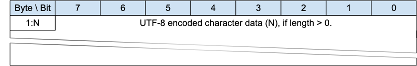{style="width: 624.00px; height: 98.67px; margin-left: 0.00px; margin-top: 0.00px; transform: rotate(0.00rad) translateZ(0px); -webkit-transform: rotate(0.00rad) translateZ(0px);"}]{style="overflow: hidden; display: inline-block; margin: 0.00px 0.00px; border: 0.00px solid #000000; transform: rotate(0.00rad) translateZ(0px); -webkit-transform: rotate(0.00rad) translateZ(0px); width: 624.00px; height: 98.67px;"}

[The character data in a UTF-8 Encoded String MUST be well-formed UTF-8
as defined by the Unicode specification ]{.c3
.c30}[[\[Unicode\]](https://www.google.com/url?q=https://docs.oasis-open.org/mqtt/mqtt/v5.0/cos02/mqtt-v5.0-cos02.html%23Unicode&sa=D&source=editors&ust=1759864763497135&usg=AOvVaw3KKrkCPI-_nhd0FT5rt7OQ){.c4}]{.c1
.c198}[ and restated in RFC 3629 ]{.c3
.c30}[[\[RFC3629\]](https://www.google.com/url?q=https://docs.oasis-open.org/mqtt/mqtt/v5.0/cos02/mqtt-v5.0-cos02.html%23RFC3629&sa=D&source=editors&ust=1759864763497293&usg=AOvVaw1syLE49TPcXnSw1ZkcdYkx){.c4}]{.c1
.c198}[. In particular, the character data MUST NOT include encodings of
code points between U+D800 and U+DFFF]{.c3
.c30}[ ]{.c3}[\[MQTT-SN-1.7.4-1\]]{.c9 .c35}[.]{.c3 .c17 .c32}

[If the Client or Server receives an ]{.c3}[MQTT-SN Control Packet
]{.c3}[containing ill-formed UTF-8 it is a Malformed
]{.c3}[Packet]{.c3}[.]{.c3}[ Refer
to]{.c3}[[ ](https://www.google.com/url?q=https://docs.oasis-open.org/mqtt/mqtt/v5.0/cos02/mqtt-v5.0-cos02.html%23S4_13_Errors&sa=D&source=editors&ust=1759864763497857&usg=AOvVaw0GW2p1gws1ceSbkWlPHKvV){.c4}]{.c3}[[4.12
Handling errors](#h.v8vlgf6xm72a){.c4}]{.c6}[ for information about
handling errors.]{.c3 .c17 .c32}

[A UTF-8 Encoded String MUST NOT include an encoding of the null
character U+0000]{.c3 .c30}[ ]{.c3}[\[MQTT-SN-1.7.4-2\].]{.c9 .c35}[ If
a receiver (Server or Client)]{.c3}[ ]{.c3}[receives an ]{.c3}[Control
Pac]{.c3}[ket containing U+0000 in a UTF-8 Encoded String it is a
Malformed Packet.]{.c3 .c17 .c32}

[UTF-8 Encoded Strings SHOULD NOT include the
Unicode]{.c3}[ \[Unicode\]]{.c3}[ code points listed below. If a
receiver (Server or Client) ]{.c3}[receives an MQTT-SN ]{.c3}[Control
Packet with UTF-8 Encoded Strings containing any of them it MAY treat it
as a Malformed Packet. These are the Disallowed Unicode code
points.]{.c3}

- [U+0001..U+001F control characters]{.c3 .c17}
- [U+007F..U+009F control characters]{.c3 .c17}
- [Code points defined in the Unicode specification ]{.c3
  .c17}[[\[Unicode\]](https://www.google.com/url?q=https://docs.oasis-open.org/mqtt/mqtt/v5.0/cos02/mqtt-v5.0-cos02.html%23Unicode&sa=D&source=editors&ust=1759864763499153&usg=AOvVaw3B9HA-OrkvL6uUofV-dVIC){.c4}]{.c9
  .c17 .c310}[ to be non-characters (for example U+0FFFF)]{.c3 .c17}

[A UTF-8 encoded sequence 0xEF 0xBB 0xBF is always interpreted as U+FEFF
(\"ZERO WIDTH NO-BREAK SPACE\") wherever it appears in a string and MUST
NOT be skipped over or stripped off by a packet receiver]{.c3
.c30}[ ]{.c3}[\[MQTT-SN-1.7.4-3\].]{.c9 .c17 .c35 .c32}

[Informative example]{.c16 .c75 .c44 .c32 .c49}

[For example, ]{.c9}[the string A𪛔
which]{.c9}^[\[b\]](#cmnt2){#cmnt_ref2}[\[c\]](#cmnt3){#cmnt_ref3}^[ is
]{.c9}[LATIN CAPITAL Letter A followed by the code point U+2A6D4 (which
represents a CJK IDEOGRAPH EXTENSION B character)]{.c3}[ is encoded as
follows: ]{.c2}

[Figure 1-2 -- ]{.c36 .c100}[Fixed Length UTF-8 Encoded String ]{.c36
.c12 .c100}[inf]{.c36 .c100}[ormative example]{.c36 .c12 .c100}

[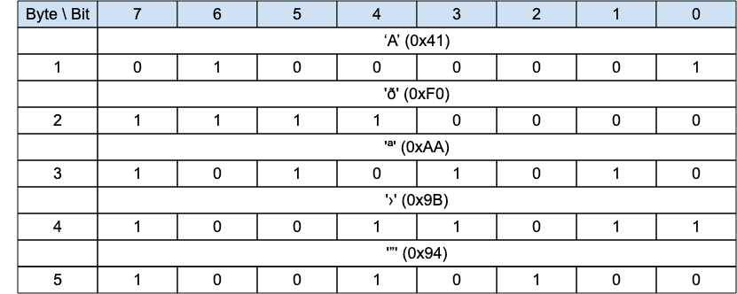{style="width: 624.08px; height: 249.33px; margin-left: -0.04px; margin-top: 0.00px; transform: rotate(0.00rad) translateZ(0px); -webkit-transform: rotate(0.00rad) translateZ(0px);"}]{style="overflow: hidden; display: inline-block; margin: 0.00px 0.00px; border: 0.00px solid #000000; transform: rotate(0.00rad) translateZ(0px); -webkit-transform: rotate(0.00rad) translateZ(0px); width: 624.00px; height: 249.33px;"}

# [2 MQTT-SN Control Packet format]{.c17 .c120 .c75 .c44 .c32} {#h.3o7alnk .c235 .c192 .c200 .c87 .c90}

## [2.1 Structure of an MQTT-SN Control Packet]{.c19 .c17} {#h.23ckvvd .c20}

[The MQTT-SN protocol operates by exchanging a series of MQTT-SN Control
Packets in a defined way. This section describes the format of these
packets. ]{.c2}

[An MQTT-SN Control Packet consists of up to two parts, always in the
following order as shown below. ]{.c2}

[Figure 2-1 －Structure of an MQTT-SN Control Packet]{.c36 .c100}

  ------------------------------------------------------------------------------
  [Control Packet Header, present in all MQTT-SN Control Packets]{.c2}
  [Control Packet Variable Part, present in some MQTT-SN Control Packets]{.c2}
  ------------------------------------------------------------------------------

### 2.1.1 [Packet Header]{.c38 .c17 .c32} {#h.1hmsyys .c20}

[Each MQTT-SN Control Packet contains a Header of format 1 or format 2
as shown below.]{.c2}

[Figure 2-2 -- Packet Header Format 1]{.c36 .c100}

[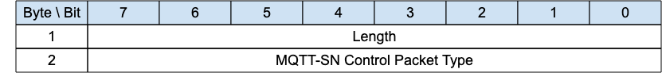{style="width: 624.00px; height: 69.33px; margin-left: 0.00px; margin-top: 0.00px; transform: rotate(0.00rad) translateZ(0px); -webkit-transform: rotate(0.00rad) translateZ(0px);"}]{style="overflow: hidden; display: inline-block; margin: 0.00px 0.00px; border: 0.00px solid #000000; transform: rotate(0.00rad) translateZ(0px); -webkit-transform: rotate(0.00rad) translateZ(0px); width: 624.00px; height: 69.33px;"}

[Figure 2-3 -- Packet Header Format 2]{.c36 .c100}

[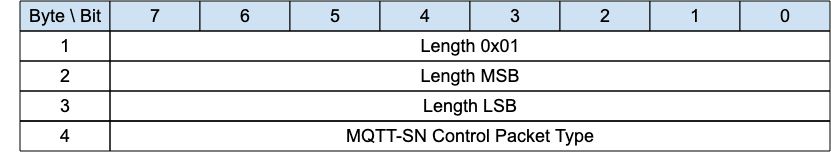{style="width: 624.00px; height: 114.67px; margin-left: 0.00px; margin-top: 0.00px; transform: rotate(0.00rad) translateZ(0px); -webkit-transform: rotate(0.00rad) translateZ(0px);"}]{style="overflow: hidden; display: inline-block; margin: 0.00px 0.00px; border: 0.00px solid #000000; transform: rotate(0.00rad) translateZ(0px); -webkit-transform: rotate(0.00rad) translateZ(0px); width: 624.00px; height: 114.67px;"}

### 2.1.2 [Length]{.c38 .c17 .c32} {#h.vx1227 .c84}

[The ]{.c9}[Length ]{.c9 .c36}[field is either 1-byte or 3-byte integer
and specifies the total number of bytes contained in the packet
(including the ]{.c9}[Length ]{.c9 .c36}[field itself).]{.c2}

[If the first byte of the ]{.c9}[Length ]{.c9 .c36}[field is coded
"0x01" then the ]{.c9}[Length ]{.c9 .c36}[field is 3-bytes long; in this
case, the two following bytes specify the total number of bytes of the
packet (most-significant byte first). Otherwise, the ]{.c9}[Length ]{.c9
.c36}[field is only 1-byte long and specifies itself the total number of
bytes contained in the packet.]{.c2}

[The 3-byte format allows the encoding of packet lengths up to 65,535
bytes. It is more efficient to use the shorter 1-byte format for
p]{.c9}[ackets with lengths up to and including 255 bytes.]{.c9}

[A ]{.c1}[C]{.c30}[lient or Server receiving MQTT-SN control packets
MUST be able to process both 1-byte and 3-byte length formats
]{.c1}[\[]{.c9 .c35}[MQTT-SN-2.1.2-1\].]{.c9 .c17 .c35 .c32}

[Informative comment]{.c16 .c75 .c44 .c32 .c49}

[MQTT-SN does not support packet fragmentation and reassembly, the
maximum packet length that could be used in a network is governed by the
maximum packet size that is supported by that network, and not by the
maximum length that could be encoded by MQTT-SN.]{.c2}

### 2.1.3 [MQTT-SN Control Packet Type]{.c38 .c17 .c32} {#h.1v1yuxt .c84}

[The MQTT-SN Control Packet Type]{.c27}[ ]{.c27 .c36}[field ]{.c27}is a
1-byte[ unsigned]{.c27} value,[ the values a]{.c27}re [shown
below.]{.c2}

[Figure 2-4 -- MQTT-SN Control Packet Types]{.c36 .c100}

+---------------------+---------------------+-------------------+-------------------------+
| [Name]{.c0}         | [Value]{.c0}        | [Direction of     | [Description]{.c0}      |
|                     |                     | flow]{.c0}        |                         |
+---------------------+---------------------+-------------------+-------------------------+
| [Reserved]{.c16     | [0x00]{.c2}         | [Forbidden]{.c2}  | [Reserved]{.c2}         |
| .c75 .c44 .c114     |                     |                   |                         |
| .c49}               |                     |                   |                         |
+---------------------+---------------------+-------------------+-------------------------+
| [CONNECT]{.c16 .c75 | [0x01]{.c2}         | [Client to        | [Virtual Connection     |
| .c44 .c114 .c49}    |                     | Server]{.c2}      | request]{.c2}           |
+---------------------+---------------------+-------------------+-------------------------+
| [CONNACK]{.c16 .c75 | [0x02]{.c2}         | [Server to        | [Virtual Connection     |
| .c44 .c114 .c49}    |                     | Client]{.c2}      | acknowledgement]{.c2}   |
+---------------------+---------------------+-------------------+-------------------------+
| [PUBLISH]{.c16 .c75 | [0x03]{.c2}         | [Client to Server | [Publish message]{.c2}  |
| .c44 .c114 .c49}    |                     | or]{.c2}          |                         |
|                     |                     |                   |                         |
|                     |                     | [Server to        |                         |
|                     |                     | Client]{.c2}      |                         |
+---------------------+---------------------+-------------------+-------------------------+
| [PUBACK]{.c16 .c75  | [0x04]{.c2}         | [Client to Server | [Publish acknowledgment |
| .c44 .c114 .c49}    |                     | or]{.c2}          | (QoS 1) or Publish      |
|                     |                     |                   | error (Any QoS).]{.c2}  |
|                     |                     | [Server to        |                         |
|                     |                     | Client]{.c2}      |                         |
+---------------------+---------------------+-------------------+-------------------------+
| [PUBREC]{.c16 .c75  | [0x05]{.c2}         | [Client to Server | [Publish received (QoS  |
| .c44 .c114 .c49}    |                     | or]{.c2}          | 2 delivery part         |
|                     |                     |                   | 1)]{.c2}                |
|                     |                     | [Server to        |                         |
|                     |                     | Client]{.c2}      |                         |
+---------------------+---------------------+-------------------+-------------------------+
| [PUBREL]{.c16 .c75  | [0x06]{.c2}         | [Client to Server | [Publish release (QoS 2 |
| .c44 .c114 .c49}    |                     | or]{.c2}          | delivery part 2)]{.c2}  |
|                     |                     |                   |                         |
|                     |                     | [Server to        |                         |
|                     |                     | Client]{.c2}      |                         |
+---------------------+---------------------+-------------------+-------------------------+
| [PUBCOMP]{.c16 .c75 | [0x07]{.c2}         | [Client to Server | [Publish complete (QoS  |
| .c44 .c114 .c49}    |                     | or]{.c2}          | 2 delivery part         |
|                     |                     |                   | 3)]{.c2}                |
|                     |                     | [Server to        |                         |
|                     |                     | Client]{.c2}      |                         |
+---------------------+---------------------+-------------------+-------------------------+
| [SUBSCRIBE]{.c16    | [0x08]{.c2}         | [Client to        | [Subscribe              |
| .c75 .c44 .c114     |                     | Server]{.c2}      | request]{.c2}           |
| .c49}               |                     |                   |                         |
+---------------------+---------------------+-------------------+-------------------------+
| [SUBACK]{.c16 .c75  | [0x09]{.c2}         | [Server to        | [Subscribe              |
| .c44 .c114 .c49}    |                     | Client]{.c2}      | acknowledgment]{.c2}    |
+---------------------+---------------------+-------------------+-------------------------+
| [UNSUBSCRIBE]{.c16  | [0x0A]{.c2}         | [Client to        | [Unsubscribe            |
| .c75 .c44 .c114     |                     | Server]{.c2}      | request]{.c2}           |
| .c49}               |                     |                   |                         |
+---------------------+---------------------+-------------------+-------------------------+
| [UNSUBACK]{.c16     | [0x0B]{.c2}         | [Server to        | [Unsubscribe            |
| .c75 .c44 .c114     |                     | Client]{.c2}      | acknowledgment]{.c2}    |
| .c49}               |                     |                   |                         |
+---------------------+---------------------+-------------------+-------------------------+
| [PINGREQ]{.c16 .c75 | [0x0C]{.c2}         | [Client to        | [PING request]{.c2}     |
| .c44 .c114 .c49}    |                     | Server]{.c2}      |                         |
+---------------------+---------------------+-------------------+-------------------------+
| [PINGRESP]{.c16     | [0x0D]{.c2}         | [Server to        | [PING response]{.c2}    |
| .c75 .c44 .c114     |                     | Client]{.c2}      |                         |
| .c49}               |                     |                   |                         |
+---------------------+---------------------+-------------------+-------------------------+
| [DISCONNECT]{.c16   | [0x0E]{.c2}         | [Client to Server | [Disconnect             |
| .c75 .c44 .c114     |                     | or]{.c2}          | notification]{.c2}      |
| .c49}               |                     |                   |                         |
|                     |                     | [Server to        |                         |
|                     |                     | Client]{.c2}      |                         |
+---------------------+---------------------+-------------------+-------------------------+
| [AUTH]{.c16 .c75    | [0x0F]{.c2}         | [Client to Server | [Authentication         |
| .c44 .c114 .c49}    |                     | or Server to      | handshake]{.c2}         |
|                     |                     | Client]{.c2}      |                         |
+---------------------+---------------------+-------------------+-------------------------+
| [REGISTER]{.c16     | [0x10]{.c2}         | [Client to        | [Request topic          |
| .c75 .c44 .c114     |                     | Server]{.c2}      | alias]{.c2}             |
| .c49}               |                     |                   |                         |
+---------------------+---------------------+-------------------+-------------------------+
| [REGACK]{.c16 .c75  | [0x11]{.c2}         | [Server to        | [Supply topic           |
| .c44 .c114 .c49}    |                     | Client]{.c2}      | alias]{.c2}             |
+---------------------+---------------------+-------------------+-------------------------+
| [PUBWOS]{.c16 .c75  | [0x12]{.c2}         | [Client to Server | [Publish packet for out |
| .c44 .c114 .c49}    |                     | or]{.c2}          | of session messages     |
|                     |                     |                   | which have no session   |
|                     |                     | [Server to        | on the receiver]{.c2}   |
|                     |                     | Client]{.c2}      |                         |
+---------------------+---------------------+-------------------+-------------------------+
| [SLEEPREQ]{.c17     | [0x13]{.c2}         | [Client to        | [Sleep request]{.c2}    |
| .c12 .c75 .c44      |                     | Server]{.c2}      |                         |
| .c114 .c49}         |                     |                   |                         |
+---------------------+---------------------+-------------------+-------------------------+
| [SLEEPRESP]{.c17    | [0x14]{.c2}         | [Server to        | [Sleep response]{.c2}   |
| .c12 .c75 .c44      |                     | Client]{.c2}      |                         |
| .c114 .c49}         |                     |                   |                         |
+---------------------+---------------------+-------------------+-------------------------+
| [WAKEUP ]{.c17 .c12 | [0x15]{.c2}         | [Server to        | [Wake up request]{.c2}  |
| .c75 .c44 .c114     |                     | Client]{.c2}      |                         |
| .c49}               |                     |                   |                         |
+---------------------+---------------------+-------------------+-------------------------+
| [ADVERTISE]{.c16    | [0x]{.c27}[16]{.c2} | [Server to        | [Advertise the Server   |
| .c75 .c44 .c114     |                     | Clients]{.c2}     | presence]{.c2}          |
| .c49}               |                     |                   |                         |
+---------------------+---------------------+-------------------+-------------------------+
| [SEARCHGW]{.c16     | [0x17]{.c2}         | [Client to        | [Client GWINFO          |
| .c75 .c44 .c114     |                     | Servers]{.c2}     | request]{.c2}           |
| .c49}               |                     |                   |                         |
+---------------------+---------------------+-------------------+-------------------------+
| [GWINFO]{.c16 .c75  | [0x18]{.c2}         | [Server to        | [Response to a          |
| .c44 .c114 .c49}    |                     | Client]{.c2}      | SEARCHGW]{.c27}         |
+---------------------+---------------------+-------------------+-------------------------+
| [Reserved ]{.c17    | [0x19-0xFC]{.c2}    | [Forbidden]{.c27} | [Reserved]{.c2}         |
| .c12 .c75 .c44 .c49 |                     |                   |                         |
| .c114}              |                     |                   |                         |
+---------------------+---------------------+-------------------+-------------------------+
| [Forwarder          | [0xFD]{.c2}         | [Forwarder to     | [MQTT-SN packet         |
| Encapsulation]{.c16 |                     | Client or]{.c2}   | envelope to add         |
| .c75 .c44 .c114     |                     |                   | addressing information  |
| .c49}               |                     | [Forwarder to     | for Forwarders]{.c2}    |
|                     |                     | Server]{.c2}      |                         |
+---------------------+---------------------+-------------------+-------------------------+
| [Session            | [0xFE]{.c2}         | [Client to        | [MQTT-SN Packet         |
| Encapsulation]{.c17 |                     | Server]{.c2}      | envelope to add session |
| .c12 .c75 .c44      |                     |                   | identification]{.c2}    |
| .c114 .c49}         |                     |                   |                         |
+---------------------+---------------------+-------------------+-------------------------+
| [Protection         | [0xFF]{.c2}         | [Client to Server | [A protection envelope  |
| Encapsulation]{.c16 |                     | or Server to      | that can encapsulate    |
| .c75 .c44 .c114     |                     | Client]{.c2}      | any MQTT-SN packet with |
| .c49}               |                     |                   | the exception of        |
|                     |                     |                   | Forwarder-Encapsulation |
|                     |                     |                   | packet (0xFE)]{.c2}     |
+---------------------+---------------------+-------------------+-------------------------+

## [2.2 Packet Identifier]{.c19 .c17} {#h.19c6y18 .c20}

[The Variable Header component of many of the MQTT-SN Control Packet
types includes a Two Byte Integer Packet Identifier field.
]{.c27}[MQTT-SN Control Packets that require a Packet Identifier are
shown in Figure 2-5.]{.c27}

[Figure 2-5 -- Packets with Packet Identifier]{.c36 .c100}

  ----------------------------------------------------- --------------------------------
  [MQTT-SN Control Packet]{.c16 .c75 .c44 .c49 .c269}   [Packet Identifier field]{.c0}
  [ADVERTISE]{.c2}                                      [NO]{.c2}
  [AUTH]{.c2}                                           [YES]{.c2}
  [CONNACK]{.c2}                                        [YES]{.c2}
  [CONNECT]{.c2}                                        [YES]{.c2}
  [DISCONNECT]{.c2}                                     [OPTIONAL]{.c2}
  [FORWARDER ENCAPSULATION]{.c2}                        [NO]{.c2}
  [GWINFO]{.c2}                                         [NO]{.c2}
  [PINGREQ]{.c2}                                        [YES]{.c2}
  [PINGRESP]{.c2}                                       [YES]{.c2}
  [PROTECTION ENCAPSULATION]{.c2}                       [NO]{.c2}
  [PUBACK]{.c2}                                         [YES]{.c2}
  [PUBCOMP]{.c2}                                        [YES]{.c2}
  [PUBLISH]{.c2}                                        [YES (If QoS \> 0)]{.c2}
  [PUBREC]{.c2}                                         [YES]{.c2}
  [PUBREL]{.c2}                                         [YES]{.c2}
  [PUBWOS]{.c27}                                        [NO]{.c2}
  [REGACK]{.c2}                                         [YES]{.c2}
  [REGISTER]{.c2}                                       [YES]{.c2}
  [SEARCHGW]{.c2}                                       [NO]{.c2}
  [SLEEPREQ]{.c2}                                       [YES]{.c2}
  [SLEEPRESP]{.c2}                                      [YES]{.c2}
  [SUBACK]{.c2}                                         [YES]{.c2}
  [SUBSCRIBE]{.c2}                                      [YES]{.c2}
  [UNSUBACK]{.c2}                                       [YES]{.c2}
  [UNSUBSCRIBE]{.c2}                                    [YES]{.c2}
  [WAKEUP]{.c2}                                         [NO]{.c2}
  ----------------------------------------------------- --------------------------------

[Each time a Client sends a new MQTT-SN Control Packet which is
identified in ]{.c1}[Figure 2-5]{.c30}[ as requiring a Packet
Identifier, it MUST assign it a non-zero Packet Identifier that is
currently unused]{.c1}[ \[MQTT-SN-2.2-1\].]{.c35}

[A PUBLISH packet MUST NOT contain a Packet Identifier if its QoS value
is set to 0]{.c1}[  \[MQTT-SN-2.2-2\],]{.c35}

[Each time a ]{.c1}[Server]{.c30}[ sends a new PUBLISH (with QoS
]{.c1}[greater than]{.c30}[ 0) MQTT-SN Control Packet it MUST assign it
a non zero Packet Identifier that is currently
unused]{.c1}[ ]{.c9}[\[MQTT-SN-2.2-3\].]{.c35}

[Packet Identifiers used with PUBLISH, SUBSCRIBE and UNSUBSCRIBE packets
form a single, unified set of identifiers separately for the Client and
the ]{.c9}Server[ in a Session. A Packet Identifier cannot be used by
more than one Packet at any time.]{.c9}

[The Packet Identifier becomes available for reuse after the sender has
processed the corresponding acknowledgement packet, defined as follows.
In the case of a QoS 1 PUBLISH, this is the corresponding PUBACK; in the
case of QoS 2 PUBLISH it is PUBCOMP or a PUBREC with a Reason Code of
0x80 or greater. For SUBSCRIBE or UNSUBSCRIBE it is the corresponding
SUBACK or UNSUBACK. ]{.c9}

[A PUBACK, PUBREC , PUBREL, or PUBCOMP packet MUST contain the same
Packet Identifier as the PUBLISH packet that was originally sent]{.c1}[.
]{.c1 .c35}[A SUBACK and UNSUBACK MUST contain the Packet Identifier
that was used in the corresponding SUBSCRIBE and UNSUBSCRIBE packet
respectively]{.c1}[ ]{.c1 .c35}[\[MQTT-SN-2.2-4\].]{.c35}

[The Client and ]{.c9}Server[ assign Packet Identifiers independently of
each other. As a result, Client-Server pairs can participate in
concurrent Packet exchanges using the same Packet Identifiers. ]{.c9}

[Informative comment]{.c16 .c75 .c44 .c32 .c49}

[It is possible for a Client to send a PUBLISH packet with Packet
Identifier 0x1234 and then receive a different PUBLISH packet with
Packet Identifier 0x1234 from its Server before it receives a PUBACK for
the PUBLISH packet that it sent.]{.c9}

[Figure 2-6 - Publishes with the same Packet Identifier]{.c36
.c100}[{style="width: 499.20px; height: 559.96px; margin-left: 0.00px; margin-top: -120.51px; transform: rotate(0.00rad) translateZ(0px); -webkit-transform: rotate(0.00rad) translateZ(0px);"}]{style="overflow: hidden; display: inline-block; margin: 0.00px 0.00px; border: 0.00px solid #000000; transform: rotate(0.00rad) translateZ(0px); -webkit-transform: rotate(0.00rad) translateZ(0px); width: 499.20px; height: 310.11px;"}

## 2.3 [Reason Code]{.c27} {#h.46r0co2 .c84}

[A Reason Code is a one byte unsigned value that indicates the result of
an operation. Reason Codes less than 0x80 indicate successful completion
of an operation. The normal Reason Code for success is 0x00. Reason Code
values of 0x80 or greater indicate failure.]{.c3}

[The Reason Codes share a common set of values as shown below.]{.c2}

[Figure 2-7 -- Reason Codes]{.c36 .c100}

+---------------------------------------------------------------+---------------+------------------------+-------------------------+----------------------------------------+
| [Identifier]{.c0}                                                             | [Name]{.c0}            | [Packets ]{.c0}         | [Description ]{.c0}                    |
+---------------------------------------------------------------+---------------+                        |                         |                                        |
| [Dec]{.c2}                                                    | [Hex]{.c2}    |                        |                         |                                        |
+---------------------------------------------------------------+---------------+------------------------+-------------------------+----------------------------------------+
| [0]{.c2}                                                      | [0x00]{.c2}   | [Success]{.c2}         | [CONNACK, SUBACK,       | [The operation was successful.]{.c2}   |
|                                                               |               |                        | UNSUBACK, REGACK,       |                                        |
|                                                               |               |                        | PUBACK, PUBREC, PUBREL, |                                        |
|                                                               |               |                        | PUBCOMP, SLEEPRESP,     |                                        |
|                                                               |               |                        | AUTH (server            |                                        |
|                                                               |               |                        | only)]{.c2}             |                                        |
+---------------------------------------------------------------+---------------+------------------------+-------------------------+----------------------------------------+
| [0]{.c2}                                                      | [0x00]{.c2}   | [Normal                | [DISCONNECT]{.c2}       | [Delete the Virtual Connection         |
|                                                               |               | disconnection]{.c2}    |                         | normally. Do not send the Will         |
|                                                               |               |                        |                         | Message.]{.c2}                         |
+---------------------------------------------------------------+---------------+------------------------+-------------------------+----------------------------------------+
| [0]{.c2}                                                      | [0x00]{.c2}   | [Granted QoS 0]{.c2}   | [SUBACK]{.c2}           | [The subscription is accepted and the  |
|                                                               |               |                        |                         | maximum QoS sent will be QoS 0. This   |
|                                                               |               |                        |                         | might be a lower QoS than was          |
|                                                               |               |                        |                         | requested.]{.c2}                       |
+---------------------------------------------------------------+---------------+------------------------+-------------------------+----------------------------------------+
| [1]{.c2}                                                      | [0x01]{.c2}   | [Granted QoS 1]{.c2}   | [SUBACK]{.c2}           | [The subscription is accepted and the  |
|                                                               |               |                        |                         | maximum QoS sent will be QoS 1. This   |
|                                                               |               |                        |                         | might be a lower QoS than was          |
|                                                               |               |                        |                         | requested.]{.c2}                       |
+---------------------------------------------------------------+---------------+------------------------+-------------------------+----------------------------------------+
| [2]{.c2}                                                      | [0x02]{.c2}   | [Granted QoS 2]{.c2}   | [SUBACK]{.c2}           | [The subscription is accepted and any  |
|                                                               |               |                        |                         | received QoS will be sent to this      |
|                                                               |               |                        |                         | subscription.]{.c2}                    |
+---------------------------------------------------------------+---------------+------------------------+-------------------------+----------------------------------------+
| [4]{.c2}                                                      | [0x04]{.c2}   | [Disconnect with will  | [DISCONNECT (client     | [The Client wishes to disconnect but   |
|                                                               |               | message]{.c2}          | only)]{.c2}             | requires that the Server also          |
|                                                               |               |                        |                         | publishes its Will Message. ]{.c2}     |
+---------------------------------------------------------------+---------------+------------------------+-------------------------+----------------------------------------+
| [16]{.c2}                                                     | [0x10]{.c2}   | [No matching           | [PUBACK, PUBREC]{.c2}   | [The Application Message is accepted   |
|                                                               |               | subscribers]{.c2}      |                         | but there are no subscribers. If the   |
|                                                               |               |                        |                         | Server knows that there are no         |
|                                                               |               |                        |                         | matching subscribers, it MAY use this  |
|                                                               |               |                        |                         | Reason Code instead of 0x00            |
|                                                               |               |                        |                         | (Success).]{.c2}                       |
+---------------------------------------------------------------+---------------+------------------------+-------------------------+----------------------------------------+
| [17]{.c2}                                                     | [0x11]{.c2}   | [No subscription       | [UNSUBACK]{.c2}         | [No matching Topic Filter is being     |
|                                                               |               | existed]{.c2}          |                         | used by the Client.]{.c2}              |
+---------------------------------------------------------------+---------------+------------------------+-------------------------+----------------------------------------+
| [24]{.c2}                                                     | [0x18]{.c2}   | [Continue              | [AUTH]{.c2}             | [Continue the authentication with      |
|                                                               |               | authentication]{.c2}   |                         | another step.]{.c2}                    |
+---------------------------------------------------------------+---------------+------------------------+-------------------------+----------------------------------------+
| [25]{.c2}                                                     | [0x19]{.c2}   | [Re-authenticate]{.c2} | [AUTH (client           | [Initiate a re-authentication.]{.c2}   |
|                                                               |               |                        | only)]{.c2}             |                                        |
+---------------------------------------------------------------+---------------+------------------------+-------------------------+----------------------------------------+
| [26]{.c27                                                     | [0x1A]{.c16   | [Topic Alias           | [REGACK]{.c16 .c9 .c52} | [A Session Topic Alias was requested,  |
| .c52}^[\[d\]](#cmnt4){#cmnt_ref4}[\[e\]](#cmnt5){#cmnt_ref5}^ | .c9 .c52}     | Exists]{.c16 .c9 .c52} |                         | but a Session or Predefined Topic      |
|                                                               |               |                        |                         | Alias already exists.]{.c16 .c9 .c52}  |
|                                                               |               |                        |                         |                                        |
|                                                               |               |                        |                         | []{.c16 .c9 .c52}                      |
|                                                               |               |                        |                         |                                        |
|                                                               |               |                        |                         | [(MQTT-SN only)]{.c16 .c9 .c52}        |
+---------------------------------------------------------------+---------------+------------------------+-------------------------+----------------------------------------+
| [128]{.c2}                                                    | [0x80]{.c2}   | [Unspecified           | [CONNACK, PUBACK,       | [The receiver does not accept the      |
|                                                               |               | error]{.c2}            | PUBREC, SUBACK,         | request but either does not want to    |
|                                                               |               |                        | UNSUBACK,               | reveal the reason, or it does not      |
|                                                               |               |                        | DISCONNECT]{.c2}        | match one of the other values.]{.c2}   |
+---------------------------------------------------------------+---------------+------------------------+-------------------------+----------------------------------------+
| [129]{.c2}                                                    | [0x81]{.c2}   | [Malformed             | [CONNACK,               | [The received packet does not conform  |
|                                                               |               | packet]{.c2}           | DISCONNECT]{.c2}        | to this specification.]{.c2}           |
+---------------------------------------------------------------+---------------+------------------------+-------------------------+----------------------------------------+
| [130]{.c2}                                                    | [0x82]{.c2}   | [Protocol error]{.c2}  | [CONNACK,               | [An unexpected or out of order packet  |
|                                                               |               |                        | DISCONNECT]{.c2}        | was received.]{.c2}                    |
+---------------------------------------------------------------+---------------+------------------------+-------------------------+----------------------------------------+
| [131]{.c2}                                                    | [0x83]{.c2}   | [Implementation        | [CONNACK, PUBACK,       | [The packet received is valid but      |
|                                                               |               | specific error]{.c2}   | PUBREC, REGACK, SUBACK, | cannot be processed by this            |
|                                                               |               |                        | UNSUBACK,               | implementation.]{.c2}                  |
|                                                               |               |                        | DISCONNECT]{.c2}        |                                        |
+---------------------------------------------------------------+---------------+------------------------+-------------------------+----------------------------------------+
| [132]{.c2}                                                    | [0x84]{.c2}   | [Unsupported Protocol  | [CONNACK]{.c2}          | [The Server does not support the       |
|                                                               |               | Version]{.c2}          |                         | version of the ]{.c27}[MQTT or MQTT-SN |
|                                                               |               |                        |                         | protocol requested by the              |
|                                                               |               |                        |                         | Client.]{.c27}                         |
+---------------------------------------------------------------+---------------+------------------------+-------------------------+----------------------------------------+
| [133]{.c2}                                                    | [0x85]{.c2}   | [Client identifier not | [CONNACK]{.c2}          | [The Client Identifier is a valid      |
|                                                               |               | valid]{.c2}            |                         | string but is not allowed by the       |
|                                                               |               |                        |                         | Server.]{.c2}                          |
+---------------------------------------------------------------+---------------+------------------------+-------------------------+----------------------------------------+
| [134]{.c2}                                                    | [0x86]{.c2}   | [Bad user name or      | [CONNACK]{.c2}          | [The Server does not accept the User   |
|                                                               |               | password]{.c2}         |                         | Name or Password specified by the      |
|                                                               |               |                        |                         | Client ]{.c2}                          |
+---------------------------------------------------------------+---------------+------------------------+-------------------------+----------------------------------------+
| [135]{.c2}                                                    | [0x87]{.c2}   | [Not authorized]{.c2}  | [CONNACK, PUBACK,       | [The request is not authorized.]{.c2}  |
|                                                               |               |                        | PUBREC, REGACK, SUBACK, |                                        |
|                                                               |               |                        | UNSUBACK, DISCONNECT    |                                        |
|                                                               |               |                        | (server only)]{.c2}     |                                        |
+---------------------------------------------------------------+---------------+------------------------+-------------------------+----------------------------------------+
| [136]{.c2}                                                    | [0x88]{.c2}   | [Server                | [CONNACK]{.c2}          | [The ]{.c27}[MQTT-SN Server]{.c27}[ is |
|                                                               |               | unavailable]{.c2}      |                         | not available or, in the case of a     |
|                                                               |               |                        |                         | Transparent gateway, the MQTT server   |
|                                                               |               |                        |                         | is not available.]{.c2}                |
+---------------------------------------------------------------+---------------+------------------------+-------------------------+----------------------------------------+
| [137]{.c2}                                                    | [0x89]{.c2}   | [Server busy]{.c2}     | [CONNACK, DISCONNECT    | [The Server is busy and cannot         |
|                                                               |               |                        | (server only)]{.c2}     | continue processing requests from this |
|                                                               |               |                        |                         | Client.]{.c2}                          |
+---------------------------------------------------------------+---------------+------------------------+-------------------------+----------------------------------------+
| [138]{.c2}                                                    | [0x8A]{.c2}   | [Banned]{.c2}          | [CONNACK]{.c2}          | [This Client has been banned by        |
|                                                               |               |                        |                         | administrative action. Contact the     |
|                                                               |               |                        |                         | server administrator.]{.c2}            |
+---------------------------------------------------------------+---------------+------------------------+-------------------------+----------------------------------------+
| [139]{.c2}                                                    | [0x8B]{.c2}   | [Server shutting       | [DISCONNECT (server     | [The Server is shutting down. ]{.c2}   |
|                                                               |               | down]{.c2}             | only)]{.c2}             |                                        |
+---------------------------------------------------------------+---------------+------------------------+-------------------------+----------------------------------------+
| [140]{.c2}                                                    | [0x8C]{.c2}   | [Bad authentication    | [CONNACK,               | [The authentication method is not      |
|                                                               |               | method]{.c2}           | DISCONNECT]{.c2}        | supported or does not match the        |
|                                                               |               |                        |                         | authentication method currently in     |
|                                                               |               |                        |                         | use.]{.c2}                             |
+---------------------------------------------------------------+---------------+------------------------+-------------------------+----------------------------------------+
| [141]{.c2}                                                    | [0x8D]{.c2}   | [Keep alive            | [DISCONNECT (server     | [The Connection is closed because no   |
|                                                               |               | timeout]{.c2}          | only)]{.c2}             | packet has been received for 1.5 times |
|                                                               |               |                        |                         | the Keepalive time.]{.c2}              |
+---------------------------------------------------------------+---------------+------------------------+-------------------------+----------------------------------------+
| [142]{.c2}                                                    | [0x8E]{.c2}   | [Session taken         | [DISCONNECT (server     | [Another Connection using the same     |
|                                                               |               | over]{.c2}             | only)]{.c2}             | Client Identifier has connected        |
|                                                               |               |                        |                         | causing this Connection to be          |
|                                                               |               |                        |                         | closed.]{.c2}                          |
+---------------------------------------------------------------+---------------+------------------------+-------------------------+----------------------------------------+
| [143]{.c2}                                                    | [0x8F]{.c2}   | [Topic filter          | [SUBACK, UNSUBACK,      | [The Topic Filter is correctly formed, |
|                                                               |               | invalid]{.c2}          | DISCONNECT (server      | but is not accepted by this            |
|                                                               |               |                        | only)]{.c2}             | Server.]{.c2}                          |
+---------------------------------------------------------------+---------------+------------------------+-------------------------+----------------------------------------+
| [144]{.c2}                                                    | [0x90]{.c2}   | [Topic name            | [CONNACK, PUBACK,       | [The Topic Name is correctly formed,   |
|                                                               |               | invalid]{.c2}          | PUBREC, DISCONNECT      | but is not accepted by this Client or  |
|                                                               |               |                        | (server only)]{.c2}     | Server.]{.c2}                          |
+---------------------------------------------------------------+---------------+------------------------+-------------------------+----------------------------------------+
| [145]{.c2}                                                    | [0x91]{.c2}   | [Packet identifier in  | [PUBACK, PUBREC,        | [The specified Packet Identifier is    |
|                                                               |               | use]{.c2}              | SUBACK,                 | already in use.]{.c2}                  |
|                                                               |               |                        | UNSUBACK]{.c27}[,]{.c2} |                                        |
|                                                               |               |                        |                         |                                        |
|                                                               |               |                        | [REGACK, PINGRESP,      |                                        |
|                                                               |               |                        | SLEEPRESP]{.c2}         |                                        |
+---------------------------------------------------------------+---------------+------------------------+-------------------------+----------------------------------------+
| [146]{.c2}                                                    | [0x92]{.c2}   | [Packet identifier not | [PUBREL,                | [The Packet Identifier is not known.   |
|                                                               |               | found]{.c2}            | ]{.c27}[PUBCOMP]{.c27}  | This is not an error during recovery,  |
|                                                               |               |                        |                         | but at other times indicates a         |
|                                                               |               |                        |                         | mismatch between the Session State on  |
|                                                               |               |                        |                         | the Client and Server. ]{.c2}          |
+---------------------------------------------------------------+---------------+------------------------+-------------------------+----------------------------------------+
| [147]{.c2}                                                    | [0x93]{.c2}   | [Receive maximum       | [DISCONNECT]{.c2}       | [The Client or Server has received     |
|                                                               |               | exceeded]{.c2}         |                         | more than Receive Maximum publication  |
|                                                               |               |                        |                         | for which it has not sent PUBACK or    |
|                                                               |               |                        |                         | PUBCOMP. ]{.c2}                        |
+---------------------------------------------------------------+---------------+------------------------+-------------------------+----------------------------------------+
| [148]{.c2}                                                    | [0x94]{.c2}   | [Topic alias           | [DISCONNECT (server     | [The Client or Server has received a   |
|                                                               |               | invalid]{.c2}          | only)]{.c2}             | PUBLISH packet containing a Topic      |
|                                                               |               |                        |                         | Alias which is greater than the        |
|                                                               |               |                        |                         | Maximum Topic Alias it sent in the     |
|                                                               |               |                        |                         | CONNECT or CONNACK packet. ]{.c2}      |
|                                                               |               |                        |                         |                                        |
|                                                               |               |                        |                         | [(Transparent gateway only)]{.c2}      |
+---------------------------------------------------------------+---------------+------------------------+-------------------------+----------------------------------------+
| [149]{.c2}                                                    | [0x95]{.c3    | [Packet too            | [CONNACK,]{.c2}         | [The packet size is greater than       |
|                                                               | .c17 .c32}    | large]{.c2}            |                         | Maximum Packet Size for this Client or |
|                                                               |               |                        | [DISCONNECT]{.c2}       | Server.]{.c2}                          |
+---------------------------------------------------------------+---------------+------------------------+-------------------------+----------------------------------------+
| [150]{.c2}                                                    | [0x96]{.c27}  | [Packet rate too       | [DISCONNECT]{.c2}       | [The received data rate is too         |
|                                                               |               | high]{.c2}             |                         | high.]{.c2}                            |
+---------------------------------------------------------------+---------------+------------------------+-------------------------+----------------------------------------+
| [151]{.c2}                                                    | [0x97]{.c3    | [Quota exceeded]{.c2}  | [REGACK, SUBACK,        | [An implementation or administrative   |
|                                                               | .c17 .c32}    |                        | DISCONNECT]{.c2}        | imposed limit has been exceeded.]{.c2} |
+---------------------------------------------------------------+---------------+------------------------+-------------------------+----------------------------------------+
| [152]{.c2}                                                    | [0x98]{.c27}  | [Administrative        | [DISCONNECT]{.c2}       | [The Virtual Connection is deleted due |
|                                                               |               | action]{.c2}           |                         | to an administrative action.]{.c2}     |
+---------------------------------------------------------------+---------------+------------------------+-------------------------+----------------------------------------+
| [153]{.c2}                                                    | [0x99]{.c3    | [Payload format        | [PUBACK, PUBREC,        | [The MQTT payload format does not      |
|                                                               | .c17 .c32}    | invalid]{.c2}          | DISCONNECT (server      | match the one specified by the Payload |
|                                                               |               |                        | only)]{.c2}             | Format Indicator.]{.c2}                |
|                                                               |               |                        |                         |                                        |
|                                                               |               |                        |                         | [(Transparent gateway only)]{.c2}      |
+---------------------------------------------------------------+---------------+------------------------+-------------------------+----------------------------------------+
| [154]{.c2}                                                    | [0x9A]{.c27}  | [Retain not            | [CONNACK, DISCONNECT    | [The MQTT Server does not support      |
|                                                               |               | supported]{.c2}        | (server only)]{.c2}     | retained messages.]{.c2}               |
|                                                               |               |                        |                         |                                        |
|                                                               |               |                        |                         | [(Transparent gateway only)]{.c2}      |
+---------------------------------------------------------------+---------------+------------------------+-------------------------+----------------------------------------+
| [155]{.c2}                                                    | [0x9B]{.c2}   | [QoS not               | [CONNACK, DISCONNECT    | [The Client specified a QoS greater    |
|                                                               |               | supported]{.c2}        | (server only)]{.c2}     | than the QoS specified in a Maximum    |
|                                                               |               |                        |                         | QoS in the MQTT CONNACK.]{.c2}         |
|                                                               |               |                        |                         |                                        |
|                                                               |               |                        |                         | [(Transparent gateway only)]{.c2}      |
+---------------------------------------------------------------+---------------+------------------------+-------------------------+----------------------------------------+
| [156]{.c2}                                                    | [0x9C]{.c2}   | [Use another           | [CONNACK, DISCONNECT    | [The Client should temporarily change  |
|                                                               |               | server]{.c2}           | (server only)]{.c2}     | its Server.]{.c2}                      |
+---------------------------------------------------------------+---------------+------------------------+-------------------------+----------------------------------------+
| [157]{.c2}                                                    | [0x9D]{.c2}   | [Server moved]{.c2}    | [CONNACK, DISCONNECT    | [The Server is moved and the Client    |
|                                                               |               |                        | (server only)]{.c2}     | should permanently change its server   |
|                                                               |               |                        |                         | location.]{.c2}                        |
+---------------------------------------------------------------+---------------+------------------------+-------------------------+----------------------------------------+
| [158]{.c2}                                                    | [0x9E]{.c2}   | [Shared subscription   | [SUBACK, DISCONNECT     | [The MQTT Server does not support      |
|                                                               |               | not supported]{.c2}    | (server only)]{.c2}     | Shared Subscriptions.]{.c2}            |
|                                                               |               |                        |                         |                                        |
|                                                               |               |                        |                         | [(Transparent gateway only)]{.c2}      |
+---------------------------------------------------------------+---------------+------------------------+-------------------------+----------------------------------------+
| [159]{.c2}                                                    | [0x9F]{.c2}   | [Connection rate       | [CONNACK, DISCONNECT    | [This Virtual Connection is deleted    |
|                                                               |               | exceeded]{.c2}         | (server only)]{.c2}     | because the connection rate is too     |
|                                                               |               |                        |                         | high.]{.c2}                            |
+---------------------------------------------------------------+---------------+------------------------+-------------------------+----------------------------------------+
| [160]{.c2}                                                    | [0xAD]{.c2}   | [Maximum connect       | [DISCONNECT (server     | [The maximum connection time           |
|                                                               |               | time]{.c2}             | only)]{.c2}             | authorized for this Virtual Connection |
|                                                               |               |                        |                         | has been exceeded.]{.c2}               |
+---------------------------------------------------------------+---------------+------------------------+-------------------------+----------------------------------------+
| [161]{.c2}                                                    | [0xA1]{.c2}   | [Subscription          | [SUBACK, DISCONNECT     | [The MQTT Server does not support      |
|                                                               |               | identifiers not        | (server only)]{.c2}     | Subscription Identifiers; the          |
|                                                               |               | supported]{.c2}        |                         | subscription is not accepted.]{.c2}    |
|                                                               |               |                        |                         |                                        |
|                                                               |               |                        |                         | [(Transparent gateway only)]{.c2}      |
+---------------------------------------------------------------+---------------+------------------------+-------------------------+----------------------------------------+
| [162]{.c2}                                                    | [0xA2]{.c2}   | [Wildcard subscription | [SUBACK, DISCONNECT     | [The MQTT Server does not support      |
|                                                               |               | not supported]{.c2}    | (server only)]{.c2}     | Wildcard Subscriptions; the            |
|                                                               |               |                        |                         | subscription is not accepted.]{.c2}    |
|                                                               |               |                        |                         |                                        |
|                                                               |               |                        |                         | [(Transparent Gateway only)]{.c2}      |
+---------------------------------------------------------------+---------------+------------------------+-------------------------+----------------------------------------+
| [230]{.c27 .c52}                                              | [0xE6]{.c16   | [Only PROTECTION       | [Any packet except      | [The Receiver was expecting a packet   |
|                                                               | .c9 .c52}     | packet supported]{.c27 | PROTECTION and          | to be Protection Encapsulated. ]{.c16  |
|                                                               |               | .c52}[ (Note 1)]{.c27  | Forwarder               | .c9 .c52}                              |
|                                                               |               | .c52 .c143}            | Encapsulation]{.c16 .c9 |                                        |
|                                                               |               |                        | .c52}                   | [(MQTT-SN only)]{.c16 .c9 .c52}        |
+---------------------------------------------------------------+---------------+------------------------+-------------------------+----------------------------------------+
| [231]{.c16 .c9 .c52}                                          | [0xE7]{.c16   | [Protection scheme     | [DISCONNECT]{.c16 .c9   | [Specific to MQTT-SN]{.c16 .c9 .c52}   |
|                                                               | .c9 .c52}     | invalid]{.c16 .c9      | .c52}                   |                                        |
|                                                               |               | .c52}                  |                         |                                        |
+---------------------------------------------------------------+---------------+------------------------+-------------------------+----------------------------------------+
| [232]{.c16 .c9 .c52}                                          | [0xE8]{.c16   | [Unknown Sender        | [DISCONNECT]{.c16 .c9   | [Specific to MQTT-SN]{.c16 .c9 .c52}   |
|                                                               | .c9 .c52}     | Id]{.c16 .c9 .c52}     | .c52}                   |                                        |
+---------------------------------------------------------------+---------------+------------------------+-------------------------+----------------------------------------+
| [240]{.c16 .c9 .c52}                                          | [0xF0]{.c16   | [Unknown Topic         | [PUBACK, PUBREC,        | [Specific to MQTT-SN]{.c16 .c9 .c52}   |
|                                                               | .c9 .c52}     | Alias]{.c16 .c9 .c52}  | SUBACK, ]{.c27          |                                        |
|                                                               |               |                        | .c52}[UNSUBACK,         |                                        |
|                                                               |               |                        | REGACK]{.c27 .c52}      |                                        |
+---------------------------------------------------------------+---------------+------------------------+-------------------------+----------------------------------------+
| [241]{.c16 .c9 .c52}                                          | [0xF1]{.c16   | [Congestion]{.c16 .c9  | [SUBACK, REGACK,        | [Try again later. See ]{.c27           |
|                                                               | .c9 .c52}     | .c52}                  | CONNACK, PUBACK,        | .c52}[[C.3 Server                      |
|                                                               |               |                        | PUBREC]{.c16 .c9 .c52}  | Congestion](#h.4ekjvzaoz0kn){.c4}]{.c6 |
|                                                               |               |                        |                         | .c27 .c52}                             |
|                                                               |               |                        |                         |                                        |
|                                                               |               |                        |                         | [(MQTT-SN only)]{.c16 .c9 .c52}        |
+---------------------------------------------------------------+---------------+------------------------+-------------------------+----------------------------------------+
| [242]{.c16 .c9 .c52}                                          | [0xF2]{.c16   | [Protection packet not | [DISCONNECT]{.c16 .c9   | [Specific to MQTT-SN]{.c16 .c9 .c52}   |
|                                                               | .c9 .c52}     | supported]{.c16 .c9    | .c52}                   |                                        |
|                                                               |               | .c52}                  |                         |                                        |
+---------------------------------------------------------------+---------------+------------------------+-------------------------+----------------------------------------+
| [243]{.c16 .c9 .c52}                                          | [0xF3]{.c16   | [Forwarder             | [DISCONNECT]{.c16 .c9   | [Specific to MQTT-SN]{.c16 .c9 .c52}   |
|                                                               | .c9 .c52}     | Encapsulation not      | .c52}                   |                                        |
|                                                               |               | supported]{.c16 .c9    |                         |                                        |
|                                                               |               | .c52}                  |                         |                                        |
+---------------------------------------------------------------+---------------+------------------------+-------------------------+----------------------------------------+
| [244]{.c16 .c9 .c52}                                          | [0xF4]{.c16   | [No Virtual Connection | [DISCONNECT]{.c16 .c9   | [Specific to MQTT-SN]{.c16 .c9 .c52}   |
|                                                               | .c9 .c52}     | exists]{.c16 .c9 .c52} | .c52}                   |                                        |
+---------------------------------------------------------------+---------------+------------------------+-------------------------+----------------------------------------+
| [245]{.c16 .c9 .c52}                                          | [0xF5]{.c16   | [Reserved for          | []{.c16 .c9 .c52}       | [Specific to MQTT-SN]{.c16 .c9 .c52}   |
|                                                               | .c9 .c52}     | MQTT-SN]{.c16 .c9      |                         |                                        |
| [-]{.c16 .c9 .c52}                                            |               | .c52}                  |                         |                                        |
|                                                               | [-]{.c16 .c9  |                        |                         |                                        |
| [255]{.c16 .c9 .c52}                                          | .c52}         |                        |                         |                                        |
|                                                               |               |                        |                         |                                        |
|                                                               | [0xFF]{.c16   |                        |                         |                                        |
|                                                               | .c9 .c52}     |                        |                         |                                        |
+---------------------------------------------------------------+---------------+------------------------+-------------------------+----------------------------------------+

[Note(s):]{.c2}

1.  [It is used by a receiver to indicate that it expected a packet to
    be protected and it wasn\'t.]{.c27}
2.  [The MQTT-SN dedicated range of reason codes is from 0xE6 (230) to
    0xFF(255).]{.c27}^[\[f\]](#cmnt6){#cmnt_ref6}[\[g\]](#cmnt7){#cmnt_ref7}[\[h\]](#cmnt8){#cmnt_ref8}[\[i\]](#cmnt9){#cmnt_ref9}[\[j\]](#cmnt10){#cmnt_ref10}^

## [2.4 Topic Types]{.c19 .c17} {#h.2zbgiuw .c93 .c87 .c90 .c155}

[Several packets refer to a Topic Type in their flags. This is a 2-bit
field which determines the format of the topic value. The allowable
values are as follows:]{.c2}

[Figure 2-8 -- Topic Types]{.c36 .c100}

  ------------------------------ ------------------------- ------------------------------- -----------------------------------------------------------------------------------------------------------------------------------------------------------------------------------------------------------------
  []{.c16 .c75 .c44 .c32 .c49}   [Topic Type Value]{.c0}   [Name]{.c0}                     [Description]{.c0}
  [0]{.c2}                       [0b00]{.c2}               [Session Topic Alias]{.c2}      [A session Topic Alias is negotiated between the Server and Client within the scope of a session.]{.c2}
  [1]{.c2}                       [0b01]{.c2}               [Predefined Topic Alias]{.c2}   [A predefined Topic Alias is known statically by both the Server and the Client outside the scope of a session. No negotiation is required since both entities have knowledge of the topic alias mapping.]{.c2}
  [2]{.c2}                       [0b10]{.c2}               []{.c2}                         [Reserved]{.c2}
  [3]{.c2}                       [0b11]{.c2}               [Topic Name or Filter]{.c2}     [A Topic Name or Topic Filter, which requires no session negotiation.]{.c2}
  ------------------------------ ------------------------- ------------------------------- -----------------------------------------------------------------------------------------------------------------------------------------------------------------------------------------------------------------

[Predefined and Session Topic Aliases are assigned from different pools
so there is no danger of collision. ]{.c2}

[Refer to ]{.c27}[[4.7 Topics](#h.sznt7pux1885){.c4}]{.c6}[ for detailed
descriptions of]{.c27}[ Topic Names and Topic Aliases.]{.c27}

# [3 MQTT-SN Control Packets]{.c17 .c120 .c75 .c44 .c32} {#h.1egqt2p .c235 .c192 .c200 .c87 .c90}

## 3.1 [CONNECT - Connection Request]{.c19 .c17} {#h.1jlao46 .c93 .c200 .c87 .c90 .c214}

[Figure 3-1 -- CONNECT Packet]{.c36 .c100}

[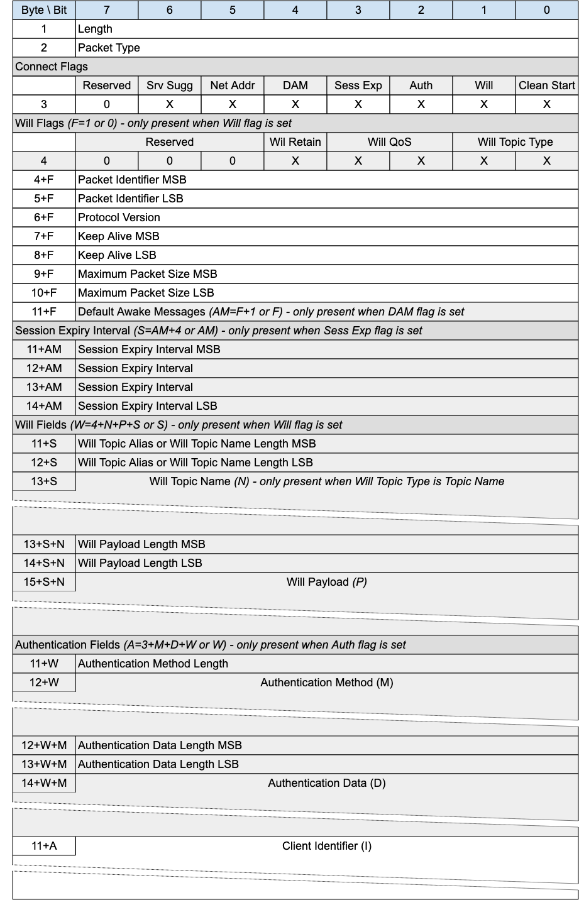{style="width: 499.20px; height: 776.17px; margin-left: 0.00px; margin-top: -0.45px; transform: rotate(0.00rad) translateZ(0px); -webkit-transform: rotate(0.00rad) translateZ(0px);"}]{style="overflow: hidden; display: inline-block; margin: 0.00px 0.00px; border: 0.00px solid #000000; transform: rotate(0.00rad) translateZ(0px); -webkit-transform: rotate(0.00rad) translateZ(0px); width: 499.20px; height: 775.27px;"}

[The CONNECT packet is sent from the Client to the
]{.c27}[Server]{.c12}[ ]{.c27 .c12}[to request the creation of or
continuation of a Session. ]{.c27}

### [3.1.1 CONNECT Header]{.c38 .c17 .c32} {#h.43ky6rz .c20}

[The first 2 or 4 bytes of the packet are encoded according to the
variable length packet header format.Refer to ]{.c27}[[2.1 Structure of
an MQTT-SN Control Packet](#h.23ckvvd){.c4}]{.c6}[ for a detailed
description.]{.c2}

### [3.1.2 Connect Flags]{.c38 .c17 .c32} {#h.2iq8gzs .c20}

[The Connect Flags is 1 byte field which contains several parameters
specifying the behavior of the MQTT-SN Virtual ]{.c3}[C]{.c9}[onnection.
It also indicates the presence or absence of fields in the Packet.]{.c3
.c17 .c32}

[The ]{.c1}[Server]{.c30}[ MUST validate that the reserved flags in the
CONNECT packet are set to 0 ]{.c1}[\[MQTT-SN-3.1.2-1\].]{.c9 .c35}[ If
any of the reserved flags is not 0 it is a Malformed Packet. Refer to
]{.c9}[[4.12 Handling errors](#h.v8vlgf6xm72a){.c4}]{.c6}[ for
information about handling errors.]{.c9}

#### [3.1.2.1 Clean Start Flag]{.c17 .c89 .c75 .c44 .c32} {#h.etqaie4ha8c7 .c20}

[Position:]{.c75 .c44 .c49}[ bit 0 of the Connect Flags byte.]{.c9}

[This flag specifies whether the Virtual Connection starts a new Session
or is a continuation of an existing Session. Refer to ]{.c3}[[4.1
Session state](#h.21od6so){.c4}]{.c6}[ for a definition of the Session
State.]{.c3 .c17}

[If a CONNECT packet is received with Clean Start is set to 1, the
Client and Server MUST discard any existing Session and start a new
Session]{.c3 .c30}[ ]{.c3}[\[MQTT-SN-3.1.2.1-1\].]{.c9
.c35}[ Consequently, the Session Present flag in CONNACK is always set
to 0 if Clean Start is set to 1.]{.c3 .c17}

[If a CONNECT packet is received with Clean Start set to 0 and there is
a Session associated with the Client Identifier, the Server MUST resume
communications with the Client based on state from the existing
Session]{.c3 .c30}[ ]{.c3}[\[MQTT-SN-3.1.2.1-2\]]{.c9 .c35}[. ]{.c3}[If
a CONNECT packet is received with Clean Start set to 0 and there is no
Session associated with the Client Identifier, the Server MUST create a
new Session]{.c3 .c30}[ ]{.c3}[\[MQTT-3.1.2.1-3\]]{.c9 .c35}[.]{.c3
.c17}

#### [3.1.2.2 Will Flag]{.c17 .c89 .c75 .c44 .c32} {#h.92dpq2f7xb81 .c7 .c93 .c90}

[Position:]{.c75 .c44 .c49}[ bit 1 of the Connect Flags byte.]{.c9}

[If the Will Flag is set to 1, the Will Flags, Will Topic, and Will
Payload fields MUST be present in the Packet]{.c3
.c30}[ ]{.c3}[\[MQTT-SN-3.1.2.2-1\]]{.c9 .c35}[. ]{.c3}

[If the Will Flag is set to 1 this indicates that a Will Message MUST be
stored on the Server and associated with the Session]{.c3
.c30}[ ]{.c3}[\[MQTT-SN-3.1.2.2-2\]]{.c9 .c35}[. The Will Message
consists of the Will Topic, and Will Payload fields in the CONNECT
Packet. ]{.c3}[The Will Message MUST be published after the Virtual
Connection is deleted or the Session ends, unless the Will Message has
been deleted by the Server on receipt of a DISCONNECT packet with Reason
Code 0x00 (Normal disconnection)]{.c3
.c30}[ ]{.c3}[\[MQTT-SN-3.1.2.2-3\]]{.c9 .c35}[.]{.c3 .c17 .c32}

[Situations in which the Will Message is published include, but are not
limited to:]{.c3 .c17 .c32}

- [The Server deletes the Virtual Connection as a result of a]{.c3}[n
  I/O error or network failure]{.c3}[ it has detected.]{.c3 .c17 .c32}
- [The Client fails to communicate within the Keep Alive time.]{.c3 .c17
  .c32}
- [The Server deletes the Virtual Connection because of a protocol
  error.]{.c3}
- [The Server deletes the Virtual Connection because of a Retry
  timeout.]{.c3 .c17 .c32}

[The Will Message MUST be removed from the stored Session State in the
Server once it has]{.c3 .c30}[ been published]{.c3 .c30}[ or the Server
has received a DISCONNECT packet with a Reason Code of 0x00 (Normal
disconnection) from the Client]{.c3
.c30}[ ]{.c3}[\[MQTT-SN-3.1.2.2-4\]]{.c9 .c35}[.]{.c3 .c17 .c32}

[The Server SHOULD publish Will Messages promptly after the Virtual
Connection is deleted or the ]{.c3}[Session]{.c3}[ ends, whichever
occurs first. In the case of a Server shutdown or failure, the Server
MAY defer publication of Will Messages until a subsequent restart. If
this happens, there might be a delay between the time the Server
experienced failure and when the Will Message is published.]{.c3 .c17
.c32}

#### [3.1.2.3 Authentication Flag]{.c17 .c89 .c75 .c44 .c32} {#h.26ppt98ru9i8 .c106 .c93 .c87 .c90}

[Position:]{.c44} bit 2 of the Connect Flags byte. Labelled
[Auth]{.c36} in Figure 3-1.

[If the Authentication Flag is set to 1, the Authentication Method and
Authentication Data fields MUST be present in the Packet]{.c18
.c12}[ ]{.c27 .c12}[\[MQTT-SN-3.1.2.3-1\]]{.c27 .c35}[. ]{.c3 .c17 .c32}

[If the Authentication Flag is set to 0, the Authentication Method and
Authentication Data fields MUST NOT be present in the Packet]{.c12
.c30}[ ]{.c12}[\[MQTT-SN-3.1.2.3-2\]]{.c35}[. ]{.c3 .c17 .c32}

#### [3.1.2.4 Session Expiry Flag]{.c17 .c89 .c75 .c44 .c32} {#h.ntz1htjambvt .c106 .c93 .c87 .c90}

[Position:]{.c44} bit 3 of the Connect Flags byte. Labelled [Sess
Exp]{.c36}[ in Figure 3-1.]{.c2}

[If the Session Expiry Flag is set to 1, the Session Expiry Interval
field MUST be present in the Packet]{.c18 .c12}[ ]{.c27
.c12}[\[MQTT-SN-3.1.2.4-1\]]{.c27 .c35}[. ]{.c3 .c17 .c32}

[If the Session Expiry Flag is set to 0, the Session Expiry Interval
field MUST NOT be present in the Packet]{.c18 .c12}[ ]{.c27
.c12}[\[MQTT-SN-3.1.2.4-2\]]{.c27 .c35}[. ]{.c3 .c17 .c32}

#### [3.1.2.5 Default Number of Awake Messages Flag]{.c17 .c89 .c75 .c44 .c32} {#h.ynjlp937bzvf .c7 .c93 .c90}

[Position:]{.c44} bit 4 of the Connect Flags byte. Labelled
[DAM]{.c36}[ in Figure 3-1.]{.c2}

[If the Default Number of Awake Messages Flag is set to 1, the Default
Awake Messages field MUST be present in the Packet]{.c12
.c30}[ ]{.c12}[\[MQTT-SN-3.1.2.5-1\]]{.c35}[. ]{.c3 .c17 .c32}

[If the Default Number of Awake Messages Flag is set to 0, the Default
Awake Messages field MUST NOT be present in the Packet]{.c12
.c30}[ ]{.c12}[\[MQTT-SN-3.1.2.5-2\]]{.c35}[. ]{.c3 .c17 .c32}

#### [3.1.2.6 Allow Network Address Changes Flag]{.c17 .c89 .c75 .c44 .c32} {#h.lxv39ab2mxz6 .c7 .c93 .c90}

[Position:]{.c44} bit 5 of the Connect Flags byte. Labelled [Net
Addr]{.c36}[ in Figure 3-1.]{.c2}

[This flag only has an effect In implementations which use a Network
Address to associate incoming packets with a Virtual Connection,
otherwise it should be 0.]{.c2}

Setting this flag to 1 means that the Client authorizes the server to
update the Network Address associated with a Virtual Connection. The
Client does this by sending a Connection Encapsulated Packet with the
Client Identifier. If its Network Address has changed, the Server can
update the Virtual Connection.

[If this flag is set to 0 and a Packet is wrapped by the Connection
Encapsulation, it is a protocol error. The Server must send a DISCONNECT
and delete the Virtual Connection
]{.c30}[\[MQTT-SN-3.1.2.6-1\]]{.c35}[.]{.c12}

[This flag affects the use of the Connection Encapsulation only, it does
not affect other methods of identifying the sender such as the
Protection Encapsulation.]{.c16 .c9}

#### [3.1.2.7 Allow Server Suggested Values Flag]{.c17 .c89 .c75 .c44 .c32} {#h.72j9yi304ucj .c7 .c93 .c90}

[Position:]{.c44} bit 6 of the Connect Flags byte. Labelled [Srv
Sugg]{.c36}[ in Figure 3-1.]{.c2}

[If this flag is set to 1, the Client allows the Server to return
modified values for all of:]{.c2}

- [Keep Alive, in the CONNACK Packet]{.c2}
- [Session Expiry, in the CONNACK Packet]{.c2}
- [Sleep Duration in the SLEEPRESP Packet]{.c2}

[for the Virtual Connection.]{.c2}

[If this flag is set to 0, the Server MUST NOT include a Server Keep
Alive field in the CONNACK Packet response
]{.c30}[\[MQTT-SN-3.1.2.7-1\]]{.c35}[. ]{.c3 .c17 .c32}

[If this flag is set to 0, the Server MUST NOT include a Session Expiry
field in the CONNACK Packet response
]{.c30}[\[MQTT-SN-3.1.2.7-2\]]{.c35}[. ]{.c3 .c17 .c32}

[If this flag is set to 0 for the current Virtual Connection, the Server
MUST NOT include a Sleep Duration in the SLEEPRESP Packet
]{.c30}[\[MQTT-SN-3.1.2.7-3\]]{.c35}[. ]{.c12}

### [3.]{.c27}1[.3 ]{.c27}Will Flags[ ]{.c38 .c17 .c32} {#h.u38i2mpp332q .c20}

[If the Will Flag is set to 0, the Will Flags MUST NOT be present in the
Packet]{.c30} [\[MQTT-SN-3.1.3-1\].]{.c35}

[If the Will Flag is set to 1, the Will Flags MUST be present in the
Packet]{.c18}[ ]{.c27}[\[MQTT-SN-3.1.3-2\].]{.c27 .c35}

[The ]{.c27}[Will Flags]{.c27 .c36}[ is 1 byte field which contains
several parameters specifying the handling of the Will Message.]{.c2}

#### [3.1.3.1 Will Topic Type]{.c17 .c89 .c75 .c44 .c32} {#h.mbj87qvk8qy6 .c20}

[Position:]{.c44}[ bits 1 and 0 of the Will Flags byte.]{.c2}

[This is a 2-bit field which determines the format of the topic value.
Refer to ]{.c27}[[2.4 Topic Types](#h.2zbgiuw){.c4}]{.c6}[ for the
definition of the various topic types.]{.c2}

#### [3.1.3.2 Will QoS]{.c17 .c89 .c75 .c44 .c32} {#h.36sxt0949mi2 .c20}

[Position:]{.c44}[ bits 3 and 2 of the Will Flags byte.]{.c2}

[These two bits specify the QoS level to be used. The value of Will QoS
can be 0 (0x00), 1 (0x01), or 2 (0x02). A value of 3 (0x03) is a
Malformed Packet.]{.c2}

#### [3.1.3.3 Will Retain]{.c17 .c89 .c75 .c44 .c32} {#h.bnoytfwh08eh .c20}

[Position:]{.c44}[ bit 4 of the Will Flags byte.]{.c2}

[This specifies if the Will Message is to be ]{.c27 .c12}[retained when
it is published]{.c27 .c12}[. See ]{.c27 .c12}[[4.13 Retained
Messages](#h.ly7c1y){.c4}]{.c6}[ for more information about Retained
Messages.]{.c3 .c17 .c32}

[If the Will Flag is set to 1 and Will Retain is set to 0, the Server
MUST publish the Will Message as a non-retained message ]{.c18
.c12}[\[MQTT-SN-3.1.3.3-1\].]{.c27 .c35}

[If the Will Flag is set to 1 and Will Retain is set to 1, the Server
MUST publish the Will Message as a retained message]{.c12 .c18}[ ]{.c27
.c12}[\[MQTT-SN-3.1.3.3-2\]]{.c27 .c35}[.]{.c27 .c12}

### [3.1.4 Packet Identifier]{.c38 .c17 .c32} {#h.kxsqte300p6i .c20}

[Used to identify the corresponding ]{.c27}[CONNACK or AUTH
]{.c27}[packet. It should ideally be populated with a random ]{.c27}[Two
Byte Integer]{.c12} [value.]{.c2}

### [3.1.5 Protocol Version]{.c38 .c17 .c32} {#h.xvir7l .c20}

[The one-byte unsigned value that represents the revision level of the
protocol used by the Client. ]{.c3 .c17 .c32}

[Figure 3-2 -- Protocol Versions]{.c36 .c100}

  ---------------------------------------------------- -----------------------------------------
  [Protocol Version]{.c17 .c126 .c12 .c75 .c44 .c49}   [Value]{.c17 .c126 .c12 .c75 .c44 .c49}
  [Version 1.2]{.c3 .c17 .c32}                         [0x01]{.c3 .c17 .c32}
  [Version 2.0]{.c17 .c12 .c75 .c44 .c32 .c49}         [0x02]{.c17 .c12 .c75 .c44 .c32 .c49}
  [Reserved for future use]{.c3 .c17 .c32}             [0x03 -- 0xFF]{.c3 .c17 .c32}
  ---------------------------------------------------- -----------------------------------------

[The value of the Protocol Version field for MQTT-SN version 2.0 ]{.c18
.c12}[MUST]{.c18}[ be 2 (0x02)]{.c18 .c12}[ ]{.c12
.c30}[\[MQTT-SN-3.1.5-1\]]{.c35}[.]{.c12}

[A ]{.c27}Server[ which supports multiple versions of the MQTT-SN
protocol uses the Protocol Version to determine which version of MQTT-SN
the Client is using. ]{.c27}[If the Protocol Version is not 2 and the
]{.c18}[Server]{.c30}[ does not want to accept the CONNECT packet, the
Server MAY send a CONNACK packet with Reason Code 0x84 (Unsupported
Protocol Version)]{.c18}[ ]{.c30}[\[MQTT-SN-3.1.5-2\]]{.c35}[.]{.c12}

### [3.1.6 Keep Alive]{.c38 .c17 .c32} {#h.4h042r0 .c20}

[The Keep Alive is a Two Byte Integer greater than 0 (1 - 65,535), which
is a time interval measured in seconds. It is the maximum time interval
that is permitted to elapse between the point at which the Client
finishes transmitting one MQTT-SN Control Packet and the point it starts
sending the next. It is the responsibility of the Client to ensure that
the interval between MQTT-SN Control Packets being sent does not exceed
the Keep Alive value. ]{.c3}[In the absence of sending any other MQTT-SN
Control Packets, the Client MUST send a PINGREQ packet]{.c3
.c30}[ ]{.c3}[\[MQTT-SN-3.1.6-1\].]{.c9 .c35}

[Informative comment]{.c75 .c44 .c49}

[The Client can send PINGREQ at any time, irrespective of the Keep Alive
value, and check for a corresponding PINGRESP to determine that the
network and the ]{.c3}[Server]{.c12}[ are available.]{.c3 .c17}

[If the ]{.c1}[Server]{.c30}[ does not receive an MQTT-SN Control Packet
from the Client within one and a half times the Keep Alive time period,
it MUST delete the Virtual Connection and move the Client to the
Disconnected state (]{.c1}[see ]{.c1}[[4.14 Client
states](#h.3mj2wkv){.c4}]{.c1
.c6}[)]{.c1}[ ]{.c1}[\[MQTT-SN-3.1.6-2\].]{.c9 .c35}

[If a Client does not receive a PINGRESP packet within a ]{.c3
.c30}[R]{.c3 .c63 .c36 .c30}[etry Interval]{.c1 .c63
.c36}[ ]{.c1}[amount of time after it has sent a PINGREQ, it SHOULD
retry the transmission according to ]{.c3 .c30}[[4.4.2 Unacknowledged
Packets](#h.17nz8yj){.c4}]{.c1 .c6}[ up to the maximum number of
attempts. If a PINGRESP is still not received it ]{.c3
.c30}[MUST]{.c1}[ delete the Virtual Connection to the ]{.c3
.c30}[Server]{.c12 .c30}[ by way of a DISCONNECT, with the]{.c3
.c30}[ understanding that the ]{.c1}[Server]{.c30}[ may no longer be
reachable]{.c1}[ ]{.c12 .c30}[\[MQTT-SN-3.1.6-3\]]{.c35}[.]{.c12}

[Informative Comment]{.c16 .c75 .c44 .c32 .c49}

[Unlike MQTT, the MQTT-SN Keep Alive timeout can not be turned off (by
setting a value of 0). This is because there is no other indication in
MQTT-SN of a connection failure, as there is in MQTT with the underlying
TCP/IP connection.]{.c9}

[The Keep Alive must have a value greater than 0. It is a protocol error
if a Keep Alive value of 0 or below is set ]{.c3
.c30}[\[MQTT-SN-3.1.6-4\]]{.c35}[.]{.c12}

[Informative comment]{.c75 .c44 .c49}[\
The ]{.c3}[Server]{.c12}[ may have other reasons to disconnect the
Client, for instance because it is shutting down. Setting Keep Alive
does not guarantee that the Client will remain connected.]{.c3 .c17}

[Informative comment]{.c16 .c75 .c44 .c49}

[The actual value of the Keep Alive is application specific; typically,
this is a few minutes. The maximum value of 65,535 is 18 hours 12
minutes and 15 seconds.]{.c3 .c17}

[Informative Comment        ]{.c17 .c12 .c75 .c44 .c49}

[Clients can use the Keep Alive procedure to supervise the liveliness of
the ]{.c9}Server[ to which they are connected. If a Client does not
receive a PINGRESP from the ]{.c9}Server[ even after multiple
retransmissions of the PINGREQ packet and deletes the Virtual
Connection, it might try to connect to another ]{.c9}Server[ before
trying to reconnect to this ]{.c9}Server[.]{.c9}

### [3.1.7 Maximum Packet Size]{.c38 .c17 .c32} {#h.3vac5uf .c20}

[A Two Byte (16-bit) Integer representing the Maximum Packet Size the
Client]{.c3}[ is willing to accept. If the Maximum Packet Size is set to
0, no limit on the packet size is imposed beyond the limitations in the
protocol as a result of the remaining length encoding and the protocol
header sizes.]{.c3 .c17 .c32}

[Informative comment]{.c75 .c44 .c49}

[It is the responsibility of the application to select a suitable
Maximum Packet Size value if it chooses to restrict the Maximum Packet
Size.]{.c3 .c17 .c32}

[The packet size is the total number of bytes in an ]{.c3}[MQTT-SN
Control Packet,]{.c3}[ as defined in ]{.c3}[[2.1 Structure of an MQTT-SN
Control Packet](#h.23ckvvd){.c4}]{.c6}[. The Client uses the Maximum
Packet Size to inform the Server that it will not process packets
exceeding this limit.]{.c3 .c17 .c32}

[The Maximum Packet Size value MUST be 10 or greater ]{.c12
.c30}[\[MQTT-SN-3.1.7-1\]]{.c35}[,]{.c12 .c30}[ as this is the minimum
size that the CONNECT Packet can be.]{.c3 .c17}

[The ]{.c3 .c30}[Server]{.c12 .c30}[ MUST NOT send packets exceeding
Maximum Packet Size to the Client. If a Client receives a packet whose
size exceeds this limit, this is a Protocol Error, the Client uses
DISCONNECT with Reason Code 0x95 (Packet too large)]{.c3 .c30}[ ]{.c12
.c30}[\[MQTT-SN-3.1.7-2\]]{.c35}[.]{.c12}

[Where a Packet is too large to send, the ]{.c3 .c30}[Server]{.c12
.c30}[ MUST discard it without sending it and then behave as if it had
completed sending that Application Message]{.c3 .c30}[ ]{.c12
.c30}[\[MQTT-SN-3.1.7-3\]]{.c35}[.]{.c12}

[Informative comment]{.c75 .c44 .c49}

[Where a packet is discarded without being sent, the
]{.c3}[Server]{.c12}[ could take some diagnostic action including
alerting the Server administrator. Such actions are outside the scope of
this specification.]{.c3 .c17 .c32}

### [3.1.8 Default Awake Messages]{.c38 .c17 .c32} {#h.yhxgf7so0kdp .c20}

[An optional single byte value to indicate the maximum number of
messages a Client shall receive during an AWAKE session. If this field
is 0, or is absent, it is up to the Server to determine how many
messages it will send, which ]{.c12}may be[ unbounded.]{.c12}

### [3.1.9 Session Expiry Interval]{.c38 .c17 .c32} {#h.1baon6m .c20}

[The Session Expiry Interval is a four-byte integer time interval
measured in seconds. If the Session Expiry Interval is absent the value
0 is used. If the Session Expiry Interval is set to 0, or ]{.c9}is
absent, [the Session ends when the Virtual Connection is deleted by the
Client or ]{.c9}Server[.  ]{.c2}

[If the Session Expiry Interval is 0xFFFFFFFF (UINT_MAX), the Session
does not expire. ]{.c2}

[The Client and ]{.c1}[Server]{.c12 .c30}[ ]{.c3 .c30}[MUST store the
Session State after ]{.c1}[the Virtual Connection is deleted ]{.c30}[if
the Session Expiry Interval is greater than
0]{.c1}[ ]{.c30}[\[MQTT-SN-3.1.9-1\]]{.c35}[.]{.c12}

[Informative comment]{.c16 .c75 .c44 .c32 .c49}

[The clock in the Client or ]{.c9}Server[ may not be running for part of
the time interval, for instance because the Client or ]{.c9}Server[ are
not running. This might cause the deletion of the state to be
delayed.]{.c2}

[Informative comment]{.c16 .c75 .c44 .c32 .c49}

[The client and ]{.c9}Server[ between them should negotiate a reasonable
and practical session expiry interval according to the network and
infrastructure environment in which they are deployed. For example, it
would not be practical to set a session expiry interval of many months
on a ]{.c9}Server[ whose hardware is only capable of storing a few
client sessions.]{.c2}

[Informative comment]{.c16 .c75 .c44 .c32 .c49}

[A Client that only wants to process messages while connected will set
Clean Start to 1 and set the Session Expiry Interval to 0. It will not
receive Application Messages published before it is connected and has to
subscribe afresh to any topics that it is interested in each time it
connects.]{.c2}

[Informative comment]{.c16 .c75 .c44 .c32 .c49}

[The Client should always use the Session Present flag in the CONNACK to
determine whether the Server has a Session State for this Client.]{.c9}

### [3.]{.c27}1[.10 Will Topic Alias or Will Topic Name Length ]{.c38 .c17 .c32} {#h.6mntinqaom6n .c20}

[If the Will Flag is set to 1, the Will Topic Alias or Will Topic Name
Length is the next field in the Packet. In both cases, this is two
bytes.]{.c2}

[In the case of Will Topic Type being Topic Name, this field will refer
to the length of the Will Topic Name field. In the other cases, this
will be the value used as the Will Topic Alias.]{.c2}

### [3.]{.c27}1[.11 Will Topic Name]{.c38 .c17 .c32} {#h.m1ydln779jbl .c20}

[If the Will Flag is set to 1 and the Will Topic Type is set to Topic
Name (0b11), the Will Topic Name is the next field in the Packet.
]{.c9}[The Will Topic Name MUST be a UTF-8 Encoded String as defined in
]{.c1}[[1.7.4 UTF-8 Encoded String](#h.49x2ik5){.c4}]{.c6
.c30}[ ]{.c9}[\[MQTT-SN-3.1.11-1\]]{.c9 .c35}[.]{.c9}

### [3.]{.c27}1[.12 Will Payload Length]{.c38 .c17 .c32} {#h.g5w1zpmaiace .c20}

If the Will Flag is set to 1, the Will Payload Length is the next field
in the Packet. [It c]{.c27}[ontains the length of the Will Payload
field.]{.c2}

### [3.]{.c27}1[.13 Will Payload]{.c38 .c17 .c32} {#h.o88zms19c5d1 .c20}

[If the Will Flag is set to 1, the Will Payload is the next field in the
Packet. The Will Payload defines the Application Message Payload that is
to be published to the Will Topic as described in ]{.c27}[[3.1.2.2 Will
Flag](#h.92dpq2f7xb81){.c4}]{.c6}[. ]{.c27}[This field consists of
Binary Data.]{.c27}

### [3.]{.c27}1[.14 Authentication Method Length]{.c38 .c17 .c32} {#h.mw1gvx9qi5t0 .c20}

[If the Auth Flag is set to 1, the Authentication Method Length is the
next field in the Packet. It is a s]{.c9}[ingle byte value (max 0-255
bytes), representing the length of the field used to specify the
authentication method. Refer to ]{.c9}[[4.11
Authentication](#h.n3l7hni8c3ae){.c4}]{.c6}[ ]{.c9 .c154}[for more
information about authentication.]{.c2}

### [3.]{.c27}1[.15 Authentication Method]{.c38 .c17 .c32} {#h.4ydjyi9y5y20 .c20}

If the Auth Flag is set to 1, the Authentication Method is the next
field in the Packet.[ It is a ]{.c27}[UTF-8 Encoded String containing
the name of the Authentication Method. ]{.c2}

[To support the equivalent of the MQTT User Name and Password fields in
the CONNECT packet, s]{.c27}ee [ ]{.c27}[[4.11.1.2 MQTT User Name and
Password Support](#h.nhp24wh46om4){.c4}]{.c6}[.]{.c2}

[Refer to ]{.c27}[[4.11
Authentication](#h.n3l7hni8c3ae){.c4}]{.c6}[ ]{.c27 .c154}[for more
information about authentication.]{.c2}

### [3.]{.c27}1[.16 Authentication Data Length]{.c38 .c17 .c32} {#h.5hocu94eubqg .c20}

If the Auth Flag is set to 1, the Authentication Data Length is the next
field in the Packet. [It is a t]{.c27}[wo byte value (max 0-65535
bytes), representing the length of the field used to specify the
authentication data. Refer to ]{.c27}[[4.11
Authentication](#h.n3l7hni8c3ae){.c4}]{.c6}[ ]{.c27 .c154}[for more
information about authentication.]{.c2}

### [3.]{.c27}1[.17 Authentication Data]{.c38 .c17 .c32} {#h.g9mib2nvvlzy .c20}

[If the Auth Flag is set to 1, the Authentication Data is the next field
in the Packet. ]{.c2}

[Binary Data containing authentication data. The contents of this data
are defined by the authentication method. ]{.c2}

[To support the equivalent of the MQTT User Name and Password CONNECT
packet fields, see ]{.c9}[[4.11.1.2 MQTT User Name and Password
Support](#h.nhp24wh46om4){.c4}]{.c6}[.]{.c2}

[Refer to ]{.c9}[[4.11
Authentication](#h.n3l7hni8c3ae){.c4}]{.c6}[ ]{.c9 .c154}[for more
information about authentication.]{.c2}

### [3.1.18 Client Identifier]{.c38 .c17 .c32} {#h.pkwqa1 .c20}

[The Client Identifier MUST be a ]{.c12 .c30}[UTF-8 Encoded
String]{.c30}[ ]{.c12}[\[MQTT-SN-3.1.18-1\]]{.c35}[. ]{.c12}This field
is optional - its existence or absence is inferred from the Packet
length.

[The Client Identifier identifies the Client to the
]{.c3}[Server]{.c12}[. Each Client connecting to the
]{.c3}[Server]{.c12}[ has a unique Client Identifier. ]{.c3}[The Client
Identifier MUST be used by Clients and by ]{.c3 .c30}[Server]{.c12
.c30}[ to ]{.c3 .c30}[identify the state]{.c1}[ that they hold relating
to this MQTT-SN Session between the Client and the ]{.c3
.c30}[Server]{.c12 .c30}[ ]{.c12}[\[MQTT-SN-3.1.18-2\]]{.c35}[.]{.c12}

[Informative comment]{.c75 .c44 .c49}

[A Client Identifier can be between 0 - ]{.c3}[65,521 bytes. It is
recommended for practicality, Client Identifiers are restricted to a
reasonable size (less than 243 bytes to fit within a small CONNECT
packet).]{.c2}

[When the Client Identifier is present (greater than 0 bytes),
t]{.c1}[he ]{.c3 .c30}[Server]{.c12 .c30}[ MUST allow ]{.c3
.c30}[values]{.c1}[ which are between ]{.c3 .c30}[1 and 23 UTF-8]{.c3
.c30}[ encoded bytes in length, and that contain only the characters
\"0123456789abcdefghijklmnopqrstuvwxyzABCDEFGHIJKLMNOPQRSTUVWXYZ"]{.c3
.c30}[ ]{.c12 .c30}[\[MQTT-SN-3.1.18-3\]]{.c35}[.]{.c12}

[The ]{.c3 .c30}[Server]{.c12 .c30}[ MAY choose to allow more than 23
bytes]{.c3 .c30}[ ]{.c12 .c30}[\[MQTT-SN-3.1.18-4\]]{.c35}[.]{.c12}

[Informative comment]{.c17 .c12 .c75 .c44 .c49}

[The minimum supported length of between 1 and 23 bytes for the Client
Identifier in the Server is for compatibility with MQTT. A longer length
might be necessary to be supported if a UUID is used as an Assigned
Client Identifier as suggested in ]{.c12}[[3.2.11 Assigned Client
Identifier](#h.haapch){.c4}]{.c6}[.]{.c12}

### [3.1.19 CONNECT Actions]{.c38 .c17 .c32} {#h.9wk6osa2rqp1 .c137 .c87 .c60}

[Note that a Server MAY support multiple protocols on the same network
endpoint. If the Server determines that the protocol is MQTT-SN 2.0 then
it validates the connection attempt as follows.]{.c2}

1.  [The Server MUST validate that the CONNECT packet matches the format
    described in ]{.c1}[[3.1 CONNECT](#h.1jlao46){.c4}]{.c6 .c30}[ and
    MUST NOT create a Virtual Connection for this CONNECT if it does not
    match]{.c1}[ ]{.c9}[\[MQTT-SN-3.1.19-1\].]{.c9 .c35}[ The Server MAY
    send a CONNACK with a Reason Code of 0x80 or greater as described in
    ]{.c3}[[4.12 Handling errors](#h.v8vlgf6xm72a){.c4}]{.c6 .c9}[.]{.c3
    .c17 .c32}
2.  [The Server MAY check that the contents of the CONNECT packet meet
    any further restrictions and SHOULD perform authentication and
    authorization checks. If any of these checks fail, it MUST NOT
    create a Virtual Connection for this
    CONNECT]{.c1}[ ]{.c9}[\[MQTT-SN-3.1.19-2\]]{.c9 .c35}[. It MAY send
    an appropriate CONNACK response with a Reason Code of 0x80 or
    greater as described in ]{.c9}[[3.5 CONNACK](#h.39kk8xu){.c4}]{.c6
    .c9}[ and ]{.c9}[[4.12 Handling errors](#h.v8vlgf6xm72a){.c4}]{.c6
    .c9}[.]{.c9}

[If validation is successful, the Server performs the following
steps.]{.c2}

1.  [If the Client Identifier represents a Client already connected to
    the Server, the Server sends a DISCONNECT packet to the existing
    Client with Reason Code of 0x8E (Session taken over) as described in
    ]{.c1}[[4.12 Handling errors](#h.v8vlgf6xm72a){.c4}]{.c1 .c6}[ and
    MUST delete the Virtual Connection of the existing
    Client]{.c1}[ ]{.c9}[\[MQTT-SN-3.1.19-3\]]{.c9 .c35}[. If the
    existing Client has a Will Message, that Will Message is published
    as described in]{.c9}[ ]{.c9}[[3.4.3 Will
    Flags](#h.u38i2mpp332q){.c4}]{.c6 .c9}[. ]{.c2}
2.  [The Server MUST perform the processing of Clean Start that is
    described in ]{.c1}[[3.1.2.1 Clean Start
    Flag](#h.etqaie4ha8c7){.c4}]{.c6
    .c30}[ ]{.c1}[\[MQTT-SN-3.1.19-4\]]{.c9 .c35}[.]{.c2}
3.  [The Server MUST acknowledge the CONNECT packet with a CONNACK
    packet containing a 0x00 (Success) Reason
    Code]{.c1}[ ]{.c9}[\[MQTT-SN-3.1.19-5\]]{.c9 .c35}[.]{.c2}
4.  [Start Application Message delivery and Keep Alive monitoring.]{.c2}

[Informative comment]{.c75 .c44 .c49}

[It is recommended that authentication and authorization checks be
performed if the Server is being used to process any form of business
critical data. If these checks succeed, the Server responds by sending
CONNACK with a 0x00 (Success) Reason Code. If they fail, it is suggested
that the Server does not send a CONNACK at all, as this could alert a
potential attacker to the presence of the MQTT-SN Server and encourage
such an attacker to launch a denial of service or password-guessing
attack.]{.c2}

[A Client MUST]{.c1}[ wait for a CONNACK packet with a 0x00 (Success)
Reason Code before sending any packet that needs a Virtual
Connection]{.c1}[ ]{.c9}[\[MQTT-SN-3.1.19-6\]]{.c9 .c35}[.]{.c2}

[The Server MUST NOT process any data sent by the Client after the
CONNECT packet and before the CONNACK ]{.c1}[response is sent,
]{.c30}[except AUTH packets]{.c1}[ ]{.c9}[\[MQTT-SN-3.1.19-7\]]{.c9
.c35}[.]{.c2}

------------------------------------------------------------------------

## []{.c19 .c17} {#h.yo8fnzypn3lz .c214 .c93 .c200 .c87 .c234 .c90}

## 3.2 [CONNACK - Connect Acknowledgement]{.c27} {#h.39kk8xu .c214 .c93 .c200 .c87 .c90}

[Figure 3-3 -- CONNACK Packet]{.c36 .c100}

[{style="width: 624.00px; height: 700.00px; margin-left: 0.00px; margin-top: 0.00px; transform: rotate(0.00rad) translateZ(0px); -webkit-transform: rotate(0.00rad) translateZ(0px);"}]{style="overflow: hidden; display: inline-block; margin: 0.00px 0.00px; border: 0.00px solid #000000; transform: rotate(0.00rad) translateZ(0px); -webkit-transform: rotate(0.00rad) translateZ(0px); width: 624.00px; height: 700.00px;"}

[The CONNACK packet is sent by the ]{.c27}[Server]{.c12}[ ]{.c27
.c12}[in response to a CONNECT request from a client.]{.c2}

### [3.2.1 CONNACK Header]{.c38 .c17 .c32} {#h.2nusc19 .c20}

[The first 2 or 4 bytes of the packet are encoded according to the
variable length packet header format. Refer to ]{.c27}[[2.1 Structure of
an MQTT-SN Control Packet](#h.23ckvvd){.c4}]{.c6}[ for a detailed
description.]{.c27}

### [3.2.2 CONNACK Flags]{.c38 .c17 .c32} {#h.3mzq4wv .c20}

[The CONNACK Flags is a 1 byte field which contains flags specifying the
behavior of the MQTT-SN ]{.c27 .c12}[Virtual C]{.c27}[onnection on the
]{.c27 .c12}[Server]{.c12}[. ]{.c27 .c12 .c121}[Bits 7-2 of the CONNACK
Flags are reserved and MUST be set to 0]{.c18
.c12}[ ]{.c12}[\[MQTT-SN-3.2.2-1\]]{.c35}[.]{.c12}

[The Client MUST validate that the reserved flags in the CONNACK packet
are set to 0. If any of the reserved flags is not 0 it is a Malformed
Packet]{.c18}[ ]{.c30}[\[MQTT-SN-3.2.2-2\]]{.c35}[.]{.c12}

#### [3.]{.c44}2[.2.1 ]{.c44}[Session Present]{.c44 .c215} {#h.w3elb16r2ceb .c20}

[Position]{.c44}: bit 0 of the CONNACK Flags. Labelled [Sess
Pres]{.c36}[ in Figure 3-6.]{.c2}

S[pecifies whether an existing session was present on the
]{.c215}Server[ for the given client identifier]{.c215}[. A value of 1
indicates a session was present, a value 0 indicates no session was
present.]{.c2}

[If the Server accepts a CONNECT with Clean Start set to 1, the Server
MUST set Session Present to 0 in the CONNACK Packet in addition to
setting a 0x00 (Success) Reason Code in the CONNACK packet
]{.c30}[\[MQTT-SN-3.2.2.1-1\]]{.c35}[.]{.c12}

[If the Server accepts a CONNECT with Clean Start set to 0 and the
Server has Session State for the client identifier it MUST set Session
Present to 1 in the CONNACK packet, otherwise it MUST set Session
Present to 0 in the CONNACK packet. In both cases it MUST set a 0x00
(Success) Reason Code in the CONNACK packet
]{.c30}[\[MQTT-SN-3.2.2.1-2\]]{.c35}[.]{.c12}

[If the value of Session Present received by the Client from the Server
is not as expected, the Client proceeds as follows:]{.c2}

[If the Client does not have Session State and receives Session Present
set to 1 it MUST delete the Virtual Connection.]{.c30} [If it wishes to
restart with a new Session the Client can reconnect using Clean Start
set to 1 ]{.c30}[\[MQTT-SN-3.2.2.1-3\]]{.c35}[.]{.c12}

[If the Client does have Session State and receives Session Present set
to 0 it MUST discard its Session State if it continues with the Virtual
Connection ]{.c30}[\[MQTT-SN-3.2.2.1-4\]]{.c35}[.]{.c12}

[If a Server sends a CONNACK packet containing a non-zero Reason Code it
MUST set Session Present to 0
]{.c30}[\[MQTT-SN-3.2.2.1-5\]]{.c35}[.]{.c12}

#### [3.2.2.2 Session Expiry Interval Flag]{.c17 .c89 .c75 .c44 .c32} {#h.xzl3tg24tlhl .c7 .c93 .c90}

[Position]{.c44}: bit 1 of the CONNACK Flags. Labelled [Sess
Exp]{.c36}[ in Figure 3-6.]{.c2}

[​​]{.c27 .c12}[If the Session Expiry Interval Flag is set to 0, a Session
Expiry Interval MUST NOT be present in the Packet]{.c18 .c12}[ ]{.c27
.c12}[\[MQTT-SN-3.2.2.2-1\]]{.c27 .c35}[. ]{.c3 .c17}

[If the Session Expiry Interval Flag is set to 1, a Session Expiry
Interval MUST be present in the Packet]{.c18 .c12}[ ]{.c27
.c12}[\[MQTT-SN-3.2.2.2-2\]]{.c27 .c35}[.]{.c3 .c17}

#### [3.2.2.3 Server Keep Alive Flag ]{.c17 .c89 .c75 .c44 .c32} {#h.ohicd3k75hpo .c7 .c93 .c90}

[Position]{.c44}: bit 2 of the CONNACK Flags. Labelled [Server
KA]{.c36}[ in Figure 3-6.]{.c2}

[Indicates whether the packet includes a Server Keep Alive or not.]{.c2}

[​​]{.c12}[If the Server Keep Alive Flag is set to 0, a Server Keep Alive
field MUST NOT be present in the Packet]{.c12
.c30}[ ]{.c12}[\[MQTT-SN-3.2.2.3-1\]]{.c35}[. ]{.c3 .c17}

[If the Server Keep Alive Flag is set to 1, a Server Keep Alive field
MUST be present in the Packet]{.c12
.c30}[ ]{.c12}[\[MQTT-SN-3.2.2.3-2\]]{.c35}[.]{.c12}

#### [3.2.2.4 Authentication Flag]{.c17 .c89 .c75 .c44 .c32} {#h.cjfdh2p7nklr .c7 .c93 .c90}

[Position]{.c44}: bit 3 of the CONNACK Flags. Labelled [Auth]{.c36}[ in
Figure 3-6.]{.c2}

[Specifies whether the packet contains authentication material to be
considered.]{.c2}

[​​]{.c27 .c12}[If the Authentication Flag is set to 0, Authentication
Method and Data MUST NOT be present in the Packet]{.c18 .c12}[ ]{.c27
.c12}[\[MQTT-SN-3.2.2.]{.c27 .c35}[4]{.c35}[-1\]]{.c27 .c35}[. ]{.c3
.c17}

[If the Authentication Flag is set to 1, Authentication Method and Data
MUST be present in the Packet]{.c18 .c12}[ ]{.c27
.c12}[\[MQTT-N-3.2.2.]{.c27 .c35}[4]{.c35}[-2\]]{.c27 .c35}[.]{.c27
.c12}

### [3.2.3 Packet Identifier]{.c38 .c17 .c32} {#h.lnmexuhpjkl8 .c20}

[The same value as the Packet Identifier in the ]{.c27}[CONNECT or AUTH
]{.c27}[Packet being acknowledged.]{.c2}

### [3.2.4 Reason Code]{.c38 .c17 .c32} {#h.1302m92 .c20}

The values for Reason Codes are shown in [[2.3 Reason
Code](#h.46r0co2){.c4}]{.c6}. [The Server sending the CONNACK Packet
MUST use one of the ]{.c30}[Reason Codes applicable to
CONNACK]{.c30}[ ]{.c30}[\[MQTT-SN-3.2.4-1\]]{.c35}[.]{.c12}

[If a Server sends a CONNACK packet containing a Reason code of 0x80 or
]{.c30}[greater]{.c30}[ it MUST then delete the Virtual
]{.c30}[Connection]{.c30}[ ]{.c30}[\[MQTT-SN-3.2.4-2\]]{.c35}[.]{.c3
.c17 .c32}

[Informative comment]{.c17 .c12 .c75 .c44 .c32 .c49}

[Reason Code 0x80 (Unspecified error) may be used where the Server knows
the reason for the failure but does not wish to reveal it to the Client,
or when none of the other Reason Code values applies.]{.c3 .c17 .c32}

### [3.2.5 Session Expiry Interval]{.c38 .c17 .c32} {#h.2250f4o .c20}

[If the Session Expiry Interval is absent the value of Session Expiry
Interval in the CONNECT Packet is used. ]{.c27 .c12}[The Server uses
this field to inform the Client that it is using a value other than that
sent by the Client in the CONNECT]{.c27}[. ]{.c3 .c17 .c32}

[Refer to ]{.c27 .c12}[[3.1.9 Session Expiry
Interval](#h.1baon6m){.c4}]{.c6}[ for a description of the use of
Session Expiry Interval.]{.c3 .c17 .c32}

### [3.2.6 Server Keep Alive]{.c38 .c17 .c32} {#h.dvtkrwv3ej4d .c20}

The Server uses this field to inform the Client that it is using a value
other than that sent by the Client in the CONNECT[. ]{.c3 .c17 .c32}

[If the Server sends a Server Keep Alive on the CONNACK packet, the
Client MUST use this value instead of the Keep Alive value the Client
sent on CONNECT]{.c12 .c30}[ ]{.c12}[\[MQTT-SN-3.2.6-1\]]{.c35}[. ]{.c3
.c17 .c32}

[If the Server does not send the Server Keep Alive, the Server MUST use
the Keep Alive value set by the Client on CONNECT]{.c12
.c30}[ ]{.c12}[\[MQTT-SN-3.2.6-2\]]{.c35}[.]{.c3 .c17 .c32}

[Refer to ]{.c12}[[3.4.6 Keep Alive](#h.4h042r0){.c4}]{.c6}[ for a
description of the use of Keep Alive Interval.]{.c3 .c17 .c32}

[Informative comment]{.c17 .c12 .c75 .c44 .c32 .c49}

[The primary use of the Server Keep Alive is for the Server to inform
the Client that it will disconnect the Client for inactivity sooner than
the Keep Alive specified by the Client.]{.c3 .c17 .c32}

### [3.]{.c27}2[.]{.c27}7[ Authentication Method Length]{.c38 .c17 .c32} {#h.3wmneavoet74 .c20}

[Single byte value (max 0-255 bytes), representing the length of field
used to specify the authentication method. Refer to ]{.c27}[[4.11
Authentication](#h.n3l7hni8c3ae){.c4}]{.c6}[ ]{.c27 .c154}[for more
information about authentication.]{.c2}

### [3.]{.c27}2[.]{.c27}8[ Authentication Method]{.c38 .c17 .c32} {#h.ydayklwjstjk .c20}

[A UTF-8 Encoded String containing the name of the authentication
method. Refer to ]{.c27}[[4.11
Authentication](#h.n3l7hni8c3ae){.c4}]{.c6}[ for more information about
authentication.]{.c2}

### [3.]{.c27}2[.]{.c27}9 [Authentication Data Length]{.c38 .c17 .c32} {#h.kvppk7yh36lv .c20}

[Two byte value (max 0-65535 bytes), representing the length of field
used to specify the authentication data. Refer to ]{.c27}[[4.11
Authentication](#h.n3l7hni8c3ae){.c4}]{.c6}[ ]{.c27 .c154}[for more
information about authentication.]{.c2}

### [3.]{.c27}2[.]{.c27}10[ Authentication Data]{.c38 .c17 .c32} {#h.600ktmi3vm5o .c20}

[Binary Data containing authentication data. The contents of this data
are defined by the authentication method and the state of already
exchanged authentication data. Refer to ]{.c27}[[4.11
Authentication](#h.n3l7hni8c3ae){.c4}]{.c6}[ ]{.c27 .c154}[for more
information about authentication.]{.c2}

### [3.2.11 Assigned Client Identifier]{.c38 .c17 .c32} {#h.haapch .c20}

[The Assigned Client Identifier MUST be a ]{.c12 .c30}[UTF-8 Encoded
String]{.c30}[ ]{.c12}[\[MQTT-SN-3.2.11-1\]]{.c35}[.]{.c12}[ ]{.c12}[This
field is optional - its existence or absence is inferred from the Packet
length.]{.c2}

The Assigned Client Identifier is t[he Client Identifier assigned by the
]{.c9}Server[ when the associated CONNECT packet
]{.c9}[contained]{.c9}[ no Client Identifier. ]{.c9}[If the Client
connects using a zero length Client Identifier, the Server MUST respond
with a CONNACK containing an Assigned Client
Identifier]{.c1}[ ]{.c30}[\[MQTT-SN-3.2.11-2\]]{.c35}[.]{.c12}[The
Assigned Client Identifier MUST be a new Client Identifier not used by
any other Session currently in the
]{.c1}[Server]{.c30} [\[MQTT-SN-3.2.11-3\]]{.c35}[.]{.c12}

[It is suggested that the 36 character Universally Unique IDentifier
(UUID) format described in RFC9562 is used for MQTT-SN Assigned Client
Identifiers. In any case they should be no longer than 36
characters.]{.c3 .c17 .c32}

[(RFC9562 describes UUIDs that are 128 bits in size, 16 bytes or 32
hexadecimal digits. These UUIDs are commonly expressed in 36 characters,
including 4 dashes as separators such as the following:
]{.c3}[f81d4fae-7dec-11d0-a765-00a0c91e6bf6]{.c3 .c36}[.)]{.c3 .c17
.c32}

[Informative comment]{.c16 .c75 .c44 .c32 .c49}

[The length of Assigned Client Identifiers should take into account the
maximum packet size allowed by the MQTT-SN implementation.]{.c3 .c17
.c32}

[Informative comment]{.c75 .c44 .c49}

[Where a Transparent Gateway ]{.c3}[receives]{.c12}[ an Assigned Client
Identifier from ]{.c3}[an MQTT Server ]{.c12}[which is deemed too
l]{.c3}[ong]{.c12}[ for a device, it should map shorter Gateway
generated Client Identifiers with their versions returned from the MQTT
]{.c3}[Server]{.c12}[.]{.c3}

## 3.3 [AUTH]{.c27}[ - Authentication Exchange]{.c19 .c17} {#h.184mhaj .c208 .c93 .c200 .c87 .c90}

[Figure 3-4 -- AUTH Packet]{.c36 .c100}

[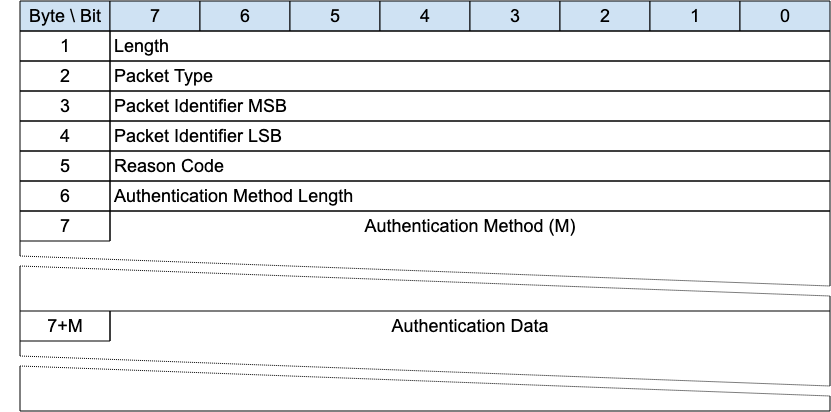{style="width: 624.00px; height: 309.33px; margin-left: 0.00px; margin-top: 0.00px; transform: rotate(0.00rad) translateZ(0px); -webkit-transform: rotate(0.00rad) translateZ(0px);"}]{style="overflow: hidden; display: inline-block; margin: 0.00px 0.00px; border: 0.00px solid #000000; transform: rotate(0.00rad) translateZ(0px); -webkit-transform: rotate(0.00rad) translateZ(0px); width: 624.00px; height: 309.33px;"}

[The authentication method and data is first sent by the Client as part
of a CONNECT exchange. If the Server requires additional information to
complete the authentication, it responds with an AUTH packet to ]{.c27
.c32}[signal]{.c27 .c32}[ that the Client generates and sends another
AUTH packet with the required information and so on until the
authentication is complete. The server then responds with a CONNACK
message.]{.c2}

### [3.3.1 AUTH Header]{.c38 .c17 .c32} {#h.3s49zyc .c20}

[The first 2 or 4 bytes of the packet are encoded according to the
variable length packet header format. Refer to ]{.c27}[[2.1 Structure of
an MQTT-SN Control Packet](#h.23ckvvd){.c4}]{.c6}[ for a detailed
description.]{.c2}

### [3.3.2 Packet Identifier]{.c38 .c17 .c32} {#h.6cbjggtsyz0j .c20}

[Used to identify the corresponding ]{.c27}[CONNECT or ]{.c27}[AUTH
packet. It should ideally be populated with a random ]{.c27}Two Byte
I[nteger value when sent from Client to Server. ]{.c27}[When sent from
Server to Client, it MUST contain the packet identifier of the CONNECT
or AUTH packet being responded to]{.c30} [\[MQTT-SN-3.3.2-1\].]{.c35}

### [3.3.3 Reason Code]{.c38 .c17 .c32} {#h.279ka65 .c20}

[The values for the Authentication Reason Code field are shown in ]{.c27
.c32}[[2.3 Reason Code](#h.46r0co2){.c4}]{.c6}. [The sender of the AUTH
Packet MUST use one of the]{.c18}[ Reason Codes]{.c18}[ shown as
applicable to the AUTH
packet]{.c18}[ ]{.c30}[\[MQTT-SN-3.3.3-1\].]{.c35}

### [3.3.4 Authentication Method Length]{.c38 .c17 .c32} {#h.meukdy .c20}

[The length of the Authentication Method string.]{.c2}

### [3.3.5 Authentication Method]{.c38 .c17 .c32} {#h.36ei31r .c20}

[A UTF-8 Encoded String containing the name of the authentication
method.]{.c2}

### [3.3.6 Authentication Data]{.c38 .c17 .c32} {#h.1ljsd9k .c20}

[Binary Data containing authentication data. The contents of this data
are defined by the authentication method.]{.c27 .c32}

### [3.3.7 AUTH Actions]{.c38 .c17 .c32} {#h.psc1lxe4uzxw .c20}

Refer to [[4.11 Authentication](#h.n3l7hni8c3ae){.c4}]{.c6}[ for more
information about authentication.]{.c2}

## 3.4 [REGISTER - Register Topic Alias Request]{.c19 .c17} {#h.45jfvxd .c208 .c93 .c200 .c87 .c90}

[Figure 3-5 -- REGISTER Packet]{.c36 .c100}

[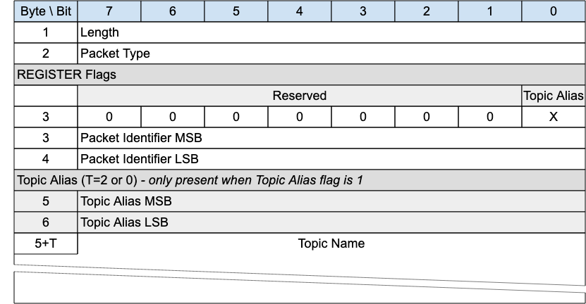{style="width: 624.00px; height: 324.00px; margin-left: 0.00px; margin-top: 0.00px; transform: rotate(0.00rad) translateZ(0px); -webkit-transform: rotate(0.00rad) translateZ(0px);"}]{style="overflow: hidden; display: inline-block; margin: 0.00px 0.00px; border: 0.00px solid #000000; transform: rotate(0.00rad) translateZ(0px); -webkit-transform: rotate(0.00rad) translateZ(0px); width: 624.00px; height: 324.00px;"}

[A REGISTER packet is sent by a Client or ]{.c9}Server[ to create a
Session Topic Alias, before sending a PUBLISH with that Session Topic
Alias.]{.c2}

[The REGISTER packet ]{.c9}[is sent by a Client to a ]{.c9}Server[ to
request a Session Topic Alias for the included Topic Name. ]{.c2}

[It is sent by a ]{.c9}Server[ to inform a Client about the Session
Topic Alias it has assigned to the included Topic Name.]{.c2}

[Topic Aliases are always assigned and managed by the ]{.c9}Server[, not
the Client. For more information see ]{.c9}[[4.7.2 Topic
Aliases](#h.1fyl9w3){.c4}]{.c6}[.]{.c2}

A REGISTER packet may be sent by the Server when the Client is in the
Awake state if the Retain Topic Aliases flag on the SLEEPREQ was set to
0, to reinform the Client of a Session Topic Alias.

[If the REGISTER packet is sent by a Client, it MUST NOT contain a Topic
Alias]{.c1}[ ]{.c30}[\[MQTT-SN-3.4-1\]]{.c35}[.]{.c12}

[If the REGISTER packet is sent by a ]{.c1}[Server]{.c30}[, it MUST
contain a Topic Alias]{.c1}[ ]{.c30}[\[MQTT-SN-3.4-2\]]{.c35}[.]{.c12}

### [3.4.1 REGISTER Header]{.c38 .c17 .c32} {#h.2koq656 .c20}

[The first 2 or 4 bytes of the packet are encoded according to the
variable length packet header format. Refer to ]{.c9}[[2.1 Structure of
an MQTT-SN Control Packet](#h.23ckvvd){.c4}]{.c6}[ for a detailed
description.]{.c2}

### [3.4.2 REGISTER Flags]{.c38 .c17 .c32} {#h.5ufspf21xppm .c20}

[The REGISTER Flags is a 1 byte field which contains flags specifying
the contents of the REGISTER packet]{.c3}[. ]{.c3}[Bits 7-1 of the
REGISTER Flags are reserved and MUST be set to 0]{.c3
.c30}[ ]{.c12}[\[MQTT-SN-3.4.2-1\]]{.c35}[.]{.c12}

[The receiver MUST validate that the reserved flags in the REGISTER
packet are set to 0. If any of the reserved flags is not 0 it is a
Malformed Packet]{.c1}[ ]{.c30}[\[MQTT-SN-3.4.2-2\]]{.c35}[.]{.c12}

#### [3.4.2.1 Topic Alias Flag]{.c17 .c89 .c75 .c44 .c32} {#h.d0vh95un2cq3 .c178 .c93 .c87 .c90}

[Position]{.c44}[: bit 0 of the REGISTER Flags.]{.c2}

[Determines the presence of the Topic Alias field. ]{.c3}

[If the Topic Alias Flag is set to 0, a Topic Alias MUST NOT be present
in the Packet]{.c3 .c30}[ ]{.c3}[\[MQTT-SN-3.4.2.1-1\]]{.c9 .c35}[.
]{.c3 .c17}

[If the Topic Alias Flag is set to 1, a Topic Alias MUST be present in
the Packet]{.c3 .c30}[ ]{.c3}[\[MQTT-SN-3.4.2.1-2\]]{.c9 .c35}[.]{.c3}

### [3.4.2 Packet Identifier]{.c38 .c17 .c32} {#h.tvj9pexz17l7 .c81 .c93 .c90}

[Used to identify the corresponding REGACK packet. It should ideally be
populated with a random ]{.c9}Two Byte I[nteger value. ]{.c2}

### [3.4.3 Topic Alias ]{.c38 .c17 .c32} {#h.zu0gcz .c20}

[C]{.c9}[ontains the Topic Alias value assigned to the Topic Name
included in the Topic Name field.]{.c2}

### [3.4.4 Topic Name]{.c38 .c17 .c32} {#h.1yyy98l .c20}

[Fixed Length UTF-8 Encoded String Contains the fully qualified topic
name.]{.c2}

### [3.4.5 REGISTER Actions]{.c38 .c17 .c32} {#h.2jnkuws4c71i .c106 .c93 .c202 .c90}

[As described in ]{.c27}[[4.7.2 Topic
Aliases](#h.1fyl9w3){.c4}]{.c6}[.]{.c2}

## 3.5 [REGACK - Register Topic Alias Acknowledgement]{.c19 .c17} {#h.4iylrwe .c83}

[Figure 3-6 -- REGACK Packet]{.c36 .c100}

[{style="width: 624.00px; height: 245.33px; margin-left: 0.00px; margin-top: 0.00px; transform: rotate(0.00rad) translateZ(0px); -webkit-transform: rotate(0.00rad) translateZ(0px);"}]{style="overflow: hidden; display: inline-block; margin: 0.00px 0.00px; border: 0.00px solid #000000; transform: rotate(0.00rad) translateZ(0px); -webkit-transform: rotate(0.00rad) translateZ(0px); width: 624.00px; height: 245.33px;"}

[The REGACK packet is sent by a Client or by a ]{.c27}Server[ as an
acknowledgment to the receipt and processing of a REGISTER packet.]{.c2}

### [3.5.1 REGACK Header]{.c38 .c17 .c32} {#h.2y3w247 .c20}

[The first 2 or 4 bytes of the packet are encoded according to the
variable length packet header format. Refer to ]{.c27}[[2.1 Structure of
an MQTT-SN Control Packet](#h.23ckvvd){.c4}]{.c6}[ for a detailed
description.]{.c2}

### [3.5.2 REGACK Flags]{.c38 .c17 .c32} {#h.1d96cc0 .c20}

[The REGACK Flags is a 1 byte field which contains flags specifying the
contents of the REGACK packet]{.c3}[. ]{.c3}[Bits 7-3 of the REGACK
Flags are reserved and MUST be set to 0]{.c3
.c30}[ ]{.c12}[\[MQTT-SN-3.5.2-1\]]{.c35}[.]{.c12}

[The Client MUST validate that the reserved flags in the REGACK packet
are set to 0. If any of the reserved flags is not 0 it is a Malformed
Packet]{.c1}[ ]{.c30}[\[MQTT-SN-3.5.2-2\]]{.c35}[.]{.c12}

#### 3.5.2.1 [Topic Type]{.c17 .c89 .c75 .c44 .c32} {#h.9sc8qmlasy98 .c93 .c87 .c90 .c139}

[Position]{.c75 .c44 .c49}[: bits 0 and 1 of the REGACK Flags.]{.c2}

[D]{.c3}[etermines the format of the topic value. Refer to ]{.c3
.c215}[[2.4 Topic Types](#h.2zbgiuw){.c4}]{.c6}[ for the definition of
the various topic types.]{.c3 .c215}

[The Topic Type in the REGACK packet MUST be ]{.c3 .c30}[Predefined
Topic Alias]{.c3 .c30}[ or Session Topic Alias]{.c3 .c30}[ ]{.c12
.c30}[\[MQTT-SN-3.5.2.1-1\]]{.c35}[. ]{.c12}[Any other value is a
Protocol Error.]{.c3 .c17}

[Informative Comment]{.c17 .c12 .c75 .c44 .c49}

[A Predefined Topic Alias can be returned in the REGACK Packet if a
Client tries to register a Session Topic Alias for a Topic Name which
the Server already knows is a Predefined Topic Alias. See
]{.c12}[[4.7.2.2 Session Topic Aliases](#h.kijijiozu1yv){.c4}]{.c6}[ for
details.]{.c12}

#### [3.5.2.2 Topic Alias Flag]{.c17 .c89 .c75 .c44 .c32} {#h.c53rgmfddmn8 .c93 .c87 .c90 .c178}

[Position]{.c44}[: bit 2 of the REGISTER Flags.]{.c2}

[Determines the presence of the Topic Alias field. ]{.c3}

[If the Topic Alias Flag is set to 0, a Topic Alias MUST NOT be present
in the Packet]{.c3 .c30}[ ]{.c3}[\[MQTT-SN-3.5.2.2-1\]]{.c9 .c35}[.
]{.c3 .c17}

[If the Topic Alias Flag is set to 1, a Topic Alias MUST be present in
the Packet]{.c3 .c30}[ ]{.c3}[\[MQTT-SN-3.5.2.2-2\]]{.c9 .c35}[.]{.c3
.c17}

### [3.5.3 Packet Identifier]{.c38 .c17 .c32} {#h.2ce457m .c20}

[The same value as the Packet Identifier in the REGISTER packet being
acknowledged.]{.c27}

### 3.5.4 Topic Alias {#h.3x8tuzt .c20}

[A Topic Alias is a ]{.c9}Two Byte I[nteger value that is used to
identify the Topic instead of the Topic Name. This numeric value is used
as the Topic Alias.]{.c2}

[If the REGACK is sent by a ]{.c9}Server[ in response to a REGISTER
request from a Client, the Topic Alias is that which has been assigned
by the ]{.c9}Server[, and which the Client should use during the rest of
the Session to refer to the Topic Name identified in the REGISTER
packet.]{.c2}

[If the REGACK is sent by a Client, it is in response to a REGISTER
packet from a ]{.c9}Server[ informing the Client which Topic Alias it
should use. ]{.c9}[When sent by a Client the REGACK MUST NOT contain a
Topic Alias]{.c1}[ ]{.c30}[\[MQTT-SN-3.5.4-1\]]{.c35}[.]{.c12}

### [3.5.5 Reason Code]{.c38 .c17 .c32} {#h.rjefff .c20}

[The Reason Code for the REGACK packet is optional - its existence is
inferred from the Packet length. If not provided, 0x00 (Success) is
assumed. ]{.c2}

The values for Reason Codes are shown in [[2.3 Reason
Code](#h.46r0co2){.c4}]{.c6}. [The sender of the REGACK Packet MUST use
one of the ]{.c30}[Reason Codes applicable to
REGACK]{.c30}[ ]{.c30}[\[MQTT-SN-3.5.5-1\]]{.c35}[.]{.c12}

## [3.6 Publish Requests and Responses]{.c19 .c17} {#h.3bj1y38 .c20}

[MQTT-SN is designed to be optimized for packet size. For this reason,
publish requests have 3 variants:]{.c2}

1.  [PUBWOS, Publish Without Session, where no session is required]{.c2}
2.  [PUBLISH Quality of Service 0 where no response is required and thus
    no packet identifier ]{.c2}
3.  [PUBLISH Quality of Service 1 and 2 where a response is expected.
    ]{.c2}

[The ]{.c49}[table below]{.c49}[ shows the two packet types.]{.c2}

[Figure 3-7 -- Publish Packet Types]{.c36 .c100}

  ----------------------------------------------------- ----------------------------------- ---------------------------------------------------------------------------------------------------------
  [Packet Name]{.c16 .c39 .c126 .c75 .c44}              [Type]{.c16 .c39 .c126 .c75 .c44}   [Description]{.c16 .c39 .c126 .c75 .c44}
  [Publish]{.c16 .c39 .c75 .c44 .c32}                   [0x0C]{.c16 .c27 .c39 .c32}         [A PUBLISH packet corresponding to Quality of Service (QoS) 0, 1 or 2]{.c16 .c27 .c39 .c32}
  [Publish Without Session]{.c16 .c39 .c75 .c44 .c32}   [0x11]{.c16 .c27 .c39 .c32}         [A PUBWOS Packet sent by a Client and does not need not to have an active Session]{.c16 .c27 .c39 .c32}
  ----------------------------------------------------- ----------------------------------- ---------------------------------------------------------------------------------------------------------

### 3.6.1 [PUB]{.c27}[WOS - Publish Without Session]{.c38 .c17 .c32} {#h.j8sehv .c83}

[Figure 3-8 -- PUBWOS Packet]{.c36 .c100}

[{style="width: 624.00px; height: 332.00px; margin-left: 0.00px; margin-top: 0.00px; transform: rotate(0.00rad) translateZ(0px); -webkit-transform: rotate(0.00rad) translateZ(0px);"}]{style="overflow: hidden; display: inline-block; margin: 0.00px 0.00px; border: 0.00px solid #000000; transform: rotate(0.00rad) translateZ(0px); -webkit-transform: rotate(0.00rad) translateZ(0px); width: 624.00px; height: 332.00px;"}

[This packet is used by both clients and ]{.c27}Server[s to publish data
for a certain topic.]{.c27}

[The ]{.c27}[PUBWOS packet does not have a corresponding feature in
MQTT. ]{.c27}[If forwarded to an MQTT connection, PUBWOS packets MUST
have their MQTT Quality of Service level set to 0
]{.c18}[\[MQTT-SN-3.6-1\].]{.c27 .c35}

[Informative comment]{.c75 .c44}

[PUBWOS packets received by a ]{.c27}Server[ are not associated with a
MQTT-SN Client Session and can be optionally discarded by the
]{.c27}Server[ without being processed for onward delivery.]{.c16 .c9}

[Informative comment]{.c44}

[If the Transport Layer supports multicast, like UDP/IP, the PUBWOS
packet can be sent using a multicast address as the destination.]{.c16
.c9}

#### [3.]{.c27}6[.1.1 PUBWOS Header]{.c17 .c89 .c75 .c44 .c32} {#h.338fx5o .c20}

[The first 2 or 4 bytes of the packet are encoded according to the
variable length packet header format. Refer to ]{.c27}[[2.1 Structure of
an MQTT-SN Control Packet](#h.23ckvvd){.c4}]{.c6}[ for a detailed
description.]{.c2}

#### [3.]{.c27}6[.1.2 PUBWOS Flags]{.c17 .c89 .c75 .c44 .c32} {#h.1idq7dh .c7 .c93 .c90}

[The PUBWOS Flags is a 1 byte field which contains flags specifying the
content of the packet and the ]{.c27 .c12}[Server]{.c12}[ behavior on
receipt]{.c27 .c12}[. ]{.c27 .c12 .c121}[Bits 7-5 and 3-2 of the PUBWOS
FLAGS are reserved and MUST be set to 0]{.c18 .c12
.c121}[ ]{.c12}[\[MQTT-SN-3.6.1.2-1\]]{.c35}[.]{.c12}

[The Client MUST validate that the reserved flags in the PUBWOS packet
are set to 0. If any of the reserved flags is not 0 it is a Malformed
Packet]{.c18}[ ]{.c30}[\[MQTT-SN-3.6.1.2-2\]]{.c35}[.]{.c12}

##### [3.6.1.2.1 Topic Type]{.c17 .c89 .c75 .c44 .c32} {#h.qfef1dqk26d9 .c106 .c93 .c124 .c90}

[Position]{.c44}[: bits 0 and 1 of the PUBWOS Flags.]{.c2}

[This determines the format of the topic data field. Refer to
]{.c27}[[2.4 Topic Types](#h.2zbgiuw){.c4}]{.c6}[ for the definition of
the topic types. ]{.c27}[The Topic Type in the PUBWOS packet MUST be
Predefined Topic Alias or Topic Name
]{.c18}[\[MQTT-SN-3.6.1.2.1-1\]]{.c35}[.]{.c12}

##### [3.6.1.2.2 Retain]{.c17 .c89 .c75 .c44 .c32} {#h.kky57id4222a .c93 .c200 .c124 .c90 .c236}

[Position]{.c44}[: bit 4 of the PUBWOS Flags.]{.c2}

[This]{.c27}[ field signifies whether the existing Retained Message for
this topic is replaced or kept. For a detailed description of Retained
Messages see ]{.c27}[[4.13 Retained
Messages](#h.ly7c1y){.c4}]{.c6}[.]{.c2}

#### [3.]{.c27}6[.1.3 Topic Alias or Topic Name Length]{.c17 .c89 .c75 .c44 .c32} {#h.42ddq1a .c7 .c93 .c90}

[This field is 2 bytes. It contains the Topic Name length if the Topic
Type is Topic Name, or a predefined Topic Alias if the Topic Type is
Predefined Topic Alias.]{.c27}[ Determines the topic which this payload
will be published to.]{.c2}

#### [3.]{.c27}6[.1.4 Topic Name]{.c17 .c89 .c75 .c44 .c32} {#h.vgc8jwcnscew .c20}

[If the Topic Type is Topic Name, the Topic Name field MUST be present
in the PUBWOS packet ]{.c30}[\[MQTT-SN-3.6.1.4-1\]]{.c35}[.]{.c12}

[If the Topic Type is Predefined Topic Alias, the Topic Name field MUST
NOT be present in the PUBWOS packet
]{.c30}[\[MQTT-SN-3.6.1.4-2\]]{.c35}[.]{.c12}

If the Topic Type is Topic Name this field will be a UTF-8 encoded
string value of length determined by the Topic Name Length field.

#### [3.]{.c27}6[.1.5 Payload]{.c17 .c89 .c75 .c44 .c32} {#h.2hio093 .c20}

[The Payload contains the payload data of the Application Message that
is being published.]{.c27}[ ]{.c27}This field consists of Binary
Data.[The content and format of the data is application specific. It is
valid for a PUBWOS packet to contain a zero length Payload.]{.c2}

#### [3.6.1.6 PUBWOS Actions]{.c17 .c89 .c75 .c44 .c32} {#h.whhpchgpz502 .c7 .c93 .c78 .c90}

[The Client or Server uses a PUBWOS packet to send an Application
Message to a Network Address, for possible receipt by a Server or
another Client.]{.c2}

[If received by a Client or Server, the PUBWOS packet MUST be treated as
if its QoS were 0 ]{.c18}[\[MQTT-SN-3.6.1.6-1\] ]{.c27 .c35}[as
described in ]{.c27 .c12}[[3.6.3.7 PUBLISH
Actions](#h.3hu8nopr74va){.c4}]{.c6}[.]{.c27 .c12}

------------------------------------------------------------------------

### 3.6.2 [PUBLISH with QoS 0]{.c38 .c17 .c32} {#h.wnyagw .c83}

[Figure 3-9 -- PUBLISH Packet for QoS 0]{.c36 .c100}

[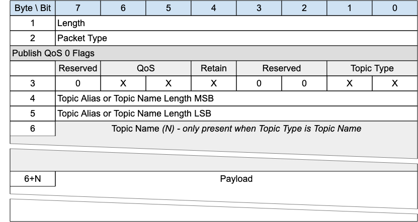{style="width: 624.00px; height: 332.00px; margin-left: 0.00px; margin-top: 0.00px; transform: rotate(0.00rad) translateZ(0px); -webkit-transform: rotate(0.00rad) translateZ(0px);"}]{style="overflow: hidden; display: inline-block; margin: 0.00px 0.00px; border: 0.00px solid #000000; transform: rotate(0.00rad) translateZ(0px); -webkit-transform: rotate(0.00rad) translateZ(0px); width: 624.00px; height: 332.00px;"}

[A PUBLISH packet is sent from a Client to a Server or from a Server to
a Client to transport an Application Message.]{.c2}

[PUBLISH packets with QoS equal to 0 received by a Client or Server
]{.c18}[MUST be associated with a
Session]{.c18}[ ]{.c18}[\[MQTT-SN-3.6.1.2-1\]]{.c35}[.]{.c12}

#### [3.]{.c27}6[.2.1]{.c27}[ PUBLISH Header]{.c17 .c89 .c75 .c44 .c32} {#h.3gnlt4p .c20}

[The first 2 or 4 bytes of the packet are encoded according to the
variable length packet header format. Refer to ]{.c27}[[2.1 Structure of
an MQTT-SN Control Packet](#h.23ckvvd){.c4}]{.c6}[ for a detailed
description.]{.c2}

#### [3.]{.c27}6[.2.2 PUBLISH Flags]{.c27} {#h.1vsw3ci .c20}

[The PUBLISH Flags is a 1 byte field which contains flags specifying the
content of the packet and the ]{.c27 .c12}[Server]{.c12}[ behavior]{.c27
.c12}[. ]{.c27 .c12 .c121}[Bits 7 and 3-2 of the PUBLISH Flags are
reserved and MUST be set to 0]{.c18 .c12
.c121}[ ]{.c12}[\[MQTT-SN-3.6.2.2-1\]]{.c35}[.]{.c12}

[The Client MUST validate that the reserved flags in the PUBLISH packet
are set to 0. If any of the reserved flags is not 0 it is a Malformed
Packet]{.c18}[ ]{.c30}[\[MQTT-SN-3.6.2.2-2\]]{.c35}[.]{.c12}

##### [3.6.2.2.1 Topic Type]{.c17 .c89 .c75 .c44 .c32} {#h.fmrm4etlxug5 .c119 .c93 .c124 .c90}

[Position]{.c44}: bits 0 and 1 of the PUBLISH Flags.

[This determines the content of the Topic Alias and Topic Name fields.
]{.c27}[Refer to ]{.c27}[[2.4 Topic Types](#h.2zbgiuw){.c4}]{.c6}[ for
the definition of the various topic types.]{.c2}

[The Topic Type may be Topic Name, Predefined Topic Alias or Session
Topic Alias.]{.c27}

##### [3.6.2.2.2 QoS]{.c17 .c89 .c75 .c44 .c32} {#h.hmaja4ei5dew .c119 .c93 .c124 .c90}

[Position]{.c44}: bits 5 and 6 of the PUBLISH Flags.

[This field is set to "0b00" for QoS 0. For a detailed description of
the various Quality Of Service levels refer to ]{.c27 .c12}[[4.3 Quality
of Service levels and protocol flows](#h.2i9l8ns){.c4}]{.c6}[.]{.c27
.c12}

##### [3.6.2.2.3 Retain]{.c17 .c89 .c75 .c44 .c32} {#h.ehxpc4g73qd3 .c236 .c93 .c200 .c124 .c90}

[Position]{.c44}: bit 4 of the PUBLISH Flags.

[This flag signifies whether the message is published as a retained
message or not. See ]{.c27}[[4.13 Retained
Messages](#h.ly7c1y){.c4}]{.c6}[ for more information]{.c27}[ about
Retained Messages.]{.c2}

#### [3.]{.c27}6[.2.3 Topic Alias or Topic Name Length]{.c17 .c89 .c75 .c44 .c32} {#h.prwby0o5psp7 .c20}

[Contains 2 bytes of Topic Name Length if the Topic Type is Topic Name,
or the Predefined or Session Topic Alias if the Topic Type is Predefined
Topic Alias or Session Topic Alias respectively.]{.c2}

#### [3.]{.c27}6[.2.4 Topic Name]{.c17 .c89 .c75 .c44 .c32} {#h.szyp1smih5mo .c20}

[If the Topic Type is Topic Name (0b11), the Topic Name field MUST be
present in the PUBLISH packet
]{.c30}[\[MQTT-SN-3.6.2.4-1\]]{.c35}[.]{.c12}

[If the Topic Type is Predefined Topic Alias or Session Topic Alias,
then the Topic Name field MUST NOT be present in the PUBLISH
packet]{.c18}[ ]{.c30}[\[MQTT-SN-3.6.2.4-2\]]{.c35}[.]{.c12}

Topic Name is a UTF-8 encoded string of length Topic Length.

#### [3.]{.c27}6[.2.5 Payload]{.c17 .c89 .c75 .c44 .c32} {#h.gqkpss1ajssy .c20}

The Payload contains the payload data of the Application Message that is
being published. This field consists of Binary Data. The content and
format of the data is application specific. It is valid for a PUBLISH
packet to contain a zero length Payload.

#### 3.6.2.6 [PUBLISH - QoS 0 Actions]{.c17 .c89 .c75 .c44 .c32} {#h.inu1col38lh0 .c20}

[As described in ]{.c27}[[3.6.3.7 PUBLISH
Actions](#h.3hu8nopr74va){.c4}]{.c6}[.]{.c27}

------------------------------------------------------------------------

### 3.6.3 [PUBLISH with QoS 1 and 2]{.c38 .c17 .c32} {#h.1a346fx .c83}

[Figure 3-10 -- PUBLISH Packet for QoS 1 and 2]{.c36 .c100}

[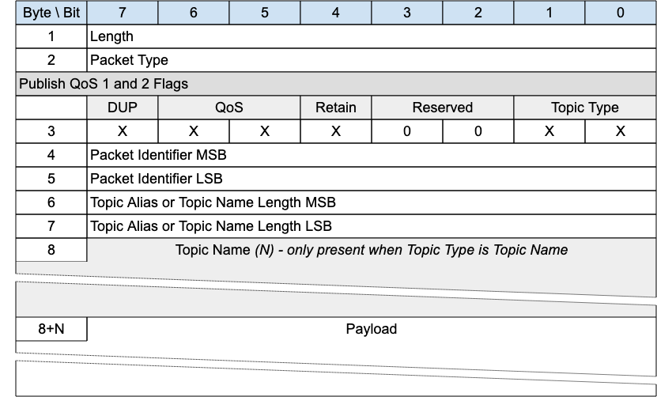{style="width: 624.00px; height: 377.33px; margin-left: 0.00px; margin-top: 0.00px; transform: rotate(0.00rad) translateZ(0px); -webkit-transform: rotate(0.00rad) translateZ(0px);"}]{style="overflow: hidden; display: inline-block; margin: 0.00px 0.00px; border: 0.00px solid #000000; transform: rotate(0.00rad) translateZ(0px); -webkit-transform: rotate(0.00rad) translateZ(0px); width: 624.00px; height: 377.33px;"}

[A PUBLISH packet is sent from a Client to a Server or from a Server to
a Client to transport an Application Message.]{.c2}

[PUBLISH packets with QoS equals to 1 or 2 received by a Client or
Server MUST be associated with a Session ]{.c1}[\[MQTT-SN-3.]{.c9
.c35}[6.3]{.c35}[-1\].]{.c9 .c17 .c35 .c32}

#### [3.]{.c27}6[.3.]{.c27}[1 PUBLISH Header]{.c17 .c89 .c75 .c44 .c32} {#h.3u2rp3q .c20}

[The first 2 or 4 bytes of the packet are encoded according to the
variable length packet header format. Refer to ]{.c9}[[2.1 Structure of
an MQTT-SN Control Packet](#h.23ckvvd){.c4}]{.c6}[ for a detailed
description.]{.c2}

#### [3.]{.c27}6[.3.2 PUBLISH Flags]{.c27} {#h.2981zbj .c20}

[The PUBLISH Flags is a 1 byte field which contains flags specifying the
content of the packet and the ]{.c27 .c12}[Server]{.c12}[ behavior]{.c27
.c12}[. ]{.c27 .c12 .c121}[Bits 3-2 of the PUBLISH Flags are reserved
and MUST be set to 0]{.c18 .c12
.c121}[ ]{.c12}[\[MQTT-SN-3.6.3.2-1\]]{.c35}[.]{.c12}

[The Client MUST validate that the reserved flags in the PUBLISH packet
are set to 0. If any of the reserved flags is not 0 it is a Malformed
Packet]{.c18}[ ]{.c30}[\[MQTT-SN-3.6.3.2-2\]]{.c35}[.]{.c12}

##### [3.6.3.2.1 Topic Type]{.c17 .c89 .c75 .c44 .c32} {#h.kw46rfulitvm .c119 .c93 .c124 .c90}

[Position]{.c44}: bits 0 and 1 of the PUBLISH Flags.

[This determines the format of the Topic Data field. ]{.c27}[Refer to
]{.c27}[[2.4 Topic Types](#h.2zbgiuw){.c4}]{.c6}[ for the definition of
Topic Types.]{.c2}

[The Topic Type may be Topic Name, Predefined Topic Alias or Session
Topic Alias.]{.c27}

##### [3.6.3.2.2 QoS]{.c17 .c89 .c75 .c44 .c32} {#h.vji0n7lr4z5x .c119 .c93 .c90 .c124}

[Position]{.c75 .c44 .c49}[: bits 5 and 6 of the PUBLISH Flags.]{.c9}

[Quality of Service - as in MQTT. The QoS levels are:]{.c3 .c17}

[Figure 3-11 -- QoS Definitions]{.c36 .c100}

  --------------------------------------- ----------------------------------- ----------------------------------- ------------------------------------------
  [QoS value]{.c17 .c12 .c75 .c44 .c49}   [Bit 6]{.c17 .c12 .c75 .c44 .c49}   [bit 5]{.c17 .c12 .c75 .c44 .c49}   [Description]{.c17 .c12 .c75 .c44 .c49}
  [0]{.c3 .c17}                           [0]{.c3 .c17}                       [0]{.c3 .c17}                       [At most once delivery]{.c3 .c17}
  [1]{.c3 .c17}                           [0]{.c3 .c17}                       [1]{.c3 .c17}                       [At least once delivery]{.c3 .c17}
  [2]{.c3 .c17}                           [1]{.c3 .c17}                       [0]{.c3 .c17}                       [Exactly once delivery]{.c3 .c17}
  [-]{.c3 .c17}                           [1]{.c3 .c17}                       [1]{.c3 .c17}                       [Reserved -- must not be used]{.c3 .c17}
  --------------------------------------- ----------------------------------- ----------------------------------- ------------------------------------------

[For a detailed description of the various Quality Of Service levels
refer to ]{.c27 .c12}[[4.3 Quality of Service levels and protocol
flows](#h.2i9l8ns){.c4}]{.c6}[.]{.c27 .c12}

##### [3.6.3.2.3 DUP]{.c17 .c89 .c75 .c44 .c32} {#h.rxf6r8qtkk4u .c119 .c93 .c124 .c90}

[Position]{.c75 .c44 .c49}[: bit 7 of the PUBLISH Flags.]{.c9}

[The DUP flag indicates the duplicate delivery of QoS 2 PUBLISH
]{.c3}[packets]{.c9}[. ]{.c3}[If the DUP flag ]{.c3}[is set]{.c9}[ to 0,
it signifies that the packet is sent for the first time. If the DUP flag
is set to 1, it signifies that the packet is
retransmitted.]{.c3}[ ]{.c3}

##### [3.6.3.2.4 Retain]{.c17 .c89 .c75 .c44 .c32} {#h.qucfg7kks10e .c236 .c93 .c200 .c124 .c90}

[Position]{.c75 .c44 .c49}[: bit 4 of the PUBLISH Flags.]{.c9}

[This flag signifies whether the message is published as a retained
message or not. See ]{.c9}[[4.13 Retained
Messages](#h.ly7c1y){.c4}]{.c6}[ for more information]{.c9}[ about
Retained Messages.]{.c2}

#### [3.6.3.3 Packet Identifier]{.c17 .c89 .c75 .c44 .c32} {#h.1nia2ey .c20}

[Used to identify the corresponding PUBACK packet in the case of QoS 1.
Used to identify the corresponding PUBREC, PUBREL and PUBCOMP packets in
the case of QoS 2. It should ideally be populated with a random
T]{.c9}wo Byte I[nteger value.]{.c2}

#### [3.6.3.4 Topic Alias or Topic Name Length]{.c17 .c89 .c75 .c44 .c32} {#h.x2t78tr9icfe .c20}

[Contains 2 bytes of Topic Name Length if the Topic Type is Topic Name,
or the Predefined or Session Topic Alias if the Topic Type is Predefined
Topic Alias or Session Topic Alias respectively.]{.c9}

#### [3.6.3.5 Topic Name]{.c17 .c89 .c75 .c44 .c32} {#h.2mn7vak .c20}

[If the Topic Type is Topic Name (0b11), the Topic Name field MUST be
present in the PUBLISH
packet]{.c1}[ ]{.c30}[\[MQTT-SN-3.6.3.5-1\]]{.c35}[.]{.c12}

[If the Topic Type is Predefined Topic Alias or Session Topic Alias,
then the Topic Name field MUST NOT be present in the PUBLISH
packet]{.c1}[ ]{.c30}[\[MQTT-SN-3.6.3.5-2\]]{.c35}[.]{.c12}

[Topic Name is a UTF-8 encoded string of length Topic Length.]{.c2}

#### [3.6.3.6 Payload]{.c17 .c89 .c75 .c44 .c32} {#h.imenmt69e82j .c20}

[The Payload contains the payload data of the Application Message that
is being published. ]{.c9}This field consists of Binary Data. [The
content and format of the data is application specific. It is valid for
a PUBLISH packet to contain a zero length Payload.]{.c9}

#### 3.6.3.7[ PUBLISH Actions]{.c17 .c89 .c75 .c44 .c32} {#h.3hu8nopr74va .c7 .c93 .c78 .c90}

[The receiver of a PUBLISH packet MUST respond with the packet as
determined by the QoS in the PUBLISH Packet. ]{.c1}[\[MQTT-SN-3.]{.c9
.c35}[6.3.]{.c35}[7-1\]]{.c9 .c35}[.]{.c3 .c17 .c32}

[Figure 3-12 -- Expected PUBLISH packet responses]{.c36 .c100}

  --------------------------------------- -----------------------------------------------
  [QoS Level]{.c16 .c75 .c44 .c32 .c49}   [Expected Response]{.c16 .c75 .c44 .c32 .c49}
  [QoS 0]{.c2}                            [None]{.c2}
  [QoS 1]{.c2}                            [PUBACK packet]{.c2}
  [QoS 2]{.c2}                            [PUBREC packet]{.c2}
  --------------------------------------- -----------------------------------------------

[The Client uses a PUBLISH packet to send an Application Message to the
Server, for distribution to Clients with matching subscriptions.]{.c2}

[The Server uses a PUBLISH packet to send an Application Message to each
Client which has a matching subscription.]{.c2}

[When Clients make subscriptions with Topic Filters that include
wildcards, it is possible for a Client's subscriptions to overlap so
that a published Application Message might match multiple filters.
]{.c9}[In this case the Server MUST deliver the Application Message to
the Client respecting the maximum QoS of all the matching
subscriptions]{.c1}[ ]{.c9}[\[MQTT-SN-3.6.3.7-2\]]{.c9 .c35}[. In
addition, the Server MAY deliver further copies of the Application
Message, one for each additional matching subscription and respecting
the subscription's QoS in each case. ]{.c2}

[The action of the recipient when it receives a PUBLISH packet depends
on the QoS level as described in ]{.c9}[[4.3 Quality of Service levels
and protocol flows](#h.2i9l8ns){.c4}]{.c6}[.]{.c9 .c149}

[Informative Comment]{.c16 .c75 .c44 .c32 .c49}

[If the Server distributes Application Messages to Clients to different
protocols and levels (such as MQTT V3.1.1) which do not support features
provided by this specification, some information in the Application
Message can be lost, and applications which depend on this information
might not work correctly.]{.c2}

[No more than one QoS 1 or 2 PUBLISH requests MUST be outstanding for a
Sender at any one time. Other packets are included in this constraint -
r]{.c9}[efer to ]{.c9}[[4.9 Flow
Control](#h.bfojn6tjnvgm){.c4}]{.c6}[ for more information about Flow
Control.]{.c9}

[Informative comment]{.c16 .c75 .c44 .c32 .c49}

[The ]{.c9}[Sender]{.c9}[ might choose to suspend the sending of QoS 0
PUBLISH packets when it suspends the sending of QoS 1 and QoS 2 PUBLISH
packets for Flow Control reasons.]{.c2}

### 3.6.4 [PUBACK -- Publish Acknowledgement (QoS 1 delivery)]{.c38 .c17 .c32} {#h.11si5id .c83}

[Figure 3-13 -- PUBACK Packet]{.c36 .c100}

[{style="width: 624.00px; height: 122.67px; margin-left: 0.00px; margin-top: 0.00px; transform: rotate(0.00rad) translateZ(0px); -webkit-transform: rotate(0.00rad) translateZ(0px);"}]{style="overflow: hidden; display: inline-block; margin: 0.00px 0.00px; border: 0.00px solid #000000; transform: rotate(0.00rad) translateZ(0px); -webkit-transform: rotate(0.00rad) translateZ(0px); width: 624.00px; height: 122.67px;"}

[A PUBACK packet is the response to a PUBLISH packet with QoS 1.]{.c27}

#### [3.]{.c27}6[.4.1 PUBACK Header]{.c17 .c89 .c75 .c44 .c32} {#h.3ls5o66 .c20}

[The first 2 or 4 bytes of the packet are encoded according to the
variable length packet header format. Refer to ]{.c27}[[2.1 Structure of
an MQTT-SN Control Packet](#h.23ckvvd){.c4}]{.c6}[ for a detailed
description.]{.c2}

#### [3.]{.c27}6[.4.2 Packet Identifier]{.c17 .c89 .c75 .c44 .c32} {#h.20xfydz .c20}

[The same value as the Packet Identifier in the PUBLISH Packet being
acknowledged.]{.c2}

#### [3.6.4.3 Reason Code]{.c17 .c89 .c75 .c44 .c32} {#h.6vzc3pa0vvfr .c199 .c93 .c87 .c90}

[The Reason Code for the PUBACK packet is optional - its existence is
inferred from the Packet length. If not provided, 0x00 (Success) is
assumed. ]{.c2}

The values for Reason Codes are shown in [[2.3 Reason
Code](#h.46r0co2){.c4}]{.c6}. [The sender of the PUBACK Packet MUST use
one of the ]{.c30}[Reason Codes applicable to
PUBACK]{.c30}[ ]{.c30}[\[MQTT-SN-3.6.4.3-1\]]{.c35}[.]{.c12}

#### 3.6.4.4 [PUBACK Actions]{.c17 .c89 .c75 .c44 .c32} {#h.xgybvs5ktz8v .c162 .c93 .c87 .c90}

As described in [[4.3.3 QoS 1: At least once
delivery](#h.1au1eum){.c4}]{.c6}[.]{.c2}

### 3.6.5 [PUBREC - Publish Received (QoS 2 delivery part 1)]{.c38 .c17 .c32} {#h.302dr9l .c275 .c93 .c200 .c87 .c90}

[Figure 3-14 -- PUBREC Packet]{.c36 .c100}

[{style="width: 624.00px; height: 122.67px; margin-left: 0.00px; margin-top: 0.00px; transform: rotate(0.00rad) translateZ(0px); -webkit-transform: rotate(0.00rad) translateZ(0px);"}]{style="overflow: hidden; display: inline-block; margin: 0.00px 0.00px; border: 0.00px solid #000000; transform: rotate(0.00rad) translateZ(0px); -webkit-transform: rotate(0.00rad) translateZ(0px); width: 624.00px; height: 122.67px;"}

[A PUBREC packet is the response to a PUBLISH packet with QoS 2. It is
the second packet of the QoS 2 protocol exchange.]{.c2}

#### [3.6.5.1 PUBREC Header]{.c17 .c89 .c75 .c44 .c32} {#h.1f7o1he .c20}

[The first 2 or 4 bytes of the packet are encoded according to the
variable length packet header format. Refer to ]{.c27}[[2.1 Structure of
an MQTT-SN Control Packet](#h.23ckvvd){.c4}]{.c6}[ for a detailed
description.]{.c2}

#### [3.]{.c27}6.5[.2 Packet Identifier]{.c17 .c89 .c75 .c44 .c32} {#h.3z7bk57 .c20}

[The same value as the Packet Identifier in the PUBLISH Packet being
acknowledged.]{.c2}

#### [3.]{.c27}6.5[.3 Reason Code]{.c17 .c89 .c75 .c44 .c32} {#h.r1l18glza5z5 .c199 .c93 .c87 .c90}

[The Reason Code for the PUBREC packet is optional - its existence is
inferred from the Packet length. If not provided, 0x00 (Success) is
assumed. ]{.c2}

The values for Reason Codes are shown in [[2.3 Reason
Code](#h.46r0co2){.c4}]{.c6}. [The sender of the PUBREC Packet MUST use
one of the ]{.c30}[Reason Codes applicable to
PUBREC]{.c30}[ ]{.c30}[\[MQTT-SN-3.6.5.3-1\]]{.c35}[.]{.c12}

#### 3.6.5.4 [PUBREC Actions]{.c17 .c89 .c75 .c44 .c32} {#h.kktb96s9v8sj .c162 .c93 .c87 .c90}

[As described in ]{.c27}[[4.3.4 QoS 2: Exactly once
delivery](#h.1o97atn){.c4}]{.c6}[.]{.c27}

### 3.6.6 [PUBREL - Publish Release (QoS 2 delivery part 2)]{.c38 .c17 .c32} {#h.2eclud0 .c93 .c200 .c87 .c90 .c275}

[Figure 3-15 -- PUBREL Packet]{.c36 .c100}

[{style="width: 624.00px; height: 122.67px; margin-left: 0.00px; margin-top: 0.00px; transform: rotate(0.00rad) translateZ(0px); -webkit-transform: rotate(0.00rad) translateZ(0px);"}]{style="overflow: hidden; display: inline-block; margin: 0.00px 0.00px; border: 0.00px solid #000000; transform: rotate(0.00rad) translateZ(0px); -webkit-transform: rotate(0.00rad) translateZ(0px); width: 624.00px; height: 122.67px;"}

[A PUBREL packet is the response to a PUBREC packet. It is the third
packet of the QoS 2 protocol exchange.]{.c2}

#### [3.]{.c27}6.6[.1 PUBREL Header]{.c17 .c89 .c75 .c44 .c32} {#h.thw4kt .c7 .c93 .c90}

[The first 2 or 4 bytes of the packet are encoded according to the
variable length packet header format. Refer to ]{.c27}[[2.1 Structure of
an MQTT-SN Control Packet](#h.23ckvvd){.c4}]{.c6}[ for a detailed
description.]{.c2}

#### [3.]{.c27}6.6[.2 Packet Identifier]{.c17 .c89 .c75 .c44 .c32} {#h.3dhjn8m .c7 .c93 .c90}

[The same value as the Packet Identifier in the PUBLISH Packet being
acknowledged.]{.c2}

#### [3.]{.c27}6[.6]{.c89 .c44}[.3 Reason Code]{.c17 .c89 .c75 .c44 .c32} {#h.93he5qdacswt .c93 .c87 .c90 .c109}

[The Reason Code for the PUBREL packet is optional - its existence is
inferred from the Packet length. If not provided, 0x00 (Success) is
assumed. ]{.c2}

The values for Reason Codes are shown in [[2.3 Reason
Code](#h.46r0co2){.c4}]{.c6}. [The sender of the PUBREL Packet MUST use
one of the ]{.c30}[Reason Codes applicable to PU]{.c30}[BREL
]{.c30}[\[MQTT-SN-3.6.6.3-1\]]{.c35}[.]{.c12}

#### [3.6.6.4 PUBREL Actions]{.c17 .c89 .c75 .c44 .c32} {#h.nj4sqaal9xm4 .c109 .c93 .c87 .c90}

[As described in ]{.c27}[[4.3.4 QoS 2: Exactly once
delivery](#h.1o97atn){.c4}]{.c6}[.]{.c2}

------------------------------------------------------------------------

### []{.c38 .c17 .c32} {#h.bhimszouu7dv .c253 .c93 .c200 .c87 .c90 .c295}

### 3.6.7 [PUBCOMP - Publish Complete (QoS 2 delivery part 3)]{.c38 .c17 .c32} {#h.1smtxgf .c93 .c200 .c87 .c90 .c253}

[Figure 3-16 -- PUBCOMP Packet]{.c36 .c100}

[{style="width: 624.00px; height: 122.67px; margin-left: 0.00px; margin-top: 0.00px; transform: rotate(0.00rad) translateZ(0px); -webkit-transform: rotate(0.00rad) translateZ(0px);"}]{style="overflow: hidden; display: inline-block; margin: 0.00px 0.00px; border: 0.00px solid #000000; transform: rotate(0.00rad) translateZ(0px); -webkit-transform: rotate(0.00rad) translateZ(0px); width: 624.00px; height: 122.67px;"}

[The PUBCOMP packet is the response to a PUBREL packet. It is the fourth
and final packet of the QoS 2 protocol exchange.]{.c2}

#### [3.]{.c27}6[.7.1 PUBCOMP Header]{.c17 .c89 .c75 .c44 .c32} {#h.4cmhg48 .c7 .c93 .c90}

[The first 2 or 4 bytes of the packet are encoded according to the
variable length packet header format. Refer to ]{.c27}[[2.1 Structure of
an MQTT-SN Control Packet](#h.23ckvvd){.c4}]{.c6}[ for a detailed
description.]{.c2}

#### [3.]{.c27}6[.7.2 Packet Identifier]{.c17 .c89 .c75 .c44 .c32} {#h.2rrrqc1 .c7 .c90 .c93}

[The same value as the Packet Identifier in the PUBLISH Packet being
acknowledged.]{.c2}

#### [3.]{.c27}6[.7.3 Reason Code]{.c17 .c89 .c75 .c44 .c32} {#h.j9ce9nedlrkd .c7 .c93 .c90}

The Reason Code for the PUBCOMP packet is optional - its existence is
inferred from the Packet length. If not provided, 0x00 (Success) is
assumed.

The values for Reason Codes are shown in [[2.3 Reason
Code](#h.46r0co2){.c4}]{.c6}. [The sender of the PUBCOMP Packet MUST use
one of the ]{.c30}[Reason Codes applicable to PU]{.c30}[BCOMP
]{.c30}[\[MQTT-SN-3.6.7.3-1\]]{.c35}[.]{.c12}

#### [3.6.7.4 PUBCOMP Actions]{.c17 .c89 .c75 .c44 .c32} {#h.wwlbpe629g7j .c106 .c93 .c87 .c90}

[As described in ]{.c27}[[4.3.4 QoS 2: Exactly once
delivery](#h.1o97atn){.c4}]{.c6}[.]{.c27}

------------------------------------------------------------------------

## 3.7 [SUBSCRIBE - Subscribe Request]{.c27} {#h.16x20ju .c93 .c200 .c87 .c90 .c208}

[Figure 3-17 -- SUBSCRIBE Packet]{.c36 .c100}

[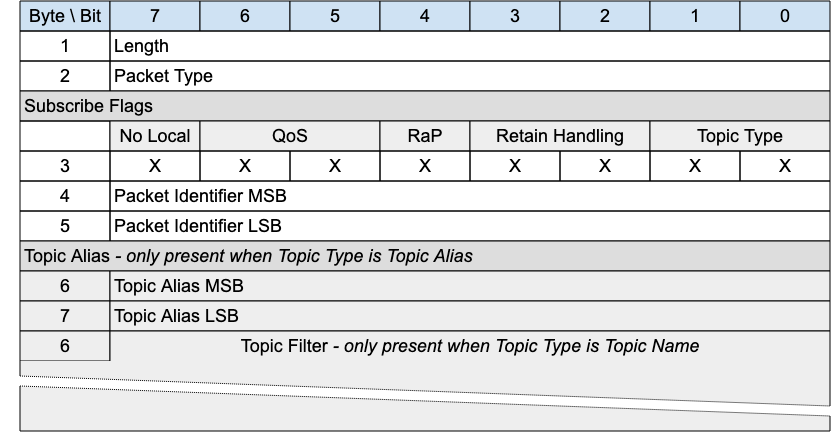{style="width: 624.00px; height: 324.00px; margin-left: 0.00px; margin-top: 0.00px; transform: rotate(0.00rad) translateZ(0px); -webkit-transform: rotate(0.00rad) translateZ(0px);"}]{style="overflow: hidden; display: inline-block; margin: 0.00px 0.00px; border: 0.00px solid #000000; transform: rotate(0.00rad) translateZ(0px); -webkit-transform: rotate(0.00rad) translateZ(0px); width: 624.00px; height: 324.00px;"}

[The SUBSCRIBE packet is sent from the Client to the Server to create
one or more Subscriptions. A Subscription registers a Client's interest
in one or more Topics. The Server sends PUBLISH packets to the Client to
forward Application Messages that were published to Topics that match
the Subscription. The SUBSCRIBE packet also specifies the maximum QoS
with which the Server can send Application Messages to the Client.]{.c2}

### [3.7.1 SUBSCRIBE Header]{.c38 .c17 .c32} {#h.3qwpj7n .c20}

[The first 2 or 4 bytes of the packet are encoded according to the
variable length packet header format. Refer to ]{.c9}[[2.1 Structure of
an MQTT-SN Control Packet](#h.23ckvvd){.c4}]{.c6}[ for a detailed
description.]{.c2}

### [3.7.2 SUBSCRIBE Flags]{.c38 .c17 .c32} {#h.261ztfg .c7 .c93 .c90}

[The SUBSCRIBE Flags field is 1 byte and governs the behavior of
subscriptions.]{.c2}

#### 3.7.2.1 Topic Type {#h.o4chcds3950x .c81 .c93 .c90}

[Position]{.c75 .c44 .c49}[: bits 0 and 1 of the SUBSCRIBE Flags.]{.c9}

[This field determines the content of the Topic Alias and Topic Filter
fields. Refer to ]{.c9}[[2.4 Topic Types](#h.2zbgiuw){.c4}]{.c6
.c9}[ for the definition of the various topic types.]{.c9}

[The Topic Type may be Topic Filter, Predefined Topic Alias or Session
Topic Alias.]{.c2}

#### [3.7.2.2 Retain handling]{.c17 .c89 .c75 .c44 .c32} {#h.cqknfyf6vt7z .c81 .c93 .c90}

[Position]{.c75 .c44 .c49}[: bits 2 and 3 of the SUBSCRIBE Flags.]{.c2}

[This option specifies whether retained messages are sent when the
subscription is established. This does not affect the sending of
retained messages at any point after the subscribe. If there are no
retained messages matching the Topic Filter, all these values act the
same. The values are:]{.c3 .c17}

[0: Send retained messages at the time of the subscribe]{.c3 .c17}

[1: Send retained messages at subscribe only if the subscription does
not currently exist]{.c3 .c17}

[2: Do not send retained messages at the time ]{.c3}[of the
subscribe]{.c9}

[It is a Protocol Error to send a Retain Handling value of 3. See
]{.c3}[[4.13 Retained Messages](#h.ly7c1y){.c4}]{.c6 .c9} for more
information about the operation of the Retain Handling field.

#### [3.7.2.3 Retain as Published]{.c17 .c89 .c75 .c44 .c32} {#h.pzgz6pkwxml8 .c81 .c93 .c90}

[Position]{.c75 .c44 .c49}[: bit 4 of the SUBSCRIBE Flags. Labelled
]{.c9}[RaP]{.c9 .c36}[ in Figure 3-19.]{.c2}

[If 1, Application Messages forwarded using this subscription keep the
RETAIN flag they were published with. ]{.c3 .c17}

[If 0, Application Messages forwarded using this subscription have the
RETAIN flag set to 0. ]{.c3}[Retained messages sent when the
subscription is established have the RETAIN flag set to 1.]{.c3}

[See ]{.c12}[[4.13 Retained Messages](#h.ly7c1y){.c4}]{.c6} for more
information about the operation of the Retain as Published flag.

#### 3.7.2.4 [Qo]{.c215}[S]{.c17 .c89 .c75 .c44 .c32} {#h.pcycfor1m7ik .c81 .c93 .c90}

[Position]{.c75 .c44 .c49}[: bits 5 and 6 of the SUBSCRIBE Flags.]{.c2}

[The]{.c3}[ maximum QoS. This gives the maximum QoS level at which the
Server can send Application Messages to the Client. It is a Protocol
Error if the Maximum QoS field has the value 3.]{.c3 .c17}

#### 3.7.2.5 [No Local]{.c17 .c89 .c75 .c44 .c32} {#h.6uifx1r15uxd .c81 .c93 .c90}

[Position]{.c75 .c44 .c49}[: bit 7 of the SUBSCRIBE Flags.]{.c2}

[if the value is 1, Application Messages MUST NOT be forwarded to a]{.c3
.c17 .c30}[ Virtual Connection with a Client Identi]{.c3 .c17
.c30}[fier]{.c3 .c30}[ equal to the Client Identif]{.c3 .c17
.c30}[ier]{.c3 .c30}[ of the publishing ]{.c3 .c17 .c30}[Virtual
C]{.c1}[onnection]{.c3 .c17 .c30}[ ]{.c12
.c30}[\[MQTT-SN-3.7.2.5-1\]]{.c35}[.]{.c12}

[Informative Comment]{.c17 .c12 .c75 .c44 .c32 .c49}

[A Session is associated with a Client Identifier. A Virtual Connection
is a link between Network Identity and a Session by means of the Client
Identifier. So a Virtual Connection can be matched to a Client
Identifier.]{.c3 .c17 .c32}

### [3.7.3 Packet Identifier]{.c38 .c17 .c32} {#h.l7a3n9 .c20}

[Used to identify the corresponding SUBACK packet. It should ideally be
populated with a random T]{.c9}wo Byte I[nteger value.]{.c2}

### [3.7.4 Topic Alias]{.c38 .c17 .c32} {#h.356xmb2 .c20}

[I]{.c18}[f the Topic Type is Predefined Topic Alias or Session Topic
Alias, then the Topic Alias field MUST be present in the SUBSCRIBE
packet]{.c1}[ ]{.c30}[\[MQTT-SN-3.7.4-1\]]{.c35}[.]{.c12}

[If the Topic Type is Topic Filter the Topic Alias field MUST NOT be
present in the SUBSCRIBE
packet]{.c1}[ ]{.c30}[\[MQTT-SN-3.7.4-2\]]{.c35}[.]{.c12}

[Contains Fixed Length UTF-8 Encoded String topic filter or Topic Alias
(Predefined or Session) as indicated in the ]{.c9}[Topic Type ]{.c9
.c36}[field in flags. Determines the topic names which this subscription
is interested in.]{.c2}

### 3.7.5 Topic Filter {#h.8j7xjui1oq1k .c20}

[If the Topic Type is Topic Filter the Topic Filter field MUST be
present in the SUBSCRIBE
packet]{.c1}[ ]{.c30}[\[MQTT-SN-3.7.5-1\].]{.c35}

[If the Topic Type is Predefined Topic Alias or Session Topic Alias,
then the Topic Filter field MUST NOT be present in the SUBSCRIBE
packet]{.c1}[ ]{.c30}[\[MQTT-SN-3.7.5-2\]]{.c35}[.]{.c12}

[The Topic Filter is a UTF-8 encoded string, which may contain
wildcards. A SUBSCRIBE packet with a zero length Topic Filter is a
Protocol Error. Refer to ]{.c9}[[4.12 Handling
errors](#h.v8vlgf6xm72a){.c4}]{.c6 .c9}[ for information about handling
errors. ]{.c16 .c9}

This existence or absence of this field is inferred from the Packet
length.

### [3.7.6 SUBSCRIBE Actions]{.c38 .c17 .c32} {#h.8f4jncpi264u .c87 .c60 .c182}

[When the Server receives a SUBSCRIBE packet from a Client, the Server
MUST respond with a SUBACK packet]{.c1}[ ]{.c9}[\[MQTT-SN-3.7.6-1\]]{.c9
.c35}[. ]{.c9}[The SUBACK packet MUST have the same Packet Identifier as
the SUBSCRIBE packet that it is
acknowledging]{.c1}[ ]{.c9}[\[MQTT-SN-3.7.6-2\]]{.c9 .c35}[.]{.c2}

[If a Server receives a SUBSCRIBE packet containing a Topic Filter that
is identical to a Subscription's Topic Filter for the current Session,
then it MUST replace that existing Subscription with a new
Subscription]{.c1}[ ]{.c9}[\[MQTT-SN-3.7.6-3\]]{.c9 .c35}[. The Topic
Filter in the new Subscription will be identical to that in the previous
Subscription, although its Subscription Options could be different.
]{.c9}[If the Retain Handling option is 0, any existing retained
messages matching the Topic Filter MUST be re-sent, ]{.c1}[but
Application Messages MUST NOT be lost due to replacing the
Subscription]{.c1}[ ]{.c9}[\[MQTT-SN-3.7.6-4\]]{.c9 .c35}[.]{.c2}

[If a Server receives a Topic Filter that is not identical to any Topic
Filter for the current Session, a new Subscription is created. If the
Retain Handling option is not 2, all matching retained messages are sent
to the Client.]{.c9}

[The SUBACK packet sent by the Server to the Client MUST contain a
Reason Code]{.c1}[ ]{.c9}[\[MQTT-SN-3.7.6-5\]]{.c9 .c35}[. ]{.c9}[This
Reason Code MUST either show the maximum QoS that was granted for that
Subscription or indicate that the subscription
failed]{.c1}[ ]{.c9}[\[MQTT-SN-3.7.6-6\]]{.c9 .c35}[. The Server might
grant a lower Maximum QoS than the subscriber requested. ]{.c3}[The QoS
of Application Messages sent in response to a Subscription MUST be the
minimum of the QoS of the originally published Application message and
the Maximum QoS granted by the
Server]{.c1}[ ]{.c9}[\[MQTT-SN-3.7.6-7\]]{.c9 .c35}[. The server is
permitted to send duplicate copies of ]{.c9}an
Application[ ]{.c9}[message to a subscriber in the case where the
original ]{.c9}[Application ]{.c9}[message was published with QoS 1 and
the maximum QoS granted was QoS 0.]{.c2}

[Informative comment]{.c75 .c44 .c49}

[If a subscribing Client has been granted maximum QoS 1 for a particular
Topic Filter, then a QoS 0 Application Message matching the filter is
delivered to the Client at QoS 0. This means that at most one copy of
the ]{.c9}[Application M]{.c9}[essage is received by the Client. On the
other hand, a QoS 2 ]{.c9}[Application ]{.c9}[Message published to the
same topic is downgraded by the Server to QoS 1 for delivery to the
Client, so that Client might receive duplicate copies of the
]{.c9}[Application ]{.c9}[Message. ]{.c2}

[Informative comment]{.c16 .c75 .c44 .c32 .c49}

[If the subscribing Client has been granted maximum QoS 0, then an
Application Message originally published as QoS 2 might get lost on the
hop to the Client, but the Server should never send a duplicate of that
Application Message. A QoS 1 Application Message published to the same
topic might either get lost or duplicated on its transmission to that
Client.]{.c2}

[Informative comment]{.c16 .c75 .c44 .c32 .c49}

[Subscribing to a Topic Filter at QoS 2 is equivalent to saying \"I
would like to receive Application Messages matching this filter at the
QoS with which they were published\". This means a publisher is
responsible for determining the maximum QoS an ]{.c9}[Application
]{.c9}[Message can be delivered at, but a subscriber is able to require
that the Server downgrades the QoS to one more suitable for its
usage.]{.c2}

## 3.8 [SUBACK - Subscribe Acknowledgement]{.c19 .c17} {#h.1kc7wiv .c83}

[Figure 3-18 -- SUBACK Packet]{.c36 .c100}

[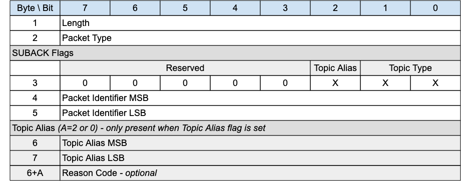{style="width: 624.00px; height: 245.33px; margin-left: 0.00px; margin-top: 0.00px; transform: rotate(0.00rad) translateZ(0px); -webkit-transform: rotate(0.00rad) translateZ(0px);"}]{style="overflow: hidden; display: inline-block; margin: 0.00px 0.00px; border: 0.00px solid #000000; transform: rotate(0.00rad) translateZ(0px); -webkit-transform: rotate(0.00rad) translateZ(0px); width: 624.00px; height: 245.33px;"}

[The SUBACK packet is sent by a ]{.c27}Server[ to a client as an
acknowledgment to the receipt and processing of a SUBSCRIBE
packet.]{.c2}

### [3.8.1 SUBACK Header]{.c38 .c17 .c32} {#h.44bvf6o .c20}

[The first 2 or 4 bytes of the packet are encoded according to the
variable length packet header format. Refer to ]{.c27}[[2.1 Structure of
an MQTT-SN Control Packet](#h.23ckvvd){.c4}]{.c6}[ for a detailed
description.]{.c2}

### 3.8.2 SUBACK Flags {#h.2jh5peh .c20}

[The SUBACK Flags is a 1 byte field which contains flags specifying the
contents of the SUBACK packet]{.c3}[. ]{.c3}[Bits 7-3 of the SUBACK
Flags are reserved and MUST be set to 0]{.c3
.c30}[ ]{.c12}[\[MQTT-SN-3.8.2-1\]]{.c35}[.]{.c12}

[The Client MUST validate that the reserved flags in the SUBACK packet
are set to 0. If any of the reserved flags is not 0 it is a Malformed
Packet]{.c1}[ ]{.c30}[\[MQTT-SN-3.8.2-2\]]{.c35}[.]{.c12}

#### [3.8.2.1 Topic Type]{.c17 .c89 .c75 .c44 .c32} {#h.sjf79nlu0oyc .c106 .c93 .c87 .c90}

[Position]{.c44}[: bits 0 and 1 of the SUBACK Flags.]{.c2}

[Determines the format of the topic value. Refer to ]{.c12}[[2.4 Topic
Types](#h.2zbgiuw){.c4}]{.c6}[ for the definition of the various topic
types. ]{.c3 .c17 .c32}

[The Topic Type in the SUBACK packet MUST be either Predefined Topic
Alias or Session Topic Alias ]{.c12
.c30}[\[MQTT-SN-3.8.2.1-1\]]{.c35}[.]{.c12}

[If there is no Topic Alias returned the Topic Type MUST be Predefined
Topic Alias ]{.c12 .c30}[\[MQTT-SN-3.8.2.1-2\]]{.c35}[.]{.c12}

#### [3.8.2.1 Topic Alias Flag]{.c17 .c89 .c75 .c44 .c32} {#h.k46i2m9cfsve .c106 .c93 .c87 .c90}

[Position]{.c44}[: bit 2 of the SUBACK Flags.]{.c2}

[If the Topic Alias Flag is set to 0, a Topic Alias MUST NOT be present
in the Packet]{.c18 .c12}[ ]{.c27 .c12}[\[MQTT-SN-3.8.2.1-1\]]{.c27
.c35}[. ]{.c3 .c17}

[If the Topic Alias Flag is set to 1, a Topic Alias MUST be present in
the Packet]{.c18 .c12}[ ]{.c27 .c12}[\[MQTT-SN-3.8.2.1-2\]]{.c27
.c35}[.]{.c27 .c12}

### [3.8.3 Packet Identifier]{.c38 .c17 .c32} {#h.3im3ia3 .c7 .c93 .c90}

[The same value as the Packet Identifier in the SUBSCRIBE Packet being
acknowledged.]{.c27}

### 3.8.4 Topic Alias {#h.ymfzma .c20}

[If a Topic Alias is returned, ]{.c18}[it MUST be used instead of the
Topic Name by the ]{.c18}[Server]{.c30}[ when sending PUBLISH packets to
the client]{.c18}[ ]{.c30}[\[MQTT-SN-3.8.4-1\]]{.c35}[.]{.c12}

[If no Topic Alias is returned, the Topic Alias Flag MUST be
0]{.c18}[ ]{.c30}[\[MQTT-SN-3.8.4-2\]]{.c35}[.]{.c12}[ This will be the
case when subscribing to a Topic Filter containing wildcards, as Topic
Aliases can only be applied to Topic Names. ]{.c27}

[If a Predefined Topic Alias was subscribed to, a Topic Alias MUST NOT
be present in the SUBACK ]{.c30}[\[MQTT-SN-3.8.4-3\]]{.c35}[.]{.c12}

### [3.8.5 Reason Code]{.c38 .c17 .c32} {#h.1xrdshw .c7 .c93 .c90}

[The Reason Code for the SUBACK packet is optional - its existence is
inferred from the Packet length. If not provided, 0x00 (Success) is
assumed. ]{.c2}

The values of Reason Codes are shown in [[2.3 Reason
Code](#h.46r0co2){.c4}]{.c6}. [The sender of the SUBACK Packet MUST use
one of the ]{.c30}[Reason Codes applicable to
SUBACK]{.c30}[ ]{.c30}[\[MQTT-SN-3.8.5-1\]]{.c35}[.]{.c12}

## 3.9 [UNSUBSCRIBE - Unsubscribe Request]{.c19 .c17} {#h.4hr1b5p .c208 .c93 .c200 .c87 .c90}

[Figure 3-19 -- UNSUBSCRIBE Packet]{.c36 .c100}

[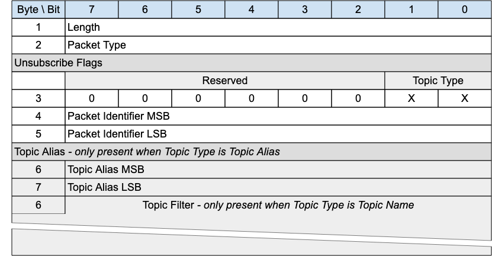{style="width: 624.00px; height: 324.00px; margin-left: 0.00px; margin-top: 0.00px; transform: rotate(0.00rad) translateZ(0px); -webkit-transform: rotate(0.00rad) translateZ(0px);"}]{style="overflow: hidden; display: inline-block; margin: 0.00px 0.00px; border: 0.00px solid #000000; transform: rotate(0.00rad) translateZ(0px); -webkit-transform: rotate(0.00rad) translateZ(0px); width: 624.00px; height: 324.00px;"}

[An UNSUBSCRIBE packet ]{.c27}[is sent by the Client to the
]{.c27}Server[ to remove subscriptions to topics.]{.c2}

### [3.9.1 UNSUBSCRIBE Header]{.c38 .c17 .c32} {#h.1c1lvlb .c20}

[The first 2 or 4 bytes of the packet are encoded according to the
variable length packet header format. Refer to ]{.c27}[[2.1 Structure of
an MQTT-SN Control Packet](#h.23ckvvd){.c4}]{.c6}[ for a detailed
description.]{.c2}

### 3.9.2 UNSUBSCRIBE Flags {#h.3w19e94 .c20}

[The UNSUBSCRIBE Flags is a 1 byte field which contains flags specifying
the contents of the UNSUBSCRIBE packet]{.c3}[. ]{.c3}[Bits 7-2 of the
UNSUBSCRIBE Flags are reserved and MUST be set to 0]{.c3
.c30}[ ]{.c12}[\[MQTT-SN-3.9.2-1\]]{.c35}[.]{.c12}

[The Client MUST validate that the reserved flags in the UNSUBSCRIBE
packet are set to 0. If any of the reserved flags is not 0 it is a
Malformed Packet]{.c1}[ ]{.c30}[\[MQTT-SN-3.9.2-2\]]{.c35}[.]{.c12}

#### [3.9.2.1 Topic Type]{.c17 .c89 .c75 .c44 .c32} {#h.35jl7go284h2 .c109 .c93 .c87 .c90}

[Position]{.c75 .c44}[: bits 0 and 1 of the UNSUBSCRIBE Flags.]{.c2}

[Determines the existence of the Topic Alias or Topic Filter. Refer to
]{.c27 .c12}[[2.4 Topic Types](#h.2zbgiuw){.c4}]{.c6}[ for the
definition of the various topic types.]{.c27 .c12}

### [3.9.3 Packet Identifier]{.c38 .c17 .c32} {#h.2b6jogx .c20}

[Used to identify the corresponding UNSUBACK packet. It should ideally
be populated with a random T]{.c27}wo Byte I[nteger value.]{.c2}

### [3.9.4 Topic Alias]{.c38 .c17 .c32} {#h.qbtyoq .c20}

[A Topic Alias MUST be present in the UNSUBSCRIBE packet if the Topic
Type is Predefined or Session Topic
Alias]{.c18}[ ]{.c30}[\[MQTT-SN-3.9.4-1\]]{.c35}[.]{.c12}

[A Topic Alias MUST NOT be present in the UNSUBSCRIBE packet if the
Topic Type is Topic
Name]{.c18}[ ]{.c30}[\[MQTT-SN-3.9.4-2\]]{.c35}[.]{.c12}

[Predefined or Session T]{.c27}[opic Alias as indicated by the
]{.c27}[Topic Type]{.c27 .c36}[. Determines the topic names which this
subscription is interested in.]{.c2}

### [3.9.5 Topic Filter]{.c38 .c17 .c32} {#h.ftxkv4ci99pj .c20}

[A Topic Filter MUST be present in the UNSUBSCRIBE packet if the Topic
Type is Topic Name]{.c18}[ ]{.c30}[\[MQTT-SN-3.9.5-1\]]{.c35}[.]{.c12}

[A Topic Filter MUST NOT be present in the UNSUBSCRIBE packet if the
Topic Type is Predefined or Session Topic
Alias]{.c18}[ ]{.c30}[\[MQTT-SN-3.9.5-2\]]{.c35}[.]{.c12}

The Topic Filter is an [UTF-8 Encoded String. ]{.c27}The existence or
absence of this field is inferred from the Packet length.

### [3.9.6 UNSUBSCRIBE Actions]{.c38 .c17 .c32} {#h.yu0e4zurjnhj .c182 .c87 .c60}

[If a Topic Alias is used in an UNSUBSCRIBE request, it MUST be
translated to its equivalent Topic Name before any other action takes
place]{.c18}[ ]{.c30}[\[MQTT-SN-3.9.6-1\]]{.c35}[.]{.c12}

[The ]{.c18}[Topic Filter]{.c18}[ (whether it contains wildcards or not)
supplied in an UNSUBSCRIBE packet MUST be compared
character-by-character with the current set of Topic Filters held by the
Server for the Client. If any filter matches exactly then its owning
Subscription MUST be deleted]{.c18}[ ]{.c27}[\[MQTT-SN-3.9.6-2\]]{.c27
.c35}[, otherwise no additional processing occurs. ]{.c2}

[When a Server receives UNSUBSCRIBE ]{.c18}[:]{.c2}

- [It MUST stop adding any new Application Messages which match the
  ]{.c18}[Topic Filters]{.c18}[, for delivery to the
  Client]{.c18}[ ]{.c27}[\[MQTT-SN-3.9.6-3\]]{.c27 .c35}[.]{.c2}
- [It MUST complete the delivery of any QoS 1 or QoS 2 Application
  Messages which match the ]{.c18}[Topic Filters]{.c18}[ and it has
  started to send to the
  Client]{.c18}[ ]{.c27}[\[MQTT-SN-3.9.6-4\]]{.c27 .c35}[.]{.c2}
- [It MAY continue to deliver any existing Application Messages
  ]{.c27}[which match the ]{.c27}[Topic Filters ]{.c27}[buffered for
  delivery to the Client.]{.c16 .c9}

[The Server MUST respond to an UNSUBSCRIBE request by sending an
UNSUBACK packet]{.c18}[ ]{.c27}[\[MQTT-3.9.6-5\]]{.c27 .c35}[.
]{.c27}[The UNSUBACK packet MUST have the same Packet Identifier as the
UNSUBSCRIBE packet. Even where no Topic Subscriptions are deleted, the
Server MUST respond with an
UNSUBACK]{.c18}[ ]{.c27}[\[MQTT-3.9.6-6\]]{.c27 .c35}[.]{.c2}

## 3.10 [UNSUBACK - Unsubscribe Acknowledgement]{.c19 .c17} {#h.3abhhcj .c93 .c200 .c87 .c90 .c291}

[Figure 3-20 -- UNSUBACK Packet]{.c36 .c100}

[{style="width: 624.00px; height: 123.31px; margin-left: 0.00px; margin-top: -0.32px; transform: rotate(0.00rad) translateZ(0px); -webkit-transform: rotate(0.00rad) translateZ(0px);"}]{style="overflow: hidden; display: inline-block; margin: 0.00px 0.00px; border: 0.00px solid #000000; transform: rotate(0.00rad) translateZ(0px); -webkit-transform: rotate(0.00rad) translateZ(0px); width: 624.00px; height: 122.67px;"}

[An UNSUBACK packet is sent by a ]{.c27}Server[ to acknowledge the
receipt and processing of an UNSUBSCRIBE packet.]{.c2}

### [3.10.1 UNSUBACK Header]{.c38 .c17 .c32} {#h.1pgrrkc .c20}

[The first 2 or 4 bytes of the packet are encoded according to the
variable length packet header format. Refer to ]{.c27}[[2.1 Structure of
an MQTT-SN Control Packet](#h.23ckvvd){.c4}]{.c6}[ for a detailed
description.]{.c2}

### [3.10.2 Packet Identifier]{.c38 .c17 .c32} {#h.49gfa85 .c20}

[The same value as the Packet Identifier in the UNSUBSCRIBE packet being
acknowledged.]{.c2}

### [3.10.3 Reason Code]{.c38 .c17 .c32} {#h.2olpkfy .c20}

[The Reason Code for the UNSUBACK packet is optional - its existence is
inferred from the Packet length. If not provided, 0x00 (Success) is
assumed. ]{.c2}

[The UNSUBACK Reason Codes are shown in ]{.c27}[[2.3 Reason
Code](#h.46r0co2){.c4}]{.c6}. [The Server sending the UNSUBACK
P]{.c18}[a]{.c30}[cket MUST use one of the UNSUBACK Reason
Codes]{.c18}[ ]{.c30}[\[MQTT-SN-3.10.3-1\]]{.c35}[.]{.c12}

## 3.11 [PINGREQ - Ping Request]{.c19 .c17} {#h.13qzunr .c83}

[Figure 3-21 -- PINGREQ Packet]{.c36 .c100}

[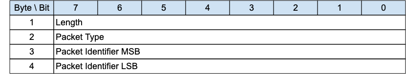{style="width: 624.00px; height: 114.67px; margin-left: 0.00px; margin-top: 0.00px; transform: rotate(0.00rad) translateZ(0px); -webkit-transform: rotate(0.00rad) translateZ(0px);"}]{style="overflow: hidden; display: inline-block; margin: 0.00px 0.00px; border: 0.00px solid #000000; transform: rotate(0.00rad) translateZ(0px); -webkit-transform: rotate(0.00rad) translateZ(0px); width: 624.00px; height: 114.67px;"}

The PINGREQ packet is sent from a Client to the Server. It can be used
to:

- [Indicate to the Server that the Client is alive in the absence of any
  other MQTT-SN Control Packets being sent from the Client to the
  Server. ]{.c27}For more information refer to [[3.1.6 Keep
  Alive](#h.4h042r0){.c4}]{.c6}.
- [Request that the Server responds to confirm that it is alive and that
  ]{.c27}it has a[ V]{.c27}irtual Connection for the Client[.]{.c27}
- [Exercise the network to determi]{.c27}ne whether[ communications
  ]{.c27}[are working.]{.c2}
- Inform the Server that the Client has awoken from being Asleep and is
  now waiting for any queued up Application Messages at the Server to be
  sent to it. For more information refer to [[4.14.2 Sleeping
  Clients](#h.pj8yyjomhafn){.c4}]{.c6}.

### [3.11.1 PINGREQ Header]{.c38 .c17 .c32} {#h.3nqndbk .c20}

[The first 2 or 4 bytes of the packet are encoded according to the
variable length packet header format. Refer to ]{.c27}[[2.1 Structure of
an MQTT-SN Control Packet](#h.23ckvvd){.c4}]{.c6}[ for a detailed
description.]{.c2}

### [3.11.2 Packet Identifier]{.c38 .c17 .c32} {#h.sqbpplpqb01e .c20}

[Used to identify the corresponding PINGRESP packet. It should ideally
be set to a random Two Byte Integer value.]{.c27}

### [3.11.3 PINGREQ Actions]{.c38 .c17 .c32} {#h.1bpzu4dgtzqz .c137 .c87 .c60}

[The Server MUST send a PINGRESP packet in response to a PINGREQ packet
if it has a Virtual Connection for the sending ]{.c18 .c12}[Client]{.c12
.c30}[ ]{.c18 .c12}[\[MQTT-SN-3.]{.c27 .c35}[1]{.c35}[1.3-1\]]{.c27
.c35}[.]{.c27 .c12}

[The Server MAY send a DISCONNECT packet in response to a PINGREQ packet
if it does not have a Virtual Connection for the sending Client ]{.c12
.c30}[\[MQTT-SN-3.11.3-2\]]{.c35}[.]{.c3 .c17 .c32}

[If the Server sends a DISCONNECT packet in response to a PINGREQ packet
because it does not have a Virtual Connection for the sending Client, it
MUST use Reason Code 244 - No Virtual Connection Exists ]{.c12
.c30}[\[MQTT-SN-3.11.3-3\]]{.c35}[.]{.c3 .c17 .c32}

[If the state of the Client associated with the Virtual Connection is
Asleep on receipt of the PINGREQ, the Server MUST move the Client to the
Awake state, stop the Sleep Duration processing, and start the Retry
Timer processing ]{.c12 .c30}[\[MQTT-SN-3.11.3-4\]]{.c35}[.]{.c12}

## 3.12 [PINGRESP - Ping Response]{.c19 .c17} {#h.i17xr6 .c83}

[Figure 3-22 -- PINGRESP Packet]{.c36 .c100}

[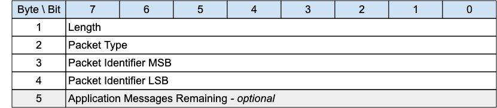{style="width: 624.00px; height: 136.00px; margin-left: 0.00px; margin-top: 0.00px; transform: rotate(0.00rad) translateZ(0px); -webkit-transform: rotate(0.00rad) translateZ(0px);"}]{style="overflow: hidden; display: inline-block; margin: 0.00px 0.00px; border: 0.00px solid #000000; transform: rotate(0.00rad) translateZ(0px); -webkit-transform: rotate(0.00rad) translateZ(0px); width: 624.00px; height: 136.00px;"}

[A PINGRESP Packet is sent by the Server to the Client in response to a
PINGREQ packet. It indicates that the Server is alive.]{.c2}

This Packet is used in Keep Alive processing. Refer to [[3.1.6 Keep
Alive](#h.4h042r0){.c4}]{.c6} for more details.

[A PINGRESP packet is also sent by ]{.c27}the[ ]{.c27}Server[ to inform
a Client in the Awake state that it has no more buffered packets for
that Client. See ]{.c27}[[4.14.2 Sleeping
Clients](#h.pj8yyjomhafn){.c4}]{.c6 .c27} for more information about
sleeping Clients.

### [3.12.1 PINGRESP Header]{.c38 .c17 .c32} {#h.320vgez .c20}

[The first 2 or 4 bytes of the packet are encoded according to the
variable length packet header format. Refer to ]{.c27}[[2.1 Structure of
an MQTT-SN Control Packet](#h.23ckvvd){.c4}]{.c6}[ for a detailed
description.]{.c2}

### [3.12.2 Packet Identifier]{.c38 .c17 .c32} {#h.fodwg3l5deju .c20}

[The same value as the Packet Identifier in the PINGREQ Packet being
acknowledged.]{.c2}

### [3.12.3 Application Messages Remaining]{.c38 .c17 .c32} {#h.1h65qms .c20}

[The number of Application Messages still queued for delivery at the
Server ]{.c27}[when the PINGRESP is sent to send the Client back to
sleep]{.c27}[. ]{.c2}

[It is optional, intended as useful information for the Client - its
exi]{.c27}stence is inferred from the Packet length[. Thi]{.c27}s field
can be present in the Active state as well as the Awake state.

[Values can be:]{.c2}

[Figure 3-23 -- PINGRESP continuation values]{.c36 .c100}

  ------------------------------------ -------------------------------------------------------------------------------------------------------------------------------------------------
  [Allowed Values]{.c0}                [Description]{.c0}
  [0]{.c16 .c9 .c127}                  [No ]{.c27}[Application ]{.c27 .c39}[M]{.c27}[essages are waiting to be delivered]{.c2}
  [1 -- 254 (incl.)]{.c16 .c9 .c127}   [The number of ]{.c27}[Application ]{.c27 .c39}[M]{.c27}[essages waiting to be delivered]{.c16 .c9}
  [255 (0xFF)]{.c16 .c9 .c127}         [An uns]{.c27}[pecified positive number of ]{.c27}[Application ]{.c27 .c39}[M]{.c27}[essages waiting to be delivered greater than 0.]{.c16 .c9}
  ------------------------------------ -------------------------------------------------------------------------------------------------------------------------------------------------

## []{.c19 .c17} {#h.j7497p9p92dy .c83 .c234}

------------------------------------------------------------------------

## []{.c19 .c17} {#h.5v6sjggftsg0 .c83 .c234}

## 3.13 [DISCONNECT - Disconnect Notification]{.c27} {#h.415t9al .c83}

[Figure 3-24 -- DISCONNECT Packet]{.c36 .c100}

[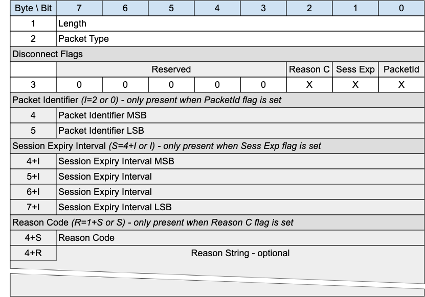{style="width: 624.44px; height: 437.33px; margin-left: -0.22px; margin-top: 0.00px; transform: rotate(0.00rad) translateZ(0px); -webkit-transform: rotate(0.00rad) translateZ(0px);"}]{style="overflow: hidden; display: inline-block; margin: 0.00px 0.00px; border: 0.00px solid #000000; transform: rotate(0.00rad) translateZ(0px); -webkit-transform: rotate(0.00rad) translateZ(0px); width: 624.00px; height: 437.33px;"}

[The DISCONNECT packet is sent by a Client to indicate that it is going
to delete]{.c9}[ ]{.c9}[the Virtual connection and go to the
Disconnected state.]{.c2}

[DISCONNECT may be sent b]{.c9}y a Server to indicate that it ca[nnot
continue with the Virtual Connection and is deleting it - for instance
the Server might be shutting down. It should use an appropriate and
allowed Reason Code - 0x8B for Server shutting down, for instance.]{.c2}

[A Client may receive an unsolicited DISCONNECT from a
]{.c9}Server[ whether or not it has a Virtual Connection to that
]{.c9}Server[. This may happen for example when the ]{.c9}Server[, due
to an error, cannot identify the Client to which a received packet
belongs. ]{.c2}

[If a Client or Server receives a packet which requires a Virtual
Connection (all packets except CONNECT, ADVERTISE, GWINFO, SEARCHGW and
PUBWOS), and no Virtual Connection exists, it MAY send a
D]{.c9}[ISCONNECT in response to the originator with Reason Code 0xF4 -
No Virtual Connection exists. ]{.c9}

### [3.13.1 DISCONNECT Header]{.c38 .c17 .c32} {#h.2gb3jie .c20}

[The first 2 or 4 bytes of the packet are encoded according to the
variable length packet header format. Refer to ]{.c27}[[2.1 Structure of
an MQTT-SN Control Packet](#h.23ckvvd){.c4}]{.c6}[ for a detailed
description.]{.c2}

### [3.13.2 DISCONNECT Flags]{.c38 .c17 .c32} {#h.vgdtq7 .c20}

[The DISCONNECT Flags is a 1 byte field which contains flags specifying
the contents of the DISCONNECT packet]{.c27 .c12}[. ]{.c27 .c12
.c121}[Bits 7-3 of the DISCONNECT Flags are reserved and MUST be set to
0]{.c18 .c12 .c121}[ ]{.c12}[\[MQTT-SN-3.13.2-1\]]{.c35}[.]{.c12}

[The receiver MUST validate that the reserved flags in the DISCONNECT
packet are set to 0. If any of the reserved flags is not 0 it is a
Malformed Packet]{.c18}[ ]{.c30}[\[MQTT-SN-3.13.2-2\]]{.c35}[.]{.c12}

#### [3.13.2.1 Packet Identifier Flag ]{.c17 .c89 .c75 .c44 .c32} {#h.xf6mk8ar6hod .c7 .c93 .c90}

[Position:]{.c44} bit 0 of the DISCONNECT Flags. Labelled
[PacketId]{.c36}[ in Figure 3-27.]{.c2}

[​​]{.c27 .c12}[If the Packet Identifier Flag is set to 0, a Packet
Identifier MUST NOT be present in the Packet]{.c18 .c12}[ ]{.c27
.c12}[\[MQTT-SN-3.13.2.]{.c27 .c35}[1]{.c35}[-1\]]{.c27 .c35}[. ]{.c3
.c17}

[If the Packet Identifier Flag is set to 1, a Packet Identifier MUST be
present in the Packet]{.c18 .c12}[ ]{.c27
.c12}[\[MQTT-SN-3.13.2.1-2\]]{.c27 .c35}[.]{.c3 .c17}

#### 3.13.2.2 Session Exp[iry Interval Flag]{.c17 .c89 .c75 .c44 .c32} {#h.vf25roqqpxsl .c7 .c93 .c90}

[Position:]{.c44} bit 1 of the DISCONNECT Flags. Labelled [Sess
Exp]{.c36}[ in Figure 3-27.]{.c2}

[​​]{.c27 .c12}[If the Session Expiry Interval Flag is set to 0, a Session
Expiry Interval MUST NOT be present in the Packet]{.c18 .c12}[ ]{.c27
.c12}[\[MQTT-SN-3.13.2.2-1\]]{.c27 .c35}[. ]{.c3 .c17}

[If the Session Expiry Interval Flag is set to 1, a Session Expiry
Interval MUST be present in the Packet]{.c18 .c12}[ ]{.c27
.c12}[\[MQTT-SN-3.13.2.2-2\]]{.c27 .c35}[.]{.c3 .c17}

#### [3.13.2.3 Reason Code Flag]{.c17 .c89 .c75 .c44 .c32} {#h.qy3p3qqdmadq .c7 .c93 .c90}

[Position:]{.c44} bit 2 of the DISCONNECT Flags. Labelled [Reason
C]{.c36} in Figure 3-27.

[​​]{.c27 .c12}[If the Reason Code Flag is set to 0, a Reason Code MUST
NOT be present in the Packet]{.c18 .c12}[ ]{.c27
.c12}[\[MQTT-SN-3.13.2.]{.c27 .c35}[3]{.c35}[-1\]]{.c27 .c35}[. ]{.c3
.c17}

[If the Reason Code Flag is set to 1, a Reason Code MUST be present in
the Packet]{.c18 .c12}[ ]{.c27 .c12}[\[MQTT-SN-3.1]{.c27
.c35}[3]{.c35}[.2.3-2\]]{.c27 .c35}[.]{.c27 .c12}

### [3.13.3 Packet Identifier]{.c38 .c17 .c32} {#h.rjljjibf9dws .c20}

This field is o[ptional. It can be used by a ]{.c27}Server[ when
responding to a Client packet for which there is no current Virtual
Connection. In this case, the DISCONNECT packet can be sent by the
]{.c27}Server[, setting the Reason Code to 0xF4 (No Virtual Connection
Exists) and including the Packet Identifier of the erroneous packet, to
help with problem diagnosis.]{.c27}

### [3.13.4 Reason Code]{.c38 .c17 .c32} {#h.3fg1ce0 .c20}

[The Reason Code for the DISCONNECT packet is optional. If not provided,
0x00 (Normal disconnection) is assumed. ]{.c2}

The values for Reason Codes are shown in [[2.3 Reason
Code](#h.46r0co2){.c4}]{.c6}. [The sender of the DISCONNECT packet MUST
use one of the Reason Code values applicable to DISCONNECT
]{.c18}[\[MQTT-SN-3.13.4-1\].]{.c9 .c17 .c35 .c32}

### 3.13.5 Session Expiry Interval {#h.1ulbmlt .c20}

[The Session Expiry Interval is a four-byte integer time interval
measured in seconds. ]{.c27}[If the Session Expiry Interval is absent,
the Session Expiry Interval in the CONNECT packet is used.]{.c2}

[The Session Expiry Interval MUST NOT be sent on a DISCONNECT by the
Server ]{.c18 .c12}[\[MQTT--SN-3.13.5-1\].]{.c9 .c17 .c35 .c32}

[If the Session Expiry Interval in the CONNECT packet was zero, then it
is a Protocol Error to set a non-zero Session Expiry Interval in the
DISCONNECT packet sent by the Client. If such a non-zero Session Expiry
Interval is received by the Server, it does not treat it as a valid
DISCONNECT packet. The Server uses DISCONNECT with Reason Code 0x82
(Protocol Error) as described in ]{.c27 .c12}[[4.12 Handling
errors](#h.v8vlgf6xm72a){.c4}]{.c6}[.]{.c3 .c17 .c32}

### 3.13.6 Reason String {#h.4ekz59m .c20}

[Fixed Length UTF-8 Encoded String representing a clear text description
of t]{.c27}he reason for the [disconnection. ]{.c2}

[Th]{.c27}is field is optional - its existence or absence is inferred
from the Packet length.

### [3.13.7 DISCONNECT Actions]{.c17 .c32 .c38} {#h.wsl51zt8cr34 .c137 .c87 .c60}

[After sending a DISCONNECT packet the sender]{.c18}[:]{.c2}

- [MUST NOT send any more MQTT-SN Control Packets on that Virtual
  Connection]{.c18}[ ]{.c27}[\[MQTT-SN-3.13.7-1\]]{.c27 .c35}[.]{.c2}
- [MUST delete the Virtual
  Connection]{.c18}[ ]{.c27}[\[MQTT-SN-3.13.7-2\]]{.c27 .c35}[.]{.c2}

[On receipt of DISCONNECT with a Reason Code of 0x00 (Success) the
Server]{.c18}[:]{.c2}

- [MUST discard any Will Message associated with the current Connection
  without publishing it]{.c18}[ ]{.c27}[\[MQTT-SN-3.13.]{.c27
  .c35}[7]{.c35}[-3\]]{.c27 .c35}[, as described in ]{.c27}[[3.1.3 Will
  Flags](#h.u38i2mpp332q){.c4}]{.c6}[.]{.c2}

[On receipt of DISCONNECT, the receiver:]{.c1 .c16}

- [MUST NOT send any more MQTT-SN Control Packets on the Virtual
  Connection, if one exists]{.c18}[ ]{.c30}[\[MQTT-SN-3.13.7-4\].]{.c35}
- [SHOULD delete any existing Virtual Connection.]{.c2}

[After receiving a DISCONNECT, a Client can make a new Virtual
Connection by sending a CONNECT Packet to the Server.]{.c2}

## 3.14 [WAKEUP - Wake up request]{.c19 .c17} {#h.elrc49qsiunp .c83}

[Figure 3-25 -- WAKEUP Packet]{.c36 .c100}

[{style="width: 624.00px; height: 69.33px; margin-left: 0.00px; margin-top: 0.00px; transform: rotate(0.00rad) translateZ(0px); -webkit-transform: rotate(0.00rad) translateZ(0px);"}]{style="overflow: hidden; display: inline-block; margin: 0.00px 0.00px; border: 0.00px solid #000000; transform: rotate(0.00rad) translateZ(0px); -webkit-transform: rotate(0.00rad) translateZ(0px); width: 624.00px; height: 69.33px;"}

[The wakeup packet is a signal sent from the ]{.c27}Server[ to a client.
It is an indication from the ]{.c27}Server[ that the client should wake
up. The client is not obliged to honor this request, nor may it even
receive the packet. It can choose to ignore the request, or undertake
one of the sequences outlined in ]{.c27}[[4.14.2 Sleeping
Clients](#h.pj8yyjomhafn){.c4}]{.c6}[. The client need not respond to
this packet.]{.c27}

### [3.14.1 WAKEUP Header]{.c38 .c17 .c32} {#h.lrkcmnrrlwx6 .c20}

[The first 2 or 4 bytes of the packet are encoded according to the
variable length packet header format. Refer to ]{.c27}[[2.1 Structure of
an MQTT-SN Control Packet](#h.23ckvvd){.c4}]{.c6}[ for a detailed
description.]{.c27}

### 3.14.2 [WAKEUP]{.c27 .c229} Actions {#h.2sa95hk6sfa3 .c137 .c87 .c60}

[The Client MAY choose to follow the AWAKE procedure in response to
receiving a WAKEUP packet ]{.c18 .c12}[\[MQTT-SN-3.14.2-1\]]{.c27
.c35}[. ]{.c3 .c17 .c32}

## 3.15 SLEEPREQ[ - Sleep request]{.c19 .c17} {#h.y0yzf1b41yjh .c83}

[Figure 3-26 -- SLEEPREQ Packet]{.c36 .c100}

[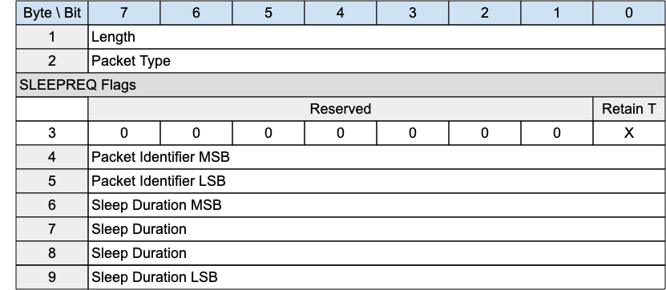{style="width: 624.00px; height: 272.00px; margin-left: 0.00px; margin-top: 0.00px; transform: rotate(0.00rad) translateZ(0px); -webkit-transform: rotate(0.00rad) translateZ(0px);"}]{style="overflow: hidden; display: inline-block; margin: 0.00px 0.00px; border: 0.00px solid #000000; transform: rotate(0.00rad) translateZ(0px); -webkit-transform: rotate(0.00rad) translateZ(0px); width: 624.00px; height: 272.00px;"}

[The SLEEPREQ packet is sent from the Client to the Server to indicate
that it is going to sleep (moving to the Asleep state).]{.c2}

### [3.15.1 SLEEPREQ Header]{.c38 .c17 .c32} {#h.ae58qknvrf2w .c20}

[The first 2 or 4 bytes of the packet are encoded according to the
variable length packet header format. Refer to ]{.c27}[[2.1 Structure of
an MQTT-SN Control Packet](#h.23ckvvd){.c4}]{.c6}[ for a detailed
description.]{.c2}

### [3.15.2 SLEEPREQ Flags]{.c38 .c17 .c32} {#h.akftl72rmwpd .c20}

[The SLEEPREQ Flags is a 1 byte field which contains flags specifying
the contents of the SLEEPREQ packet]{.c27 .c12}[. ]{.c27 .c12
.c121}[Bits 7-1 of the SLEEPREQ Flags are reserved and MUST be set to
0]{.c18 .c12}[ ]{.c12}[\[MQTT-SN-3.15.2-1\].]{.c35}

[The receiver MUST validate that the reserved flags in the SLEEPREQ
packet are set to 0. If any of the reserved flags is not 0 it is a
Malformed Packet]{.c18}[ ]{.c30}[\[MQTT-SN-3.15.2-2\].]{.c35}

#### [3.15.2.1 Retain Topic Aliases]{.c17 .c89 .c75 .c44 .c32} {#h.des7747zmmjp .c7 .c93 .c90}

[Position:]{.c44} bit 0 of the SLEEPREQ Flags. Labelled [Retain
T]{.c36} in Figure 3-28.

[Specifies whether Session Topic Aliases should be retained by the
]{.c27 .c12}[Server]{.c12}[ during the Asleep state. "0" indicates Topic
Aliases should be removed during the sleeping period and renegotiated
]{.c27 .c12}[when Awake]{.c27 .c12}[ or Active. "1" indicates Topic
Aliases should be retained during the Asleep period, and therefore not
negotiated when Awake or Active.]{.c3 .c17}

[Predefined Topic aliases MUST NOT be removed by the setting of the
Retain Topic Aliases flag to 1 ]{.c12
.c30}[\[MQTT-SN-3.15.2.1-1\].]{.c35}

### 3.15.3 [Packet Identifier]{.c38 .c17 .c32} {#h.r9l470czcfcd .c20}

[Used to identify the corresponding SLEEPRESP packet. It should ideally
be set to a random Two Byte Integer value.]{.c27}

### 3.15.4 [Sleep Duration]{.c38 .c17 .c32} {#h.lmowugbak9ff .c20}

[The Sleep Duration is a four-byte integer time interval measured in
seconds. It is the maximum amount of time that a client may stay asleep
without being disconnected by the ]{.c27}Server[. For more information
on sleeping clients, and the purpose of Sleep Duration, see
]{.c27}[[4.14.2 Sleeping Clients](#h.pj8yyjomhafn){.c4}]{.c6
.c27}[.]{.c2}

[The Sleep Duration MUST be greater than 0
]{.c30}[\[MQTT-SN-3.15.4-1\].]{.c35}

[Informative Comment]{.c17 .c12 .c75 .c44 .c49}

[The Sleep Duration should likely be substantially less than the Session
Expiry for the session. If anything goes wrong in the Asleep to Awake
transition, the Virtual Connection might be deleted by the Server, and
the Session data might also be deleted if the Session Expiry interval
passes before the Client reconnects. ]{.c3 .c17}

[Informative Comment]{.c17 .c12 .c75 .c44 .c49}

[The Server can decide when to disconnect a sleeping Client it has not
heard from. If packet loss is minimal, allowing 1.5 times the Sleep
Duration before disconnecting the Client, similar to the Keep Alive
processing, in many cases might be too short. Waiting 2.5 times the
Sleep Duration before disconnecting the Client will allow one missed
waking period. ]{.c12}

### 3.15.5 [SLEEPREQ Actions]{.c38 .c17 .c32} {#h.1za85wfbb30f .c20}

[A SLEEPREQ packet sent by a Server is a Protocol Error ]{.c12
.c30}[\[MQTT-SN-3.15.5-1\]]{.c35}[.]{.c12}

[If there is a Virtual Connection for the Client, t]{.c12 .c30}[he]{.c18
.c12}[ Server]{.c18 .c12}[ MUST send a SLEEPRESP packet in response to a
SLEEPREQ packet ]{.c18 .c12}[\[MQTT-SN-3.]{.c27
.c35}[15]{.c35}[.5-]{.c27 .c35}[2]{.c35}[\]]{.c27 .c35}[.]{.c3 .c17
.c32}

[If there is no Virtual Connection associated with the SLEEPREQ,
the]{.c12 .c30}[ Server]{.c12 .c30}[ MAY send a DISCONNECT with Reason
Code xxx in response ]{.c12 .c30}[\[MQTT-SN-3.15.5-3\]]{.c35}[.]{.c3
.c17 .c32}

[If the SLEEPREQ request is granted, the]{.c12 .c30}[ Server]{.c12
.c30}[ MUST suspend Keep Alive processing for the Virtual Connection
]{.c12 .c30}[\[MQTT-SN-3.15.5-4\]]{.c35}[.]{.c3 .c17 .c32}

[If the  SLEEPREQ request is granted, the]{.c12 .c30}[ Server]{.c12
.c30}[ MUST start Sleep Duration processing for the Virtual Connection
]{.c12 .c30}[\[MQTT-SN-3.15.5-5\]]{.c35}[.]{.c3 .c17 .c32}

[If the SLEEPREQ request is successful, the Virtual Connection MUST NOT
be deleted ]{.c12 .c30}[\[MQTT-SN-3.15.5-6\]]{.c35}[.]{.c3 .c17 .c32}

[If the Client is already in the Asleep state when a SLEEPREQ is
received by the Server, the Server MUST stop the Sleep Duration Timer,
and start a new sleep cycle using the updated Sleep Duration ]{.c12
.c30}[\[MQTT-SN-3.15.5-7\]]{.c35}[.]{.c3 .c17 .c32}

[After sending a SLEEPREQ packet the Client]{.c27} [MAY]{.c27}[ wait for
a SLEEPRESP packet in response from the Server]{.c27}[.]{.c27}

[A Client will wait for a response if it wishes to ascertain that the
Server has received and processed its sleep request. By doing so it will
avoid the possibility ]{.c27}of having[ to]{.c27} [reestablish a Virtual
Connection on wakening if the Server did not receive the
SLEEPREQ]{.c27} and the Virtual Connection has been deleted by the
Server because of a Keep Alive timeout.

[A Client ]{.c27}might[ not wait, or might stop waiting, if it is
concerned that it will use excess power to determine that the Server has
received the SLEEPREQ.]{.c27}

## 3.16 SLEEPRESP[ - Sleep response]{.c19 .c17} {#h.jym8s7ogwu9n .c83}

[Figure 3-27 -- SLEEPRESP Packet]{.c36 .c100}

[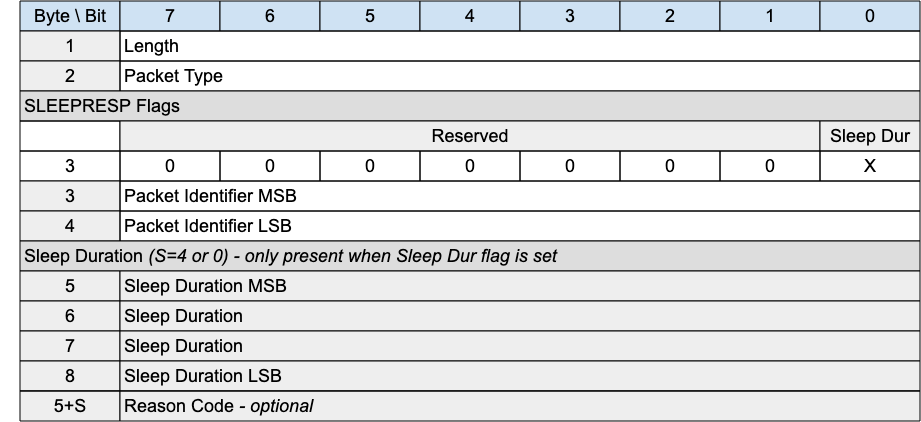{style="width: 624.00px; height: 285.33px; margin-left: 0.00px; margin-top: 0.00px; transform: rotate(0.00rad) translateZ(0px); -webkit-transform: rotate(0.00rad) translateZ(0px);"}]{style="overflow: hidden; display: inline-block; margin: 0.00px 0.00px; border: 0.00px solid #000000; transform: rotate(0.00rad) translateZ(0px); -webkit-transform: rotate(0.00rad) translateZ(0px); width: 624.00px; height: 285.33px;"}

### [3.16.1 SLEEPRESP Header]{.c38 .c17 .c32} {#h.lhdh9flvorts .c20}

[The first 2 or 4 bytes of the packet are encoded according to the
variable length packet header format. Refer to ]{.c27}[[2.1 Structure of
an MQTT-SN Control Packet](#h.23ckvvd){.c4}]{.c6}[ for a detailed
description.]{.c2}

### [3.16.2 SLEEPRESP Flags]{.c38 .c17 .c32} {#h.6myl7m4a5sfe .c20}

[The SLEEPRESP Flags is a 1 byte field which contains flags specifying
the contents of the SLEEPRESP packet]{.c12}[. ]{.c12 .c121}[Bits 7-1 of
the SLEEPRESP Flags are reserved and MUST be set to 0]{.c12
.c30}[ ]{.c12}[\[MQTT-SN-3.16.2-1\]]{.c35}[.]{.c3 .c17 .c32}

[The receiver MUST validate that the reserved flags in the SLEEPRESP
packet are set to 0. If any of the reserved flags is not 0 it is a
Malformed Packet ]{.c30}[\[MQTT-SN-3.16.2-2\]]{.c35}[.]{.c12}

#### [3.16.2.1 Sleep Duration Flag]{.c17 .c89 .c75 .c44 .c32} {#h.uzbh77rya6ge .c7 .c93 .c90}

[Position:]{.c44} bit 0 of the SLEEPRESP Flags. Labelled [Sleep
Dur]{.c36}[ in Figure 3-28.]{.c2}

[​​]{.c12}[If the Sleep Duration Flag is set to 0, Sleep Duration MUST NOT
be present in the Packet]{.c12
.c30}[ ]{.c12}[\[MQTT-SN-3.16.2.1-1\]]{.c35}[. ]{.c3 .c17}

[​​]{.c12}[If the Sleep Duration Flag is set to 1, Sleep Duration MUST be
present in the Packet]{.c12
.c30}[ ]{.c12}[\[MQTT-SN-3.16.2.1-2\]]{.c35}[. ]{.c3 .c17}

[If the Allow Modified Sleep Duration Flag in the CONNECT Packet that
created the current Virtual Connection was 0, the Server MUST set the
Sleep Duration Flag in the SLEEPRESP Packet to 0]{.c12
.c30}[ ]{.c12}[\[MQTT-SN-3.16.2.1-3\]]{.c35}[. ]{.c3 .c17}

### 3.16.2 [Packet Identifier]{.c38 .c17 .c32} {#h.ts4rruwfri54 .c20}

[The same value as the Packet Identifier in the SLEEPREQ Packet being
acknowledged.]{.c27}

### 3.16.3 [Sleep Duration]{.c38 .c17 .c32} {#h.fdgdw4er64ab .c20}

The Server uses this field to inform the Client that it is using a value
other than that sent by the Client in the SLEEPRESP[. ]{.c3 .c17 .c32}

[If the Server sends a Sleep Duration on the SLEEPRESP packet, the
Client MUST use this value instead of the Sleep Duration value the
Client sent in the SLEEPREQ packet]{.c12
.c30}[ ]{.c12}[\[MQTT-SN-3.16.3-1\]]{.c35}[. ]{.c3 .c17 .c32}

[If the Server does not send the Sleep Duration, the Server MUST use the
Sleep Duration value set by the Client in the SLEEPREQ packet]{.c12
.c30}[ ]{.c12}[\[MQTT-SN-3.16.3-2\]]{.c35}[.]{.c3 .c17 .c32}

[Refer to ]{.c12}[[4.14.2 Sleeping
Clients](#h.pj8yyjomhafn){.c4}]{.c6}[ for more information on Sleeping
Clients.]{.c12}

### [3.16.4 Reason Code]{.c38 .c17 .c32} {#h.jamrhuf3ktlv .c20}

[The Reason Code for the SLEEPRESP packet is optional - its existence is
inferred from the Packet length. If not provided, 0x00 (Success) is
assumed. ]{.c2}

The values for Reason Codes are shown in [[2.3 Reason
Code](#h.46r0co2){.c4}]{.c6}. [The sender of the SLEEPRESP packet MUST
use one of the Reason Code values applicable to SLEEPRESP
]{.c30}[\[MQTT-SN-3.16.4-1\].]{.c35}

------------------------------------------------------------------------

## [3.17 Protection Encapsulation]{.c19 .c17} {#h.15cqrsoyxc87 .c20}

[Figure 3-28 -- Format of an Protection Encapsulated MQTT-SN
Packet]{.c36 .c100}

[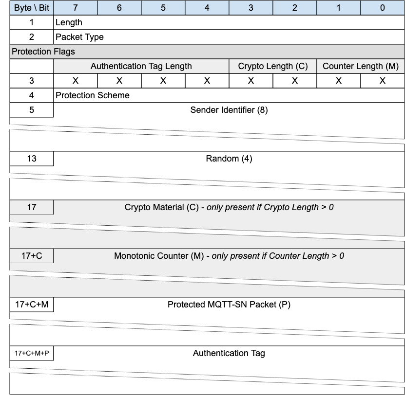{style="width: 624.00px; height: 609.33px; margin-left: 0.00px; margin-top: 0.00px; transform: rotate(0.00rad) translateZ(0px); -webkit-transform: rotate(0.00rad) translateZ(0px);"}]{style="overflow: hidden; display: inline-block; margin: 0.00px 0.00px; border: 0.00px solid #000000; transform: rotate(0.00rad) translateZ(0px); -webkit-transform: rotate(0.00rad) translateZ(0px); width: 624.00px; height: 609.33px;"}

[Protection encapsulation provides a secure envelope for any MQTT-SN
packet (with the exception of the Forward Encapsulation packet). The
fields provided by the Protection Encapsulation provide a means by which
the sender is identified and the]{.c9}[ packet is protected]{.c9}[,
using a number of prescribed protection schemes. ]{.c2}

[The ]{.c1}[s]{.c30}[ender identified by Sender Identifier is the
originator of the protected MQTT-SN Packet and responsible for its
protection. This responsibility MUST NOT be delegated to a third party
like a Forwarder]{.c1}[ ]{.c30}[\[MQTT-SN-3.17-1\]]{.c35}[.]{.c12}

[The ]{.c9}s[ender ]{.c9}i[dentification is required as the
]{.c9}s[ender and the ]{.c9}r[eceiver of the protected packet must have
access to the same shared key to be used directly or after
derivation.]{.c9}[ The Sender Identifier may not be related to the
Network Address of the ]{.c9}s[ender. The authentication of the
]{.c9}s[ender and the ]{.c9}r[eceiver, their authorizations and the
provisioning of the shared keys used to protect integrity and optionally
confidentiality of the protected packet content are out of scope.]{.c2}

[A protected packet, like any other one, can be the payload of a
Forwarder Encapsulated packet.]{.c2}

[When the P]{.c1}[rotection Encapsulation]{.c30}[ is used by a
]{.c1}[Server]{.c30}[, it MUST be used to protect all MQTT-SN packets
exchanged with a Client for which a shared key (indexed by its Sender
Identifier) is
available]{.c1}[ ]{.c30}[\[MQTT-SN-3.17-2\]]{.c35}[.]{.c12}^[\[k\]](#cmnt11){#cmnt_ref11}^

[Informative Comment]{.c16 .c75 .c44 .c49}

[If the Client is not enrolled to the ]{.c9}Server[ (so the
]{.c9}Server[ has no access to a key shared with it on the basis of its
Sender Identifier) and the Client and ]{.c9}Server[ are not in a private
network, it is recommended that the ]{.c9}Server[ process]{.c9}es[ only
MQTT-SN packets received over a DTLS session initiated with mutual
authentication by the Client.]{.c16 .c9}

[When the P]{.c1}[rotection Encapsulation]{.c30}[ is used by a Client,
it MUST be used to protect all MQTT-SN packets exchanged with a
]{.c1}[Server]{.c30}[ for which a shared key (indexed by its
]{.c1}[Server]{.c42 .c30}[ Identifier]{.c1 .c42}[) is
available]{.c1}[ ]{.c30}[\[MQTT-SN-3.17-3\]]{.c35}[.]{.c12}

[Informative Comment]{.c16 .c75 .c44 .c49}

[If the ]{.c9}Server[ is not enrolled to the Client (so the Client has
no access to a key shared with it on the basis of its
]{.c9}Server[ Identifier) and the Client and ]{.c9}Server[ are not in a
private network, it is recommended for the Client to open a DTLS session
and process only MQTT-SN packets received over it.]{.c9}

### [3.17.1 Protection Encapsulation Header]{.c38 .c17 .c32} {#h.j9tutdzg8gdj .c20}

[The first 2 or 4 bytes of the packet are encoded according to the
variable length packet header format. Refer to ]{.c9}[[2.1 Structure of
an MQTT-SN Control Packet](#h.23ckvvd){.c4}]{.c6}[ for a detailed
description.]{.c2}

### [3.17.2 Protection Flags]{.c38 .c17 .c32} {#h.g1mmf1c4lvqh .c20}

[The Protection Flags is a ]{.c9}one[ byte field specifying the
properties of the Protection Encapsulation. ]{.c2}

#### [3.17.2.1 Monotonic Counter Length]{.c17 .c89 .c75 .c44 .c32} {#h.dgr37fcn70h7 .c7 .c93 .c90}

[Position:]{.c75 .c44 .c49}[ bits 0 and 1 of the Protection Flags.
Labelled ]{.c9}[Counter Length]{.c9 .c36}[ in Figure 3-]{.c9}28[.]{.c2}

[Specifies ]{.c9 .c42}[the number of bytes forming the monotonic counter
in big-endian order. Only three of the four possible values are
allowed]{.c9 .c42}[.]{.c9 .c17 .c42 .c32}

- [The Monotonic Counter Length MUST NOT be set to 0x3 - the value is
  reserved ]{.c30}[\[MQTT-SN-3.17.2.1-1\]]{.c35}[.]{.c12}
- [If the Monotonic Counter Length is set to ]{.c30}[0x2, a Monotonic
  Counter of 32 bits (4 bytes) in length MUST ]{.c1 .c42}[be]{.c42
  .c30}[ present in the Protection Encapsulation]{.c1
  .c42}[ ]{.c42}[\[MQTT-SN-3.17.2.1-2\]]{.c35}[.]{.c3 .c17 .c32}
- [If the Monotonic Counter Length is set to ]{.c30}[0x1, a Monotonic
  Counter of 16 bits (2 bytes) in length MUST be present in the
  Protection Encapsulation]{.c42
  .c30}[ ]{.c42}[\[MQTT-SN-3.17.2.1-3\]]{.c35}[.]{.c3 .c17 .c32}
- [If the Monotonic Counter Length is set to ]{.c30}[0x0, a Monotonic
  Counter MUST NOT be present in the Protection Encapsulation]{.c42
  .c30}[ ]{.c42}[\[MQTT-SN-3.17.2.1-4\]]{.c35}[.]{.c12}

#### [3.17.2.2 Cryptographic Material Length]{.c17 .c89 .c75 .c44 .c32} {#h.ur276rc44plv .c7 .c93 .c90}

[Position:]{.c75 .c44 .c49}[ bits 2 and 3 of the Protection Flags.
Labelled ]{.c9}[Crypto Length]{.c9 .c36}[ in Figure 3-]{.c9}28[.]{.c2}

[Specifies]{.c9 .c42}[ ]{.c75 .c42 .c44 .c49}[the number of ]{.c9
.c42}[sixteen]{.c42}[ bit groups forming the cryptographic material in
big-endian order. The meaning of each possible value is defined as
follows.]{.c9 .c42}

- [If the Cryptographic Material Length is set to ]{.c30}[0x3, a
  Cryptographic Material field of 96 bits (12 bytes) in length MUST be
  present in the Protection Encapsulation]{.c42
  .c30}[ ]{.c42}[\[MQTT-SN-3.17.2.2-1\]]{.c35}[.]{.c12}
- [If the Cryptographic Material Length is set to ]{.c30}[0x2, a
  Cryptographic Material field of 32 bits (4 bytes) in length MUST be
  present in the Protection Encapsulation]{.c42
  .c30}[ ]{.c42}[\[MQTT-SN-3.17.2.2-2\]]{.c35}[.]{.c12}
- [If the Cryptographic Material Length is set to ]{.c30}[0x1, a
  Cryptographic Material field of 16 bits (2 bytes) in length MUST be
  present in the Protection Encapsulation]{.c42
  .c30}[ ]{.c42}[\[MQTT-SN-3.17.2.2-3\]]{.c35}[.]{.c12}
- [If the Cryptographic Material Length is set to ]{.c30}[0x0, a
  Cryptographic Material field MUST NOT be present in the Protection
  Encapsulation]{.c42
  .c30}[ ]{.c42}[\[MQTT-SN-3.17.2.2-4\]]{.c35}[.]{.c12}

#### [3.17.2.3 Authentication Tag Length]{.c17 .c89 .c75 .c44 .c32} {#h.dvegbdq024g .c93 .c200 .c87 .c90 .c301}

[Position:]{.c75 .c44 .c49}[ bits 4 through 7 of the Protection
Flags.]{.c2}

[The Authentication Tag Length d]{.c42}[efines the size of the ]{.c9
.c42}[A]{.c42}[uthentication Tag.]{.c9 .c42}

- [Only fou]{.c9 .c42}[rteen ]{.c42}[of the ]{.c9
  .c42}[sixteen]{.c42}[ possible values are allowed]{.c9 .c42}[.]{.c42}

<!-- -->

- [If the Authentication Tag Length is set to 0x0, the length of the
  Authentication Tag is ]{.c12}[provider defined]{.c12}[. ]{.c3 .c17
  .c32}

[Informative Comment]{.c17 .c12 .c75 .c44 .c32 .c49}

[For instance a provider can decide that the length of the
Authentication Tag field is 40 bits whenever the Authentication Tag
Length field is 0x0. This will work only for devices running code which
implements the same provider scheme as the Gateway.]{.c12}

- [If the Protection Scheme is not "Authentication Only" ]{.c42
  .c30}[the Authentication Tag Length MUST be set to ]{.c30}[0x1]{.c42
  .c30}[ ]{.c42}[\[MQTT-SN-3.17.2.3-1\]]{.c35}[. ]{.c3 .c17 .c32}
- [If the Authentication Tag Length is set to 0x1, the length of the
  Authentication Tag MUST be equal to the Protection Scheme nominal tag
  size]{.c12 .c30}[ ]{.c12}[\[MQTT-SN-3.17.2.3-2\]]{.c35}[.]{.c12}
- [The Authentication Tag Length MUST NOT be set to 0x2 or 0x3 - these
  values are reserved ]{.c30}[\[MQTT-SN-3.17.2.3-3\]]{.c35}[.]{.c12}
- [If the Authentication Tag Length is set to any value between 0x4 and
  0xF inclusive, the Protection Scheme MUST be "Authentication Only"
  ]{.c12 .c30}[\[MQTT-SN-3.17.2.3-4\]]{.c35}[.]{.c12}
- [Authentication Tag Length values ]{.c42 .c30}[between 0x4 and 0xF
  in]{.c1 .c42}[clusive MUST ]{.c42 .c30}[only be used for the
  truncation of "Authentication Only" protection schemes]{.c1
  .c42}[ ]{.c42 .c30}[\[MQTT-SN-3.17.2.3-5\]]{.c35}[.]{.c12}[ ]{.c9
  .c42}[In these cases the ]{.c1 .c42}[length of the A]{.c42
  .c30}[uthentication Tag MUST  be si]{.c1 .c42}[xteen times the
  Authentication Tag Length]{.c42
  .c30}[ ]{.c42}[\[MQTT-SN-3.17.2.3-6\]]{.c35}[.]{.c12}[ F]{.c42}[or
  example:]{.c9 .c17 .c42 .c32}

<!-- -->

- [if the value is 0xF, the length of the Authentication Tag will be
  (0xF)\*16=240 bits;]{.c9 .c17 .c42 .c32}
- [if the value is 0x4, the length o]{.c9 .c42}[f the
  ]{.c42}[Authentication Tag will be (0x4)\*16=64 bits.]{.c9 .c17 .c42
  .c32}

<!-- -->

- [If truncation of the output of the authentication algorithm is
  required, it ]{.c1 .c42}[MUST]{.c42 .c30}[ be taken in most
  significant bits first order (leftmost bits)]{.c1
  .c42}[ ]{.c42}[\[MQTT-SN-3.17.2.3-7\]]{.c35}[.]{.c12}
- [Authentication Tag Length values for some Authentication Only
  protection schemes MUST NOT be used if they define a tag size bigger
  than the nominal tag size ]{.c42
  .c30}[\[MQTT-SN-3.17.2.3-8\]]{.c35}[.]{.c42 .c30}[ ]{.c42}[For
  example, values from 0x09 (144 bits) to 0x0F (240 bits) are not
  allowed for "Authentication Only" protection schemes with a nominal
  tag size less than 144 bits, such as CMAC-128, CMAC-192,
  CMAC-256.]{.c9 .c42}

### [3.17.3 Protection Scheme]{.c38 .c17 .c32} {#h.m1zk7agco355 .c20}

[The Protection Scheme is a one]{.c42 .c30}[ byte field which ]{.c1
.c42}[MUST ]{.c42 .c30}[contain one of the indexes in table 3-39]{.c1
.c42}[ which ]{.c1 .c42}[is]{.c42 .c30}[ not reserved]{.c1
.c42}[ ]{.c42}[\[MQTT-SN-3.17.3-1\]]{.c35}[.]{.c12}

[In general two types of protection ]{.c9 .c42}[scheme]{.c9 .c42}[ are
considered: ]{.c9 .c42}[Authentication only]{.c75 .c42 .c44 .c49}[ (such
as HMAC or CMAC) and ]{.c9 .c42}[AEAD]{.c75 .c42 .c44
.c49}[ (Authenticated Encryption with Associated Data, ]{.c9 .c42}[such
as]{.c42}[ GCM, CCM or ChaCha20/Poly1305).]{.c9 .c17 .c42 .c32}

[The thirteen byte nonce recommended for ]{.c30}[AES CCM must be
obtained by performing SHA256, truncated to the leftmost 104 bits, of
the sequence Byte 1 to Byte 17+C+M (all packet fields up to the
Protected MQTT-SN Packet)]{.c30} [\[MQTT-SN-3.17.3-2\]]{.c35}[.]{.c12}

[The twelve byte initialization vector (IV) recommended for AES GCM must
be]{.c30}[ obtained by performing SHA256, truncated to the leftmost 96
bits, of the sequence Byte 1 to Byte ]{.c42 .c30}[17+C+M]{.c30}[ (all
packet fields up to the Protected MQTT-SN Packet)]{.c42
.c30}[ ]{.c42}[\[MQTT-SN-3.17.3-3\]]{.c35}[.]{.c12}

[The twelve byte nonce recommended for ]{.c30}[ChaCha20/Poly1305 must
be]{.c110 .c30}[ obtained by performing SHA256 truncated to 96 bit of
the sequence Byte 1 to Byte ]{.c42 .c30}[17+C+M]{.c30}[ (all packet
fields up to the Protected MQTT-SN Packet)]{.c42
.c30}[ ]{.c42}[\[MQTT-SN-3.17.3-4\]]{.c35}[.]{.c12}[ ]{.c9 .c17 .c42
.c32}

[Figure 3-29 -- Protection Schemes]{.c36 .c100}

+-----------------+--------------------------+-----------------------+--------------+--------------+
| [Index]{.c0}    | [Name]{.c0}              | [Authentication]{.c0} | [Key         | [Nominal Tag |
|                 |                          |                       | Size]{.c0}   | Size]{.c0}   |
|                 |                          | [Only]{.c0}           |              |              |
+-----------------+--------------------------+-----------------------+--------------+--------------+
| [0x00]{.c9 .c17 | [HMAC-SHA256]{.c27       | [Yes]{.c9 .c17 .c42   | [Any         | [256         |
| .c127 .c42}     | .c42}[ (Note 1)]{.c27    | .c32}                 | size]{.c27   | bits]{.c9    |
|                 | .c42 .c143}              |                       | .c42}[ (Note | .c17 .c42    |
|                 |                          |                       | 2)]{.c27     | .c32}        |
|                 |                          |                       | .c42 .c143}  |              |
+-----------------+--------------------------+-----------------------+--------------+--------------+
| [0x01]{.c9 .c17 | [HMAC-SHA3_256]{.c27     | [Yes]{.c9 .c17 .c42   | [Any         | [256         |
| .c127 .c42}     | .c42}[ (Note 1)]{.c27    | .c32}                 | size]{.c27   | bits]{.c9    |
|                 | .c42 .c143}              |                       | .c42}[ (Note | .c17 .c42    |
|                 |                          |                       | 2)]{.c27     | .c32}        |
|                 |                          |                       | .c42 .c143}  |              |
+-----------------+--------------------------+-----------------------+--------------+--------------+
| [0x02]{.c9 .c17 | [CMAC-128]{.c27          | [Yes]{.c9 .c17 .c42   | [128         | [128         |
| .c127 .c42}     | .c42}[ (Note 3)]{.c27    | .c32}                 | bits]{.c9    | bits]{.c9    |
|                 | .c42 .c143}              |                       | .c17 .c42    | .c17 .c42    |
|                 |                          |                       | .c32}        | .c32}        |
+-----------------+--------------------------+-----------------------+--------------+--------------+
| [0x03]{.c9 .c17 | [CMAC-192]{.c27          | [Yes]{.c9 .c17 .c42   | [192         | [128         |
| .c42 .c127}     | .c42}[ (Note 3)]{.c27    | .c32}                 | bits]{.c9    | bits]{.c9    |
|                 | .c42 .c143}              |                       | .c17 .c42    | .c17 .c42    |
|                 |                          |                       | .c32}        | .c32}        |
+-----------------+--------------------------+-----------------------+--------------+--------------+
| [0x04]{.c9 .c17 | [CMAC-256]{.c27          | [Yes]{.c9 .c17 .c42   | [256         | [128         |
| .c127 .c42}     | .c42}[ (Note 3)]{.c27    | .c32}                 | bits]{.c9    | bits]{.c9    |
|                 | .c42 .c143}              |                       | .c17 .c42    | .c17 .c42    |
|                 |                          |                       | .c32}        | .c32}        |
+-----------------+--------------------------+-----------------------+--------------+--------------+
| [0x05-0x3B]{.c9 | [RESERVED]{.c9 .c17 .c42 | [ ]{.c9 .c17 .c42     | []{.c9 .c17  | []{.c9 .c17  |
| .c17 .c127      | .c32}                    | .c32}                 | .c42 .c32}   | .c42 .c32}   |
| .c42}           |                          |                       |              |              |
+-----------------+--------------------------+-----------------------+--------------+--------------+
| [0x3C-0x3F]{.c9 | [Provider defined]{.c9   | [Yes]{.c9 .c17 .c42   | [Provider    | [Provider    |
| .c17 .c127      | .c17 .c42 .c32}          | .c32}                 | defined]{.c9 | defined]{.c9 |
| .c42}           |                          |                       | .c17 .c42    | .c17 .c42    |
|                 |                          |                       | .c32}        | .c32}        |
+-----------------+--------------------------+-----------------------+--------------+--------------+
| [0x40]{.c9 .c17 | [AES-CCM-64-128]{.c27    | [No]{.c9 .c17 .c42    | [128         | [64          |
| .c127 .c42}     | .c110}[ (Notes           | .c32}                 | bits]{.c9    | bits]{.c9    |
|                 | 4,5)]{.c27 .c42 .c143}   |                       | .c17 .c42    | .c17 .c42    |
|                 |                          |                       | .c32}        | .c32}        |
+-----------------+--------------------------+-----------------------+--------------+--------------+
| [0x41]{.c9 .c17 | [AES-CCM-64-192]{.c27    | [No]{.c9 .c17 .c42    | [192         | [64          |
| .c127 .c42}     | .c110}[ (Notes           | .c32}                 | bits]{.c9    | bits]{.c9    |
|                 | 4,5)]{.c27 .c42 .c143}   |                       | .c17 .c42    | .c17 .c42    |
|                 |                          |                       | .c32}        | .c32}        |
+-----------------+--------------------------+-----------------------+--------------+--------------+
| [0x42]{.c9 .c17 | [AES-CCM-64-256]{.c27    | [No]{.c9 .c17 .c42    | [256         | [64          |
| .c127 .c42}     | .c110}[ (Notes           | .c32}                 | bits]{.c9    | bits]{.c9    |
|                 | 4,5)]{.c27 .c42 .c143}   |                       | .c17 .c42    | .c17 .c42    |
|                 |                          |                       | .c32}        | .c32}        |
+-----------------+--------------------------+-----------------------+--------------+--------------+
| [0x43]{.c9 .c17 | [AES-CCM-128-128]{.c27   | [No]{.c9 .c17 .c42    | [128         | [128         |
| .c127 .c42}     | .c110}[ (Notes           | .c32}                 | bits]{.c9    | bits]{.c9    |
|                 | 4,5)]{.c27 .c42 .c143}   |                       | .c17 .c42    | .c17 .c42    |
|                 |                          |                       | .c32}        | .c32}        |
+-----------------+--------------------------+-----------------------+--------------+--------------+
| [0x44]{.c9 .c17 | [AES-CCM-128-192]{.c27   | [No]{.c9 .c17 .c42    | [192         | [128         |
| .c127 .c42}     | .c110}[ (Notes           | .c32}                 | bits]{.c9    | bits]{.c9    |
|                 | 4,5)]{.c27 .c42 .c143}   |                       | .c17 .c42    | .c17 .c42    |
|                 |                          |                       | .c32}        | .c32}        |
+-----------------+--------------------------+-----------------------+--------------+--------------+
| [0x45]{.c9 .c17 | [AES-CCM-128-256]{.c27   | [No]{.c9 .c17 .c42    | [256         | [128         |
| .c127 .c42}     | .c110}[ (Notes           | .c32}                 | bits]{.c9    | bits]{.c9    |
|                 | 4,5)]{.c27 .c42 .c143}   |                       | .c17 .c42    | .c17 .c42    |
|                 |                          |                       | .c32}        | .c32}        |
+-----------------+--------------------------+-----------------------+--------------+--------------+
| [0x46]{.c9 .c17 | [AES-GCM-128-128]{.c27   | [No]{.c9 .c17 .c42    | [128         | [128         |
| .c127 .c42}     | .c110}[ (Notes           | .c32}                 | bits]{.c9    | bits]{.c9    |
|                 | 6,7)]{.c27 .c42 .c143}   |                       | .c17 .c42    | .c17 .c42    |
|                 |                          |                       | .c32}        | .c32}        |
+-----------------+--------------------------+-----------------------+--------------+--------------+
| [0x47]{.c9 .c17 | [AES-GCM-128-192]{.c27   | [No]{.c9 .c17 .c42    | [192         | [128         |
| .c127 .c42}     | .c110}[ (Notes           | .c32}                 | bits]{.c9    | bits]{.c9    |
|                 | 6,7)]{.c27 .c42 .c143}   |                       | .c17 .c42    | .c17 .c42    |
|                 |                          |                       | .c32}        | .c32}        |
+-----------------+--------------------------+-----------------------+--------------+--------------+
| [0x48]{.c9 .c17 | [AES-GCM-128-256]{.c27   | [No]{.c9 .c17 .c42    | [256         | [128         |
| .c127 .c42}     | .c110}[ (Notes           | .c32}                 | bits]{.c9    | bits]{.c9    |
|                 | 6,7)]{.c27 .c42 .c143}   |                       | .c17 .c42    | .c17 .c42    |
|                 |                          |                       | .c32}        | .c32}        |
+-----------------+--------------------------+-----------------------+--------------+--------------+
| [0x49]{.c9 .c17 | [ChaCha20/Poly1305]{.c27 | [No]{.c9 .c17 .c42    | [256         | [128         |
| .c127 .c42}     | .c110}[ (Notes           | .c32}                 | bits]{.c9    | bits]{.c9    |
|                 | 8,9)]{.c27 .c42 .c143}   |                       | .c17 .c42    | .c17 .c42    |
|                 |                          |                       | .c32}        | .c32}        |
+-----------------+--------------------------+-----------------------+--------------+--------------+
| [0x4A-0xEF]{.c9 | [RESERVED]{.c9 .c17 .c42 | [ ]{.c9 .c17 .c42     | []{.c9 .c17  | []{.c9 .c17  |
| .c17 .c127      | .c32}                    | .c32}                 | .c42 .c32}   | .c42 .c32}   |
| .c42}           |                          |                       |              |              |
+-----------------+--------------------------+-----------------------+--------------+--------------+
| [0xF0-0xFF]{.c9 | [Provider defined]{.c9   | [No]{.c9 .c17 .c42    | [Provider    | [Provider    |
| .c17 .c127      | .c17 .c42 .c32}          | .c32}                 | defined]{.c9 | defined]{.c9 |
| .c42}           |                          |                       | .c17 .c42    | .c17 .c42    |
|                 |                          |                       | .c32}        | .c32}        |
+-----------------+--------------------------+-----------------------+--------------+--------------+

[Note(s):]{.c17 .c75 .c42 .c44 .c32 .c49}

1.  [Reference ]{.c9
    .c42}[[https://www.rfc-editor.org/rfc/rfc2104](https://www.google.com/url?q=https://www.rfc-editor.org/rfc/rfc2104&sa=D&source=editors&ust=1759864763850342&usg=AOvVaw0ru1Al4gl0UnGtp2I20KNr){.c4}]{.c6
    .c9}
2.  [Reference
    ]{.c9}[[https://nvlpubs.nist.gov/nistpubs/FIPS/NIST.FIPS.198-1.pdf](https://www.google.com/url?q=https://nvlpubs.nist.gov/nistpubs/FIPS/NIST.FIPS.198-1.pdf&sa=D&source=editors&ust=1759864763850615&usg=AOvVaw0xC-WPXk_74l1CSLQD0gtd){.c4}]{.c9}
3.  [Reference
    ]{.c9}[[https://www.rfc-editor.org/rfc/rfc4493](https://www.google.com/url?q=https://eur02.safelinks.protection.outlook.com/?url%3Dhttps%253A%252F%252Fwww.rfc-editor.org%252Frfc%252Frfc4493%26data%3D05%257C01%257Cdavide.lenzarini%2540u-blox.com%257C4c9137c28d464ec349b908db260113dd%257C80c4ffa675114bba9f03e5872a660c9b%257C0%257C0%257C638145558306431211%257CUnknown%257CTWFpbGZsb3d8eyJWIjoiMC4wLjAwMDAiLCJQIjoiV2luMzIiLCJBTiI6Ik1haWwiLCJXVCI6Mn0%253D%257C3000%257C%257C%257C%26sdata%3Dxugq2R3JL90RCv%252BzdnQqW7rtztg1MF6xtBAYnqa1K8s%253D%26reserved%3D0&sa=D&source=editors&ust=1759864763851035&usg=AOvVaw1Qcsw6jv3NqygFMZvdG7w7){.c4}]{.c9}[ and
    ]{.c9}[[https://nvlpubs.nist.gov/nistpubs/SpecialPublications/NIST.SP.800-38b.pdf](https://www.google.com/url?q=https://nvlpubs.nist.gov/nistpubs/SpecialPublications/NIST.SP.800-38b.pdf&sa=D&source=editors&ust=1759864763851259&usg=AOvVaw0S6-vzu5v_BHx7gwzFKM23){.c4}]{.c9}[ and
    https://csrc.nist.gov/CSRC/media/Projects/Cryptographic-Standards-and-Guidelines/documents/examples/AES_CMAC.pdf]{.c9}
4.  [Reference]{.c9}[[ ](https://www.google.com/url?q=https://eur02.safelinks.protection.outlook.com/?url%3Dhttps%253A%252F%252Fwww.rfc-editor.org%252Frfc%252Frfc3610%26data%3D05%257C01%257Cdavide.lenzarini%2540u-blox.com%257C4c9137c28d464ec349b908db260113dd%257C80c4ffa675114bba9f03e5872a660c9b%257C0%257C0%257C638145558306431211%257CUnknown%257CTWFpbGZsb3d8eyJWIjoiMC4wLjAwMDAiLCJQIjoiV2luMzIiLCJBTiI6Ik1haWwiLCJXVCI6Mn0%253D%257C3000%257C%257C%257C%26sdata%3DvMkxcRTrFVbOOc6NEcSe9b4WVfyCOwnuV7Bj4tDb03s%253D%26reserved%3D0&sa=D&source=editors&ust=1759864763851767&usg=AOvVaw0ELUfEZXiGsNILQbVeNU6V){.c4}]{.c9}[[https://www.rfc-editor.org/rfc/rfc3610](https://www.google.com/url?q=https://www.rfc-editor.org/rfc/rfc3610&sa=D&source=editors&ust=1759864763851890&usg=AOvVaw1tnVantpWBR0Nn1jjUqec7){.c4}]{.c9}[ and
    security considerations on
    ]{.c9}[[https://www.rfc-editor.org/rfc/rfc8152#section-10.2.1](https://www.google.com/url?q=https://eur02.safelinks.protection.outlook.com/?url%3Dhttps%253A%252F%252Fwww.rfc-editor.org%252Frfc%252Frfc8152%2523section-10.2.1%26data%3D05%257C01%257Cdavide.lenzarini%2540u-blox.com%257C4c9137c28d464ec349b908db260113dd%257C80c4ffa675114bba9f03e5872a660c9b%257C0%257C0%257C638145558306431211%257CUnknown%257CTWFpbGZsb3d8eyJWIjoiMC4wLjAwMDAiLCJQIjoiV2luMzIiLCJBTiI6Ik1haWwiLCJXVCI6Mn0%253D%257C3000%257C%257C%257C%26sdata%3DDTxkXC3J%252B8Wj2l7qn6U5cFUExdZVFXPv2Ss3M2%252B1VLY%253D%26reserved%3D0&sa=D&source=editors&ust=1759864763852290&usg=AOvVaw0-vi-42UQGeXP6HcGA6AuK){.c4}]{.c9}
5.  [AES CCM requires a 13 bytes nonce as indicated in
    https://www.rfc-editor.org/rfc/rfc8152#section-10.2]{.c9}
6.  [Reference
    https://nvlpubs.nist.gov/nistpubs/Legacy/SP/nistspecialpublication800-38d.pdf]{.c9
    .c110}[ and security considerations on
    https://www.rfc-editor.org/rfc/rfc8152#section-10.1.1]{.c9}
7.  [AES GCM requires a ]{.c9}[12 bytes IV as indicated in
    https://www.rfc-editor.org/rfc/rfc8152#section-10.1]{.c9 .c42}
8.  [Reference: https://www.rfc-editor.org/rfc/rfc7539 and security
    considerations on
    https://www.rfc-editor.org/rfc/rfc8152#section-10.3.1]{.c9 .c110}
9.  [ChaCha20/Poly1305 requires a ]{.c9 .c110}[12 bytes nonce as
    indicated in
    https://www.rfc-editor.org/rfc/rfc8152#section-10.3]{.c9 .c42}

### [3.17.4 Sender Identifier]{.c38 .c17 .c32} {#h.jo2d2fngx6hj .c20}

[T]{.c1 .c42}[he eight byte ]{.c1 .c42}[Sender Ide]{.c1
.c42}[ntifier]{.c42 .c30}[ field ]{.c1 .c42}[MUST]{.c42 .c30}[ ]{.c42
.c30}[contain]{.c1 .c42}[ a unique value per sender over 8 bytes (such
as a MAC address, or other identifying characteristics)]{.c1
.c42}[ ]{.c42 .c30}[\[MQTT-SN-3.17.4-1\]]{.c35}[.]{.c12}[ ]{.c42}[ ]{.c9
.c42}[The methods to guarantee the uniqueness of the Sender Identifier
are out of scope.]{.c2}

[Informative comment]{.c75 .c44 .c49}

[In order to create a whitelist of authorized senders, the Client ]{.c9
.c42}[can]{.c42}[ store a map of author]{.c9 .c42}[ized Servers]{.c42}[.
The ]{.c9 .c42}[Sender Identifiers of the authorized Servers]{.c42}[ can
be obtained from pre-configuration]{.c9 .c42}[, for example.]{.c42}

[Informative comment]{.c75 .c44 .c49}

[In order to create a whitelist of authorized senders, the MQTT-SN ]{.c9
.c42}[Server]{.c42}[ ]{.c9 .c42}[can]{.c42}[ store a map of authorized
Clients. ]{.c9 .c42}[The Sender Identifiers of the authorized Clients
can be obtained from pre-configuration]{.c42}[, for example.]{.c42}

### [3.17.5 Random]{.c38 .c17 .c32} {#h.vjl219ghlhvi .c20}

[T]{.c9 .c42}[he ]{.c9 .c42}[four]{.c42}[ byte Random field should
contain a random number which is not guessable, generated at the time of
Protection Encapsulation packet creation.]{.c9 .c17 .c42 .c32}

- [Informative comment]{.c16 .c75 .c44 .c49}

[In the case of CCM, in the worst case scenario where the "Cryptographic
Material" and the "Monotonic Counter" optional fields are not present,
the recommended nonce on 13 bytes ]{.c9 .c42}[has to]{.c42}[ ]{.c42}[be
calculated as SHA256 truncated to 104 bits of the sequence Byte 1 to
Byte 16 (all packet fields up to the Protected MQTT-SN Packet). So
considering the same Sender Identifier, the same nonce can be generated
with a probability of 1/2\^32=2.33x10]{.c9 .c42}[-10]{.c9 .c42 .c186}[.
With a shorter Random field of 2 bytes, the same nonce would be
calculated with a probability of only 1/2\^16=1.53x10]{.c9 .c42}[-5]{.c9
.c42 .c186}[. As CCM is a derivation of CTR (see ]{.c9
.c42}[[https://en.wikipedia.org/wiki/CCM_mode](https://www.google.com/url?q=https://en.wikipedia.org/wiki/CCM_mode&sa=D&source=editors&ust=1759864763856468&usg=AOvVaw2vUqqnwRcQzZMW_skWiju9){.c4}]{.c6
.c9}[), the nonce should never be reused for the same key so the
probability ]{.c9 .c42}[of]{.c42}[ ]{.c9 .c42}[generating]{.c42}[ two
identical nonces should be kept as low as possible. The same applies to
GCM and ChaCha20/Poly1305, the security depends on choosing a unique IV
of 12 bytes for every encryption performed with the same key (]{.c9
.c42}[[https://en.wikipedia.org/wiki/Galois/Counter_Mode](https://www.google.com/url?q=https://en.wikipedia.org/wiki/Galois/Counter_Mode&sa=D&source=editors&ust=1759864763857110&usg=AOvVaw0JNOQUkA5unXmUj5XkRT2-){.c4}]{.c6
.c9}[).]{.c9 .c42}

### [3.17.6 Cryptographic Material]{.c38 .c17 .c32} {#h.q30yx1mc4rc1 .c20}

[T]{.c9}[he optional Cryptographic Material field contains two]{.c9
.c42}[, four or t]{.c9 .c42 .c32}[welve]{.c42}[ bytes of cryptographic
material that when defined it can be used to derive, from a shared
master secret, the same keys on the two endpoints and/or, when filled
partially or totally with a random value, to provide enough entro]{.c9
.c42 .c32}[py to ]{.c42}[further reduce the probability of IV or nonce
reuse for CCM or GCM or ChaCha20/Poly1305.]{.c9 .c42 .c32}[ For
instance, when the Cryptographic Material Length is set to 0x03, the
Cryptographic Material field can be partially filled with a random value
of ni]{.c9 .c42 .c32}[ne]{.c42}[ bytes (the remaining th]{.c9 .c42
.c32}[ree]{.c42}[ bytes can be set to 0 if not used) in order to reach,
in ]{.c9 .c42 .c32}[conjunction]{.c42}[ with the ]{.c9 .c42
.c32}[four]{.c42}[ bytes of the Random field, the ]{.c9 .c42
.c32}[thirteen]{.c42}[ bytes of entropy recommended for the
determination of the nonce used by CCM or it can be partially filled
with a random value of eight bytes in order to reach the ]{.c9 .c42
.c32}[twelve]{.c42}[ bytes of entro]{.c9 .c42 .c32}[py
]{.c42}[recommended for the IV or nonce used by GCM or
ChaCha20/Poly1305.]{.c9 .c42 .c32}

### [3.17.7 Monotonic Counter]{.c38 .c17 .c32} {#h.3y6o9vhqakro .c20}

[T]{.c9}[he optional Monotonic Counter field contains a ]{.c9
.c42}[two]{.c42}[ or 4 four number that when defined, is increased by
the Client or ]{.c9 .c42 .c32}[Server]{.c42}[ for every packet sent.
]{.c9 .c42 .c32}[The counters ]{.c1 .c42}[must ]{.c42 .c30}[be
considered independent of session or destination]{.c1 .c42}[ ]{.c42
.c30}[\[MQTT-SN-3.17.7-1\].]{.c35}[ ]{.c9 .c42 .c32}[For example, t]{.c9
.c42}[he ]{.c9 .c42 .c32}[Client ]{.c9 .c42}[will keep a counter
independently from the ]{.c9 .c42 .c32}[Server]{.c42}[.]{.c9 .c17 .c42
.c32}

### [3.17.8 Protected MQTT-SN Packet]{.c38 .c17 .c32} {#h.dovnwl46a7is .c20}

[T]{.c9}[he field Protected MQTT-SN Packet contains the MQTT-SN packet
that is being secured, encoded according to its packet type.]{.c9 .c17
.c42 .c32}

[The Protected MQTT-SN Packet MUST NOT be a Forwarder Encapsulated
Packet ]{.c1 .c42}[\[MQTT-SN-3.17.8-1\]]{.c35}[ ]{.c12}[ ]{.c1 .c42}[as
the shared key used directly or after derivation for the protection must
belong to the originator of the content and not to a Forwarder that, in
general, is not able to securely identify the originator.]{.c9 .c17 .c42
.c32}

### [3.17.9 Authentication Tag]{.c38 .c17 .c32} {#h.j75p96o6vesm .c20}

[The ]{.c9}[Authentication Tag field has a length ]{.c9 .c42}[that
depends ]{.c42}[on the Authentication Tag Length. ]{.c9
.c42}[I]{.c42}[t]{.c9 .c42}[s content authenticates ALL the preceding
fields and ]{.c42}[is ]{.c9 .c42}[obtained]{.c42}[ on the basis of the
protection scheme selected ]{.c9 .c42}[in the Protection Scheme
field]{.c42}[.]{.c42}

------------------------------------------------------------------------

## []{.c19 .c17} {#h.tsbcoj339o52 .c20 .c234}

## 3.18 Connection Encapsulation {#h.gxusxa6x6vzt .c20}

[Figure 3-30 -- Format of a Connection Encapsulated MQTT-SN Packet]{.c36
.c100}

[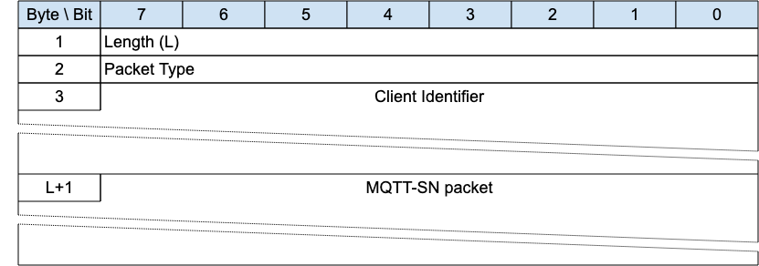{style="width: 624.00px; height: 219.26px; margin-left: 0.00px; margin-top: -0.30px; transform: rotate(0.00rad) translateZ(0px); -webkit-transform: rotate(0.00rad) translateZ(0px);"}]{style="overflow: hidden; display: inline-block; margin: 0.00px 0.00px; border: 0.00px solid #000000; transform: rotate(0.00rad) translateZ(0px); -webkit-transform: rotate(0.00rad) translateZ(0px); width: 624.00px; height: 218.67px;"}

This envelope wraps an MQTT-SN Packet to allow it to be associated with
an existing Virtual Connection where other methods are not sufficient.
Only Clients can use the Connection Encapsulation because it is assumed
that the Network Address for the Server is static for the duration of
the Virtual Connection. If the Server Network Address is not static,
then another method of identifying the Packet sender must be used, such
as the Protection Encapsulation or DTLS.

[If the Allow Network Identifier Changes flag in the CONNECT for the
Virtual Connection is 0, it is a protocol error to use the Connection
Encapsulation ]{.c30}[\[MQTT-SN-3.18-1\]]{.c35}[.]{.c12}

[It is a protocol error to use the Connection Encapsulation on Packets
sent by a Server ]{.c30}[MQTT-SN-3.18-2\]]{.c35}[.]{.c12}

[It is a protocol error to use the Connection Encapsulation on Packets
other than PUBLISH, SUBSCRIBE, UNSUBSCRIBE, REGISTER, DISCONNECT,
SLEEPREQ and PINGREQ sent by a Client
]{.c30}[MQTT-SN-3.18-3\]]{.c35}[.]{.c12}

[The encapsulated MQTT-SN packet MUST be treated by the receiver in
exactly the same fashion as the same Packet unencapsulated, once the
associated Virtual Connection is identified
]{.c30}[MQTT-SN-3.18-4\]]{.c35}[.]{.c12}

[Informative Comment]{.c16 .c75 .c44 .c32 .c49}

If the Server receives a Connection Encapsulated Packet from a Network
Address corresponding to an existing Virtual Connection, but the
Connection Information does not match, this would normally be an error,
but it is up to the implementation to decide.

[Informative Comment]{.c16 .c75 .c44 .c32 .c49}

The Protection Encapsulation is a secure method of identifying the
Sender but requires the prior distribution of shared secrets. The
Connection Encapsulation is inherently insecure and should not be used
to bypass the security of the connection process -- other environmental
or network characteristics should be used in addition.

### [3.18.1 Connection Encapsulation Header]{.c38 .c17 .c32} {#h.s8vygwg8gr70 .c20}

The first 2 or 4 bytes of the packet are encoded according to the
variable length packet header format. Refer to [[2.1 Structure of an
MQTT-SN Control Packet](#h.23ckvvd){.c4}]{.c6}[ for a detailed
description.]{.c2}

[The Length field specifies the number of bytes up to the end of the
Client Identifier field, including the Length field itself. ]{.c2}

### [3.18.2 Client Identifier]{.c38 .c17 .c32} {#h.rqq2nn7sxsft .c20}

[This is a variable length UTF-8 field that contains the Client
Identifier which was used to create the Virtual Connection. ]{.c2}

### [3.18.3 MQTT-SN Packet]{.c38 .c17 .c32} {#h.ukrkvslvb49m .c20}

[The MQTT-SN packet, encoded according to the packet type, follows
immediately after the Client Identifier field. ]{.c2}

## 3.19 Forwarder Encapsulation {#h.1e03kqp .c20}

[Figure 3-31 -- Format of an Forwarder Encapsulated MQTT-SN Packet]{.c36
.c100}

[{style="width: 624.00px; height: 219.26px; margin-left: 0.00px; margin-top: -0.30px; transform: rotate(0.00rad) translateZ(0px); -webkit-transform: rotate(0.00rad) translateZ(0px);"}]{style="overflow: hidden; display: inline-block; margin: 0.00px 0.00px; border: 0.00px solid #000000; transform: rotate(0.00rad) translateZ(0px); -webkit-transform: rotate(0.00rad) translateZ(0px); width: 624.00px; height: 218.67px;"}

An MQTT-SN Client can access a Server through a Forwarder in case the
Server is not directly attached to the same Underlying Network as the
Client. The Forwarder encapsulates the MQTT-SN Packets it receives from
the Client and sends them unchanged to the Server. In the opposite
direction, it decapsulates the Packets[ it receives from the Server and
sends them unchanged to the Clients. ]{.c2}

The Forwarder Encapsulation contains the addressing information needed
by the Forwarder to allow MQTT-SN Packets reach their intended
destination(s). Refer to [[C.1.3
Forwarder](#h.ydw0bb14xbf){.c4}]{.c6}[ for examples.]{.c2}

### [3.19.1 Forwarder Encapsulation Header]{.c38 .c17 .c32} {#h.3xzr3ei .c20}

The first 2 or 4 bytes of the packet are encoded according to the
variable length packet header format. Refer to [[2.1 Structure of an
MQTT-SN Control Packet](#h.23ckvvd){.c4}]{.c6}[ for a detailed
description.]{.c2}

[The Length field specifies the number of bytes up to the end of the
Client Addressing Information field, including the Length field
itself.]{.c2}

### [3.19.2 Client Addressing Information]{.c38 .c17 .c32} {#h.1rf9gpq .c20}

Identifies the MQTT-SN Client which has sent or should receive the
encapsulated MQTT-SN packet. The receiving Gateway[ can pass this
information back to the Forwarder in the MQTT-SN response packet
encapsulation, to allow the Forwarder to send packets to the appropriate
destination.]{.c2}

[The mapping between this information and the address of the sending or
receiving Client node is implemented by the Forwarder, if needed. It can
contain any other information needed to allow the packets to reach the
correct destination.]{.c2}

[Informative Comment]{.c16 .c75 .c44 .c32 .c49}

[For example, in MQTT-SN 1.2 this field contained a wireless node
identifier, which mapped to the Network Address, and a broadcast radius
for use in ZigBee networks.]{.c2}

### [3.19.3 MQTT-SN Packet]{.c38 .c17 .c32} {#h.4bewzdj .c20}

[The MQTT-SN packet, encoded according to the packet type.]{.c2}

## 3.20 Gateway [Discovery Packets]{.c19 .c17} {#h.2dlolyb .c83}

The Packets in this section are optional. A description of how this
functionality works can be found in [[C.2 Gateway Advertisement and
Discovery](#h.kble35c09nw4){.c4}]{.c6}.

### 3.20.1 ADVERTISE - Gateway Advertisement {#h.d4gdb1y3emqv .c83}

[Figure 3-32 -- ADVERTISE Packet]{.c36 .c100}

[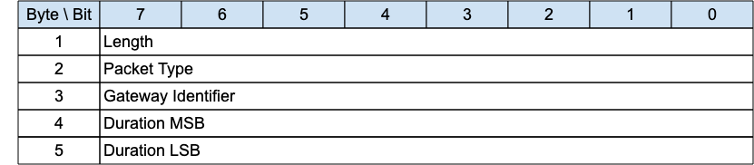{style="width: 624.00px; height: 136.00px; margin-left: 0.00px; margin-top: 0.00px; transform: rotate(0.00rad) translateZ(0px); -webkit-transform: rotate(0.00rad) translateZ(0px);"}]{style="overflow: hidden; display: inline-block; margin: 0.00px 0.00px; border: 0.00px solid #000000; transform: rotate(0.00rad) translateZ(0px); -webkit-transform: rotate(0.00rad) translateZ(0px); width: 624.00px; height: 136.00px;"}

The ADVERTISE packet is sent periodically by a Gateway to advertise its
presence. The time interval until the next transmission is indicated by
the [Duration ]{.c36}[field.]{.c2}

[Informative comment]{.c44}

[If the Transport Layer supports multicast, like UDP/IP, the ADVERTISE
packet can be sent using a multicast address as the destination.]{.c16
.c9}

#### [3.20.1.1 ADVERTISE Header]{.c17 .c89 .c75 .c44 .c32} {#h.sqyw64 .c20}

The first 2 or 4 bytes of the packet are encoded according to the
variable length packet header format. Refer to [[2.1 Structure of an
MQTT-SN Control Packet](#h.23ckvvd){.c4}]{.c6}[ for a detailed
description.]{.c2}

#### [3.20.1.2 Gateway Identifier]{.c17 .c89 .c75 .c44 .c32} {#h.3cqmetx .c20}

The [Gateway Identifier ]{.c36}[field is 1 byte and uniquely identifies
a Gateway which is advertising its presence on the network.]{.c2}

The MQTT-SN protocol itself does not guarantee the uniqueness of the
[Gateway Identifier]{.c36}[.]{.c2}

#### [3.20.1.3 Duration]{.c17 .c89 .c75 .c44 .c32} {#h.1rvwp1q .c20}

The [Duration ]{.c36}[field is a 2-byte integer. It specifies the time
interval in seconds until the next ADVERTISE packet is transmitted by
this Gateway. ]{.c2}

[The maximum value that can be encoded is approximately 18 hours.]{.c2}

### 3.20.2 SEARCHGW - Search for A Gateway {#h.4bvk7pj .c83}

[Figure 3-33 -- SEARCHGW Packet]{.c36 .c100}

[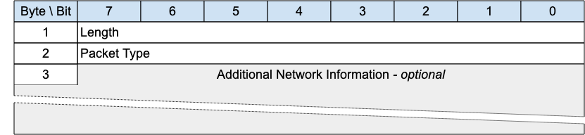{style="width: 624.00px; height: 144.00px; margin-left: 0.00px; margin-top: 0.00px; transform: rotate(0.00rad) translateZ(0px); -webkit-transform: rotate(0.00rad) translateZ(0px);"}]{style="overflow: hidden; display: inline-block; margin: 0.00px 0.00px; border: 0.00px solid #000000; transform: rotate(0.00rad) translateZ(0px); -webkit-transform: rotate(0.00rad) translateZ(0px); width: 624.00px; height: 144.00px;"}

The SEARCHGW packet is sent by a Client to find a [Gateway to send
Application Messages to, and receive Application Messages from]{.c12}[.
]{.c2}

[Informative comment]{.c44}

If the Transport Layer supports multicast, like UDP/IP, the SEARCHGW
packet can be sent using the multicast address as the destination.

To prevent flooding the network, the transmission radius of the SEARCHGW
packet may be limited, if the underlying Transport Layer supports the
concept.

#### [3.20.2.1 SEARCHGW Header]{.c17 .c89 .c75 .c44 .c32} {#h.2r0uhxc .c20}

The first 2 or 4 bytes of the packet are encoded according to the
variable length packet header format. Refer to [[2.1 Structure of an
MQTT-SN Control Packet](#h.23ckvvd){.c4}]{.c6}[ for a detailed
description.]{.c2}

#### [3.20.2.2 Additional Network Information]{.c17 .c89 .c75 .c44 .c32} {#h.1664s55 .c20}

Any extra information that the underlying network needs to control the
search process can be included in this variable length field. It will be
available to the receiver of this packet and could be used to affect the
transmission of the GWINFO response packet.

[This field is optional - its existence or absence is inferred from the
Packet length.]{.c2}

[        Informative Comment]{.c16 .c75 .c44 .c32 .c49}

[In ZigBee mesh networks, this field could contain the ZigBee 1-byte
broadcast radius, for instance.]{.c2}

### 3.20.3 GWINFO - Gateway Information {#h.3q5sasy .c83}

[Figure 3-34 -- GWINFO Packet]{.c36 .c100}

[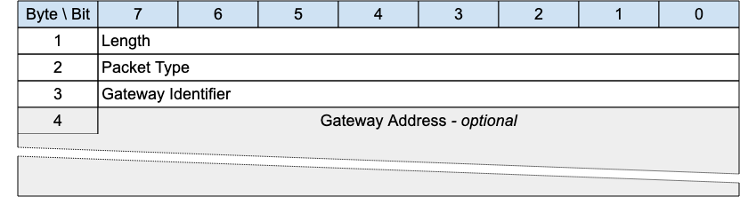{style="width: 624.00px; height: 166.67px; margin-left: 0.00px; margin-top: 0.00px; transform: rotate(0.00rad) translateZ(0px); -webkit-transform: rotate(0.00rad) translateZ(0px);"}]{style="overflow: hidden; display: inline-block; margin: 0.00px 0.00px; border: 0.00px solid #000000; transform: rotate(0.00rad) translateZ(0px); -webkit-transform: rotate(0.00rad) translateZ(0px); width: 624.00px; height: 166.67px;"}

The GWINFO packet is sent as response to a SEARCHGW packet. If sent by a
[Gateway]{.c12}, it contains only the identifier of the sending
[Gateway]{.c12}; otherwise, if sent by a client, it also includes the
Network Address of the [Gateway]{.c12}[.]{.c2}

[Informative comment]{.c44}

[If the Transport Layer supports multicast, like UDP/IP, the GWINFO
packet can be sent using a multicast address as destination.]{.c16 .c9}

#### [3.20.3.1 GWINFO Header]{.c17 .c89 .c75 .c44 .c32} {#h.25b2l0r .c20}

The first 2 or 4 bytes of the packet are encoded according to the
variable length packet header format. Refer to [[2.1 Structure of an
MQTT-SN Control Packet](#h.23ckvvd){.c4}]{.c6}[ for a detailed
description.]{.c2}

#### [3.20.3.2 Gateway Identifier]{.c17 .c89 .c75 .c44 .c32} {#h.kgcv8k .c20}

The [Gateway Identifier ]{.c36}field is 1-byte long and uniquely
identifies a [Gateway ]{.c12}[in the network.]{.c2}

#### [3.20.3.3 Gateway Address]{.c17 .c75 .c44 .c32 .c89} {#h.34g0dwd .c20}

The [Gateway Address ]{.c36}[field has a variable length and contains
the Network Address of a Gateway. Its length depends on the type of
network over which MQTT-SN operates and is specified by the Length byte.
]{.c2}

[This field is optional - its existence or absence is inferred from the
Packet length. It is only included if the Packet is sent by a
Client.]{.c2}

[]{.c9 .c17 .c42 .c32}

# [4 Operational behavior]{.c17 .c120 .c75 .c44 .c32} {#h.2qk79lc .c235 .c192 .c200 .c87 .c90}

[An important design point of MQTT-SN is to be as close as possible to
MQTT. Therefore, all protocol semantics should remain, as far as
possible, the same as those defined by MQTT.]{.c2}

## [4.1 ]{.c27}[Session state]{.c27} {#h.21od6so .c155 .c93 .c87 .c90}

[In order to implement QoS 1 and QoS 2 protocol flows the Client and
Server need to associate state with the Client Identifier, this is
referred to as the Session State. The Server also stores the
subscriptions as part of the Session State.]{.c2}

[The Session can continue across a sequence of Virtual Connections. It
lasts as long as the latest Virtual Connection plus the Session Expiry
Interval.]{.c2}

[The Session State in the Client consists of:]{.c49}

- [QoS 1 and QoS 2 PUBLISH Packets which have been sent to the Server,
  but have not been completely acknowledged.]{.c2}
- [QoS 2 PUBLISH Packets which have been received from the Server, but
  have not been ]{.c49}[completely ]{.c49}[acknowledged.]{.c2}
- [Session Topic Alias mappings.]{.c2}

[The Session State in the Server consists of:]{.c49}

- [The existence of a Session, even if the rest of the Session State is
  empty.]{.c2}
- [The Client's subscriptions.]{.c2}
- [QoS 1 and QoS 2 PUBLISH Packets which have been sent to the Client,
  but have not been completely acknowledged.]{.c2}
- [QoS 1 and QoS 2 PUBLISH Packets pending transmission to the Client
  and OPTIONALLY QoS 0 PUBLISH Packets pending transmission to the
  Client.]{.c2}
- [QoS 2 PUBLISH Packets which have been received from the Client, but
  have not been completely acknowledged.]{.c2}
- [The Will ]{.c49}[Message and associated Will data.]{.c2}
- [If the Session is currently not connected, the time at which the
  Session will end and Session State will be discarded.]{.c2}
- [Session Topic Alias mappings.]{.c2}

[Retained messages do not form part of the Session State in the Server,
they are not deleted as a result of a Session ending.]{.c2}

### [4.1.1 Storing Session State]{.c38 .c17 .c32} {#h.nasxg3iedd75 .c137}

[The Server ]{.c30 .c49}[MUST NOT discard]{.c30 .c49}[ the Session State
while the Virtual Connection exists]{.c30
.c49}[ ]{.c49}[\[MQTT-SN-4.1.1-1\]]{.c35 .c49}[. ]{.c2}

[The Client ]{.c30 .c49}[MUST NOT discard]{.c30 .c49}[ the Session State
while the Virtual Connection exists]{.c30
.c49}[ ]{.c49}[\[MQTT-SN-4.1.1-2\]]{.c35 .c49}[. ]{.c49}

[The Server MUST discard the Session State when the Virtual Connection
is deleted]{.c30 .c49}[ ]{.c30 .c49}[and ]{.c30 .c49}[the Session Expiry
Interval has passed]{.c30 .c49}[ ]{.c49}[\[MQTT-SN-4.1.1-3\]]{.c35
.c49}[. A Session Expiry Interval of 0xFFFFFFFF is an infinite amount of
time, so never passes.]{.c2}

[         ]{.c49}[Informative comment]{.c16 .c75 .c44 .c32 .c49}

[The storage capabilities of Client and Server implementations will of
course have limits in terms of capacity and may be subject to
administrative policies. Stored Session State can be discarded as a
result of an administrator action, including an automated response to
defined conditions. This has the effect of terminating the Session.
These actions might be prompted by resource constraints or for other
operational reasons. It is possible that hardware or software failures
may result in loss or corruption of Session State stored by the Client
or Server. It is prudent to evaluate the storage capabilities of the
Client and Server to ensure that they are sufficient.]{.c2}

### [4.1.2 Session Establishment]{.c38 .c17 .c32} {#h.434ayfz .c155 .c93 .c87 .c90}

[An MQTT-SN Client needs to create a session on the server, unless it is
only publishing using PUBWOS packets. The procedure for setting up a
session with a server is illustrated in figures 4-1 and 4-2. ]{.c2}

[The CONNECT packet contains flags to communicate to the
]{.c9}Server[ that authentication interactions, with the AUTH packet,
should take place.]{.c2}

[Figure 4-1 -- Connect Procedure (without Auth flag set, or no further
authentication data required)]{.c36 .c100}

[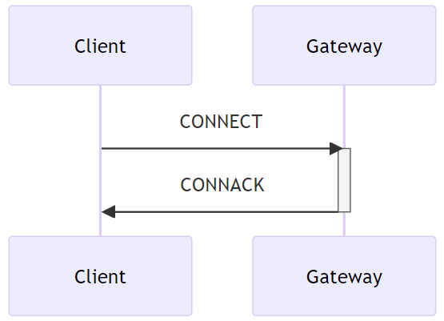{style="width: 321.10px; height: 232.06px; margin-left: 0.00px; margin-top: 0.00px; transform: rotate(0.00rad) translateZ(0px); -webkit-transform: rotate(0.00rad) translateZ(0px);"}]{style="overflow: hidden; display: inline-block; margin: 0.00px 0.00px; border: 0.00px solid #000000; transform: rotate(0.00rad) translateZ(0px); -webkit-transform: rotate(0.00rad) translateZ(0px); width: 321.10px; height: 232.06px;"}

[Figure 4-2 -- Connect Procedure (with Auth flag set and further
authentication data required)]{.c36 .c100}

[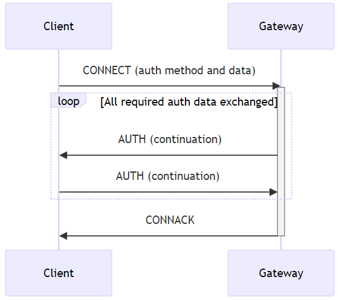{style="width: 321.14px; height: 284.50px; margin-left: 0.00px; margin-top: 0.00px; transform: rotate(0.00rad) translateZ(0px); -webkit-transform: rotate(0.00rad) translateZ(0px);"}]{style="overflow: hidden; display: inline-block; margin: 0.00px 0.00px; border: 0.00px solid #000000; transform: rotate(0.00rad) translateZ(0px); -webkit-transform: rotate(0.00rad) translateZ(0px); width: 321.14px; height: 284.50px;"}

[If the ]{.c9}Server[ can not accept the CONNECT request the
]{.c9}Server[ returns a CONNACK packet with the rejection Reason
Code.]{.c2}

[If the Client provides no client identifier, the Server MUST respond
with a CONNACK containing an Assigned Client
Identifier]{.c1}[ ]{.c30}[\[MQTT-SN-4.1.2-1\]]{.c35}[.]{.c12}

[An Assigned Client Identifier MUST be a new Client Identifier
]{.c1}[not used by]{.c1}[ any other Session currently in the
]{.c1}[Server ]{.c30}[\[MQTT-SN-4.1.2-2\]]{.c35}[.]{.c12}

## [4.2 Networks and Virtual Connections]{.c19 .c17} {#h.fc1j1f7dq6oy .c155 .c93 .c87 .c90}

[The MQTT-SN protocol requires an Underlying Network to
ca]{.c49}rry[ Packets from a Client to a ]{.c49}Server[ and from a
]{.c49}Server[ to a Client. ]{.c2}

[The Underlying Network may also be able to ]{.c49}send[ ]{.c9}[Packets
from a sender to more than one receiver]{.c49} at once -- UDP/IP
multicast, for example.

[The relationship between MQTT-SN and the Underlying Network is
described in the following points:]{.c2}

- [MQTT-SN Packets which are received must be unaltered and
  complete.]{.c49}[ ]{.c49}[There is no packet error correction in
  MQTT-SN. If a corrupted or partial packet is received it will cause a
  protocol error.]{.c2}
- [The Underlying Network does not need to be reliable, it is expected
  that Packets can be lost or delivered out of order. ]{.c49}[The
  MQTT-SN protocol will tolerate out of order Packets and it will
  retransmit lost Packets in the case that an expected acknowledgement
  has not been received.]{.c2}
- [If the Underlying Network might deliver a Packet more than once, for
  connection-oriented communications (CONNECT, DISCONNECT and other
  packets in between) the PROTECTION ENCAPSULATION Monotonic Counter
  MUST be used to eliminate duplicates]{.c49}[. (In the case that a
  protected packet is duplicated, the Monotonic Counter will be the same
  on all the duplicates of a packet).]{.c2}
- [The Underlying Network may be connectionless. Virtual Connections do
  not need to have an Underlying Network event that signals their
  creation or deletion.]{.c2}
- [The Underlying Network may be a radio network.]{.c2}

[Informative comment]{.c16 .c75 .c44 .c49}

[UDP as defined in \[RFC0768\] can be used for MQTT-SN if the Maximum
Transmission Unit is configured to be more ]{.c49}[than the maximum
MQTT-SN Packet size]{.c49}[ used and no Packet fragmentation occurs.
Depending on the network configuration, UDP can duplicate Packets. If
this can happen, the PROTECTION ENCAPSULATION monotonic counter should
be used.]{.c16 .c9}

[Examples of possible consequences of allowing duplicate Packets are:\
-- DISCONNECT Packet applied to the wrong Virtual Connection\
-- SUBSCRIBE and UNSUBSCRIBE Packets applied to the wrong Virtual
Connection\
-- PUBLISH QOS=2 published more than once]{.c16 .c9}

[The following transport protocols are also suitable but if not capable
of multicast the implementation of the optional ADVERTISE, SEARCHGW,
GWINFO packets may not be possible:]{.c16 .c9}

- [DTLS v1.2 \[RFC6347\]]{.c16 .c9}
- [DTLS v1.3 \[RFC9147\]]{.c16 .c9}
- [QUIC \[RFC9000\]]{.c16 .c9}
- [Non-IP protocols]{.c49}
- [TCP/IP \[RFC0793\]]{.c16 .c9}
- [TLS \[RFC5246\]]{.c16 .c9}
- [WebSocket \[RFC6455\].]{.c16 .c9}

[Informative comment]{.c16 .c75 .c44 .c49}

[Both ]{.c49}[TCP and UDP ports 1883 and 8883 are registered with IANA
for MQTT and secure communication
respectively.]{.c49}^[\[l\]](#cmnt12){#cmnt_ref12}[\[m\]](#cmnt13){#cmnt_ref13}^

### [4.2.1 Virtual Connections]{.c38 .c17 .c32} {#h.os7rhgsntv6i .c46 .c93 .c90}

[A Virtual Connection is:]{.c3 .c17}

- [created ]{.c12}[with a CONNECT packet]{.c3 .c17}
- [deleted ]{.c12}[by any of:]{.c3 .c17}

<!-- -->

- [Keep Alive timeout]{.c3 .c17}
- [Retry timeout]{.c3 .c17}
- [DISCONNECT packet]{.c3 .c17}
- [protocol error]{.c3 .c17}

<!-- -->

- [required for any MQTT-SN Packet to be sent between an MQTT-SN Client
  and Server, except any of the following Packets:]{.c3 .c17}

<!-- -->

- [CONNECT, which creates a Virtual Connection]{.c3 .c17}
- [PUB]{.c12}[WOS]{.c12}[ (and PUBLISH QoS -1 if implemented)]{.c3 .c17}
- [ADVERTISE, SEARCHGW, GWINFO]{.c12}

[All incoming Packets except CONNECT, PUBWOS and Gateway search
(ADVERTISE, SEARCHGW and GWINFO) MUST be associated with an existing
Virtual Connection]{.c30} [\[MQTT-SN-4.2.1-1\]]{.c35}[.]{.c2}

Virtual Connections link a Network Identity with a Session. [For those
Packets other than CONNECT, PUBWOS and Gateway search, the receiver
needs to be able to identify the sender to associate the Packet with a
Virtual Connection. The Sender may be identified in various ways, for
example:]{.c2}

- [Network Address]{.c2}
- [Protection Encapsulation - Sender Identifier]{.c2}
- [Connection Encapsulation - Connection Information]{.c2}
- DTLS Connection ID

[Informative Comment]{.c17 .c12 .c44 .c49 .c75}

[The Network Address was the usual method of identifying the Sender in
MQTT-SN 1.2, but may not be secure, or work in environments where the
Network Address of a Client device may change during the lifetime of a
Virtual Connection.]{.c12}

## [4.3 Quality of Service levels and protocol flows]{.c27} {#h.2i9l8ns .c155 .c93 .c87 .c90}

[MQTT-SN delivers Application Messages according to the Quality of
Service (QoS) levels defined in the following sections. The delivery
protocol is symmetric - in the description below the role of the sender
can be taken by the Client with the ]{.c9}Server[ being the receiver, or
the role of the sender can be taken by the Server with the Client being
the receiver. When the ]{.c9}Server[ is delivering an Application
Message to more than one Client, each Client is treated independently.
The QoS level used to deliver an Application Message outbound to the
Client could differ from that of the inbound Application Message.]{.c2}

### 4.3.1 Publish without session {#h.be76rdrlcegt .c20}

[No Session or Virtual Connection is required to send a message. The
message is delivered according to the capabilities of the underlying
network. ]{.c49}[No response is sent by the receiver and no retry is
performed by the sender. The message arrives at the receiver either once
or]{.c9}[ ]{.c9}[not at all.]{.c2}

[In the PUBWOS delivery protocol, the sender]{.c30}

- [MUST send a PUBWOS packet]{.c1}[ ]{.c30}[\[MQTT-SN-4.3.1-1\].]{.c35}

[The receiver:]{.c1 .c16}

- [MAY decide to accept ownership of the message when it receives a
  PUBWOS packet.]{.c16 .c9}
- [MUST treat any accepted messages as QoS
  0]{.c1}[ ]{.c30}[\[MQTT-SN-4.3.1-2\].]{.c35}

[Informative Comment:]{.c16 .c75 .c44 .c32 .c49}

Each [PUBWOS packet may be ]{.c9}received and processed by more than one
receiver.

### 4.3.2 [QoS 0: At most once delivery]{.c38 .c17 .c32} {#h.xevivl .c20}

[The message is delivered according to the capabilities of the
underlying network. No response is sent by the receiver and no retry is
performed by the sender. The message arrives at the receiver either once
or not at all. ]{.c2}

[In the QoS 0 delivery protocol, the sender]{.c1}

- [MUST send a PUBLISH packet with QoS
  0]{.c1}[ \[MQTT-SN-4.3.2-1\]]{.c35}[.]{.c12}

[In the QoS 0 delivery protocol, the receiver]{.c2}

- [Accepts ownership of the message when it receives the PUBLISH
  packet.]{.c2}

[Figure 4-3 -- QoS 0 protocol flow, informative example]{.c36 .c100}

  ---------------------- ------------------------------ -------------------------------------------------------------------------
  [Sender Action]{.c0}   [Control Packet]{.c0}          [Receiver Action]{.c0}
  [PUBLISH QoS 0]{.c2}   []{.c2}                        []{.c2}
  []{.c2}                [\-\-\-\-\-\-\-\-\--\>]{.c2}   []{.c16 .c75 .c44 .c32 .c49}
  []{.c2}                []{.c2}                        [Deliver Application Message to appropriate onward recipient(s) ]{.c27}
  ---------------------- ------------------------------ -------------------------------------------------------------------------

### 4.3.3 [QoS 1: At least once delivery]{.c38 .c17 .c32} {#h.1au1eum .c20}

[This Quality of Service level ensures that the message arrives at the
receiver at least once. A QoS 1 PUBLISH packet has a Packet Identifier
in its Variable Header and is acknowledged by a PUBACK packet.]{.c2}

[In the QoS 1 delivery protocol, the sender]{.c1}

- [MUST assign an unused Packet Identifier each time it has a new
  Application Message to publish]{.c1}[ ]{.c9}[\[MQTT-SN-4.3.3-1\].]{.c9
  .c17 .c35 .c32}
- [MUST send a PUBLISH packet containing this Packet Identifier with QoS
  1 ]{.c1}[and DUP flag set to 0]{.c1}[ ]{.c9}[\[MQTT-SN-4.3.3-2\].]{.c9
  .c35}
- [MUST treat the PUBLISH packet as "unacknowledged" until it has
  received the corresponding PUBACK packet from the
  receiver]{.c1}[ ]{.c9}[\[MQTT-SN-4.3.3-3\].]{.c9 .c35}

[The Packet Identifier becomes available for reuse once the sender has
received the PUBACK packet. ]{.c9}

[The sender is NOT permitted to send further packets with different
Packet Identifiers while it is waiting to receive
acknowledgements.]{.c9}[ ]{.c1}[At all times a Sender MUST have a
maximum of one unacknowledged
packet]{.c1}[ ]{.c30}[\[MQTT-SN-4.3.3-4\]]{.c35}[.]{.c12}

[In the QoS 1 delivery protocol, the receiver]{.c1}

- [MUST respond with a PUBACK packet containing the Packet Identifier
  from the incoming PUBLISH packet, having accepted ownership of the
  Application Message]{.c1} [\[MQTT-SN-4.3.3-5\]]{.c35}[.]{.c12}
- [a]{.c30}[fter it has sent a PUBACK packet]{.c1}[, ]{.c30}[MUST treat
  any incoming PUBLISH packet that contains the same Packet Identifier
  as being a new Application
  Message]{.c1}[ ]{.c30}[\[MQTT-SN-4.3.3-6\]]{.c35}[.]{.c12}

[Figure 4-4 -- QoS 1 protocol flow, informative example]{.c36 .c100}

  --------------------------------------------------------- ------------------------------- ----------------------------------------------------------------------------
  [Sender Action]{.c0}                                      [MQTT-SN Control Packet]{.c0}   [Receiver action]{.c0}
  [Store message]{.c2}                                      []{.c2}                         []{.c2}
  [Send PUBLISH QoS 1, DUP=0, \<Packet Identifier\>]{.c2}   [\-\-\-\-\-\-\-\-\--\>]{.c2}    []{.c16 .c75 .c44 .c32 .c49}
  []{.c2}                                                   []{.c2}                         [Initiate onward delivery of the Application Message]{.c27}[1]{.c27 .c186}
  []{.c2}                                                   [\<\-\-\-\-\-\-\-\-\--]{.c2}    [Send PUBACK \<Packet Identifier\>]{.c2}
  [Discard message]{.c27}                                   []{.c2}                         []{.c16 .c75 .c44 .c32 .c49}
  --------------------------------------------------------- ------------------------------- ----------------------------------------------------------------------------

[1]{.c42 .c186 .c49 .c286}[The receiver does not need to complete
delivery of the Application Message before sending the PUBACK]{.c49}[.
When its original sender receives the PUBACK packet, ownership of the
Application Message is transferred to the receiver.]{.c2}

### 4.3.4 [QoS 2: Exactly once delivery]{.c38 .c17 .c32} {#h.1o97atn .c20}

[This is the highest Quality of Service level, for use when neither loss
nor duplication of Application Messages are acceptable. There is an
increased overhead associated with QoS 2.]{.c2}

[In the QoS 2 delivery protocol, the sender]{.c1}[:]{.c2}

- [MUST assign an unused Packet Identifier when it has a new Application
  Message to publish]{.c1}[ ]{.c9 .c35}[\[MQTT-SN-4.3.4-1\]]{.c9 .c17
  .c35 .c32}
- [MUST send a PUBLISH packet containing this Packet Identifier with QoS
  equal to 2 ]{.c1}[\[MQTT-SN-4.3.4-2\]]{.c35}
- [MUST set the DUP flag to 0 when it attempts to ]{.c1}[send]{.c30}[ a
  PUBLISH packet for the first time ]{.c1}[\[MQTT-SN-4.3.4-3\]]{.c35}
- [MUST set the DUP flag to 1 when it attempts to resend a PUBLISH
  packet]{.c1}[ ]{.c9}[\[MQTT-SN-4.3.4-4\]]{.c35}
- [MUST treat the PUBLISH packet as "unacknowledged" until it has
  received the corresponding PUBREC packet from the
  receiver]{.c1}[ ]{.c9}[\[MQTT-SN-4.3.4-5\]]{.c35}
- [MUST send a PUBREL packet when it receives a PUBREC packet from the
  receiver with a Reason Code value less than 0x80. This PUBREL packet
  MUST contain the same Packet Identifier as the original PUBLISH packet
  ]{.c1}[\[MQTT-SN-4.3.4-6\]]{.c35}
- [MUST treat the PUBREL packet as "unacknowledged" until it has
  received the corresponding PUBCOMP packet from the receiver
  ]{.c1}[\[MQTT-SN-4.3.4-7\]]{.c35}
- [MUST NOT resend the PUBLISH once it has sent the corresponding PUBREL
  packe]{.c1}[t]{.c9}[ ]{.c9}[\[MQTT-SN-4.3.4-8\]]{.c35}

[The Packet Identifier becomes available for reuse once the sender has
received the PUBCOMP packet or a PUBREC with a Reason Code of 0x80 or
greater. ]{.c2}

[In the QoS 2 delivery protocol, the receiver]{.c1}[:]{.c9}

- [MUST respond with a PUBREC containing the Packet Identifier from the
  incoming PUBLISH packet, having accepted ownership of the Application
  Message ]{.c1}[\[MQTT-SN-4.3.4-9\]]{.c35}
- [If it has sent a PUBREC with a Reason Code of 0x80 or greater, the
  receiver MUST treat any subsequent PUBLISH packet that contains that
  Packet Identifier as being a new Application
  Message]{.c1}[ ]{.c9}[\[MQTT-SN-4.3.4-10\]]{.c35}
- [Until it has received the corresponding PUBREL packet, ]{.c1}[the
  receiver MUST acknowledge any subsequent PUBLISH packet with the same
  Packet Identifier by sending a PUBREC]{.c1}[. It MUST NOT cause
  duplicate messages to be delivered to any onward recipients in this
  case]{.c1}[ ]{.c9}[\[MQTT-SN-4.3.4-11\]]{.c35}
- [MUST respond to a PUBREL packet by sending a PUBCOMP packet
  containing the same Packet Identifier as the PUBREL
  ]{.c1}[\[MQTT-SN-4.3.4-12\]]{.c35}
- [After it has sent a PUBCOMP, the receiver MUST treat any subsequent
  PUBLISH packet that contains that Packet Identifier as being a new
  Application Message]{.c1}[, irrespective of the setting of its DUP
  flag ]{.c1}[\[MQTT-SN-4.3.4-13\]]{.c35}

[Figure 4-5 -- QoS 2 protocol flow, informative example]{.c36 .c100}

+-----------------------+------------------------------+-----------------------+
| [Sender Action]{.c0}  | [MQTT-SN Control             | [Receiver             |
|                       | Packet]{.c0}                 | Action]{.c0}          |
+-----------------------+------------------------------+-----------------------+
| [Store message]{.c2}  | [ ]{.c2}                     | [ ]{.c2}              |
+-----------------------+------------------------------+-----------------------+
| [PUBLISH QoS 2,       | [ ]{.c2}                     | [ ]{.c16 .c75 .c44    |
| DUP=0\                |                              | .c32 .c49}            |
| \<Packet              |                              |                       |
| Identifier\>]{.c2}    |                              |                       |
+-----------------------+------------------------------+-----------------------+
| [ ]{.c2}              | [\-\-\-\-\-\-\-\-\--\>]{.c2} | [ ]{.c16 .c75 .c44    |
|                       |                              | .c32 .c49}            |
+-----------------------+------------------------------+-----------------------+
| [ ]{.c2}              | [ ]{.c2}                     | Store \<Packet        |
|                       |                              | Identifier\> and      |
|                       |                              | message               |
+-----------------------+------------------------------+-----------------------+
| [ ]{.c2}              | [ ]{.c2}                     | [PUBREC \<Packet      |
|                       |                              | Identifier\>\<Reason  |
|                       |                              | Code\>]{.c2}          |
+-----------------------+------------------------------+-----------------------+
| [ ]{.c2}              | [\<\-\-\-\-\-\-\-\-\--]{.c2} | [ ]{.c2}              |
+-----------------------+------------------------------+-----------------------+
| [Discard message,     | [ ]{.c2}                     | [ ]{.c2}              |
| Store PUBREC received |                              |                       |
| \<Packet              |                              |                       |
| Identifier\>]{.c2}    |                              |                       |
+-----------------------+------------------------------+-----------------------+
| [PUBREL \<Packet      | [ ]{.c2}                     | [ ]{.c16 .c75 .c44    |
| Identifier\>]{.c2}    |                              | .c32 .c49}            |
+-----------------------+------------------------------+-----------------------+
| [ ]{.c2}              | [\-\-\-\-\-\-\-\-\--\>]{.c2} | [ ]{.c16 .c75 .c44    |
|                       |                              | .c32 .c49}            |
+-----------------------+------------------------------+-----------------------+
| [ ]{.c2}              | [ ]{.c2}                     | Initiate onward       |
|                       |                              | delivery of the       |
|                       |                              | Application Message[1 |
|                       |                              | ]{.c168 .c9 .c164     |
|                       |                              | .c32}                 |
|                       |                              |                       |
|                       |                              | [then discard the     |
|                       |                              | message and \<Packet  |
|                       |                              | Identifier\>]{.c2}    |
+-----------------------+------------------------------+-----------------------+
| [ ]{.c16 .c75 .c44    | [ ]{.c2}                     | [Send PUBCOMP         |
| .c32 .c49}            |                              | \<Packet              |
|                       |                              | Identifier\>]{.c2}    |
+-----------------------+------------------------------+-----------------------+
| [ ]{.c16 .c75 .c44    | [\<\-\-\-\-\-\-\-\-\--]{.c2} | [ ]{.c2}              |
| .c32 .c49}            |                              |                       |
+-----------------------+------------------------------+-----------------------+
| [Discard stored       | [ ]{.c2}                     | [ ]{.c2}              |
| state]{.c2}           |                              |                       |
+-----------------------+------------------------------+-----------------------+

[1 ]{.c49 .c186}[T]{.c49}[he receiver does not need to complete delivery
of the Application Message before sending the ]{.c49}[PUBREC
or]{.c49}[ PUBCOMP.]{.c49}[ When its original sender receives the PUBREC
packet, ownership of the Application Message is transferred to the
receiver. However, the receiver needs to perform all checks for
conditions which might result in a forwarding failure (for example,
quota exceeded or authorization) before accepting ownership. The
receiver indicates success or failure using the appropriate Reason Code
in the PUBREC.]{.c49}

## [4.4 Packet delivery retry]{.c19 .c17} {#h.6udnv5yl5cv5 .c20}

[There are two situations when packets that require acknowledgement are
resent by the sender:]{.c2}

1.  [when a Virtual Connection is deleted before the acknowledgement is
    received by the requester, ]{.c9}[and]{.c9}[ Clean Start is 0]{.c9}
2.  [when no acknowledgment is received by the requester within a
    configured timeout period during the existence of a Virtual
    Connection]{.c9}

[These situations are described in the following sections.]{.c2}

### [4.4.1 Virtual Connection End]{.c38 .c17 .c32} {#h.kc8msbstg9e .c20}

[When]{.c1}[ a Client reconnects with Clean Start set to 0 and a Session
is present, both the Client and Server MUST resend any
]{.c1}[unacknowledged PUBLISH with QoS 1 and 2 packets]{.c1}[ (not QoS
0) and PUBREL packets using their original Packet
Identifiers]{.c1}[ ]{.c1 .c35}[\[MQTT-SN-4.4.1-1\].]{.c9 .c35}

[If PUBACK or PUBREC is received containing a Reason Code of 0x80 or
greater, the corresponding PUBLISH packet is treated as acknowledged,
and MUST NOT be retransmitted]{.c1}[ ]{.c9}[\[MQTT-SN-4.4.1-2\]]{.c9
.c35}[. ]{.c2}

[The DUP flag MUST be set to 1 by the Client or Server when it attempts
to resend a PUBLISH QoS 2
packet]{.c1}[ ]{.c30}[\[MQTT-SN-4.4.1-3\].]{.c9 .c35}

### [4.4.2 Unacknowledged Packets]{.c38 .c17 .c32} {#h.17nz8yj .c155 .c93 .c87 .c90}

[In MQTT-SN, any packet may not be delivered by the underlying Network.
If a packet is lost, the response to a request will not arrive. In
addition to the Keep Alive timer, MQTT-SN Clients and ]{.c9}Server[s may
also resend any packets for which a response is expected, but not
received.]{.c2}

[The packets that expect a response an]{.c9}d may be retried [are:]{.c2}

- [Sent by both Clients and Servers:]{.c2}

<!-- -->

- [REGISTER]{.c2}
- [PUBLISH QoS 1 and 2]{.c2}
- [PUBREL]{.c2}

<!-- -->

- [Sent by Clients only:]{.c2}

<!-- -->

- [SUBSCRIBE ]{.c2}
- [UNSUBSCRIBE]{.c2}
- [SLEEPREQ]{.c2}
- [PINGREQ]{.c9}

[CONNECT and AUTH packets expect a response but MUST NOT be retried
]{.c30}[\[MQTT-SN-4.4.2-1\].]{.c35}

[The connection sequence CONNECT, zero or more AUTH Packets then CONNACK
MUST be completed without retries ]{.c30}[\[MQTT-SN-4.4.2-2\].]{.c35}

[An MQTT-SN Sender may be configured with two parameters to govern its
resending of unacknowledged packets:]{.c2}

1.  [Retry Interval ]{.c2}
2.  [Maximum Retry Count]{.c2}

[on the basis of the expected characteristics of the Underlying Network.
Example values for these are suggested in ]{.c9}[[C.4 Timer and Counter
Values](#h.b7gl7rjnh27t){.c4}]{.c6 .c9}[. See also ]{.c9}[[C.5
Exponential Backoff](#h.x5dohv2o2038){.c4}]{.c6 .c9}[ for guidance on
varying the ]{.c9}[Retry Interval]{.c9 .c36}[ to reduce potential
network congestion.]{.c9}

[When no response to one of the above packets is received in the
]{.c9}[Retry Interval]{.c9 .c36}[, the Sender may resend the packet, at
]{.c9}[Retry Interval]{.c9 .c36}[ intervals, until the ]{.c9}[Maximum
Retry Count]{.c9 .c36}[ is reached. ]{.c9}[After]{.c9} the [Maximum
Retry Count ]{.c36}is reached and a further [Retry Interval]{.c36} has
passed without a response[, it is deemed that there is no
response.]{.c2}

[In the absence of a response to a packet which expects one, t]{.c1}[he
Sender MUST delete the Virtual
Connection]{.c1}[ ]{.c30}[\[MQTT-SN-4.4.2-3\].]{.c35}[ ]{.c30}I[f the
Sender is a Serv]{.c9}er and a Will Message is defined for the Virtual
Connection, the Will Message is be published as described in [[3.1.2.2
Will Flag](#h.92dpq2f7xb81){.c4}]{.c6}. [A new connection will have to
be established to continue.]{.c9}

[If a Packet is retransmitted, it MUST have Protection Encapsulation if
the previously transmitted Packet had Protection
Encapsulation]{.c1}^[\[n\]](#cmnt14){#cmnt_ref14}[\[o\]](#cmnt15){#cmnt_ref15}^[ ]{.c30}[\[MQTT-SN-4.4.2-4\].]{.c35}

[If a Packet is retransmitted it MUST be identical to the previously
transmitted Packet. The Protection Encapsulation need not be
identical]{.c1}[ ]{.c30}[\[MQTT-SN-4.4.2-5\].]{.c35}

[Informative comment]{.c16 .c75 .c44 .c32 .c49}

[The value of the ]{.c9}[Retry Interval]{.c9 .c36}[ is not specified by
MQTT-SN, however, to be useful it ought to be longer than the network
round trip time. If it is excessively long, the time taken to detect and
retransmit lost Packets will also be excessively long. Implementers need
to take care not to use a retry interval that might cause the network to
become congested with retried Packets.]{.c2}

[Informative comment]{.c16 .c75 .c44 .c32 .c49}

[To be useful, and depending on the reliability characteristics of the
Underlying Network, the retry cycle should be shorter than the Keep
Alive interval. If it is not, then a Keep Alive timeout may occur during
the retry cycle, causing the Virtual Connection to be deleted, and the
rest of the retry cycle to be ineffective.]{.c2}

## [4.5 Application Message receipt]{.c19 .c17} {#h.xoc2pfhnyfst .c20}

[When a Server takes ownership of an incoming Application Message it
MUST add it to the Session State for those Clients that have matching
Subscriptions]{.c1}[ ]{.c9}[\[MQTT-SN-4.5-1\]]{.c9 .c35}[. Matching
rules are defined in ]{.c9}[[4.7.1 Topic Names and Topic
Filters](#h.g7vjj8m1vj3z){.c4}]{.c6 .c9}[.]{.c6 .c9 .c118 .c32}

[Under normal circumstances Clients receive]{.c9}[ Application
]{.c9}[M]{.c9}[essages in response to Subscriptions they have created. A
Client coul]{.c9}[d also receive Application Mess]{.c9}[ages that do not
match any of its explicit Subscriptions. Th]{.c9}[is can happen if the
Server automatically assigned a subscription to the Client. A Client
could also receive Application Messa]{.c9}[ges while an UNSUBSCRIBE
operation is in progress. ]{.c9}[The Client MUST acknowledge any PUBLISH
packet it receives according to the applicable QoS rules regardless of
whether it elects to process the Application Message that it
contains]{.c1}[ ]{.c9}[\[MQTT-SN-4.5-2\]]{.c9 .c35}[.]{.c2}

## [4.6 Application Message ordering]{.c19 .c17} {#h.rrfw7sclv8s .c20}

[An Ordered Topic is a Topic where the Client can be certain that the
Application Messages in that Topic from the same Client and at the same
QoS are received in the order they were published. ]{.c9}[When a Server
processes an ]{.c1}[Application M]{.c1}[essage that has been published
to an Ordered Topic, it MUST send PUBLISH packets to consumers (for the
same Topic and QoS) in the order that they were received from any given
Client ]{.c1}[\[MQTT-SN-4.6-1\]]{.c9 .c35}[.]{.c2}

[By default, a Server MUST treat every Topic as an Ordered Topic when it
is forwarding ]{.c1}[Application
M]{.c1}[essages]{.c1}[ ]{.c9}[\[MQTT-SN-4.6-2\]]{.c9 .c35}[. A Server
MAY provide an administrative or other mechanism to allow one or more
Topics to not be treated as an Ordered Topic.]{.c2}

[Informative comment]{.c16 .c75 .c44 .c32 .c49}

[When a stream of messages is published and subscribed to an Ordered
Topic with QoS 1, the final copy of each message received by the
subscribers will be in the order that they were published. As no more
than one message is "in-flight" at any one time, no QoS 1 message will
be received after any later one even on re-connection. For example a
subscriber might receive them in the order 1,2,3,3,4 but not
1,2,3,2,3,]{.c9}[4. ]{.c2}

## [4.7 Topics]{.c19 .c17} {#h.sznt7pux1885 .c169 .c93 .c202}

### 4.7.1 Topic Names and Topic Filters {#h.g7vjj8m1vj3z .c169 .c93 .c202}

[T]{.c9}[opic Names are a label for a message, consisting of a series of
topic levels, each level separated by the topic level separator. ]{.c2}

[Topic Filters can match several Topic Names by replacing the topic
levels with wildcards.]{.c2}

#### [4.7.1.1 Topic wildcards]{.c17 .c89 .c75 .c44 .c32} {#h.q0s32id4lv9p .c20}

[The topic level separator is used to introduce structure into the Topic
Name. If present, it divides the Topic Name into multiple "topic
levels".]{.c9}

[A subscription's Topic Filter can contain special wildcard characters,
which allow a Client to subscribe to multiple topics at once.]{.c2}

[A Topic Name, the target of PUBWOS and PUBLISH packets, MUST NOT
contain special ]{.c1}[wildcard characters.
]{.c1}[\[MQTT-SN-4.7.1.1-1\]]{.c9 .c35}[. ]{.c2}

##### [4.7.1.1.1 Topic level separator]{.c17 .c89 .c75 .c44 .c32} {#h.3kbulner4ob4 .c20}

[The forward slash ('/' U+002F) is used to separate each level within a
topic tree and provide a hierarchical structure to the Topic Names.
]{.c9}[The use of the topic level separator is significant when either
of the two wildcard characters is encountered in Topic Filters specified
by subscribing Clients. Topic level separators can appear anywhere in a
Topic Filter or Topic Name. Adjacent Topic level separators indicate a
zero-length topic level.]{.c2}

##### [4.7.1.1.2 Multi-level wildcard]{.c17 .c89 .c75 .c44 .c32} {#h.ychcrpqsu69r .c20}

[The number sign ('#' U+0023) is a wildcard character that matches any
number of levels within a topic. The multi-level wildcard represents the
parent and any number of child levels. ]{.c9}[The multi-level wildcard
character MUST be specified either on its own or following a topic level
separator. In either case it MUST be the last character specified in the
Topic Filter]{.c1}[ ]{.c9}[\[MQTT-SN-4.7.1.1.2-1\]]{.c9 .c35}[.]{.c2}

[Informative comment]{.c16 .c75 .c44 .c32 .c49}

[For example, if a Client subscribes to "sport/tennis/player1/#", it
would receive ]{.c9}[Application]{.c9}[ ]{.c1}[M]{.c9}[essages published
using these Topic Names:]{.c2}

- ["sport/tennis/player1"]{.c2}
- ["sport/tennis/player1/ranking]{.c2}
- [ "sport/tennis/player1/score/wimbledon"]{.c2}

[Informative comment]{.c16 .c75 .c44 .c32 .c49}

- ["sport/#" also matches the singular "sport", since \# includes the
  parent level.]{.c2}
- ["#" is valid and will receive every Application Message]{.c2}
- ["sport/tennis/#" is valid]{.c2}
- ["sport/tennis#" is not valid]{.c2}
- ["sport/tennis/#/ranking" is not valid]{.c2}

##### [4.7.1.1.3 Single-level wildcard]{.c17 .c89 .c75 .c44 .c32} {#h.x4yye38w41vd .c20}

[The plus sign ('+' U+002B) is a wildcard character that matches only
one topic level. ]{.c2}

[The single-level wildcard can be used at any level in the Topic Filter,
including first and last levels. Where it is used, it MUST occupy an
entire level of the filter]{.c1}[ ]{.c9}[\[MQTT-SN-4.7.1]{.c9
.c35}[.1]{.c35}[.3-1\]]{.c9 .c35}[. It can be used at more than one
level in the Topic Filter and can be used in conjunction with the
multi-level wildcard.]{.c2}

[Informative comment]{.c16 .c75 .c44 .c32 .c49}

[For example, "sport/tennis/+" matches "sport/tennis/player1" and
"sport/tennis/player2", but not "sport/tennis/player1/ranking". Also,
because the single-level wildcard matches only a single level, "sport/+"
does not match "sport" but it does match "sport/".]{.c2}

- ["+" is valid]{.c2}
- ["+/tennis/#" is valid]{.c2}
- ["sport+" is not valid]{.c2}
- ["sport/+/player1" is valid]{.c2}
- ["/finance" matches "+/+" and "/+", but not "+" ]{.c2}

#### [4.7.1.2 Topics beginning with \$]{.c17 .c89 .c75 .c44 .c32} {#h.p61p07rh2x26 .c20}

[The Server MUST NOT match Topic Filters starting with a wildcard
character (# or +) with Topic Names beginning with a \$
character]{.c1}[ ]{.c9}[\[MQTT-SN-4.7.1.2-1\]]{.c9 .c35}[. The Server
SHOULD prevent Clients from using such Topic Names to exchange messages
with other Clients. Server implementations MAY use Topic Names that
start with a leading \$ character for other purposes.]{.c2}

[Informative comment]{.c16 .c75 .c44 .c32 .c49}

- [\$SYS/ has been widely adopted as a prefix to topics that contain
  Server-specific information or control APIs]{.c2}
- [ Applications cannot use a topic with a leading \$ character for
  their own purposes]{.c2}

[Informative comment]{.c16 .c75 .c44 .c32 .c49}

- [A subscription to "#" will not receive any messages published to a
  topic beginning with a \$]{.c2}
- [A subscription to "+/monitor/Clients" will not receive any messages
  published to "\$SYS/monitor/Clients"]{.c2}
- [A subscription to "\$SYS/#" will receive messages published to topics
  beginning with "\$SYS/"]{.c2}
- [A subscription to "\$SYS/monitor/+" will receive messages published
  to "\$SYS/monitor/Clients"]{.c2}
- [For a Client to receive messages from topics that begin with \$SYS/
  and from topics that don't begin with a \$, it has to subscribe to
  both "#" and "\$SYS/#"]{.c2}

#### [4.7.1.3 Topic semantic and usage]{.c17 .c89 .c75 .c44 .c32} {#h.rvcur5x0am .c20}

[The following rules apply to Topic Names and Topic Filters:]{.c2}

- [All Topic Names and Topic Filters MUST be at least one character
  long]{.c1}[ ]{.c9}[\[MQTT-SN-4.7.1.3-1\]]{.c9 .c17 .c35 .c32}
- [Topic Names and Topic Filters are case sensitive]{.c2}
- [Topic Names and Topic Filters can include the space character]{.c2}
- [A leading or trailing '/' creates a distinct Topic Name or Topic
  Filter]{.c2}
- [A Topic Name or Topic Filter consisting only of the '/' character is
  valid]{.c2}
- [Topic Names and Topic Filters MUST NOT include the null character
  (Unicode
  U+0000)]{.c1}[[ ](https://www.google.com/url?q=https://docs.oasis-open.org/mqtt/mqtt/v5.0/os/mqtt-v5.0-os.html%23Unicode&sa=D&source=editors&ust=1759864763927569&usg=AOvVaw1XBfxGEI7zgNbNThlppqTB){.c4}]{.c9}[[\[Unicode\]](https://www.google.com/url?q=https://docs.oasis-open.org/mqtt/mqtt/v5.0/os/mqtt-v5.0-os.html%23Unicode&sa=D&source=editors&ust=1759864763927719&usg=AOvVaw12f4KZ27rfn-QE1nG3XkHH){.c4}]{.c6
  .c9}[ ]{.c9}[\[MQTT-SN-4.7.1.3-2\]]{.c9 .c17 .c35 .c32}
- [Topic Names and Topic Filters are UTF-8 Encoded Strings; they MUST
  NOT encode to more than 65,535
  bytes]{.c1}[ ]{.c9}[\[MQTT-SN-4.7.1.3-]{.c9 .c35}[3]{.c35}[\]]{.c9
  .c35}[. Refer to ]{.c9}[[1.7.4 UTF-8 Encoded
  String](#h.49x2ik5){.c4}]{.c6}[.]{.c2}

[There is no limit to the number of levels in a Topic Name or Topic
Filter, other than that imposed by the overall length of a UTF-8 Encoded
String.]{.c2}

[When it performs subscription matching the Server MUST NOT perform any
normalization of Topic Names or Topic Filters, or any modification or
substitution of unrecognized
characters]{.c1}[ ]{.c9}[\[MQTT-SN-4.7.1.3-4\]]{.c9 .c35}[. Each
non-wildcarded level in the Topic Filter has to match the corresponding
level in the Topic Name character for character for the match to
succeed.]{.c2}

[ ]{.c9}[Informative comment]{.c16 .c75 .c44 .c32 .c49}

[The UTF-8 encoding rules mean that the comparison of Topic Filter and
Topic Name could be performed either by comparing the encoded UTF-8
bytes, or by comparing decoded Unicode ]{.c9}[characters]{.c9}[.]{.c2}

[ ]{.c9}[Informative comment]{.c16 .c75 .c44 .c32 .c49}

- ["ACCOUNTS" and "Accounts" are two different Topic Names]{.c2}
- ["Accounts payable" is a valid Topic Name]{.c2}
- ["/finance" is different from "finance"]{.c9}[ ]{.c16 .c75 .c44 .c32
  .c49}

[An Application Message is sent to each Client Subscription whose Topic
Filter matches the Topic Name attached to an Application Message. The
topic resource MAY be either predefined in the Server by an
administrator or it MAY be dynamically created by the Server when it
receives the first subscription or an Application Message with that
Topic Name. The Server MAY also use a security component to authorize
particular actions on the topic resource for a given Client.]{.c2}

### [4.7.2 Topic Aliases]{.c38 .c17 .c32} {#h.1fyl9w3 .c93 .c87 .c90 .c141}

[A Topic Alias is a 2 byte integer value that is used to identify the
Topic instead of using the Topic Name. Topic Aliases can reduce the
bandwidth needed when Topic Names are long and the same Topic Names are
used repetitively.]{.c2}

[There are two types of Topic Alias: Predefined and Session. Predefined
and Session Topic Aliases MUST occupy separate value spaces. That is, a
Session Topic Alias MUST be able to have the same numerical value as a
Predefined Topic Alias.]{.c2}

[The only reason for the existence of Topic Aliases is to reduce packet
size. Therefore, a Topic Alias is transformed to its mapped Topic Name
when received by a Client or Server before any further processing.]{.c2}

[A Subscription contains a Topic Filter, which is a Topic Name that is
allowed to include wildcards - it does not contain any Topic
Aliases.]{.c2}

[If a Topic Alias exists for a Topic Name, a Sender (Client or
]{.c1}[Server]{.c30}[) MUST use that Topic Alias and not the Topic Name
in any PUBLISH packet]{.c1}[ ]{.c30}[\[MQTT-SN-4.7.2-1\].]{.c35}

#### [4.7.2.1 Predefined Topic Aliases]{.c48 .c17 .c44 .c32} {#h.ivsbmx9hwewr .c137 .c87 .c60 .c90}

[Predefined Topic Aliases are known to both sender and receivers before
any communication takes place between them. The set of Predefined Topic
Aliases in a ]{.c3}[Server]{.c12}[ is the same for all Clients that
connect to it. ]{.c3 .c17}

[The definitions of Predefined Topic Aliases are not affected by the
sending or receiving of any MQTT-SN Packets - their creation and upkeep
is an administrative procedure outside the scope of this
specification.]{.c3 .c17}

[Predefined Topic Aliases MUST NOT change for the duration of any
MQTT-SN Session]{.c3 .c30}[ ]{.c12 .c30}[\[MQTT-SN-4.7.2.1-1\].]{.c35}

[If a PUBLISH is sent to a Predefined Topic Alias which is not defined
on the receiver it is a Protocol
Error]{.c1}[ ]{.c30}[\[MQTT-SN-4.7.2.1-2\].]{.c35}

#### [4.7.2.2 Session Topic Aliases]{.c48 .c17 .c44 .c32} {#h.kijijiozu1yv .c7 .c60 .c90 .c249}

[Session Topic Aliases are allocated and controlled by the
]{.c3}[Server]{.c12}[, not the Client.]{.c3 .c17}

[Session Topic Aliases MUST be allocated on a per Session basis - they
are not shared between Sessions either with the same Client or different
Clients]{.c3 .c30}[ ]{.c12 .c30}[\[MQTT-SN-4.7.2.2-1\].]{.c35}

[Session Topic Aliases last for the duration of the Session, except
after a SLEEPREQ with Retain Topic Aliases equal to 0.]{.c3 .c17}

[]{.c3 .c17}

[There are several ways that a Session Topic Alias can be created:]{.c3
.c17}

- [A Client subscribes to a Topic Filter without wildcards. The Session
  Topic Alias for that Topic Name is returned in the SUBACK packet.]{.c3
  .c17}
- [A Client sends a REGISTER packet to the ]{.c3}[Server]{.c12}[. If the
  ]{.c3}[Server]{.c12}[ successfully creates a Session Topic Alias, its
  value is returned in the REGACK packet.]{.c3 .c17}
- [As a result of a wildcard subscription, the
  ]{.c3}[Server]{.c12}[ needs to send a PUBLISH packet to a Client, and
  no Topic Alias, Predefined or Session, exists for the Topic Name. The
  ]{.c3}[Server]{.c12}[ creates a Session Topic Alias and informs the
  Client by sending it a REGISTER packet.]{.c3 .c17}
- [The ]{.c3}[Server]{.c12}[ may need to re-register Topic Aliases in
  the Awake state, as a result of the Client using the Retain Topic
  Aliases flag set to 0 on the SLEEPREQ packet when going to sleep.]{.c3
  .c17}

[I]{.c3}[f a Client subscribes to a Topic Filter which does not include
wildcard characters, a Predefined or Session Topic Alias MUST be
returned in the SUBACK packet]{.c3 .c30}[ ]{.c12
.c30}[\[MQTT-SN-4.7.2.2-2\].]{.c35}

[I]{.c3}[f a Client subscribes to a Topic Filter which includes wildcard
characters, a Topic Alias (Predefined or Session) MUST NOT be returned
in the SUBACK packet]{.c3 .c30}[ ]{.c12
.c30}[\[MQTT-SN-4.7.2.2-3\].]{.c35}

[A Session Topic Alias MUST NOT be allowed to map to the same Topic Name
as a Predefined Topic Alias]{.c1}[ ]{.c30}[\[MQTT-SN-4.7.2.2-4\].]{.c35}

[If a Client requests a Session Topic Alias for a Topic Name which
already has a Predefined Topic Alias, the ]{.c1}[Server]{.c30}[ MUST
return a REGACK with the Topic Type "Predefined Topic Alias", the
Predefined Topic Alias, and the Reason Code "Topic Alias
Exists"]{.c1}[ ]{.c30}[\[MQTT-SN-4.7.2.2-5\].]{.c35}

[A Session Topic alias and a Predefined Topic Alias with the same
numerical value MUST map to different Topic
Names]{.c18}[ ]{.c30}[\[MQTT-SN-4.7.2.2-6\].]{.c35}

## [4.8 Subscriptions]{.c19 .c17} {#h.zh9mgr3i86c2 .c20}

[A Subscription is associated only with the Session that created it.
Each Subscription includes a Topic Filter, indicating the topic(s) for
which messages are to be delivered on that Session, and Subscription
Options. The Server is responsible for collecting messages that match
the subscription and transmitting them on the Session\'s Virtual
Connection if and when that Virtual Connection exists.]{.c2}

[A Session cannot have more than one Subscription with the same Topic
Filter, so the Topic Filter can be used as a key to identify the
subscription within that Session.]{.c2}

[If there are multiple Clients, each with its own Subscription to the
same Topic, each Client gets its own copy of the Application Messages
that are published on that Topic. This means that the Subscriptions
cannot be used to load-balance Application Messages across multiple
consuming Clients as in such cases every message is delivered to every
subscribing Client.]{.c2}

## [4.9 Flow Control]{.c19 .c17} {#h.bfojn6tjnvgm .c169 .c93 .c87 .c90}

[The maximum number of unacknowledged MQTT-SN requests in one direction
within a Virtual Connection for both Clients and Servers is 1. The
packets ]{.c49}[which need acknowledgement ]{.c49}[and are included in
this constraint are:]{.c2}

- [PUBLISH (QoS 1 and 2), PUBREC and PUBREL]{.c2}
- [REGISTER]{.c2}
- [SUBSCRIBE]{.c2}
- [UNSUBSCRIBE]{.c2}
- [PINGREQ]{.c2}
- [SLEEPREQ]{.c2}
- [AUTH]{.c2}

[I]{.c49}[f a Client or Server receives an MQTT-SN request (from the
above list) and there is already a request outstanding from the other
party within the same Virtual Connection and a different Packet
Identifier, then it MUST issue a DISCONNECT with Reason Code 147
(Receive Maximum Exceeded) and delete the Virtual Connection]{.c30
.c49}[ ]{.c49}[\[MQTT-SN-4.9-1\].]{.c9 .c17 .c35 .c32}

[A]{.c1}[ Server or Client MUST NOT send a new Packet of a type from the
above list, when it has an acknowledgement outstanding for another
Packet for which it has not received an acknowledgement
]{.c1}[\[MQTT-SN-4.9-2\]]{.c9 .c35}[. ]{.c9}

[A sender MAY retry a request (send the same Packet) when it is
expecting an acknowledgement and none has been received. See ]{.c9}[[4.4
Packet delivery retry](#h.6udnv5yl5cv5){.c4}]{.c6}[ for more information
on Packet retries.]{.c2}

[Informative comment]{.c16 .c75 .c44 .c32 .c49}

[The ]{.c9}sender[ might choose to suspend the sending of QoS 0 PUBLISH
packets when it suspends the sending of QoS 1 and QoS 2 PUBLISH packets
because a request is outstanding.]{.c2}

[Informative Comment]{.c16 .c75 .c44 .c32 .c49}

[It is possible to publish PUBWOS packets in the middle of a QoS 1 or
QoS 2 exchange.]{.c2}

[Refer to ]{.c49}[[3.6.3.7 PUBLISH
Actions](#h.3hu8nopr74va){.c4}]{.c6}[ for a description of how Clients
and Servers react if they are sent more than one unacknowledged
packet.]{.c2}

## [4.10 Server redirection]{.c19 .c17} {#h.k5nujtaz6h05 .c20}

[A Server can request that the Client uses another Server by sending a
CONNACK or DISCONNECT packet with Reason Codes 0x9C (Use another
server), or 0x9D (Server moved) ]{.c9}[as described in ]{.c9}[[4.12
Handling errors](#h.v8vlgf6xm72a){.c4}]{.c6}[. ]{.c2}

[The Reason Code 0x9C (Use another server) specifies that the Client
SHOULD temporarily switch to using another Server. The other Server is
already known to the Client.]{.c2}

[The Reason Code 0x9D (Server moved) specifies that the Client SHOULD
permanently switch to using another Server. The other Server is already
known to the Client.]{.c2}

## [4.11 Authentication]{.c19 .c17} {#h.n3l7hni8c3ae .c20}

[The MQTT-SN CONNECT and AUTH packets contain Authentication Method and
Data fields for use in authentication. ]{.c2}

[Authentication in MQTT-SN is equivalent to Enhanced Authentication in
MQTT 5.0. For an implementation of MQTT 3.1.1 Authentication or MQTT 5.0
Basic Authentication (User Name and Password), refer to ]{.c9}[[4.11.1.2
MQTT User Name and Password Support](#h.nhp24wh46om4){.c4}]{.c6}[.]{.c2}

[Alternatively, the Underlying Network may support authentication
technology, such as DTLS in the case that the Underlying Network is UDP.
]{.c2}

### [4.11.1 CONNECT and AUTH packets]{.c38 .c17 .c32} {#h.wz7zobqrpqj8 .c20}

[The a]{.c9}[uthentication information in MQTT-SN CONNECT and AUTH
packets allows a range of options from username and password to
challenge / response style authentication. It might involve the exchange
of AUTH packets between the Client and the Server after the CONNECT and
before the CONNACK packets.]{.c2}

[To begin authentication, ]{.c9}[the Client sets the AUTH flag in the
CONNECT packet and]{.c9}[ includes an Authentication Method and
optionally Data, depending on the Authentication Method, used in the
CONNECT packet. This specifies the authentication method to use and its
parameters. ]{.c9}[If the Server does not support the Authentication
Method supplied by the Client, it MAY send a CONNACK with a Reason Code
of 0x8C (Bad authentication method) or 0x87 (Not Authorized) as
described in ]{.c1}[[2.3 Reason Code](#h.46r0co2){.c4}]{.c6 .c30}[ and
MUST delet]{.c1}[e ]{.c1}[the Virtual Connection
]{.c1}[\[MQTT-SN-4.1]{.c9 .c35}[1.1]{.c35}[-1\]]{.c9 .c35}[.]{.c2}

[The Authentication Method is an agreement between the Client and Server
about the meaning of the data sent in the Authentication Data ]{.c9}[and
optionally the Client Identifier]{.c9}[, and the exchanges and
processing needed by the Client and Server to complete the
authentication.]{.c2}

[Informative comment]{.c16 .c75 .c44 .c32 .c49}

[The Authentication Method is commonly a
]{.c9}[[SASL](https://www.google.com/url?q=https://datatracker.ietf.org/doc/html/rfc4422&sa=D&source=editors&ust=1759864763947539&usg=AOvVaw06AOiC2nlbyxGoWtQhP_ri){.c4}]{.c6
.c9}[ mechanism, and using such a registered name aids interchange.
However, the Authentication Method is not constrained to using
registered SASL mechanisms.]{.c2}

[If the Authentication Method selected by the Client specifies that the
Client sends data first, the Client SHOULD include the Authentication
Data in the CONNECT packet. The contents of the Authentication Data are
defined by the authentication method.]{.c2}

[If the Server requires additional information to complete the
authentication, it can send an AUTH packet to the Client. This packet
MUST contain a Reason Code of 0x18 (Continue
authentication)]{.c1}[ ]{.c9}[\[MQTT-SN-4.1]{.c9
.c35}[1.1]{.c35}[-2\]]{.c9 .c35}[. If the authentication method requires
the Server to send authentication data to the Client, it is sent in the
Authentication Data field of the AUTH packet.]{.c2}

[The Client responds to an AUTH packet from the Server by sending a
further AUTH packet. This packet MUST contain a Reason Code of 0x18
(Continue authentication)]{.c1}[ ]{.c9}[\[MQTT-SN-4.1]{.c9
.c35}[1.1]{.c35}[-3\]]{.c9 .c35}[. If the authentication method requires
the Client to send authentication data for the Server, it is sent in the
Authentication Data field of the AUTH packet.]{.c2}

[The Client and Server exchange AUTH packets as needed until the Server
accepts the authentication by sending a CONNACK with a Reason Code of
0x00. If the acceptance of the authentication requires data to be sent
to the Client, it is sent in the Authentication Data field of the
CONNACK packet.]{.c2}

[The Client can terminate]{.c9}[ ]{.c9}[the Virtual Connection at any
point in this process by sending a DISCONNECT packet. ]{.c9}[The Server
can reject the authentication at any point in this process. It MUST send
a CONNACK with a Reason Code of 0x80 or above as described in
]{.c1}[[4.12 Handling errors](#h.v8vlgf6xm72a){.c4}]{.c6 .c30}[ ]{.c9
.c35}[\[MQTT-SN-4.1]{.c9 .c35}[1.1]{.c35}[-4\]]{.c9 .c35}[.]{.c2}

[If the initial CONNECT packet included an Authentication Method then
all AUTH packets, and any successful CONNACK packet MUST include an
Authentication Method with the same value as in the CONNECT
packet]{.c1}[ ]{.c9}[\[MQTT-SN-4.1]{.c9 .c35}[1.1]{.c35}[-5\]]{.c9
.c35}[.]{.c2}

[If the Client does not include an Authentication Method in the CONNECT,
the Server MUST NOT send an AUTH packet, and it MUST NOT send an
Authentication Method in the CONNACK
packet]{.c1}[ ]{.c9}[\[MQTT-SN-4.1]{.c9 .c35}[1.1]{.c35}[-6\]]{.c9
.c35}[. ]{.c9}[If the Client does not include an Authentication Method
in the CONNECT, the Client MUST NOT send an AUTH packet to the
Server]{.c1}[ ]{.c9}[\[MQTT-SN-4.1]{.c9 .c35}[1.1]{.c35}[-7\]]{.c9
.c35}[.]{.c2}

[If the Client does not include an Authentication Method in the CONNECT
packet, the Server SHOULD authenticate using some or all of the
information in the CONNECT packet ]{.c9}[in conjunction with the
underlying transport layer or alternatively use the Protection
Encapsulation]{.c9}[.]{.c9}

[Informative example showing a SCRAM challenge]{.c16 .c75 .c44 .c32
.c49}

- [Client to Server: CONNECT Authentication Method=\"SCRAM-SHA-1\"
  Authentication Data=client-first-data]{.c2}
- [Server to Client: AUTH rc=0x18 Authentication Method=\"SCRAM-SHA-1\"
  Authentication Data=server-first-data]{.c2}
- [Client to Server AUTH rc=0x18 Authentication Method=\"SCRAM-SHA-1\"
  Authentication Data=client-final-data]{.c2}
- [Server to Client CONNACK rc=0 Authentication Method=\"SCRAM-SHA-1\"
  Authentication Data=server-final-data]{.c2}

[Informative example showing a Kerberos challenge]{.c16 .c75 .c44 .c32
.c49}

- [Client to Server CONNECT Authentication Method=\"GS2-KRB5\"]{.c2}
- [Server to Client AUTH rc=0x18 Authentication
  Method=\"GS2-KRB5\"]{.c2}
- [Client to Server AUTH rc=0x18 Authentication Method=\"GS2-KRB5\"
  Authentication Data=initial context token]{.c2}
- [Server to Client AUTH rc=0x18 Authentication Method=\"GS2-KRB5\"
  Authentication Data=reply context token]{.c2}
- [Client to Server AUTH rc=0x18 Authentication
  Method=\"GS2-KRB5\"]{.c2}
- [Server to Client CONNACK rc=0 Authentication Method=\"GS2-KRB5\"
  Authentication Data=outcome of authentication]{.c2}

#### [4.11.1.1 Re-authentication]{.c17 .c89 .c75 .c44 .c32} {#h.ut22r1f7l7us .c20}

[If the Client supplied an Authentication Method in the CONNECT packet,
it can initiate a re-authentication at any time after receiving a
CONNACK. It does this by sending an AUTH packet with a Reason Code of
0x19 (Re-authentication). The Client MUST set the Authentication Method
to the same value as the Authentication Method originally used to
authenticate the Virtual Connection]{.c1}[ ]{.c9}[\[MQTT-SN-4.1]{.c9
.c35}[1]{.c35}[.1.1-1\]]{.c9 .c35}[. If the authentication method
requires Client data first, this AUTH packet contains the first piece of
authentication data in the Authentication Data field.]{.c2}

[The Server responds to this re-authentication request by sending an
AUTH packet to the Client with a Reason Code of 0x00 (Success) to
indicate that the re-authentication is complete, or a Reason Code of
0x18 (Continue authentication) to indicate that more authentication data
is needed. The Client can respond with additional authentication data by
sending an AUTH packet with a Reason Code of 0x18 (Continue
authentication). This flow continues as with the original authentication
until the re-authentication is complete or the re-authentication
fails.]{.c2}

[If the re-authentication fails, the Client or Server MUST send
DISCONNECT with an appropriate Reason Code as described in ]{.c1}[[4.12
Handling errors](#h.v8vlgf6xm72a){.c4}]{.c6 .c30}[, and MUST delete the
Virtual Connection]{.c1}[ ]{.c9}[\[MQTT-SN-4.11]{.c9
.c35}[.1]{.c35}[.1-2\]]{.c9 .c35}[.]{.c2}

[During this re-authentication sequence, the flow of other packets
between the Client and Server is paused, pending the new authentication
outcome.]{.c9}

[         ]{.c9}[Informative comment]{.c16 .c75 .c44 .c32 .c49}

[The Server might limit the scope of the changes the Client can attempt
in a re-authentication by rejecting the re-authentication. For instance,
if the Server does not allow the User Name to be changed it can fail any
re-authentication attempt which changes the User Name.]{.c2}

#### [4.11.1.2 MQTT ]{.c9}[User Name]{.c9}[ and Password Support]{.c48 .c17 .c44 .c32} {#h.nhp24wh46om4 .c20}

[To support the equivalent of the MQTT ]{.c9}[User Name]{.c9}[ and
Password fields in the CONNECT packet, do the following:]{.c2}

- [Set the ]{.c9}[[Authentication Method](#h.4ydjyi9y5y20){.c4}]{.c6
  .c9}[ field to MQTT-BASIC.]{.c2}
- [Set the ]{.c9}[[Authentication Data](#h.g9mib2nvvlzy){.c4}]{.c6
  .c9}[ field to to:]{.c2}

1.  [MQTT User Name: a Two Byte Integer length followed by ]{.c9}[a
    UTF-8 Encoded String]{.c9}[ as defined in ]{.c9}[[1.7.4 UTF-8
    Encoded String](#h.49x2ik5){.c4}]{.c6}[.]{.c2}
2.  [MQTT Password: a Two Byte Integer length followed by binary
    data.]{.c9}

[The User Name string and Password binary data must have the same length
as the values in their corresponding preceding length fields.]{.c2}

[This is a one-way transfer of information - the response MUST be a
CONNACK, not an AUTH packet.]{.c2}

[Informative comment]{.c16 .c75 .c44 .c32 .c49}

[The length field in front of the password is not strictly necessary as
the Authentication Data field length is known, but including it makes
the transfer to and from the MQTT Connect packet simpler.]{.c9}

------------------------------------------------------------------------

[]{.c27 .c111 .c36 .c164 .c32 .c100}

[Figure 4-6 -- CONNECT with MQTT User Name and Password, informative
example]{.c36 .c100}

[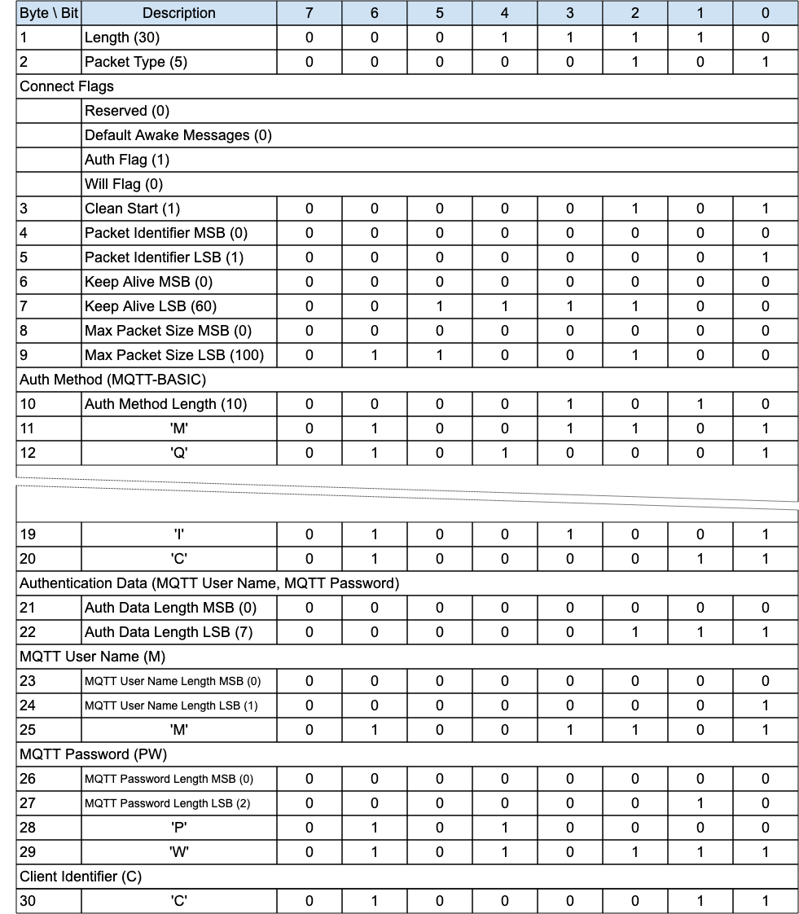{style="width: 624.00px; height: 713.33px; margin-left: 0.00px; margin-top: 0.00px; transform: rotate(0.00rad) translateZ(0px); -webkit-transform: rotate(0.00rad) translateZ(0px);"}]{style="overflow: hidden; display: inline-block; margin: 0.00px 0.00px; border: 0.00px solid #000000; transform: rotate(0.00rad) translateZ(0px); -webkit-transform: rotate(0.00rad) translateZ(0px); width: 624.00px; height: 713.33px;"}

[To support the equivalent of the MQTT ]{.c9}[User Name]{.c9}[ and
Password together with MQTT Enhanced Authentication, in the CONNECT
packet do the following:]{.c2}

- [Set the ]{.c9}[[Authentication Method](#h.4ydjyi9y5y20){.c4}]{.c6
  .c9}[ field to MQTT-ENHANCED.]{.c2}
- [Set the ]{.c9}[[Authentication Data](#h.g9mib2nvvlzy){.c4}]{.c6
  .c9}[ field to:]{.c2}

1.  [MQTT User Name: a Two Byte Integer length followed by a UTF-8
    Encoded String as defined in ]{.c9}[[1.7.4 UTF-8 Encoded
    String](#h.49x2ik5){.c4}]{.c6}[.]{.c2}
2.  [MQTT ]{.c9}[Password: a Two Byte Integer length followed by binary
    data.]{.c2}
3.  [MQTT Authentication Method: a Two Byte Integer length followed by a
    UTF-8 Encoded String as defined in ]{.c9}[[1.7.4 UTF-8 Encoded
    String](#h.49x2ik5){.c4}]{.c6}[ .]{.c2}
4.  [MQTT Authentication Data: a Two Byte Integer length followed by
    binary data.]{.c2}

[In any subsequent AUTH and CONNACK packets of the authentication
exchange:]{.c2}

1.  [The MQTT User Name and MQTT Password fields MUST not be
    included.]{.c2}
2.  [The Authentication Method MUST remain MQTT-ENHANCED
    throughout.]{.c9}

## [4.12 Handling errors]{.c17 .c19} {#h.v8vlgf6xm72a .c20}

### [4.12.1 Malformed Packet and Protocol Errors]{.c38 .c17 .c32} {#h.kbby30dtgah8 .c20}

[Definitions of Malformed Packet and Protocol Errors are contained in
]{.c9}[[1.3 Terminology](#h.17dp8vu){.c4}]{.c6}[, some but not all of
these error cases are noted throughout the specification. The rigor with
which a Client or Server checks an MQTT-SN Control Packet it has
received will be a compromise between:]{.c2}

- [The size of the Client or Server implementation.]{.c2}
- [The capabilities that the implementation supports.]{.c2}
- [The degree to which the receiver trusts the sender to send correct
  Control Packets.]{.c2}
- [The degree to which the receiver trusts the network to deliver
  Control Packets correctly.]{.c2}
- [The consequences of continuing to process a packet that is
  incorrect.]{.c2}

[If the sender is compliant with this specification it will not send
Malformed Packets or cause Protocol Errors. ]{.c9}[The Reason Codes used
for Malformed Packet and Protocol Errors include:]{.c9}

- [0x81        Malformed Packet]{.c2}
- [0x82         Protocol Error]{.c2}
- [0x93         Receive Maximum exceeded]{.c2}
- [0x95         Packet too large]{.c2}

[When a Client detects a Malformed Packet or Protocol Error associated
with a Virtual Connection it SHOULD send a DISCONNECT packet containing
an appropriate Reason Code and MUST delete the associated Virtual
Connection]{.c1}[ ]{.c30}[\[MQTT-4.12.1-1\].]{.c35}[ Use Reason Code
0x81 (Malformed Packet) or 0x82 (Protocol Error) unless a more specific
Reason Code has been defined in ]{.c9}[[2.3 Reason
Code](#h.46r0co2){.c4}]{.c6}[.]{.c2}

[When a Server detects a Malformed Packet or Protocol Error for any
packet except ADVERTISE, SEARCHGW, GWINFO, ]{.c1}[PUBWOS ]{.c1}[and
CONNECT, the Server MAY]{.c1}[ ]{.c1}[send a DISCONNECT packet with an
appropriate Reason Code]{.c1}[ and MUST delete the associated Virtual
Connection if one exists]{.c1}[ ]{.c9}[\[MQTT-4.12.1-]{.c9
.c35}[2]{.c35}[\].]{.c9 .c35}[ In the case of an error in a CONNECT
packet it MAY send a CONNACK packet containing the Reason Code. Use
Reason Code 0x81 (Malformed Packet) or 0x82 (Protocol Error) unless a
more specific Reason Code has been defined in ]{.c9}[[2.3 Reason
Code](#h.46r0co2){.c4}]{.c6}[.]{.c9}[ There are no consequences for
other Sessions.]{.c2}

[If either the Server or Client omits to check some feature of a Control
Packet, it might fail to detect an error, consequently it might allow
data to be damaged.]{.c2}

### [4.12.2 Other errors]{.c38 .c17 .c32} {#h.j0ufrffgt029 .c20}

[Errors other than Malformed Packet and Protocol Errors cannot be
anticipated by the sender because the receiver might have constraints
which it has not communicated to the sender. A receiving Client or
Server might encounter a transient error, such as a shortage of memory,
that prevents successful processing of an individual Control
Packet.]{.c2}

[Acknowledgment packets PUBACK, PUBREC, PUBREL, PUBCOMP, REGACK, SUBACK,
UNSUBACK with a Reason Code of 0x80 or greater indicate that the
received packet, identified by a Packet Identifier, was in error. There
are no consequences for other Sessions or other Packets flowing on the
same Session.]{.c2}

[The ]{.c30 .c49}[CONNACK]{.c30 .c49}[ and DISCONNECT packets allow a
Reason Code of 0x80 or greater to indicate that the Virtual Connection
will be delete]{.c30 .c49}[d]{.c30 .c49}[. If a Reason Code of 0x80 or
greater is specified, then the Virtual Connection MUST be delete]{.c30
.c49}[d ]{.c30 .c49}[whether or not the ]{.c30 .c49}[CONNACK]{.c30
.c49}[ or DISCONNECT is sent]{.c30 .c49}[ ]{.c49}[\[MQTT-4.1]{.c35
.c49}[2]{.c35}[.2-1\]]{.c35 .c49}[. Sending one of these Reason Codes
has no consequences for any other Session.]{.c2}

[If the Control Packet contains multiple errors the receiver of the
Packet can validate the Packet in any order and take the appropriate
action for any of the errors found.]{.c2}

[Refer to ]{.c49}[[5.4.9 Handling of Disallowed Unicode code
points](#h.wh4qb21u9cfo){.c4}]{.c6 .c49}[ for information about handling
Disallowed Unicode code points.]{.c2}

## [4.13 Retained Messages]{.c19 .c17} {#h.ly7c1y .c20}

[If the RETAIN flag is set to 1 in a PUBLISH or PUBWOS packet received
by a Server, the Server MUST replace any existing Retained Message for
this topic and store the Application
Message]{.c1}[ ]{.c9}[\[MQTT-SN-4.13-1\]]{.c9 .c35}[, so that it can be
delivered to future subscribers whose subscriptions match its Topic
Name. ]{.c9}[If the Publish Data contains zero bytes it is processed
normally by the Server but any retained message with the same topic name
MUST be removed and any future subscribers for the topic will not
receive a retained message]{.c1}[ ]{.c9}[\[MQTT-SN-4.13-2\]]{.c9 .c35}[.
]{.c9}[A Retained Message with a Publish Data containing zero bytes MUST
NOT be stored as a Retained Message on the
Server]{.c1}[ ]{.c9}[\[MQTT-SN-4.13-3\]]{.c9 .c35}[.]{.c2}

[If the RETAIN flag is 0 in a PUBLISH packet sent by a Client to a
Server, the Server MUST NOT store the message as a Retained Message and
MUST NOT remove or replace any existing Retained
Message]{.c1}[ ]{.c9}[\[MQTT-SN-4.13-4\]]{.c9 .c35}[.]{.c2}

[When a new Subscription is made, the last retained message, if any, on
each matching topic name is sent to the Client as directed by the Retain
Handling Subscribe Flag. These messages are sent with the RETAIN flag
set to 1. Which retained messages are sent is controlled by the Retain
Handling Subscribe Flag. At the time of the Subscription:]{.c2}

- [If Retain Handling is set to 0 the Server MUST send the retained
  messages matching the Topic Filter of the subscription to the
  Client]{.c1}[ ]{.c9}[\[MQTT-SN-4.13-5\]]{.c9 .c35}[.]{.c2}
- [If Retain Handling is set to 1 then if the subscription did not
  already exist, the Server MUST send all retained messages matching the
  Topic Filter of the subscription to the Client, and if the
  subscription did exist the Server MUST NOT send the retained
  messages.]{.c1}[ ]{.c9}[\[MQTT-SN-4.13-6\]]{.c9 .c35}[.]{.c2}
- [ ]{.c49 .c306}[If Retain Handling is set to 2, the Server MUST NOT
  send the retained messages]{.c1}[ ]{.c9}[\[MQTT-SN-4.13-7\]]{.c9
  .c35}[.]{.c2}

[Refer to ]{.c9}[[3.7.2 SUBSCRIBE Flags](#h.261ztfg){.c4}]{.c6}[ for a
definition of the Subscription Flags.]{.c2}

[If the Server receives a PUBLISH packet with the RETAIN flag set to 1,
and QoS 0 it SHOULD store the new QoS 0 message as the new retained
message for that topic, but MAY choose to discard it at any time. If
this happens there will be no retained message for that topic.]{.c2}

[The setting of the RETAIN flag in an Application Message forwarded by
the Server from an established Virtual Connection is controlled by the
Retain As Published subscription option. Refer to ]{.c9}[[3.7.2
SUBSCRIBE Flags](#h.261ztfg){.c4}]{.c6}[ for a definition of the
Subscription Flags.]{.c2}

- [If the value of Retain As Published subscription option is set to 0,
  the Server MUST set the RETAIN flag to 0 when forwarding an
  Application Message regardless of how the RETAIN flag was set in the
  received PUBLISH packet]{.c1}[ ]{.c9}[\[MQTT-SN-4.]{.c9
  .c35}[13]{.c35}[-]{.c9 .c35}[8]{.c35}[\]]{.c9 .c35}[.]{.c2}
- [If the value of Retain As Published subscription option is set to 1,
  the Server MUST set the RETAIN flag equal to the RETAIN flag in the
  received PUBLISH packet]{.c1}[ ]{.c9}[\[MQTT-SN-4.]{.c9
  .c35}[13]{.c35}[-9\]]{.c9 .c35}[.]{.c2}

[Informative comment]{.c16 .c75 .c44 .c32 .c49}

[Retained messages are useful where publishers send state messages on an
irregular basis. A new subscriber will receive the most recent
state.]{.c2}

[Informative comment]{.c16 .c75 .c44 .c32 .c49}

[As in MQTT 3.1.1 there is no notion of message expiry in MQTT-SN,
including expiry of Retained Messages. It is an administrative decision
under what conditions to remove Retained Messages, if at all. They
should be kept long enough to support the expectations of the
applications that will use the Server, at a minimum. ]{.c9}

------------------------------------------------------------------------

## [4.14 Client states]{.c19 .c17} {#h.3mj2wkv .c155 .c93 .c87 .c90}

[At any time, a Client will be in one of the following]{.c9}[ ]{.c75
.c44 .c49}[states]{.c9}[ from the perspective of the
]{.c9}Server[:]{.c2}

[Figure 4-7 -- Client States]{.c36 .c100}

+-----------------------+----------------------------+-----------------------+
| [State]{.c0}          | [State Description]{.c0}   | [Possible             |
|                       |                            | Transitions]{.c0}     |
+-----------------------+----------------------------+-----------------------+
| [None]{.c16 .c127     | [The Client is unknown to  | [Active]{.c16 .c75    |
| .c75 .c44 .c49}       | the Server. There is no    | .c44 .c32 .c49}       |
|                       | Session State nor Virtual  |                       |
|                       | Connection.]{.c2}          |                       |
|                       |                            |                       |
|                       | [A Client may transition   |                       |
|                       | from here to               |                       |
|                       | ]{.c27}[Active]{.c75       |                       |
|                       | .c44}[ with a              |                       |
|                       | CONNECT.]{.c27}            |                       |
+-----------------------+----------------------------+-----------------------+
| [Disconnected]{.c16   | [The Client is considered  | [Active]{.c16 .c75    |
| .c127 .c75 .c44 .c49} | offline and not able to    | .c44 .c32 .c49}       |
|                       | receive packets until it   |                       |
|                       | has re-established a       | [None]{.c16 .c75 .c44 |
|                       | session with the Server by | .c32 .c49}            |
|                       | way of a CONNECT. The      |                       |
|                       | Server has Session state   |                       |
|                       | for this Client, but there |                       |
|                       | is no Virtual              |                       |
|                       | Connection.]{.c27}         |                       |
|                       |                            |                       |
|                       | [A Client may transition   |                       |
|                       | from here to               |                       |
|                       | ]{.c27}[Active]{.c75       |                       |
|                       | .c44}[ with a CONNECT, or  |                       |
|                       | to ]{.c27}[None]{.c75      |                       |
|                       | .c44}[ on Session          |                       |
|                       | expiry.]{.c27}             |                       |
+-----------------------+----------------------------+-----------------------+
| [Active]{.c16 .c127   | [The Client is actively    | [Asleep]{.c16 .c75    |
| .c75 .c44 .c49}       | engaged in the Session. A  | .c44 .c32 .c49}       |
|                       | Virtual Connection exists. |                       |
|                       | It should be able to send  | [Disconnected]{.c16   |
|                       | and receive packets. Its   | .c75 .c44 .c32 .c49}  |
|                       | state is supervised by the |                       |
|                       | Server with the associated |                       |
|                       | Keep Alive timer.]{.c2}    |                       |
|                       |                            |                       |
|                       | [A Client may transition   |                       |
|                       | from here to               |                       |
|                       | ]{.c27}[Asleep]{.c75       |                       |
|                       | .c44}[ by way of a         |                       |
|                       | SLEEPREQ or                |                       |
|                       | ]{.c27}[Disconnected]{.c75 |                       |
|                       | .c44}[ by way of a         |                       |
|                       | DISCONNECT, Keep Alive     |                       |
|                       | timeout or Retry           |                       |
|                       | timeout]{.c27}[.]{.c75     |                       |
|                       | .c44}                      |                       |
+-----------------------+----------------------------+-----------------------+
| [Asleep]{.c127 .c75   | [The Client is engaged in  | [Awake]{.c16 .c75     |
| .c44}                 | an ongoing Session, and a  | .c44 .c32 .c49}       |
|                       | Virtual Connection exists. |                       |
|                       | The Client cannot receive  | [Active]{.c16 .c75    |
|                       | Packets (except possibly   | .c44 .c32 .c49}       |
|                       | the WAKEUP hint); it can   |                       |
|                       | send Packets. The Server   | [Disconnected]{.c16   |
|                       | should not expect a        | .c75 .c44 .c32 .c49}  |
|                       | response from the client   |                       |
|                       | in this state.]{.c2}       |                       |
|                       |                            |                       |
|                       | [A Client may transition   |                       |
|                       | from here to ]{.c27}[Awake |                       |
|                       | ]{.c75 .c44}[(by way of    |                       |
|                       | PINGREQ),                  |                       |
|                       | ]{.c27}[Active]{.c75       |                       |
|                       | .c44}[ by way of CONNECT,  |                       |
|                       | ]{.c27}[Disconnected]{.c75 |                       |
|                       | .c44}[ (by way of          |                       |
|                       | DISCONNECT, Sleep timeout  |                       |
|                       | or ]{.c27}[Retry           |                       |
|                       | timeout]{.c27}[). ]{.c2}   |                       |
|                       |                            |                       |
|                       | [The Server may send a     |                       |
|                       | WAKEUP packet to the       |                       |
|                       | Client, as an indication   |                       |
|                       | that messages are          |                       |
|                       | waiting - it is up to the  |                       |
|                       | Client to act, if it is    |                       |
|                       | even able to notice        |                       |
|                       | it.]{.c2}                  |                       |
+-----------------------+----------------------------+-----------------------+
| [Awake]{.c16 .c127    | [The Client is             | [Asleep]{.c16 .c75    |
| .c75 .c44 .c49}       | ]{.c27}[partially          | .c44 .c32 .c49}       |
|                       | ]{.c27}[engaged in an      |                       |
|                       | ongoing session and a      | [Active]{.c16 .c75    |
|                       | Virtual Connection         | .c44 .c32 .c49}       |
|                       | exists.]{.c2}              |                       |
|                       |                            | [Disconnected]{.c16   |
|                       | [The client transitions    | .c75 .c44 .c32 .c49}  |
|                       | back to the                |                       |
|                       | ]{.c27}[Asleep]{.c75       | []{.c16 .c75 .c44     |
|                       | .c44}[ state on receipt of | .c32 .c49}            |
|                       | a PINGRESP packet or       |                       |
|                       | ]{.c27}[Disconnected]{.c75 |                       |
|                       | .c44}[ (by way of          |                       |
|                       | DISCONNECT, or on Keep     |                       |
|                       | Alive or ]{.c27}[Retry     |                       |
|                       | timeout]{.c27}[ for the    |                       |
|                       | possible PUBACK, PUBREL,   |                       |
|                       | PUBREC, PUBCOMP or REGACK  |                       |
|                       | packets to be received     |                       |
|                       | from the Client). The      |                       |
|                       | Client may also move to    |                       |
|                       | the ]{.c27}[Active ]{.c75  |                       |
|                       | .c44}[state by way of      |                       |
|                       | CONNECT.]{.c2}             |                       |
+-----------------------+----------------------------+-----------------------+

[A ]{.c1}[Server]{.c30}[ ]{.c1}[MUST NOT]{.c75 .c44 .c30 .c49}[ attempt
to send packets to a Disconnected Client]{.c1}[ ]{.c44
.c30}[\[MQTT-SN-4.14-1\]]{.c35}.

[Any packet except CONNECT received from a Disconnected Client MUST NOT
be processed]{.c1}[ ]{.c30}[\[MQTT-SN-4.14-2\]]{.c35}. [A DISCONNECT
with error should be sent in response, unless the packet received is
PUBWOS.]{.c2}

[In the Asleep state, a Client MUST only send PINGREQ, CONNECT or
DISCONNECT packets to the ]{.c1}[Server
]{.c30}[\[MQTT-SN-4.14-3\]]{.c35}.

[In the Awake state, a Client MUST not send ANY packets other than those
involved in the receipt of PUBLISH packets (PUBACK, PUBREC, PUBCOMP,
REGACK) or CONNECT or DISCONNECT]{.c1} [\[MQTT-SN-4.14-4\]]{.c35}.

[Whenever a CONNECT is received by a Server, any existing Virtual
Connection for that Client MUST be deleted and a new one created with
all CONNECT Packet processing, regardless of the state of the Client
]{.c30}[\[MQTT-SN-4.14-5\]]{.c35}.

[Transition through these states is governed by a sequence of packets
between Client and ]{.c9}Server[ and mediated by
]{.c9}[[timers](#h.qfa0p4gzzbmu){.c4}]{.c6 .c9}[ resident on the
]{.c9}Server[. A Client is in the Active]{.c9}[ ]{.c9 .c36}[state when
the ]{.c9}Server[ receives a CONNECT packet from that Client. This state
is supervised by the ]{.c9}Server[ with the ]{.c9}[[3.1.6 Keep
Alive](#h.4h042r0){.c4}]{.c6}[ timer. If the ]{.c9}Server[ does not
receive any packet from the Client in a defined perio]{.c9}d, [the
]{.c9}Server[ will consider that client as Disconnected]{.c9}[ ]{.c9
.c36}[and delete the Virtual Connection. The Disconnected state is
governed by the Session Expiry timer - on expiry the ]{.c9}Server[ is
free to remove the Client session. A Client moves into the Asleep state
by issuing a SLEEPREQ packet]{.c9}.[ ]{.c9}[T]{.c9}o be certain that the
Server has also recorded the Client as being asleep, the Client
[needs]{.c9} to wait [for a positive SLEEPRESP respon]{.c9}se[. For more
information on the Asleep state, refer to ]{.c9}[[4.14.2 Sleeping
Clients](#h.pj8yyjomhafn){.c4}]{.c6}[.]{.c2}

See [[C.5 Client State Diagrams](#h.gc2bf5yxnvwt){.c4}]{.c6} for
informative state diagrams to help illustrate these transitions.

[Informative Comment]{.c16 .c75 .c44 .c32 .c49}

[In MQTT-SN 1.2 there existed a Lost state, which was identical to the
Disconnected state, except that it was reached by a timer expiry on the
]{.c9}Server[ rather than an explicit Disconnect request from the
Client. As the Lost state was not really different from Disconnected
except for the history of Client events, similar information may be kept
by the ]{.c9}Server[, in for instance its administrative logs.]{.c2}

### [4.14.1 Session Timers]{.c38 .c17 .c32} {#h.qfa0p4gzzbmu .c20}

[The following timers are used by ]{.c9}Server[s, on a per Client basis,
to handle Client states, and by Clients to direct their actions. In
general, Clients are able to infer the Server's view of their state by
observing the Server's response. ]{.c2}

------------------------------------------------------------------------

[]{.c27 .c111 .c36 .c164 .c32 .c100}

[Figure 4-8 -- Session Timers]{.c36 .c100}

+----------------+---------------------+---------------------+----------------------+--------------------------------------+
| [Timer         | [State(s)]{.c0}     | [Timeout            | [Defined in]{.c0}    | [Information]{.c0}                   |
| Name]{.c0}     |                     | State]{.c0}         |                      |                                      |
+----------------+---------------------+---------------------+----------------------+--------------------------------------+
| [Keep          | [Active]{.c2}       | [Disconnected]{.c2} | [CONNECT]{.c2}       | [[3.1.6 Keep                         |
| Alive]{.c16    |                     |                     |                      | Alive](#h.4h042r0){.c4}]{.c6}        |
| .c9 .c127}     |                     |                     |                      |                                      |
+----------------+---------------------+---------------------+----------------------+--------------------------------------+
| [Sleep         | [Asleep]{.c2}       | [Disconnected]{.c2} | [SLEEPREQ]{.c2}      | [[4.14.2 Sleeping                    |
| Duration]{.c16 |                     |                     |                      | Clients](#h.pj8yyjomhafn){.c4}]{.c6} |
| .c9 .c127}     |                     |                     |                      |                                      |
+----------------+---------------------+---------------------+----------------------+--------------------------------------+
| [Session       | [Disconnected]{.c2} | [None]{.c2}         | [CONNECT,            | [[4.1.1 Storing Session              |
| Expiry]{.c16   |                     |                     | DISCONNECT]{.c2}     | State](#h.nasxg3iedd75){.c4}]{.c6}   |
| .c9 .c127}     |                     |                     |                      |                                      |
+----------------+---------------------+---------------------+----------------------+--------------------------------------+
| [Retry]{.c16   | [Active,            | [Disconnected]{.c2} | [Sender]{.c2}        | [[4.4 Packet delivery                |
| .c9 .c127}     | Awake,]{.c2}        |                     |                      | retry](#h.6udnv5yl5cv5){.c4}]{.c6}   |
|                |                     |                     | [configuration]{.c2} |                                      |
|                | [Asleep]{.c2}       |                     |                      |                                      |
+----------------+---------------------+---------------------+----------------------+--------------------------------------+

[For example values of these timers, see ]{.c9}[[C.3 Example Timer and
Counter Values](#h.b7gl7rjnh27t){.c4}]{.c6}[.]{.c9}

### [4.14.2 Sleeping Clients]{.c38 .c17 .c32} {#h.pj8yyjomhafn .c93 .c200 .c87 .c90 .c289}

[The Asleep state is intended to allow Clients, which ]{.c9}[may be
running on battery powered devices]{.c9}[, to save as much energy as
possible. These Clients enter a low-power mode when they are not active,
and will wake when they have data to send or receive. ]{.c9}[The
]{.c27}Server[ needs to be aware of the sleeping state of these Clients
and buffer messages destined for them, so that they may be delivered
when the Clients wake up.]{.c27}

[To go to sleep, a Client sends a SLEEPREQ packet containing a Sleep
Duration in seconds. ]{.c9}[The ]{.c9}Server[ acknowledges that packet
with a SLEEPRESP Packet ]{.c9}including a successful Reason Code,[ and
considers the Client to be Asleep. ]{.c9}

[If the Server does not receive an MQTT-SN Control Packet from ]{.c1}[an
Asleep]{.c30}[ Client within one and a half times the Sleep Duration, it
MUST delete the Virtual Connection to the
Client]{.c1}[ ]{.c30}[\[MQTT-SN-4.14.2-1\]]{.c35}.[ The Client will then
be considered to be Disconnected.]{.c2}

[During the Asleep]{.c1}[ ]{.c1 .c36}[state, packets that need to be
sent to the client are buffered at the ]{.c1}[Server]{.c30}[. The
]{.c1}[Server]{.c30}[ MUST buffer Application Messages of QoS 1 and
2]{.c1}[ ]{.c30}[\[MQTT-SN-4.14.2-2\]]{.c35}.

[Informative comment]{.c16 .c75 .c44 .c32 .c49}

[The ]{.c9}Server[ may ]{.c9}[choose]{.c9 .c36}[ to buffer messages of
QoS 0 while the Client is in the Asleep state.]{.c2}

[The Client wakes by sending a PINGREQ. ]{.c9}[If the
]{.c3}[Server]{.c12}[ has buffered ]{.c3}[packet]{.c9}[s for the Client,
it will send them to the Client, acknowledging the ]{.c3}[Default Awake
Messages]{.c9}[ value sent in the ]{.c3}[CONNECT
]{.c9}[packet.]{.c3}[ If the number of messages buffered on the ]{.c3
.c30}[Server]{.c12 .c30}[ waiting to be sent exceeds the value specified
by the client in the ]{.c3 .c30}[Default Awake Messages]{.c1}[ field,
the ]{.c3 .c30}[Server]{.c12 .c30}[ MUST send only the ]{.c3
.c30}[Default Awake Messages]{.c1}[ value number of messages ]{.c3
.c30}[\[MQTT-SN-4.14.2-3\]]{.c35}.[ ]{.c3 .c17 .c32}

[It cuts short the AWAKE cycle, and MUST respond with a PINGRESP with a
messages-left value of either the number of messages remaining in the
]{.c3 .c30}[Server]{.c12 .c30}[ buffer or 0xFFFF (meaning undetermined
number of messages greater than 0 remaining)]{.c3 .c30}[ ]{.c12
.c30}[\[MQTT-SN-4.14.2-4\]]{.c35}.

[During the Awake state, for each Application Message the ]{.c3
.c30}[Server]{.c12 .c30}[ sends to the Client, the ]{.c3
.c30}[application messages']{.c1}[ quality of service MUST be ]{.c3
.c30}[honored - ]{.c1}[a full ]{.c3 .c30}[packet]{.c1}[ interaction MUST
take place including all normative phases of acknowledgement, including
any associated retransmission logic]{.c3 .c30}[ ]{.c12
.c30}[\[MQTT-SN-4.14.2-5\]]{.c35}.

[If, during the delivery of Application Messages from the ]{.c3
.c30}[Server]{.c12 .c30}[ to the Client, and apply]{.c3 .c30}[ing the
]{.c12 .c30}[[retry logic](#h.17nz8yj){.c4}]{.c6 .c30}[,]{.c12
.c30}[ ]{.c12 .c30}[the ]{.c3 .c30}[Server]{.c12 .c30}[ gets no
response,]{.c3 .c30}[ it MUST consider the Client disconnected and ]{.c3
.c30}[delete the Virtual Connection ]{.c12
.c30}[\[MQTT-SN-4.14.2-6\]]{.c35}. [I]{.c12 .c30}[t may]{.c12}[ send a
DISCONNECT packet with an appropriate Reason Code.]{.c3}

[The transfer of ]{.c3}[packet]{.c9}[s to the Client is closed by the
]{.c3}[Server]{.c12}[ by means of a PINGRESP ]{.c3}[packet.]{.c9}[ That
is, the ]{.c3}[Server]{.c12}[ will consider the Client as
Asleep]{.c3}[ ]{.c3 .c36}[and restart the Sleep Duration timer after
having sent the PINGRESP ]{.c3}[packet]{.c9}[. ]{.c3}[If the ]{.c3
.c30}[Server]{.c12 .c30}[ does not have any ]{.c3 .c30}[packet]{.c1}[s
buffered for the client, it MUST respond immediately with a PINGRESP
]{.c3 .c30}[packet ]{.c1}[\[MQTT-SN-4.14.2-7\]]{.c35}[, returning the
Client back to the Asleep]{.c3}[ ]{.c3 .c36}[state, and
]{.c3}[restarting]{.c12}[ the Sleep Duration timer for that Client.
]{.c3 .c17 .c32}

[After having sent the PINGREQ to the ]{.c3}[Server]{.c12}[, the Client
uses the retransmission procedure of ]{.c3}[[4.4 Packet delivery
retry](#h.6udnv5yl5cv5){.c4}]{.c6 .c9}[ to supervise the arrival of
]{.c3}[packet]{.c9}[s sent by the ]{.c3}[Server]{.c12}[. To avoid
draining its battery due to excessive retransmission of the PINGREQ
]{.c3}[packet]{.c9}[, the Client should limit the retransmission with a
Maximum Retry Count, and go back to sleep when the limit is reached.
]{.c3 .c17 .c32}

[At ]{.c3}[some point after several Awake periods without any response
from the Server, a Client might decide that it needs to try to connect
to a different Server. The Client might send a DISCONNECT Packet to try
to notify the original Server, or just delete its Virtual Connection.
 ]{.c12}

[From the ]{.c3}[Asleep]{.c3 .c36}[ ]{.c9 .c36}[state, a client can
]{.c3}[move]{.c12}[ to the ]{.c3}[Active ]{.c3 .c36}[state by sending a
CONNECT ]{.c3}[packet]{.c9}[ or to the ]{.c3}[Disconnected ]{.c3
.c36}[state by sending a DISCONNECT ]{.c3}[packet]{.c9}[. ]{.c3}[The
Client can also modify its sleep configuration by sending a SLEEPREQ
P]{.c3}[acket]{.c9}[ with a new value of Sleep Duration.]{.c3}[ ]{.c3
.c17 .c32}

[Note that a sleeping Client should go to the ]{.c3}[Awake ]{.c3
.c36}[state only if it wants to check whether the
]{.c3}[Server]{.c12}[ has any Application
M]{.c3}[essages]{.c9}[ buffered for it and return as soon as possible to
the ]{.c3}[Asleep ]{.c3 .c36}[state without sending any
]{.c3}[packet]{.c9}[s to the ]{.c3}[Server]{.c12}[ (other ]{.c3}[than
PUBACK, PUBREC, PUBCOMP or REGACK)]{.c12}[. ]{.c3}[If it wants to do
more than this,]{.c12}[ it ]{.c3}[needs to create a new Virtual
Connection ]{.c12}[by sending a CONNECT ]{.c3}[packet]{.c9}[ to the
]{.c3}[Server]{.c12}[.
]{.c3}^[\[p\]](#cmnt16){#cmnt_ref16}[\[q\]](#cmnt17){#cmnt_ref17}[\[r\]](#cmnt18){#cmnt_ref18}^

[Session ]{.c3}[Topic Aliases last for the duration of a Session which
exists throughout the sleep cycle. However, if the Client wants to save
storage by removing the Session Topic Aliases while Asleep,
i]{.c3}[t]{.c12}[ can set the Retain Topic Aliases flag on the SLEEPREQ
packet to 0. The disadvantage being that during the Awake state, Session
Topic Aliases will have to be recreated, or Topic Names used instead,
increasing network data usage. ]{.c3}

------------------------------------------------------------------------

[]{.c27 .c111 .c36 .c164 .c32 .c100}

[]{.c27 .c111 .c36 .c164 .c32 .c100}

[Figure 4-9 -- Awake PINGRESP Packet flush]{.c36 .c100}

[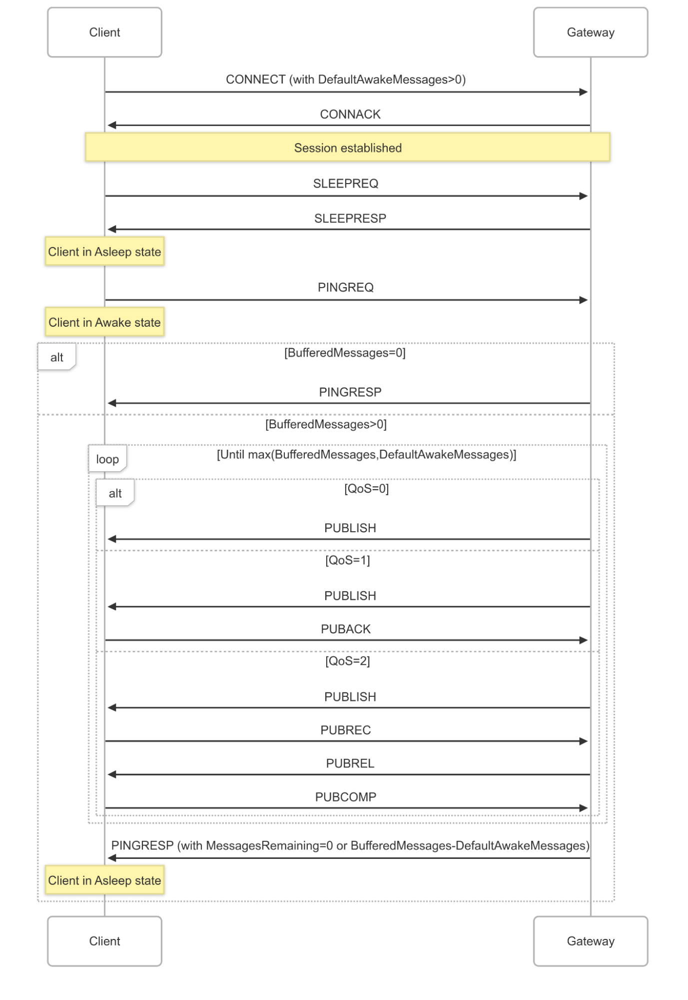{style="width: 492.61px; height: 715.50px; margin-left: -24.75px; margin-top: 0.00px; transform: rotate(0.00rad) translateZ(0px); -webkit-transform: rotate(0.00rad) translateZ(0px);"}]{style="overflow: hidden; display: inline-block; margin: 0.00px 0.00px; border: 0.00px solid #000000; transform: rotate(0.00rad) translateZ(0px); -webkit-transform: rotate(0.00rad) translateZ(0px); width: 443.11px; height: 715.50px;"}

## [4.15 Optional Features]{.c19 .c17} {#h.mo7ahow0t2fa .c20}

[Support for the ADVERTISE, SEARCHGW, GWINFO and PUBWOS packet types is
optional. ]{.c2}

[The Forwarder Encapsulation packet type support is optional. For
instance, it is not required if the MQTT-SN Clients are able to directly
reach an MQTT-SN ]{.c9}Server[.]{.c2}

[The Protection Encapsulation packet type support is optional. For
instance, it is not required if the MQTT-SN ]{.c9}Server[ and the
MQTT-SN Clients interact over a secure communication channel, such as
DTLS, or any communication channel assuring the authenticity and
optionally the confidentiality]{.c9} of MQTT-SN data[. ]{.c2}

# 5 Security (Informative) {#h.ao41zqqg0txn .c192 .c200 .c87 .c90 .c235}

## [5.1 Introduction]{.c19 .c17} {#h.2w9qaq2wvr46 .c20}

[MQTT-SN is a transport protocol specification for message transmission,
allowing implementers a choice of network, privacy, authentication and
authorization technologies. Since the exact security technologies chosen
will be context specific, it is the implementer\'s responsibility to
include the appropriate features as part of their design.]{.c3 .c17}

[MQTT-SN solutions are likely to also include MQTT communications - this
section should be read alongside the Security chapters in the MQTT
standards: ]{.c27 .c12}[[MQTT
3.1.1](https://www.google.com/url?q=https://docs.oasis-open.org/mqtt/mqtt/v3.1.1/os/mqtt-v3.1.1-os.html&sa=D&source=editors&ust=1759864763995578&usg=AOvVaw07vWjYKf09IQULFgMZwpT1){.c4}]{.c6
.c27}[ and ]{.c27 .c12}[[MQTT
5.0](https://www.google.com/url?q=https://docs.oasis-open.org/mqtt/mqtt/v5.0/mqtt-v5.0.html&sa=D&source=editors&ust=1759864763995725&usg=AOvVaw25q9uEH2XYmtBa5WQ7OI69){.c4}]{.c6
.c27}[.]{.c3 .c17}

[MQTT-SN implementations will likely need to keep pace with an evolving
security landscape. This Chapter provides general implementation
guidance so as not to restrict choices available. Examples of threats
that solution providers should consider are:]{.c3 .c17}

- [Devices could be compromised]{.c3 .c17}
- [Data at rest in Clients and Servers might be accessible]{.c3 .c17}
- [Protocol behaviors could have side effects - "timing attacks" for
  example]{.c3 .c17}
- [Denial of Service (DoS) attacks]{.c3 .c17}
- [Communications could be intercepted, altered, re-routed or
  disclosed]{.c3 .c17}
- [Injection of spoofed MQTT-SN Control Packets]{.c3 .c17}

[When MQTT-SN solutions are deployed in hostile communication
environments, implementations will often need to provide mechanisms
for:]{.c3 .c17}

- [Authentication of users and devices]{.c3 .c17}
- [Authorization of access to Server resources]{.c3 .c17}
- [Integrity of MQTT-SN Control Packets and application data contained
  therein]{.c3 .c17}
- [Privacy of MQTT-SN Control Packets and application data contained
  therein ]{.c3 .c17}

[In addition to technical security issues there could also be geographic
(for example U.S.-EU Privacy Shield Framework]{.c27
.c12}[[ ](https://www.google.com/url?q=https://docs.oasis-open.org/mqtt/mqtt/v5.0/cos02/mqtt-v5.0-cos02.html%23USEUPRIVSH&sa=D&source=editors&ust=1759864763997170&usg=AOvVaw3YTVhifD-AQGNeLjv0qyzn){.c4}]{.c27
.c12}[[\[USEUPRIVSH\]](https://www.google.com/url?q=https://docs.oasis-open.org/mqtt/mqtt/v5.0/cos02/mqtt-v5.0-cos02.html%23USEUPRIVSH&sa=D&source=editors&ust=1759864763997281&usg=AOvVaw3ukzwGSLtBCJrGyJPUjCuo){.c4}]{.c6
.c27}[), industry specific (for example PCI DSS]{.c27
.c12}[[ ](https://www.google.com/url?q=https://docs.oasis-open.org/mqtt/mqtt/v5.0/cos02/mqtt-v5.0-cos02.html%23PCIDSS&sa=D&source=editors&ust=1759864763997429&usg=AOvVaw2aUhdXOTfhDjwwwk9kQLLF){.c4}]{.c27
.c12}[[\[PCIDSS\]](https://www.google.com/url?q=https://docs.oasis-open.org/mqtt/mqtt/v5.0/cos02/mqtt-v5.0-cos02.html%23PCIDSS&sa=D&source=editors&ust=1759864763997522&usg=AOvVaw0ATd5kUOyFEZ8sVqUKOQDS){.c4}]{.c6
.c27}[) and regulatory considerations (for example Sarbanes-Oxley]{.c27
.c12}[[ ](https://www.google.com/url?q=https://docs.oasis-open.org/mqtt/mqtt/v5.0/cos02/mqtt-v5.0-cos02.html%23SARBANES&sa=D&source=editors&ust=1759864763997684&usg=AOvVaw3t0VaVPVmHEaFCWB1l0PcG){.c4}]{.c27
.c12}[[\[SARBANES\]](https://www.google.com/url?q=https://docs.oasis-open.org/mqtt/mqtt/v5.0/cos02/mqtt-v5.0-cos02.html%23SARBANES&sa=D&source=editors&ust=1759864763997782&usg=AOvVaw1y__sjlLazIXbrYUuuCcS6){.c4}]{.c6
.c27}[).]{.c3 .c17}

## [5.2 MQTT-SN solutions: security and certification]{.c19 .c17} {#h.igt8todq2le2 .c20}

[An implementation might want to provide conformance with specific
industry security standards such as NIST Cyber Security Framework]{.c27
.c12}[[ ](https://www.google.com/url?q=https://docs.oasis-open.org/mqtt/mqtt/v5.0/cos02/mqtt-v5.0-cos02.html%23NISTCSF&sa=D&source=editors&ust=1759864763998159&usg=AOvVaw1Bo6qOnrswQRI7lhy0fIsx){.c4}]{.c27
.c12}[[\[NISTCSF\]](https://www.google.com/url?q=https://docs.oasis-open.org/mqtt/mqtt/v5.0/cos02/mqtt-v5.0-cos02.html%23NISTCSF&sa=D&source=editors&ust=1759864763998260&usg=AOvVaw0GIdpIWQxJlk-kJS4kHP_f){.c4}]{.c6
.c27}[, PCI-DSS]{.c27
.c12}[[ ](https://www.google.com/url?q=https://docs.oasis-open.org/mqtt/mqtt/v5.0/cos02/mqtt-v5.0-cos02.html%23PCIDSS&sa=D&source=editors&ust=1759864763998376&usg=AOvVaw3e1s5p-K_axSVpaXuo5rHW){.c4}]{.c27
.c12}[[\[PCIDSS\]](https://www.google.com/url?q=https://docs.oasis-open.org/mqtt/mqtt/v5.0/cos02/mqtt-v5.0-cos02.html%23PCIDSS&sa=D&source=editors&ust=1759864763998470&usg=AOvVaw0ptuxN9ChTe1Mokt5qN-0g){.c4}]{.c6
.c27}[), FIPS-140-3]{.c27
.c12}[[ ](https://www.google.com/url?q=https://docs.oasis-open.org/mqtt/mqtt/v5.0/cos02/mqtt-v5.0-cos02.html%23FIPS1402&sa=D&source=editors&ust=1759864763998586&usg=AOvVaw0X9Vr8_DZ-OSPz3rOWebdW){.c4}]{.c27
.c12}[[\[FIPS1403\]](https://www.google.com/url?q=https://docs.oasis-open.org/mqtt/mqtt/v5.0/cos02/mqtt-v5.0-cos02.html%23FIPS1402&sa=D&source=editors&ust=1759864763998717&usg=AOvVaw20U_Mow175TESCka1_A7TF){.c4}]{.c6
.c27}[ and Commercial National Security Algorithm Suite (CNSA) 2.0
]{.c27
.c12}[[\[CNSA20\]](https://www.google.com/url?q=https://media.defense.gov/2022/Sep/07/2003071834/-1/-1/0/CSA_CNSA_2.0_ALGORITHMS_.PDF&sa=D&source=editors&ust=1759864763998946&usg=AOvVaw1IXhcpvY9PNqPSJFY-3vXf){.c4}]{.c6
.c27}[. The use of industry proven, independently verified and certified
technologies will help meet compliance requirements.]{.c3 .c17}

## [5.3 Lightweight cryptography and constrained devices]{.c19 .c17} {#h.t81ayj7ar2ac .c20}

[MQTT-SN is targeted at the most power saving and constrained devices.
In contrast to MQTT where there is principally one underlying network
technology - TCP/IP - MQTT-SN is intended to be agnostic to the
underlying network as long as it conforms to the requirements outlined
in ]{.c27 .c12}[[4.2 Networks and Virtual
Connections](#h.fc1j1f7dq6oy){.c4}]{.c6}[. ]{.c3 .c17}

[Previous versions of MQTT-SN did not include specific security and
integrity features, preferring to leave that to the underlying network.
That approach is still supported, but to aid interoperability the
Protection Encapsulation is introduced, in ]{.c27 .c12}[[3.17 Protection
Encapsulation](#h.15cqrsoyxc87){.c4}]{.c6}[. In order to disassociate
the security model from the rest of the MQTT-SN specification, the
Protection Encapsulation allows all the packet types, including CONNECT,
to be wrapped in a security envelope. Furthermore the security material
is self-contained in each Protection Encapsulation envelope, so it is
completely decoupled from the Virtual Connection.]{.c3 .c17}

[The schemes defined by the Protection Encapsulation are especially
suited for implementation by constrained devices: ]{.c3 .c17}

- [HMAC and AES CMAC are widely adopted authentication only standard
  schemes.]{.c3 .c17}
- [The Advanced Encryption Standard]{.c27
  .c12}[[ ](https://www.google.com/url?q=https://docs.oasis-open.org/mqtt/mqtt/v5.0/cos02/mqtt-v5.0-cos02.html%23AES&sa=D&source=editors&ust=1759864764001014&usg=AOvVaw3uwxvtLX6Ei7xeVMepOLSb){.c4}]{.c27
  .c12}[[\[AES\]](https://www.google.com/url?q=https://docs.oasis-open.org/mqtt/mqtt/v5.0/cos02/mqtt-v5.0-cos02.html%23AES&sa=D&source=editors&ust=1759864764001145&usg=AOvVaw07uP5kzSAUR_yGQImdNoO7){.c4}]{.c6
  .c27}[ is the most widely adopted encryption algorithm. There is
  hardware support for AES in many processors, but not commonly for
  embedded processors. ]{.c3 .c17}
- [The encryption algorithm ChaCha20 \[]{.c27
  .c12}[[CHACHA20](https://www.google.com/url?q=https://docs.oasis-open.org/mqtt/mqtt/v5.0/cos02/mqtt-v5.0-cos02.html%23CHACHA20&sa=D&source=editors&ust=1759864764001483&usg=AOvVaw0zpYT43Io28FD0bxXSaFi6){.c4}]{.c6
  .c27}[\] encrypts and decrypts much faster in software, but is not as
  widely available as AES.]{.c3 .c17}

[The Protection Encapsulation approach is informed by the OSCORE \[RFC
8613\] standard and CBOR Initial Algorithms \[RFC 9053\] informational
document. The ISO 29192]{.c27
.c12}[[ ](https://www.google.com/url?q=https://docs.oasis-open.org/mqtt/mqtt/v5.0/cos02/mqtt-v5.0-cos02.html%23ISO29192&sa=D&source=editors&ust=1759864764001857&usg=AOvVaw23xieCm3t1Rvp7aQabDZ9k){.c4}]{.c27
.c12}[[\[ISO29192\]](https://www.google.com/url?q=https://docs.oasis-open.org/mqtt/mqtt/v5.0/cos02/mqtt-v5.0-cos02.html%23ISO29192&sa=D&source=editors&ust=1759864764001966&usg=AOvVaw0r79KlppRUSWp40p19Hfnf){.c4}]{.c6
.c27}[ standard makes recommendations for cryptographic primitives
specifically tuned to perform on constrained, low end, devices.]{.c3
.c17}

[The MQTT-SN Protection Encapsulation also allows for user defined
protection schemes, although these will of necessity have lower
interoperability compared to the built-in schemes, as implementations of
both Client and Server will have to be aware of them.]{.c3 .c17}

## [5.4 Implementation notes]{.c19 .c17} {#h.g0bezd2bi3zn .c20}

[When the underlying network layer for MQTT-SN is UDP, DTLS \[RFC9147\]
can be used to secure MQTT-SN communications instead of or in
conjunction with the Protection Encapsulation. It is recommended that
Server implementations that offer DTLS use UDP port 8883 (IANA service
name: secure-mqtt).]{.c3 .c17}

[For other underlying network technologies, a security solution
particular to that technology must be found, which could involve using
the MQTT-SN ]{.c27 .c12}[[Protection
Encapsulation](#h.15cqrsoyxc87){.c4}]{.c6 .c27}[ and/or ]{.c27
.c12}[[Authentication](#h.n3l7hni8c3ae){.c4}]{.c6 .c27}[.]{.c3 .c17}

[There are many security concerns to consider when implementing or using
MQTT-SN. The following section should not be considered a comprehensive
checklist.]{.c3 .c17}

[An implementation might want to achieve some, or all, of the
following:]{.c3 .c17}

### [5.4.1 Authentication of Clients by the Server]{.c38 .c17 .c32} {#h.h5vxo4k0bdpo .c20}

[The CONNECT packet contains an Authentication Data field which can
contain a user name and password if the Authentication Method is SASL
PLAIN (see ]{.c27 .c12}[[4.11.1.2 MQTT User Name and Password
Support](#h.nhp24wh46om4){.c4}]{.c6}[). Implementations can choose how
to make use of the content of these fields. They may provide their own
authentication mechanism, use an external authentication system such as
LDAP]{.c27
.c12}[[ ](https://www.google.com/url?q=https://docs.oasis-open.org/mqtt/mqtt/v5.0/cos02/mqtt-v5.0-cos02.html%23RFC4511&sa=D&source=editors&ust=1759864764003992&usg=AOvVaw0kGglR19bcw-EgU6b4Dfsx){.c4}]{.c27
.c12}[[\[RFC4511\]](https://www.google.com/url?q=https://docs.oasis-open.org/mqtt/mqtt/v5.0/cos02/mqtt-v5.0-cos02.html%23RFC4511&sa=D&source=editors&ust=1759864764004096&usg=AOvVaw0BZT9Ak18el7R-fJai0pcr){.c4}]{.c6
.c27}[ or OAuth]{.c27
.c12}[[ ](https://www.google.com/url?q=https://docs.oasis-open.org/mqtt/mqtt/v5.0/cos02/mqtt-v5.0-cos02.html%23RFC6749&sa=D&source=editors&ust=1759864764004215&usg=AOvVaw3IKIxvjop7GvhOhb8JhW1q){.c4}]{.c27
.c12}[[\[RFC6749\]](https://www.google.com/url?q=https://docs.oasis-open.org/mqtt/mqtt/v5.0/cos02/mqtt-v5.0-cos02.html%23RFC6749&sa=D&source=editors&ust=1759864764004310&usg=AOvVaw2RdSwFR--Lg_Csc2dBPomC){.c4}]{.c6
.c27}[ tokens, or leverage operating system authentication
mechanisms.]{.c3 .c17}

[MQTT-SN provides an Authentication mechanism as described in ]{.c27
.c12}[[4.11 Authentication](#h.n3l7hni8c3ae){.c4}]{.c6}[. Using this
requires support for it in both the Client and Server.]{.c3 .c17}

[Implementations passing authentication data in clear text, obfuscating
such data elements or requiring no authentication data should be aware
this can give rise to Man-in-the-Middle and replay attacks. ]{.c27
.c12}[[5.4.5 Privacy of Application Messages and MQTT-SN Control
Packets](#h.zdgt1oam65sj){.c4}]{.c6}[ introduces approaches to ensure
data privacy.]{.c3 .c17}

[A Virtual Private Network (VPN) between the Clients and Servers can
provide confidence that data is only being received from authorized
Clients.]{.c3 .c17}

[Where DTLS ]{.c27
.c12}[[\[RFC9147\]](https://www.google.com/url?q=https://datatracker.ietf.org/doc/rfc9147/&sa=D&source=editors&ust=1759864764005306&usg=AOvVaw0VPNuHzVJ89cYhQPX8UtL6){.c4}]{.c6
.c27}[ is used, X.509 Certificates sent from the Client can be used by
the Server to authenticate the Client to achieve mutual
authentication.]{.c3 .c17}

### [5.4.2 Authorization of Clients by the Server]{.c38 .c17 .c32} {#h.lexe5j11rq4v .c20}

[If a Client has been successfully authenticated, a Server
implementation should check that it is authorized before accepting its
connection.]{.c3 .c17}

[Authorization may be based on information provided by the Client such
as User Name, the hostname/network address of the Client, or the outcome
of authentication mechanisms.]{.c3 .c17}

[In particular, the implementation should check that the Client is
authorized to use the Client Identifier as this gives access to the
MQTT-SN Session State (described in ]{.c27 .c12}[[4.1 Session
state](#h.21od6so){.c4}]{.c6}[). This authorization check is to protect
against the case where one Client, accidentally or maliciously, provides
a Client Identifier that is already being used by some other
Client.]{.c3 .c17}

[An implementation should provide access controls that take place after
CONNECT to restrict the Client\'s ability to publish to particular
Topics or to subscribe using particular Topic Filters. An implementation
should consider limiting access to Topic Filters that have broad scope,
such as the \# Topic Filter.]{.c3 .c17}

### [5.4.3 Authentication of the Server by the Client]{.c38 .c17 .c32} {#h.jysh3cxpsb6d .c20}

[The MQTT-SN protocol is not trust symmetrical. When using basic
Username and Password authentication, there is no mechanism for the
Client to authenticate the Server. Some forms of authentication do allow
for mutual authentication.]{.c3 .c17}

[Where DTLS]{.c27
.c12}[[ ](https://www.google.com/url?q=https://docs.oasis-open.org/mqtt/mqtt/v5.0/cos02/mqtt-v5.0-cos02.html%23RFC5246&sa=D&source=editors&ust=1759864764007246&usg=AOvVaw1LyepfCvQC4ZPZwGtKgolq){.c4}]{.c27
.c12}[is used, X.509 Certificates sent from the Server can be used by
the Client to authenticate the Server. ]{.c3 .c17}

[MQTT-SN provides an Authentication mechanism as described in ]{.c27
.c12}[[4.11 Authentication](#h.n3l7hni8c3ae){.c4}]{.c6}[, which can be
used to authenticate the Server to the Client. Using this requires
support for it in both the Client and Server.]{.c3 .c17}

[A VPN between Clients and Servers can provide confidence that Clients
are connecting to the intended Server.]{.c3 .c17}

### [5.4.4 Integrity of Application Messages and MQTT-SN Control Packets]{.c38 .c17 .c32} {#h.ot7sd3b9qzjh .c20}

[Applications can independently include hash values in their Application
Messages. This can provide integrity of the contents of Publish packets
across the network and at rest.]{.c3 .c17}

[DTLS and the Protection Encapsulation]{.c27
.c12}[[ ](https://www.google.com/url?q=https://docs.oasis-open.org/mqtt/mqtt/v5.0/cos02/mqtt-v5.0-cos02.html%23RFC5246&sa=D&source=editors&ust=1759864764008202&usg=AOvVaw2fXS9OTJKVb4yeBGz-CoJL){.c4}]{.c27
.c12}[provide hash algorithms to verify the integrity of data sent over
the network.]{.c3 .c17}

[The use of VPNs to connect Clients and Servers can provide integrity of
data across the section of the network covered by a VPN.]{.c3 .c17}

### [5.4.5 Privacy of Application Messages and MQTT-SN Control Packets]{.c38 .c17 .c32} {#h.zdgt1oam65sj .c20}

[DTLS]{.c27
.c12}[[ ](https://www.google.com/url?q=https://docs.oasis-open.org/mqtt/mqtt/v5.0/cos02/mqtt-v5.0-cos02.html%23RFC5246&sa=D&source=editors&ust=1759864764008673&usg=AOvVaw22T9xe0lyLyXpJONQ4XoiL){.c4}]{.c27
.c12}[[\[RFC9147\]](https://www.google.com/url?q=https://datatracker.ietf.org/doc/rfc9147/&sa=D&source=editors&ust=1759864764008750&usg=AOvVaw3dAzvvy4h4qGuxRoJ65zGH){.c4}]{.c6
.c27}[ can provide encryption of data sent over the network. There are
valid DTLS cipher suites that include a NULL encryption algorithm that
does not encrypt data. To ensure privacy Clients and Servers should
avoid these cipher suites.]{.c3 .c17}

[An application might independently encrypt the contents of its
Application Messages. This could provide privacy of the Application
Message both over the network and at rest. This would not provide
privacy for other Properties of the Application Message such as Topic
Name.]{.c3 .c17}

[Client and Server implementations can provide encrypted storage for
data at rest such as Application Messages stored as part of a
Session.]{.c3 .c17}

[The use of VPNs to connect Clients and Servers can provide privacy of
data across the section of the network covered by a VPN.]{.c3 .c17}

### [5.4.6 Non-repudiation of message transmission]{.c38 .c17 .c32} {#h.xh57vyfcv2nk .c20}

[Application designers might need to consider appropriate strategies to
achieve end to end non-repudiation.]{.c3 .c17}

### [5.4.7 Detecting compromise of Clients and Servers]{.c38 .c17 .c32} {#h.e8wrqxkc3xaj .c20}

[Client and Server implementations using DTLS]{.c27
.c12}[[ ](https://www.google.com/url?q=https://docs.oasis-open.org/mqtt/mqtt/v5.0/cos02/mqtt-v5.0-cos02.html%23RFC5246&sa=D&source=editors&ust=1759864764010040&usg=AOvVaw1tl_4SlsXKkWiCu_m77k_J){.c4}]{.c27
.c12}[should provide capabilities to ensure that any X.509 certificates
provided when initiating a DTLS session are associated with the hostname
of the Client connecting or Server being connected to.]{.c3 .c17}

[Client and Server implementations using DTLS can choose to provide
capabilities to check Certificate Revocation Lists (CRLs]{.c27
.c12}[[ ](https://www.google.com/url?q=https://docs.oasis-open.org/mqtt/mqtt/v5.0/cos02/mqtt-v5.0-cos02.html%23RFC5280&sa=D&source=editors&ust=1759864764010489&usg=AOvVaw1pIZze8lmpMbyhe17eckj4){.c4}]{.c27
.c12}[[\[RFC5280\]](https://www.google.com/url?q=https://docs.oasis-open.org/mqtt/mqtt/v5.0/cos02/mqtt-v5.0-cos02.html%23RFC5280&sa=D&source=editors&ust=1759864764010593&usg=AOvVaw1EGCDZhzLtHuX6LXhO1VDn){.c4}]{.c6
.c27}[) and Online Certificate Status Protocol (OSCP)]{.c27
.c12}[[ ](https://www.google.com/url?q=https://docs.oasis-open.org/mqtt/mqtt/v5.0/cos02/mqtt-v5.0-cos02.html%23RFC6960&sa=D&source=editors&ust=1759864764010756&usg=AOvVaw2dCupwSdOIERf520b0Pg_N){.c4}]{.c27
.c12}[[\[RFC6960\]](https://www.google.com/url?q=https://docs.oasis-open.org/mqtt/mqtt/v5.0/cos02/mqtt-v5.0-cos02.html%23RFC6960&sa=D&source=editors&ust=1759864764010854&usg=AOvVaw3krEv8A6FOpnOPn4vHDjuC){.c4}]{.c6
.c27}[ to prevent revoked certificates from being used.]{.c3 .c17}

[Physical deployments might combine tamper-proof hardware with the
transmission of specific data in Application Messages. For example, a
meter might have an embedded GPS to ensure it is not used in an
unauthorized location.]{.c27
.c12}[[ ](https://www.google.com/url?q=https://docs.oasis-open.org/mqtt/mqtt/v5.0/cos02/mqtt-v5.0-cos02.html%23IEEE8021AR&sa=D&source=editors&ust=1759864764011249&usg=AOvVaw3iandai5rjzz-t6uj9qdBU){.c4}]{.c27
.c12}[[\[IEEE8021AR\]](https://www.google.com/url?q=https://docs.oasis-open.org/mqtt/mqtt/v5.0/cos02/mqtt-v5.0-cos02.html%23IEEE8021AR&sa=D&source=editors&ust=1759864764011356&usg=AOvVaw3INEffMRAK37HeD_TbjbDf){.c4}]{.c6
.c27}[ is a standard for implementing mechanisms to authenticate a
device's identity using a cryptographically bound identifier.]{.c3 .c17}

### [5.4.8 Detecting abnormal behaviors]{.c38 .c17 .c32} {#h.z4zuc51rmam1 .c20}

[Server implementations might monitor Client behavior to detect
potential security incidents. For example:]{.c3 .c17}

- [Repeated connection attempts]{.c3 .c17}
- [Repeated authentication attempts]{.c3 .c17}
- [Abnormal termination of connections]{.c3 .c17}
- [Topic scanning (attempts to send or subscribe to many topics)]{.c3
  .c17}
- [Sending undeliverable messages (no subscribers to the topics)]{.c3
  .c17}
- [Clients that connect but do not send data]{.c3 .c17}

[Server implementations might delete the Virtual Connection of Clients
that breach its security rules.]{.c3 .c17}

[Server implementations detecting unwelcome behavior might implement a
dynamic block list based on identifiers such as IP address or Client
Identifier.]{.c3 .c17}

[Deployments might use network-level controls (where available) to
implement rate limiting or blocking based on IP address or other
information.]{.c3 .c17}

### [5.4.9 Handling of Disallowed Unicode code points]{.c38 .c17 .c32} {#h.wh4qb21u9cfo .c20}

[[1.7.4 UTF-8 Encoded String](#h.49x2ik5){.c4}]{.c6}[ describes the
Disallowed Unicode code points, which should not be included in a UTF-8
Encoded String. A Client or Server implementation can choose whether to
validate that these code points are not used in UTF-8 Encoded Strings
such as the Topic Name or Properties.]{.c3 .c17}

[If the Server does not validate the code points in a UTF-8 Encoded
String but a subscribing Client does, then a second Client might be able
to cause the subscribing Client to delete the Virtual Connection by
publishing on a Topic Name or using Properties that contain a Disallowed
Unicode code point. This section recommends some steps that can be taken
to prevent this problem.]{.c3 .c17}

[A similar problem can occur when the Client validates that the payload
matches the Payload Format Indicator and the Server does not. The
considerations and remedies for this are similar to those for handling
Disallowed Unicode code points.]{.c3 .c17}

#### [5.4.9.1 Considerations for the use of Disallowed Unicode code points]{.c17 .c89 .c75 .c44 .c32} {#h.nz5eemy59ri .c20}

[An implementation would normally choose to validate UTF-8 Encoded
strings, checking that the Disallowed Unicode code points are not used.
This avoids implementation difficulties such as the use of libraries
that are sensitive to these code points, it also protects applications
from having to process them.]{.c3 .c17}

[Validating that these code points are not used removes some security
exposures. There are possible security exploits which use control
characters in log files to mask entries in the logs or confuse the tools
which process log files. The Unicode Noncharacters are commonly used as
special markers and allowing them into UTF-8 Encoded Strings could
permit such exploits. ]{.c3 .c17}

#### [5.4.9.2 Interactions between Publishers and Subscribers]{.c17 .c89 .c75 .c44 .c32} {#h.bynx7fjpvxum .c20}

[The publisher of an Application Message normally expects that the
Servers will forward the message to subscribers, and that these
subscribers are capable of processing the messages.]{.c3 .c17}

[These are some conditions under which a publishing Client can cause the
subscribing Client to delete the Virtual Connection. Consider a
situation where:]{.c3 .c17}

- [A Client publishes an Application Message using a Topic Name
  containing one of the Disallowed Unicode code points.]{.c3 .c17}
- [The publishing Client library allows the Disallowed Unicode code
  point to be used in a Topic Name rather than rejecting it.]{.c3 .c17}
- [The publishing Client is authorized to send the publication.]{.c3
  .c17}
- [A subscribing Client is authorized to use a Topic Filter which
  matches the Topic Name. Note that the Disallowed Unicode code point
  might occur in a part of the Topic Name matching a wildcard character
  in the Topic Filter.]{.c3 .c17}
- [The Server forwards the message to the matching subscriber rather
  than disconnecting the publisher.]{.c3 .c17}
- [In this case the subscribing Client might:]{.c3 .c17}

<!-- -->

- [Delete the Virtual Connection because it does not allow the use of
  Disallowed Unicode code points, possibly sending a DISCONNECT before
  doing so. For QoS 1 and QoS 2 messages this might cause the Server to
  send the message again, causing the Client to delete the Virtual
  Connection again.]{.c3 .c17}
- [Reject the Application Message by sending a Reason Code greater than
  or equal to 0x80 in a PUBACK (QoS 1) or PUBREC (QoS 2).]{.c3 .c17}
- [Accept the Application Message but fail to process it because it
  contains one of the Disallowed Unicode code points.]{.c3 .c17}
- [Successfully process the Application Message.]{.c3 .c17}

[The potential for the Client to delete the Virtual Connection might go
unnoticed until a publisher uses one of the Disallowed Unicode code
points.]{.c3 .c17}

#### [5.4.9.3 Remedies]{.c17 .c89 .c75 .c44 .c32} {#h.d4dvwf8lgj0z .c20}

[If there is a possibility that a Disallowed Unicode code point could be
included in a Topic Name or other Properties delivered to a Client, the
solution owner can adopt one of the following suggestions:]{.c3 .c17}

1.  [Change the Server implementation to one that rejects UTF-8 Encoded
    Strings containing a Disallowed Unicode code point either by sending
    a Reason Code greater than or equal to 0x80 or deleting the Virtual
    Connection.]{.c3 .c17}
2.  [Change the Client library used by the subscribers to one that
    tolerates the use of Disallowed Code points. The client can either
    process or discard messages with UTF-8 Encoded Strings that contain
    Disallowed Unicode code points so long as it continues the
    protocol.]{.c3 .c17}

### [5.4.10 Other security considerations]{.c38 .c17 .c32} {#h.tdlqgir6zrnb .c20}

[If Client or Server X.509 certificates are lost or it is considered
that they might be compromised they should be revoked (using CRLs]{.c27
.c12}[[ ](https://www.google.com/url?q=https://docs.oasis-open.org/mqtt/mqtt/v5.0/cos02/mqtt-v5.0-cos02.html%23RFC5280&sa=D&source=editors&ust=1759864764017546&usg=AOvVaw0WKgmmsMipQV3A_V-TRP8W){.c4}]{.c27
.c12}[[\[RFC5280\]](https://www.google.com/url?q=https://docs.oasis-open.org/mqtt/mqtt/v5.0/cos02/mqtt-v5.0-cos02.html%23RFC5280&sa=D&source=editors&ust=1759864764017675&usg=AOvVaw3dIoWQ3aeqgfyFcg44YR98){.c4}]{.c6
.c27}[ and/or OSCP]{.c27
.c12}[[ ](https://www.google.com/url?q=https://docs.oasis-open.org/mqtt/mqtt/v5.0/cos02/mqtt-v5.0-cos02.html%23RFC6960&sa=D&source=editors&ust=1759864764017798&usg=AOvVaw0fmChHpAcTppFZCTxGlh6G){.c4}]{.c27
.c12}[[\[RFC6960\]](https://www.google.com/url?q=https://docs.oasis-open.org/mqtt/mqtt/v5.0/cos02/mqtt-v5.0-cos02.html%23RFC6960&sa=D&source=editors&ust=1759864764017895&usg=AOvVaw2PXetcCFw1S0u5m4z1IpC2){.c4}]{.c6
.c27}[).]{.c3 .c17}

[Client or Server authentication credentials, such as User Name and
Password, that are lost or considered compromised should be revoked
and/or reissued.]{.c3 .c17}

[In the case of long lasting connections:]{.c3 .c17}

- [Where applicable, Client and Server implementations should allow for
  session renegotiation to establish new cryptographic parameters
  (replace session keys, change cipher suites, change authentication
  credentials).]{.c3 .c17}
- [Servers may close the Virtual Connection of Clients and require them
  to re-authenticate with new credentials.]{.c3 .c17}
- [Servers may require their Client to reauthenticate periodically using
  the mechanism described in ]{.c27 .c12}[[4.11.1.1
  Re-authentication](#h.ut22r1f7l7us){.c4}]{.c6}[.]{.c3 .c17}

[Clients connected to a Server have a transitive trust relationship with
other Clients connected to the same Server and who have authority to
publish data on the same topics.]{.c3 .c17}

### [5.4.11 Use of SOCKS]{.c38 .c17 .c32} {#h.ndkmfsfe6rvr .c7 .c93 .c90}

[Implementations of Clients should be aware that some environments will
require the use of SOCKSv5]{.c27
.c12}[[ ](https://www.google.com/url?q=https://docs.oasis-open.org/mqtt/mqtt/v5.0/cos02/mqtt-v5.0-cos02.html%23RFC1928&sa=D&source=editors&ust=1759864764019147&usg=AOvVaw3dBhesTj33bHRQeRunExTG){.c4}]{.c27
.c12}[[\[RFC1928\]](https://www.google.com/url?q=https://docs.oasis-open.org/mqtt/mqtt/v5.0/cos02/mqtt-v5.0-cos02.html%23RFC1928&sa=D&source=editors&ust=1759864764019250&usg=AOvVaw1pB8ELLr7z83iOYyOHvHUG){.c4}]{.c6
.c27}[ proxies to transmit data. Some MQTT-SN implementations could make
use of alternative secured tunnels through the use of SOCKS. Where
implementations choose to use SOCKS, they should support both anonymous
and User Name, Password authenticating SOCKS proxies. In the latter
case, implementations should be aware that SOCKS authentication might
occur in plain-text and so should avoid using the same credentials for
connection to an MQTT-SN Server.]{.c3 .c17}

### [5.4.12 Security profiles]{.c38 .c17 .c32} {#h.3e16slc3oya2 .c7 .c93 .c90}

[Implementers and solution designers might wish to consider security as
a set of profiles which can be applied to the MQTT-SN protocol. An
example of a layered security hierarchy is presented below.]{.c3 .c17}

#### [5.4.12.1 Clear communication profile]{.c17 .c89 .c75 .c44 .c32} {#h.mkfs4hgl2fw9 .c7 .c93 .c90}

[When using the clear communication profile, the MQTT-SN protocol runs
over an open network with no additional secure communication mechanisms
in place.]{.c3 .c17}

#### [5.4.12.2 Secured network communication profile]{.c17 .c89 .c75 .c44 .c32} {#h.z2enj073z0k8 .c20}

[When using the secured network communication profile, the MQTT-SN
protocol runs over a physical or virtual network which has security
controls, VPNs or physically secure networks for example.]{.c3 .c17}

#### [5.4.12.3 Secured transport profile]{.c17 .c89 .c75 .c44 .c32} {#h.uimbujrr2hqo .c20}

[When using the secured transport profile, the MQTT-SN protocol runs
over a physical or virtual network and uses MQTT-SN Authentication,
Protection Encapsulation, DTLS and/or other technologies to provide
authentication, integrity and privacy.]{.c3 .c17}

[DTLS]{.c27
.c12}[[ ](https://www.google.com/url?q=https://docs.oasis-open.org/mqtt/mqtt/v5.0/cos02/mqtt-v5.0-cos02.html%23RFC5246&sa=D&source=editors&ust=1759864764021021&usg=AOvVaw0AgpavPdB__A7Z4S1yJPtu){.c4}]{.c27
.c12}[Client authentication can be used in addition to -- or in place of
-- MQTT-SN Client authentication as provided by the Authentication
Method and Data fields.]{.c3 .c17}

#### [5.4.12.4 Industry specific security profiles]{.c17 .c89 .c75 .c44 .c32} {#h.5h0rls4zwxer .c20}

[It is anticipated that the MQTT-SN (and MQTT) protocols will be
designed into industry specific application profiles, each defining a
threat model and the specific security mechanisms to be used to address
these threats. Recommendations for specific security mechanisms will
often be taken from existing works including:]{.c3 .c17}

[[\[NISTCSF\] NIST Cyber Security Framework\
\[NIST7628\] NISTIR 7628 Guidelines for Smart Grid Cyber Security\
\[FIPS1403\] Security Requirements for Cryptographic Modules (FIPS PUB
140-3)\
\[PCIDSS\] PCI-DSS Payment Card Industry Data Security Standard\
](https://www.google.com/url?q=https://docs.oasis-open.org/mqtt/mqtt/v5.0/cos02/mqtt-v5.0-cos02.html%23NSAB&sa=D&source=editors&ust=1759864764021969&usg=AOvVaw1IdO-JzBwLtkzwK-IjmveR){.c4}]{.c6
.c27}[[\[CNSA20\]](https://www.google.com/url?q=https://media.defense.gov/2022/Sep/07/2003071834/-1/-1/0/CSA_CNSA_2.0_ALGORITHMS_.PDF&sa=D&source=editors&ust=1759864764022091&usg=AOvVaw1l_vPIZQtzAc20ReF7zCq0){.c4}]{.c6
.c27}[ Commercial National Security Algorithm Suite (CNSA) 2.0 ]{.c3
.c17}

[[\[NSAB\]](#id.is565v){.c4}]{.c27 .c154}[ ]{.c75 .c44}[NSA Suite B
Cryptography]{.c27}

# [6 Conformance]{.c17 .c120 .c75 .c44 .c32} {#h.2k82xt6 .c235 .c192 .c200 .c87 .c90}

[The MQTT specification defines conformance for MQTT Client
implementations and MQTT Server implementations. An MQTT implementation
can conform as both an MQTT Client and an MQTT Server.]{.c16 .c9}

## 6[.1 Conformance clauses]{.c19 .c17} {#h.9xrzlfregqrj .c87 .c90 .c137}

### [6.1.1 MQTT-SN Server conformance clause]{.c38 .c17 .c32} {#h.6ih0gc825g62 .c20}

Refer to [[1.3 Terminology](#h.17dp8vu){.c4}]{.c6}[ for a definition of
Server.]{.c16 .c9}

[ An MQTT-SN Server conforms to this specification only if it satisfies
all the statements below:]{.c16 .c9}

1.  The format of all MQTT-SN Control Packets that the Server sends
    matches the format described in [[2 MQTT-SN Control Packet
    format](#h.3o7alnk){.c4}]{.c6} and [[3 MQTT-SN Control
    Packets](#h.1egqt2p){.c4}]{.c6}[.]{.c16 .c9}
2.  It follows the Topic matching rules described in [[4.7.1 Topic Names
    and Topic Filters](#h.g7vjj8m1vj3z){.c4}]{.c6} and the Subscription
    rules in [[4.8 Subscriptions](#h.zh9mgr3i86c2){.c4}]{.c6}[.]{.c16
    .c9}
3.  It satisfies the MUST level requirements in the following chapters
    that are identified except for those that only apply to the
    Client[:]{.c3 .c17 .c32}

- [[1 Introduction](#h.3dy6vkm){.c4}]{.c6}
- [[2 MQTT-SN Control Packet format](#h.3o7alnk){.c4}]{.c6}
- [[3 MQTT-SN Control Packets](#h.1egqt2p){.c4}]{.c6}
- [[4 Operational behavior](#h.2qk79lc){.c4}]{.c6}

4.  [It does not require the use of any extensions defined outside of
    the specification in order to interoperate with any other conformant
    implementation.]{.c16 .c9}

### [ 6.1.2 MQTT-SN Client conformance clause]{.c38 .c17 .c32} {#h.bnrc0unbbog2 .c46 .c93 .c90}

Refer to [[1.3 Terminology](#h.17dp8vu){.c4}]{.c6} for a definition of
Client.

[ An MQTT-SN Client conforms to this specification only if it satisfies
all the statements below:]{.c16 .c9}

1.  The format of all MQTT-SN Control Packets that the Client sends
    matches the format described in [[2 MQTT-SN Control Packet
    format](#h.3o7alnk){.c4}]{.c6} and [[3 MQTT-SN Control
    Packets](#h.1egqt2p){.c4}]{.c6}[.]{.c16 .c9}
2.  It follows the Topic matching rules described in [[4.7.1 Topic Names
    and Topic Filters](#h.g7vjj8m1vj3z){.c4}]{.c6} and the Subscription
    rules in [[4.8 Subscriptions](#h.zh9mgr3i86c2){.c4}]{.c6}[.]{.c16
    .c9}
3.  It satisfies the MUST level requirements in the following chapters
    that are identified except for those that only apply to the
    Server[:]{.c3 .c17 .c32}

- [[1 Introduction](#h.3dy6vkm){.c4}]{.c6}
- [[2 MQTT-SN Control Packet format](#h.3o7alnk){.c4}]{.c6}
- [[3 MQTT-SN Control Packets](#h.1egqt2p){.c4}]{.c6}
- [[4 Operational behavior](#h.2qk79lc){.c4}]{.c6}

4.  It does not require the use of any extensions defined outside of the
    specification in order to interoperate with any other conformant
    implementation.

# [Appendix A. Acknowledgments]{.c17 .c75 .c44 .c32 .c120} {#h.bc8w7ov5oli4 .c192 .c200 .c87 .c90 .c280}

[\[]{.c27}[Required section.]{.c18}[\]]{.c2}

[Note: A Work Product approved by the TC must include a list of people
who participated in the development of the Work Product. This is
generally done by collecting the list of names in this appendix. This
list shall be initially compiled by the Chair, and any Member of the TC
may add or remove their names from the list by request.]{.c1 .c16}

[Remove these yellow notes before submitting for publication.]{.c1 .c16}

## [A.1 Special Thanks]{.c19 .c17} {#h.glow6i83isd5 .c20}

[Note: This is an optional subsection to call out contributions from TC
members. If a TC wants to thank non-TC members then they should avoid
using the term \"contribution\" and instead thank them for their
\"expertise\" or \"assistance\". ]{.c1 .c16}

[Substantial contributions to this document from the following
individuals are gratefully acknowledged:]{.c27}

[\[Participant Name, Affiliation \| Individual Member\]]{.c2}

## [A.2 Participants]{.c19 .c17} {#h.tdeowwajj1wf .c20}

[Note: A TC can determine who they list here, however, Observers must
not be listed. It is common practice for TCs to list everyone that was
part of the TC during the creation of the document, but this is
ultimately a TC decision on who they want to list and not list. ]{.c1
.c16}

[The following individuals were members of this Technical Committee
during the creation of this document and their contributions are
gratefully acknowledged:]{.c2}

[\[Participant Name, Affiliation \| Individual Member\]]{.c27}

# [Appendix B.]{.c27}[ ]{.c24}[Mandatory normative statements (informative)]{.c17 .c120 .c75 .c44 .c32} {#h.v94r25kxc2gv .c179 .c90 .c192}

This Appendix is non-normative and is provided as a convenient summary
of the numbered conformance statements found in the main body of this
document. Refer to [[6 Conformance](#h.2k82xt6){.c4}]{.c6}[ for a
definitive list of conformance requirements.]{.c16 .c9}

  --------------------------------------------------- -------------------------------------------------------------------------------------------------------------------------------------------------------------------------------------------------------------------------------------------------------------------------------------------------------------------------------------------------------------------------------------------------------------------------------------------------------------------------------------------------------------------------------------------------------------------------------------------------------------------------------------------------------------------------------------------------------------------
  [Normative Statement Number]{.c16 .c75 .c44 .c49}   [Normative Statement]{.c16 .c75 .c44 .c49}
  [\[MQTT-SN-1.7.4-1\]]{.c3 .c17}                     [The character data in a UTF-8 Encoded String MUST be well-formed UTF-8 as defined by the Unicode specification ]{.c12}[[\[Unicode\]](https://www.google.com/url?q=https://docs.oasis-open.org/mqtt/mqtt/v5.0/cos02/mqtt-v5.0-cos02.html%23Unicode&sa=D&source=editors&ust=1759864764031584&usg=AOvVaw0hR3hL6_VBU1IzrG1PUwv4){.c4}]{.c12}[ and restated in RFC 3629 ]{.c12}[[\[RFC3629\]](https://www.google.com/url?q=https://docs.oasis-open.org/mqtt/mqtt/v5.0/cos02/mqtt-v5.0-cos02.html%23RFC3629&sa=D&source=editors&ust=1759864764031763&usg=AOvVaw3HtRzxOqK1NHhoekXSFmgk){.c4}]{.c12}[. In particular, the character data MUST NOT include encodings of code points between U+D800 and U+DFFF.]{.c3 .c17}
  [\[MQTT-SN-1.7.4-2\]]{.c3 .c17}                     [A UTF-8 Encoded String MUST NOT include an encoding of the null character U+0000.]{.c3 .c17}
  [\[MQTT-SN-1.7.4-3\]]{.c3 .c17}                     [A UTF-8 encoded sequence 0xEF 0xBB 0xBF is always interpreted as U+FEFF (\"ZERO WIDTH NO-BREAK SPACE\") wherever it appears in a string and MUST NOT be skipped over or stripped off by a packet receiver.]{.c3 .c17}
  [\[MQTT-SN-2.1.2-1\]]{.c3 .c17}                     [A Client or Server receiving MQTT-SN control packets MUST be able to process both 1-byte and 3-byte length formats.]{.c3 .c17}
  [\[MQTT-SN-2.2-1\]]{.c3 .c17}                       [Each time a Client sends a new MQTT-SN Control Packet which is identified in Figure 2-5 as requiring a Packet Identifier, it MUST assign it a non-zero Packet Identifier that is currently unused.]{.c3 .c17}
  [ \[MQTT-SN-2.2-2\]]{.c3 .c17}                      [A PUBLISH packet MUST NOT contain a Packet Identifier if its QoS value is set to 0.]{.c3 .c17}
  [ \[MQTT-SN-2.2-3\]]{.c3 .c17}                      [Each time a Server sends a new PUBLISH (with QoS greater than 0) MQTT-SN Control Packet it MUST assign it a non zero Packet Identifier that is currently unused.]{.c3 .c17}
  [ \[MQTT-SN-2.2-4\]]{.c3 .c17}                      [A PUBACK, PUBREC , PUBREL, or PUBCOMP packet MUST contain the same Packet Identifier as the PUBLISH packet that was originally sent. A SUBACK and UNSUBACK MUST contain the Packet Identifier that was used in the corresponding SUBSCRIBE and UNSUBSCRIBE packet respectively.]{.c3 .c17}
  [\[MQTT-SN-3.1.2-1\]]{.c3 .c17}                     [The Server MUST validate that the reserved flags in the CONNECT packet are set to 0.]{.c3 .c17}
  [\[MQTT-SN-3.1.2.1-1\]]{.c3 .c17}                   [If a CONNECT ]{.c12}[packet is received]{.c12}[ with Clean Start is set to 1, the Client and Server MUST discard any existing Session and start a new Session.]{.c3 .c17}
  [\[MQTT-SN-3.1.2.1-2\]]{.c3 .c17}                   [If a CONNECT packet is received with Clean Start set to 0 and there is a Session associated with the Client Identifier, the Server MUST resume communications with the Client based on state from the existing Session.]{.c3 .c17}
  [\[MQTT-3.1.2.1-3\]]{.c3 .c17}                      [If a CONNECT packet is received with Clean Start set to 0 and there is no Session associated with the Client Identifier, the Server MUST create a new Session.]{.c3 .c17}
  [\[MQTT-SN-3.1.2.2-1\]]{.c3 .c17}                   [If the Will Flag is set to 1, the Will Flags, Will Topic, and Will Payload fields MUST be present in the Packet.]{.c3 .c17}
  [\[MQTT-SN-3.1.2.2-2\]]{.c3 .c17}                   [If the Will Flag is set to 1 this indicates that a Will Message MUST be stored on the Server and associated with the Session.]{.c3 .c17}
  [\[MQTT-SN-3.1.2.2-3\]]{.c3 .c17}                   [The Will Message MUST be published after the Virtual Connection is deleted or the Session ends, unless the Will Message has been deleted by the Server on receipt of a DISCONNECT packet with Reason Code 0x00 (Normal disconnection).]{.c3 .c17}
  [\[MQTT-SN-3.1.2.2-4\]]{.c3 .c17}                   [The Will Message MUST be removed from the stored Session State in the Server once it has]{.c12}[ been published]{.c12}[ or the Server has received a DISCONNECT packet with a Reason Code of 0x00 (Normal disconnection) from the Client.]{.c3 .c17}
  [\[MQTT-SN-3.1.2.3-1\]]{.c3 .c17}                   [If the Authentication Flag is set to 1, the Authentication Method and Authentication Data fields MUST be present in the Packet.]{.c3 .c17}
  [\[MQTT-SN-3.1.2.3-2\]]{.c3 .c17}                   [If the Authentication Flag is set to 0, the Authentication Method and Authentication Data fields MUST NOT be present in the Packet.]{.c3 .c17}
  [\[MQTT-SN-3.1.2.4-1\]]{.c3 .c17}                   [If the Session Expiry Flag is set to 1, the Session Expiry Interval field MUST be present in the Packet.]{.c3 .c17}
  [\[MQTT-SN-3.1.2.4-2\]]{.c3 .c17}                   [If the Session Expiry Flag is set to 0, the Session Expiry Interval field MUST NOT be present in the Packet.]{.c3 .c17}
  [\[MQTT-SN-3.1.2.5-1\]]{.c3 .c17}                   [If the Default Number of Awake Messages Flag is set to 1, the Default Awake Messages field MUST be present in the Packet.]{.c3 .c17}
  [\[MQTT-SN-3.1.2.5-2\]]{.c3 .c17}                   [If the Default Number of Awake Messages Flag is set to 0, the Default Awake Messages field MUST NOT be present in the Packet.]{.c3 .c17}
  [\[MQTT-SN-3.1.2.6-1\]]{.c3 .c17}                   [If this flag is set to 0 and a Packet is wrapped by the Connection Encapsulation, it is a protocol error. The Server must send a DISCONNECT and delete the Virtual Connection.]{.c3 .c17}
  [\[MQTT-SN-3.1.2.7-1\]]{.c3 .c17}                   [If this flag is set to 0, the Server MUST NOT include a Server Keep Alive field in the CONNACK Packet response.]{.c3 .c17}
  [\[MQTT-SN-3.1.2.7-2\]]{.c3 .c17}                   [If this flag is set to 0, the Server MUST NOT include a Session Expiry field in the CONNACK Packet response.]{.c3 .c17}
  [\[MQTT-SN-3.1.2.7-3\]]{.c3 .c17}                   [If this flag is set to 0 for the current Virtual Connection, the Server MUST NOT include a Sleep Duration in the SLEEPRESP Packet . ]{.c3 .c17}
  [\[MQTT-SN-3.1.3-1\]]{.c3 .c17}                     [If the Will Flag is set to 0, the Will Flags MUST NOT be present in the Packet.]{.c3 .c17}
  [\[MQTT-SN-3.1.3-2\]]{.c3 .c17}                     [If the Will Flag is set to 1, the Will Flags MUST be present in the Packet.]{.c3 .c17}
  [\[MQTT-SN-3.1.3.3-1\]]{.c3 .c17}                   [If the Will Flag is set to 1 and Will Retain is set to 0, the Server MUST publish the Will Message as a non-retained message.]{.c3 .c17}
  [\[MQTT-SN-3.1.3.3-2\]]{.c3 .c17}                   [If the Will Flag is set to 1 and Will Retain is set to 1, the Server MUST publish the Will Message as a retained message.]{.c3 .c17}
  [\[MQTT-SN-3.1.5-1\]]{.c3 .c17}                     [The value of the Protocol Version field for MQTT-SN version 2.0 MUST be 2 (0x02).]{.c3 .c17}
  [\[MQTT-SN-3.1.5-2\]]{.c3 .c17}                     [If the Protocol Version is not 2 and the Server does not want to accept the CONNECT packet, the Server MAY send a CONNACK packet with Reason Code 0x84 (Unsupported Protocol Version)]{.c12}[.]{.c3 .c17}
  [\[MQTT-SN-3.1.6-1\]]{.c3 .c17}                     [In the absence of sending any other MQTT-SN Control Packets, the Client MUST send a PINGREQ packet.]{.c3 .c17}
  [\[MQTT-SN-3.1.6-2\]]{.c3 .c17}                     [If the Server does not receive an MQTT-SN Control Packet from the Client within one and a half times the Keep Alive time period, it MUST delete the Virtual Connection and move the Client to the Disconnected state (]{.c12}[see ]{.c12}[[4.14 Client states](#h.3mj2wkv){.c4}]{.c6}[)]{.c12}[.]{.c3 .c17}
  [\[MQTT-SN-3.1.6-3\]]{.c3 .c17}                     [If a Client does not receive a PINGRESP packet within a ]{.c12}[Retry Interval]{.c63 .c36 .c12}[ amount of time after it has sent a PINGREQ, it SHOULD retry the transmission according to ]{.c12}[[4.4.2 Unacknowledged Packets](#h.17nz8yj){.c4}]{.c6}[ up to the maximum number of attempts. If a PINGRESP is still not received it MUST delete the Virtual Connection to the Server by way of a DISCONNECT, with the understanding that the Server may no longer be reachable.]{.c3 .c17}
  [\[MQTT-SN-3.1.6-4\]]{.c3 .c17}                     [The Keep Alive must have a value greater than 0. It is a protocol error if a Keep Alive value of 0 or below is set.]{.c3 .c17}
  [\[MQTT-SN-3.1.7-1\]]{.c3 .c17}                     [The Maximum Packet Size value MUST be 10 or greater.]{.c3 .c17}
  [\[MQTT-SN-3.1.7-2\]]{.c3 .c17}                     [The Server MUST NOT send packets exceeding Maximum Packet Size to the Client. If a Client receives a packet whose size exceeds this limit, this is a Protocol Error, the Client uses DISCONNECT with Reason Code 0x95 (Packet too large).]{.c3 .c17}
  [\[MQTT-SN-3.1.7-3\]]{.c3 .c17}                     [Where a Packet is too large to send, the Server MUST discard it without sending it and then behave as if it had completed sending that Application Message.]{.c3 .c17}
  [\[MQTT-SN-3.1.9-1\]]{.c3 .c17}                     [The Client and Server MUST sore the Session State after the Virtual Connection is deleted if the Session Expiry Interval is greater than 0.]{.c3 .c17}
  [\[MQTT-SN-3.1.11-1\]]{.c3 .c17}                    [The Will Topic Name MUST be a UTF-8 Encoded String as defined in ]{.c12}[[1.7.4 UTF-8 Encoded String](#h.49x2ik5){.c4}]{.c6}[.]{.c3 .c17}
  [\[MQTT-SN-3.1.18-1\]]{.c3 .c17}                    [The Client Identifier MUST be a UTF-8 Encoded String.]{.c3 .c17}
  [\[MQTT-SN-3.1.18-2\]]{.c3 .c17}                    [The Client Identifier MUST be used by Clients and by Server to identify the state that they hold relating to this MQTT-SN Session between the Client and the Server.]{.c3 .c17}
  [\[MQTT-SN-3.1.18-3\]]{.c3 .c17}                    [When the Client Identifier is present (greater than 0 bytes), the Server MUST allow values which are between ]{.c12}[1 and 23 UTF-8]{.c12}[ encoded bytes in length, and that contain only the characters \"0123456789abcdefghijklmnopqrstuvwxyzABCDEFGHIJKLMNOPQRSTUVWXYZ".]{.c3 .c17}
  [\[MQTT-SN-3.1.18-4\]]{.c3 .c17}                    [The Server MAY choose to allow more than 23 bytes.]{.c3 .c17}
  [\[MQTT-SN-3.1.19-1\]]{.c3 .c17}                    [The Server MUST validate that the CONNECT packet matches the format described in ]{.c12}[[3.1 CONNECT - Connection Request](#h.1jlao46){.c4}]{.c6}[ and MUST NOT create a Virtual Connection for this CONNECT if it does not match.]{.c3 .c17}
  [\[MQTT-SN-3.1.19-2\]]{.c3 .c17}                    [The Server MAY check that the contents of the CONNECT packet meet any further restrictions and SHOULD perform authentication and authorization checks. If any of these checks fail, it MUST NOT create a Virtual Connection for this CONNECT.]{.c3 .c17}
  [\[MQTT-SN-3.1.19-3\]]{.c3 .c17}                    [If the Client Identifier represents a Client already connected to the Server, the Server sends a DISCONNECT packet to the existing Client with Reason Code of 0x8E (Session taken over) as described in ]{.c12}[[4.12 Handling errors](#h.v8vlgf6xm72a){.c4}]{.c6}[ and MUST delete the Virtual Connection of the existing Client.]{.c3 .c17}
  [\[MQTT-SN-3.1.19-4\]]{.c3 .c17}                    [The Server MUST perform the processing of Clean Start that is described in ]{.c12}[[3.1.2.1 Clean Start Flag](#h.etqaie4ha8c7){.c4}]{.c6}[.]{.c3 .c17}
  [\[MQTT-SN-3.1.19-5\]]{.c3 .c17}                    [The Server MUST acknowledge the CONNECT packet with a CONNACK packet containing a 0x00 (Success) Reason Code.]{.c3 .c17}
  [\[MQTT-SN-3.1.19-6\]]{.c3 .c17}                    [A Client MUST]{.c12}[ wait for a CONNACK packet with a 0x00 (Success) Reason Code before sending any packet that needs a Virtual Connection]{.c12}[.]{.c3 .c17}
  [\[MQTT-SN-3.1.19-7\]]{.c3 .c17}                    [The Server MUST NOT process any data sent by the Client after the CONNECT packet and before the CONNACK response is sent, except AUTH packets.]{.c3 .c17}
  [\[MQTT-SN-3.2.2-1\]]{.c3 .c17}                     [Bits 7-2 of the CONNACK Flags are reserved and MUST be set to 0]{.c12}[.]{.c3 .c17}
  [\[MQTT-SN-3.2.2-2\]]{.c3 .c17}                     [The Client MUST validate that the reserved flags in the CONNACK packet are set to 0. If any of the reserved flags is not 0 it is a Malformed Packet.]{.c12}
  [\[MQTT-SN-3.2.2.1-1\]]{.c3 .c17}                   [If the Server accepts a CONNECT with Clean Start set to 1, the Server MUST set Session Present to 0 in the CONNACK Packet in addition to setting a 0x00 (Success) Reason Code in the CONNACK packet.]{.c3 .c17}
  [\[MQTT-SN-3.2.2.1-2\]]{.c3 .c17}                   [If the Server accepts a CONNECT with Clean Start set to 0 and the Server has Session State for the client identifier it MUST set Session Present to 1 in the CONNACK packet, otherwise it MUST set Session Present to 0 in the CONNACK packet. In both cases it MUST set a 0x00 (Success) Reason Code in the CONNACK packet.]{.c3 .c17}
  [\[MQTT-SN-3.2.2.1-3\]]{.c3 .c17}                   [If the Client does not have Session State and receives Session Present set to 1 it MUST delete the Virtual Connection. If it wishes to restart with a new Session the Client can reconnect using Clean Start set to 1.]{.c3 .c17}
  [\[MQTT-SN-3.2.2.1-4\]]{.c3 .c17}                   [If the Client does have Session State and receives Session Present set to 0 it MUST discard its Session State if it continues with the Virtual Connection.]{.c3 .c17}
  [\[MQTT-SN-3.2.2.1-5\]]{.c3 .c17}                   [If a Server sends a CONNACK packet containing a non-zero Reason Code it MUST set Session Present to 0.]{.c3 .c17}
  [\[MQTT-SN-3.2.2.2-1\]]{.c3 .c17}                   [​​If the Session Expiry Interval Flag is set to 0, a Session Expiry Interval MUST NOT be present in the Packet.]{.c3 .c17}
  [\[MQTT-SN-3.2.2.2-2\]]{.c3 .c17}                   [If the Session Expiry Interval Flag is set to 1, a Session Expiry Interval MUST be present in the Packet.]{.c3 .c17}
  [\[MQTT-SN-3.2.2.3-1\]]{.c3 .c17}                   [​​If the Server Keep Alive Flag is set to 0, a Server Keep Alive field MUST NOT be present in the Packet.]{.c3 .c17}
  [\[MQTT-SN-3.2.2.3-2\]]{.c3 .c17}                   [If the Server Keep Alive Flag is set to 1, a Server Keep Alive field MUST be present in the Packet.]{.c3 .c17}
  [\[MQTT-N-3.2.2.4-1\]]{.c3 .c17}                    [​​If the Authentication Flag is set to 0, Authentication Method and Data MUST NOT be present in the Packet.]{.c3 .c17}
  [\[MQTT-N-3.2.2.4-2\]]{.c3 .c17}                    [If the Authentication Flag is set to 1, Authentication Method and Data MUST be present in the Packet.]{.c3 .c17}
  [\[MQTT-SN-3.2.4-1\]]{.c3 .c17}                     [The Server sending the CONNACK Packet MUST use one of the ]{.c12}[Reason Codes applicable to CONNACK]{.c12}[.]{.c12}
  [\[MQTT-SN-3.2.4-2\]]{.c3 .c17}                     [If a Server sends a CONNACK packet containing a Reason code of 0x80 or ]{.c12}[greater]{.c12}[ it MUST then delete the Virtual ]{.c12}[Connection]{.c12}[.]{.c3 .c17}
  [\[MQTT-SN-3.2.6-1\]]{.c3 .c17}                     [If the Server sends a Server Keep Alive on the CONNACK packet, the Client MUST use this value instead of the Keep Alive value the Client sent on CONNECT.]{.c3 .c17}
  [\[MQTT-SN-3.2.6-2\]]{.c3 .c17}                     [If the Server does not send the Server Keep Alive, the Server MUST use the Keep Alive value set by the Client on CONNECT.]{.c3 .c17}
  [\[MQTT-SN-3.2.11-1\]]{.c3 .c17}                    [The Assigned Client Identifier MUST be a UTF-8 Encoded String.]{.c3 .c17}
  [\[MQTT-SN-3.2.11-2\]]{.c3 .c17}                    [If the Client connects using a zero length Client Identifier, the Server MUST respond with a CONNACK containing an Assigned Client Identifier.]{.c3 .c17}
  [\[MQTT-SN-3.2.11-3\]]{.c3 .c17}                    [The Assigned Client Identifier MUST be a new Client Identifier not used by any other Session currently in the Server.]{.c3 .c17}
  [\[MQTT-SN-3.3.2-1\]]{.c3 .c17}                     [When sent from Server to Client, it MUST contain the packet identifier of the CONNECT or AUTH packet being responded to.]{.c3 .c17}
  [\[MQTT-SN-3.3.3-1\]]{.c3 .c17}                     [The sender of the AUTH Packet MUST use one of the]{.c12}[ Reason Codes]{.c12}[ shown as applicable to the AUTH packet.]{.c3 .c17}
  [\[MQTT-SN-3.4-1\]]{.c3 .c17}                       [If the REGISTER packet is sent by a Client, it MUST NOT contain a Topic Alias.]{.c3 .c17}
  [\[MQTT-SN-3.4-2\]]{.c3 .c17}                       [If the REGISTER packet is sent by a Server, it MUST contain a Topic Alias.]{.c3 .c17}
  [\[MQTT-SN-3.4.2-1\]]{.c3 .c17}                     [Bits 7-1 of the REGISTER Flags are reserved and MUST be set to 0 \[MQTT-SN-3.4.2-1\].]{.c3 .c17}
  [\[MQTT-SN-3.4.2-2\]]{.c3 .c17}                     [The receiver MUST validate that the reserved flags in the REGISTER packet are set to 0. If any of the reserved flags is not 0 it is a Malformed Packet.]{.c3 .c17}
  [\[MQTT-SN-3.4.2.1-1\]]{.c3 .c17}                   [If the Topic Alias Flag is set to 0, a Topic Alias MUST NOT be present in the Packet.]{.c3 .c17}
  [\[MQTT-SN-3.4.2.1-2\]]{.c3 .c17}                   [If the Topic Alias Flag is set to 1, a Topic Alias MUST be present in the Packet.]{.c3 .c17}
  [\[MQTT-SN-3.5.2-1\]]{.c3 .c17}                     [Bits 7-3 of the REGACK Flags are reserved and MUST be set to 0.]{.c3 .c17}
  [\[MQTT-SN-3.5.2-2\]]{.c3 .c17}                     [The Client MUST validate that the reserved flags in the REGACK packet are set to 0. If any of the reserved flags is not 0 it is a Malformed Packet.]{.c3 .c17}
  [\[MQTT-SN-3.5.2.1-1\]]{.c3 .c17}                   [The Topic Type in the REGACK packet MUST be ]{.c12}[Predefined Topic Alias]{.c12}[ or Session Topic Alias.]{.c3 .c17}
  [\[MQTT-SN-3.5.2.2-1\]]{.c3 .c17}                   [If the Topic Alias Flag is set to 0, a Topic Alias MUST NOT be present in the Packet.]{.c3 .c17}
  [\[MQTT-SN-3.5.2.2-2\]]{.c3 .c17}                   [If the Topic Alias Flag is set to 1, a Topic Alias MUST be present in the Packet.]{.c3 .c17}
  [\[MQTT-SN-3.5.4-1\]]{.c3 .c17}                     [When sent by a Client the REGACK MUST NOT contain a Topic Alias.]{.c3 .c17}
  [\[MQTT-SN-3.5.5-1\]]{.c3 .c17}                     [The sender of the REGACK Packet MUST use one of the ]{.c12}[Reason Codes applicable to REGACK]{.c12}[.]{.c3 .c17}
  [\[MQTT-SN-3.6-1\]]{.c3 .c17}                       [If forwarded to an MQTT connection, PUBWOS packets MUST have their MQTT Quality of Service level set to 0\].]{.c3 .c17}
  [\[MQTT-SN-3.6.1.2-1\]]{.c3 .c17}                   [Bits 7-5 and 3-2 of the PUBWOS FLAGS are reserved and MUST be set to 0]{.c12 .c121}[.]{.c3 .c17}
  [\[MQTT-SN-3.6.1.2-2\]]{.c3 .c17}                   [The Client MUST validate that the reserved flags in the PUBWOS packet are set to 0. If any of the reserved flags is not 0 it is a Malformed Packet.]{.c12}
  [\[MQTT-SN-3.6.1.2.1-1\]]{.c3 .c17}                 [The Topic Type in the PUBWOS packet MUST be Predefined Topic Alias or Topic Name .]{.c3 .c17}
  [\[MQTT-SN-3.6.1.4-1\]]{.c3 .c17}                   [If the Topic Type is Toic Name, the Topic Name field MUST be present in the PUBWOS packet.]{.c3 .c17}
  [\[MQTT-SN-3.6.1.4-2\]]{.c3 .c17}                   [If the Topic Type is Predefined Topic Alias, the Topic Name field MUST NOT be present in the PUBWOS packet.]{.c3 .c17}
  [\[MQTT-SN-3.6.1.6-1\]]{.c3 .c17}                   [If received by a Client or Server, the PUBWOS packet MUST be treated as if its QoS were 0 ]{.c3 .c17}
  [\[MQTT-SN-3.6.1.2-1\]]{.c3 .c17}                   [PUBLISH packets with QoS equal to 0 received by a Client or Server ]{.c12}[MUST be associated with a Session]{.c12}[.]{.c3 .c17}
  [\[MQTT-SN-3.6.2.2-1\]]{.c3 .c17}                   [Bits 7 and 3-2 of the PUBLISH Flags are reserved and MUST be set to 0]{.c12 .c121}[.]{.c3 .c17}
  [\[MQTT-SN-3.6.2.2-2\]]{.c3 .c17}                   [The Client MUST validate that the reserved flags in the PUBLISH packet are set to 0. If any of the reserved flags is not 0 it is a Malformed Packet.]{.c12}
  [\[MQTT-SN-3.6.2.4-1\]]{.c3 .c17}                   [If the Topic Type is Topic Name (0b11), the Topic Name field MUST be present in the PUBLISH packet.]{.c3 .c17}
  [\[MQTT-SN-3.6.2.4-2\]]{.c3 .c17}                   [If the Topic Type is Predefined Topic Alias or Session Topic Alias, then the Topic Name field MUST NOT be present in the PUBLISH packet.]{.c3 .c17}
  [\[MQTT-SN-3.6.3-1\]]{.c3 .c17}                     [PUBLISH packets with QoS equals to 1 or 2 received by a Client or Server MUST be associated with a Session.]{.c3 .c17}
  [\[MQTT-SN-3.6.3.2-1\]]{.c3 .c17}                   [Bits 3-2 of the PUBLISH Flags are reserved and MUST be set to 0]{.c12 .c121}[.]{.c3 .c17}
  [\[MQTT-SN-3.6.3.2-2\]]{.c3 .c17}                   [The Client MUST validate that the reserved flags in the PUBLISH packet are set to 0. If any of the reserved flags is not 0 it is a Malformed Packet.]{.c3 .c17}
  [\[MQTT-SN-3.6.3.5-1\]]{.c3 .c17}                   [If the Topic Type is Topic Name (0b11), the Topic Name field MUST be present in the PUBLISH packet.]{.c3 .c17}
  [\[MQTT-SN-3.6.3.5-2\]]{.c3 .c17}                   [If the Topic Type is Predefined Topic Alias or Session Topic Alias, then the Topic Name field MUST NOT be present in the PUBLISH packet.]{.c3 .c17}
  [\[MQTT-SN-3.6.3.7-1\]]{.c3 .c17}                   [The receiver of a PUBLISH packet MUST respond with the packet as determined by the QoS in the PUBLISH Packet.]{.c3 .c17}
  [\[MQTT-SN-3.6.3.7-2\]]{.c3 .c17}                   [In this case the Server MUST deliver the Application Message to the Client respecting the maximum QoS of all the matching subscriptions.]{.c3 .c17}
  [\[MQTT-SN-3.6.4.3-1\]]{.c3 .c17}                   [The sender of the PUBACK Packet MUST use one of the ]{.c12}[Reason Codes applicable to PUBACK]{.c12}[.]{.c3 .c17}
  [\[MQTT-SN-3.6.5.3-1\]]{.c3 .c17}                   [The sender of the PUBREC Packet MUST use one of the ]{.c12}[Reason Codes applicable to PUBREC]{.c12}[.]{.c3 .c17}
  [\[MQTT-SN-3.6.6.3-1\]]{.c3 .c17}                   [The sender of the PUBREL Packet MUST use one of the ]{.c12}[Reason Codes applicable to PU]{.c12}[BREL.]{.c3 .c17}
  [\[MQTT-SN-3.6.7.3-1\]]{.c3 .c17}                   [The sender of the PUBCOMP Packet MUST use one of the ]{.c12}[Reason Codes applicable to PU]{.c12}[BCOMP.]{.c3 .c17}
  [\[MQTT-SN-3.7.2.5-1\]]{.c3 .c17}                   [if the value is 1, Application Messages MUST NOT be forwarded to a]{.c12}[ Virtual Connection with a Client Identifier]{.c12}[ equal to the Client Identifier of the publishing Virtual Connection .]{.c3 .c17}
  [\[MQTT-SN-3.7.4-1\]]{.c3 .c17}                     [If the Topic Type is Predefined Topic Alias or Session Topic Alias, then the Topic Alias field MUST be present in the SUBSCRIBE packet .]{.c3 .c17}
  [\[MQTT-SN-3.7.4-2\]]{.c3 .c17}                     [If the Topic Type is Topic Filter the Topic Alias field MUST NOT be present in the SUBSCRIBE packet.]{.c3 .c17}
  [\[MQTT-SN-3.7.5-1\]]{.c3 .c17}                     [If the Topic Type is Topic Filter the Topic Filter field MUST be present in the SUBSCRIBE packet.]{.c3 .c17}
  [\[MQTT-SN-3.7.5-2\]]{.c3 .c17}                     [If the Topic Type is Predefined Topic Alias or Session Topic Alias, then the Topic Filter field MUST NOT be present in the SUBSCRIBE packet .]{.c3 .c17}
  [\[MQTT-SN-3.7.6-1\]]{.c3 .c17}                     [When the Server receives a SUBSCRIBE packet from a Client, the Server MUST respond with a SUBACK packet.]{.c3 .c17}
  [\[MQTT-SN-3.7.6-2\]]{.c3 .c17}                     [The SUBACK packet MUST have the same Packet Identifier as the SUBSCRIBE packet that it is acknowledging.]{.c3 .c17}
  [\[MQTT-SN-3.7.6-3\]]{.c3 .c17}                     [If a Server receives a SUBSCRIBE packet containing a Topic Filter that is identical to a Subscription's Topic Filter for the current Session, then it MUST replace that existing Subscription with a new Subscription.]{.c3 .c17}
  [\[MQTT-SN-3.7.6-4\]]{.c3 .c17}                     [If the Retain Handling option is 0, any existing retained messages matching the Topic Filter MUST be re-sent, ]{.c12}[but Application Messages MUST NOT be lost due to replacing the Subscription]{.c12}[.]{.c3 .c17}
  [\[MQTT-SN-3.7.6-5\]]{.c3 .c17}                     [The SUBACK packet sent by the Server to the Client MUST contain a Reason Code.]{.c3 .c17}
  [\[MQTT-SN-3.7.6-6\]]{.c3 .c17}                     [This Reason Code MUST either show the maximum QoS that was granted for that Subscription or indicate that the subscription failed.]{.c3 .c17}
  [\[MQTT-SN-3.7.6-7\]]{.c3 .c17}                     [The QoS of Application Messages sent in response to a Subscription MUST be the minimum of the QoS of the originally published Application message and the Maximum QoS granted by the Server.]{.c3 .c17}
  [\[MQTT-SN-3.8.2-1\]]{.c3 .c17}                     [Bits 7-3 of the SUBACK Flags are reserved and MUST be set to 0.]{.c3 .c17}
  [\[MQTT-SN-3.8.2-2\]]{.c3 .c17}                     [The Client MUST validate that the reserved flags in the SUBACK packet are set to 0. If any of the reserved flags is not 0 it is a Malformed Packet.]{.c3 .c17}
  [\[MQTT-SN-3.8.2.1-1\]]{.c3 .c17}                   [The Topic Type in the SUBACK packet MUST be either Predefined Topic Alias or Session Topic Alias.]{.c3 .c17}
  [\[MQTT-SN-3.8.2.1-2\]]{.c3 .c17}                   [If there is no Topic Alias returned the Topic Type MUST be Predefined Topic Alias.]{.c3 .c17}
  [\[MQTT-SN-3.8.2.1-1\]]{.c3 .c17}                   [If the Topic Alias Flag is set to 0, a Topic Alias MUST NOT be present in the Packet.]{.c3 .c17}
  [\[MQTT-SN-3.8.2.1-2\]]{.c3 .c17}                   [If the Topic Alias Flag is set to 1, a Topic Alias MUST be present in the Packet.]{.c3 .c17}
  [\[MQTT-SN-3.8.4-1\]]{.c3 .c17}                     [If a Topic Alias is returned, ]{.c12}[it MUST be used instead of the Topic Name by the Server when sending PUBLISH packets to the client]{.c12}[.]{.c3 .c17}
  [\[MQTT-SN-3.8.4-2\]]{.c3 .c17}                     [If no Topic Alias is returned, the Topic Alias Flag MUST be 0.]{.c3 .c17}
  [\[MQTT-SN-3.8.4-3\]]{.c3 .c17}                     [If a Predefined Topic Alias was subscribed to, a Topic Alias MUST NOT be present in the SUBACK.]{.c3 .c17}
  [\[MQTT-SN-3.8.5-1\]]{.c3 .c17}                     [The sender of the SUBACK Packet MUST use one of the ]{.c12}[Reason Codes applicable to SUBACK]{.c12}[.]{.c3 .c17}
  [\[MQTT-SN-3.9.2-1\]]{.c3 .c17}                     [Bits 7-2 of the UNSUBSCRIBE Flags are reserved and MUST be set to 0.]{.c3 .c17}
  [\[MQTT-SN-3.9.2-2\]]{.c3 .c17}                     [The Client MUST validate that the reserved flags in the UNSUBSCRIBE packet are set to 0. If any of the reserved flags is not 0 it is a Malformed Packet.]{.c3 .c17}
  [\[MQTT-SN-3.9.4-1\]]{.c3 .c17}                     [A Topic Alias MUST be present in the UNSUBSCRIBE packet if the Topic Type is Predefined or Session Topic Alias.]{.c3 .c17}
  [\[MQTT-SN-3.9.4-2\]]{.c3 .c17}                     [A Topic Alias MUST NOT be present in the UNSUBSCRIBE packet if the Topic Type is Topic Name.]{.c3 .c17}
  [\[MQTT-SN-3.9.5-1\]]{.c3 .c17}                     [A Topic Filter MUST be present in the UNSUBSCRIBE packet if the Topic Type is Topic Name.]{.c3 .c17}
  [\[MQTT-SN-3.9.5-2\]]{.c3 .c17}                     [A Topic Filter MUST NOT be present in the UNSUBSCRIBE packet if the Topic Type is Predefined or Session Topic Alias.]{.c3 .c17}
  [\[MQTT-SN-3.9.6-1\]]{.c3 .c17}                     [If a Topic Alias is used in an UNSUBSCRIBE request, it MUST be translated to its equivalent Topic Name before any other action takes place.]{.c3 .c17}
  [\[MQTT-SN-3.9.6-2\]]{.c3 .c17}                     [The ]{.c12}[Topic Filter]{.c12}[ (whether it contains wildcards or not) supplied in an UNSUBSCRIBE packet MUST be compared character-by-character with the current set of Topic Filters held by the Server for the Client. If any filter matches exactly then its owning Subscription MUST be deleted.]{.c3 .c17}
  [\[MQTT-SN-3.9.6-3\]]{.c3 .c17}                     [When a Server receives UNSUBSCRIBE it MUST stop adding any new Application Messages which match the ]{.c12}[Topic Filters]{.c12}[, for delivery to the Client.]{.c3 .c17}
  [\[MQTT-SN-3.9.6-4\]]{.c3 .c17}                     [When a Server receives UNSUBSCRIBE it MUST complete the delivery of any QoS 1 or QoS 2 Application Messages which match the ]{.c12}[Topic Filters]{.c12}[ and it has started to send to the Client.]{.c3 .c17}
  [\[MQTT-3.9.6-5\]]{.c3 .c17}                        [The Server MUST respond to an UNSUBSCRIBE request by sending an UNSUBACK packet.]{.c3 .c17}
  [\[MQTT-3.9.6-6\]]{.c3 .c17}                        [The UNSUBACK packet MUST have the same Packet Identifier as the UNSUBSCRIBE packet. Even where no Topic Subscriptions are deleted, the Server MUST respond with an UNSUBACK.]{.c3 .c17}
  [\[MQTT-SN-3.10.3-1\]]{.c3 .c17}                    [The Server sending the UNSUBACK Packet MUST use one of the UNSUBACK Reason Codes.]{.c3 .c17}
  [\[MQTT-SN-3.11.3-1\]]{.c3 .c17}                    [The Server MUST send a PINGRESP packet in response to a PINGREQ packet if it has a Virtual Connection for the sending Client.]{.c3 .c17}
  [\[MQTT-SN-3.11.3-2\]]{.c3 .c17}                    [The Server MAY send a DISCONNECT packet in response to a PINGREQ packet if it does not have a Virtual Connection for the sending Client.]{.c3 .c17}
  [\[MQTT-SN-3.11.3-3\]]{.c3 .c17}                    [If the Server sends a DISCONNECT packet in response to a PINGREQ packet because it does not have a Virtual Connection for the sending Client, it MUST use Reason Code 244 - No Virtual Connection Exists.]{.c3 .c17}
  [\[MQTT-SN-3.11.3-4\]]{.c3 .c17}                    [If the state of the Client associated with the Virtual Connection is Asleep on receipt of the PINGREQ, the Server MUST move the Client to the Awake state, stop the Sleep Duration processing, and start the Retry Timer processing.]{.c3 .c17}
  [\[MQTT-SN-3.13.2-1\]]{.c3 .c17}                    [Bits 7-3 of the DISCONNECT Flags are reserved and MUST be set to 0]{.c12 .c121}[ .]{.c3 .c17}
  [\[MQTT-SN-3.13.2-2\]]{.c3 .c17}                    [The receiver MUST validate that the reserved flags in the DISCONNECT packet are set to 0. If any of the reserved flags is not 0 it is a Malformed Packet.]{.c12}
  [\[MQTT-SN-3.13.2.1-1\]]{.c12}                      [​​If the Packet Identifier Flag is set to 0, a Packet Identifier MUST NOT be present in the Packet.]{.c3 .c17}
  [\[MQTT-SN-3.13.2.1-2\]]{.c12}                      [If the Packet Identifier Flag is set to 1, a Packet Identifier MUST be present in the Packet.]{.c3 .c17}
  [\[MQTT-SN-3.13.2.2-1\]]{.c12}                      [​​If the Session Expiry Interval Flag is set to 0, a Session Expiry Interval MUST NOT be present in the Packet.]{.c3 .c17}
  [\[MQTT-SN-3.13.2.2-2\]]{.c12}                      [If the Session Expiry Interval Flag is set to 1, a Session Expiry Interval MUST be present in the Packet.]{.c3 .c17}
  [\[MQTT-SN-3.13.2.3-1\]]{.c3 .c17}                  [If the Reason Code Flag is set to 0, a Reason Code MUST NOT be present in the Packet.]{.c3 .c17}
  [\[MQTT-SN-3.13.2.3-2\]]{.c3 .c17}                  [If the Reason Code Flag is set to 1, a Reason Code MUST be present in the Packet.]{.c3 .c17}
  [\[MQTT-SN-3.13.4-1\]]{.c3 .c17}                    [The sender of the DISCONNECT packet MUST use one of the Reason Code values applicable to DISCONNECT.]{.c3 .c17}
  [\[MQTT--SN-3.13.5-1\]]{.c3 .c17}                   [The Session Expiry Interval MUST NOT be sent on a DISCONNECT by the Server.]{.c3 .c17}
  [\[MQTT-SN-3.13.7-1\]]{.c3 .c17}                    [After sending a DISCONNECT packet the sender MUST NOT send any more MQTT-SN Control Packets on that Virtual Connection.]{.c3 .c17}
  [\[MQTT-SN-3.13.7-2\]]{.c3 .c17}                    [After sending a DISCONNECT packet the sender MUST delete the Virtual Connection.]{.c3 .c17}
  [\[MQTT-SN-3.13.7-3\]]{.c3 .c17}                    [On receipt of DISCONNECT with a Reason Code of 0x00 (Success) the Server MUST discard any Will Message associated with the current Connection without publishing it.]{.c3 .c17}
  [\[MQTT-SN-3.13.7-4\]]{.c3 .c17}                    [On receipt of DISCONNECT, the receiver MUST NOT send any more MQTT-SN Control Packets on the Virtual Connection, if one exists.]{.c3 .c17}
  [\[MQTT-SN-3.14.2-1\]]{.c3 .c17}                    [The Client MAY choose to follow the AWAKE procedure in response to receiving a WAKEUP packet.]{.c3 .c17}
  [\[MQTT-SN-3.15.2-1\]]{.c3 .c17}                    [Bits 7-1 of the SLEEPREQ Flags are reserved and MUST be set to 0.]{.c12}
  [\[MQTT-SN-3.15.2-2\]]{.c3 .c17}                    [The receiver MUST validate that the reserved flags in the SLEEPREQ packet are set to 0. If any of the reserved flags is not 0 it is a Malformed Packet.]{.c3 .c17}
  [\[MQTT-SN-3.15.2.1-1\]]{.c3 .c17}                  [Predefined Topic aliases MUST NOT be removed by the setting of the Retain Topic Aliases flag to 1.]{.c3 .c17}
  [\[MQTT-SN-3.15.4-1\]]{.c3 .c17}                    [The Sleep Duration MUST be greater than 0.]{.c3 .c17}
  [\[MQTT-SN-3.15.5-1\]]{.c3 .c17}                    [A SLEEPREQ packet sent by a Server is a Protocol Error.]{.c3 .c17}
  [\[MQTT-SN-3.15.5-2\]]{.c3 .c17}                    [If there is a Virtual Connection for the Client, the]{.c12}[ Server]{.c12}[ MUST send a SLEEPRESP packet in response to a SLEEPREQ packet.]{.c3 .c17}
  [\[MQTT-SN-3.15.5-3\]]{.c3 .c17}                    [If there is no Virtual Connection associated with the SLEEPREQ, the]{.c12}[ Server]{.c12}[ MAY send a DISCONNECT with Reason Code xxx in response.]{.c3 .c17}
  [\[MQTT-SN-3.15.5-4\]]{.c3 .c17}                    [If the SLEEPREQ request is granted, the]{.c12}[ Server]{.c12}[ MUST suspend Keep Alive processing for the Virtual Connection.]{.c3 .c17}
  [\[MQTT-SN-3.15.5-5\]]{.c3 .c17}                    [If the  SLEEPREQ request is granted, the]{.c12}[ Server]{.c12}[ MUST start Sleep Duration processing for the Virtual Connection.]{.c3 .c17}
  [\[MQTT-SN-3.15.5-6\]]{.c3 .c17}                    [If the SLEEPREQ request is successful, the Virtual Connection MUST NOT be deleted.]{.c3 .c17}
  [\[MQTT-SN-3.15.5-7\]]{.c3 .c17}                    [If the Client is already in the Asleep state when a SLEEPREQ is received by the Server, the Server MUST stop the Sleep Duration Timer, and start a new sleep cycle using the updated Sleep Duration.]{.c3 .c17}
  [\[MQTT-SN-3.16.2-1\]]{.c3 .c17}                    [Bits 7-1 of the SLEEPRESP Flags are reserved and MUST be set to 0.]{.c3 .c17}
  [\[MQTT-SN-3.16.2-2\]]{.c3 .c17}                    [The receiver MUST validate that the reserved flags in the SLEEPRESP packet are set to 0. If any of the reserved flags is not 0 it is a Malformed Packet.]{.c3 .c17}
  [\[MQTT-SN-3.16.2.1-1\]]{.c3 .c17}                  [​​If the Sleep Duration Flag is set to 0, Sleep Duration MUST NOT be present in the Packet.]{.c3 .c17}
  [\[MQTT-SN-3.16.2.1-2\]]{.c3 .c17}                  [​​If the Sleep Duration Flag is set to 1, Sleep Duration MUST be present in the Packet.]{.c3 .c17}
  [\[MQTT-SN-3.16.2.1-3\]]{.c3 .c17}                  [If the Allow Modified Sleep Duration Flag in the CONNECT Packet that created the current Virtual Connection was 0, the Server MUST set the Sleep Duration Flag in the SLEEPRESP Packet to 0.]{.c3 .c17}
  [\[MQTT-SN-3.16.3-1\]]{.c3 .c17}                    [If the Server sends a Sleep Duration on the SLEEPRESP packet, the Client MUST use this value instead of the Sleep Duration value the Client sent in the SLEEPREQ packet. ]{.c3 .c17}
  [\[MQTT-SN-3.16.3-2\]]{.c3 .c17}                    [If the Server does not send the Sleep Duration, the Server MUST use the Sleep Duration value set by the Client in the SLEEPREQ packet.]{.c3 .c17}
  [\[MQTT-SN-3.16.4-1\]]{.c3 .c17}                    [The sender of the SLEEPRESP packet MUST use one of the Reason Code values applicable to SLEEPRESP.]{.c3 .c17}
  [\[MQTT-SN-3.17-1\]]{.c3 .c17}                      [The sender identified by Sender Identifier is the originator of the protected MQTT-SN Packet and responsible for its protection. This responsibility MUST NOT be delegated to a third party like a Forwarder.]{.c3 .c17}
  [\[MQTT-SN-3.17-2\]]{.c3 .c17}                      [When the Protection Encapsulation is used by a Server, it MUST be used to protect all MQTT-SN packets exchanged with a Client for which a shared key (indexed by its Server Identifier) is available ]{.c12}[.]{.c3 .c17}
  [\[MQTT-SN-3.17-3\]]{.c3 .c17}                      [When the Protection Encapsulation is used by a Client, it MUST be used to protect all MQTT-SN packets exchanged with a Server for which a shared key (indexed by its Server Identifier) is available ]{.c12}[.]{.c3 .c17}
  [\[MQTT-SN-3.17.2.1-1\]]{.c3 .c17}                  [The Monotonic Counter Length MUST NOT be set to 0x3 - the value is reserved.]{.c3 .c17}
  [\[MQTT-SN-3.17.2.1-2\]]{.c3 .c17}                  [If the Monotonic Counter Length is set to 0x2, a Monotonic Counter of 32 bits (4 bytes) in length MUST be present in the Protection Encapsulation.]{.c3 .c17}
  [\[MQTT-SN-3.17.2.1-3\]]{.c3 .c17}                  [If the Monotonic Counter Length is set to 0x1, a Monotonic Counter of 16 bits (2 bytes) in length MUST be present in the Protection Encapsulation.]{.c3 .c17}
  [\[MQTT-SN-3.17.2.1-4\]]{.c3 .c17}                  [If the Monotonic Counter Length is set to 0x0, a Monotonic Counter MUST NOT be present in the Protection Encapsulation.]{.c3 .c17}
  [\[MQTT-SN-3.17.2.2-1\]]{.c3 .c17}                  [If the Cryptographic Material Length is set to 0x3, a Cryptographic Material field of 96 bits (12 bytes) in length MUST be present in the Protection Encapsulation.]{.c3 .c17}
  [\[MQTT-SN-3.17.2.2-2\]]{.c3 .c17}                  [If the Cryptographic Material Length is set to 0x2, a Cryptographic Material field of 32 bits (4 bytes) in length MUST be present in the Protection Encapsulation.]{.c3 .c17}
  [\[MQTT-SN-3.17.2.2-3\]]{.c3 .c17}                  [If the Cryptographic Material Length is set to 0x1, a Cryptographic Material field of 16 bits (2 bytes) in length MUST be present in the Protection Encapsulation.]{.c3 .c17}
  [\[MQTT-SN-3.17.2.2-4\]]{.c3 .c17}                  [If the Cryptographic Material Length is set to 0x0, a Cryptographic Material field MUST NOT be present in the Protection Encapsulation.]{.c3 .c17}
  [\[MQTT-SN-3.17.2.3-1\]]{.c3 .c17}                  [If the Protection Scheme is not "Authentication Only" the Authentication Tag Length MUST be set to 0x1.]{.c3 .c17}
  [\[MQTT-SN-3.17.2.3-2\]]{.c3 .c17}                  [If the Authentication Tag Length is set to 0x1, the length of the Authentication Tag MUST be equal to the Protection Scheme nominal tag size.]{.c3 .c17}
  [\[MQTT-SN-3.17.2.3-3\]]{.c3 .c17}                  [The Authentication Tag Length MUST NOT be set to 0x2 or 0x3 - these values are reserved.]{.c3 .c17}
  [\[MQTT-SN-3.17.2.3-4\]]{.c3 .c17}                  [If the Authentication Tag Length is set to any value between 0x4 and 0xF inclusive, the Protection Scheme MUST be "Authentication Only".]{.c3 .c17}
  [\[MQTT-SN-3.17.2.3-5\]]{.c3 .c17}                  [Authentication Tag Length values between 0x4 and 0xF inclusive MUST only be used for the truncation of "Authentication Only" protection schemes.]{.c3 .c17}
  [\[MQTT-SN-3.17.2.3-6\]]{.c3 .c17}                  [In these cases the length of the Authentication Tag MUST  be sixteen times the Authentication Tag Length.]{.c3 .c17}
  [\[MQTT-SN-3.17.2.3-7\]]{.c3 .c17}                  [If truncation of the output of the authentication algorithm is required, it MUST be taken in most significant bits first order (leftmost bits).]{.c3 .c17}
  [\[MQTT-SN-3.17.2.3-8\]]{.c3 .c17}                  [Authentication Tag Length values for some Authentication Only protection schemes MUST NOT be used if they define a tag size bigger than the nominal tag size.]{.c3 .c17}
  [\[MQTT-SN-3.17.3-1\]]{.c3 .c17}                    [The Protection Scheme is a one]{.c12}[ byte field which MUST contain one of the indexes in table 3-39]{.c12}[ which is not reserved.]{.c3 .c17}
  [\[MQTT-SN-3.17.3-2\]]{.c3 .c17}                    [The thirteen byte nonce recommended for ]{.c12}[AES CCM must be obtained by performing SHA256, truncated to the leftmost 104 bits, of the sequence Byte 1 to Byte 17+C+M (all packet fields up to the Protected MQTT-SN Packet)]{.c12}[.]{.c3 .c17}
  [\[MQTT-SN-3.17.3-3\]]{.c3 .c17}                    [The twelve byte initialization vector (IV) recommended for AES GCM must be obtained by performing SHA256, truncated to the leftmost 96 bits, of the sequence Byte 1 to Byte 17+C+M (all packet fields up to the Protected MQTT-SN Packet)]{.c12}[.]{.c3 .c17}
  [\[MQTT-SN-3.17.3-4\]]{.c3 .c17}                    [The twelve byte nonce recommended for ChaCha20/Poly1305 must be obtained by performing SHA256 truncated to 96 bit of the sequence Byte 1 to Byte 17+C+M (all packet fields up to the Protected MQTT-SN Packet)]{.c12}[.]{.c3 .c17}
  [\[MQTT-SN-3.17.4-1\]]{.c3 .c17}                    [The eight byte ]{.c12}[Sender Identifier field MUST contain]{.c12}[ a unique value per sender over 8 bytes (such as a MAC address, or other identifying characteristics)]{.c12}[.]{.c3 .c17}
  [\[MQTT-SN-3.17.7-1\]]{.c3 .c17}                    [The counters must be considered independent of session or destination]{.c12}[.]{.c3 .c17}
  [\[MQTT-SN-3.17.8-1\]]{.c3 .c17}                    [The Protected MQTT-SN Packet MUST NOT be a Forwarder Encapsulated Packet.]{.c3 .c17}
  [\[MQTT-SN-3.18-1\]]{.c3 .c17}                      [If the Allow Network Identifier Changes flag in the CONNECT for the Virtual Connection is 0, it is a protocol error to use the Connection Encapsulation.]{.c3 .c17}
  [\[MQTT-SN-3.18-2\]]{.c3 .c17}                      [It is a protocol error to use the Connection Encapsulation on Packets sent by a Server.]{.c3 .c17}
  [\[MQTT-SN-3.18-3\]]{.c3 .c17}                      [It is a protocol error to use the Connection Encapsulation on Packets other than PUBLISH, SUBSCRIBE, UNSUBSCRIBE, REGISTER, DISCONNECT, SLEEPREQ and PINGREQ sent by a Client.]{.c3 .c17}
  [\[MQTT-SN-3.18-4\]]{.c3 .c17}                      [The encapsulated MQTT-SN packet MUST be treated by the receiver in exactly the same fashion as the same Packet unencapsulated, once the associated Virtual Connection is identified.]{.c3 .c17}
  [\[MQTT-SN-4.1.1-1\]]{.c3 .c17}                     [The Server ]{.c12}[MUST NOT discard]{.c12}[ the Session State while the Virtual Connection exists.]{.c3 .c17}
  [\[MQTT-SN-4.1.1-2\]]{.c3 .c17}                     [The Client ]{.c12}[MUST NOT discard]{.c12}[ the Session State while the Virtual Connection exists.]{.c3 .c17}
  [\[MQTT-SN-4.1.1-3\]]{.c3 .c17}                     [The Server MUST discard the Session State when the Virtual Connection is deleted]{.c12}[ ]{.c12}[and ]{.c12}[the Session Expiry Interval has passed]{.c12}[.]{.c3 .c17}
  [\[MQTT-SN-4.1.2-1\]]{.c3 .c17}                     [If the Client provides no client identifier, the Server MUST respond with a CONNACK containing an Assigned Client Identifier.]{.c3 .c17}
  [\[MQTT-SN-4.1.2-2\]]{.c3 .c17}                     [An Assigned Client Identifier MUST be a new Client Identifier ]{.c12}[not used by]{.c12}[ any other Session currently in the Server.]{.c3 .c17}
  [\[MQTT-SN-4.2.1-1\]]{.c3 .c17}                     [All incoming Packets except CONNECT, PUBWOS and Gateway search (ADVERTISE, SEARCHGW and GWINFO) MUST be associated with an existing Virtual Connection.]{.c3 .c17}
  [\[MQTT-SN-4.3.1-1\]]{.c3 .c17}                     [In the PUBWOS delivery protocol the sender MUST send a PUBWOS packet.]{.c3 .c17}
  [\[MQTT-SN-4.3.1-2\]]{.c3 .c17}                     [In the PUBWOS delivery protocol the receiver MUST treat any accepted messages as QoS 0.]{.c3 .c17}
  [\[MQTT-SN-4.3.2-1\]]{.c3 .c17}                     [In the QoS 0 delivery protocol the sender MUST send a PUBLISH packet with QoS 0.]{.c3 .c17}
  [\[MQTT-SN-4.3.3-1\]]{.c3 .c17}                     [In the QoS 1 delivery protocol, the sender MUST assign an unused Packet Identifier each time it has a new Application Message to publish.]{.c3 .c17}
  [\[MQTT-SN-4.3.3-2\]]{.c3 .c17}                     [In the QoS 1 delivery protocol, the sender MUST send a PUBLISH packet containing this Packet Identifier with QoS 1 ]{.c12}[and DUP flag set to 0]{.c12}[.]{.c3 .c17}
  [\[MQTT-SN-4.3.3-3\]]{.c3 .c17}                     [In the QoS 1 delivery protocol, the sender MUST treat the PUBLISH packet as "unacknowledged" until it has received the corresponding PUBACK packet from the receiver.]{.c3 .c17}
  [\[MQTT-SN-4.3.3-4\]]{.c3 .c17}                     [At all times a Sender MUST have a maximum of one unacknowledged packet]{.c12}[.]{.c3 .c17}
  [\[MQTT-SN-4.3.3-5\]]{.c3 .c17}                     [In the QoS 1 delivery protocol, the receiver MUST respond with a PUBACK packet containing the Packet Identifier from the incoming PUBLISH packet, having accepted ownership of the Application Message.]{.c3 .c17}
  [\[MQTT-SN-4.3.3-6\]]{.c3 .c17}                     [In the QoS 1 delivery protocol, the receiver, after it has sent a PUBACK packet, MUST treat any incoming PUBLISH packet that contains the same Packet Identifier as being a new Application Message.]{.c3 .c17}
  [\[MQTT-SN-4.3.4-1\]]{.c3 .c17}                     [In the QoS 2 delivery protocol, the sender MUST assign an unused Packet Identifier when it has a new Application Message to publish.]{.c3 .c17}
  [\[MQTT-SN-4.3.4-2\]]{.c3 .c17}                     [In the QoS 2 delivery protocol, the sender MUST send a PUBLISH packet containing this Packet Identifier with QoS equal to 2.]{.c3 .c17}
  [\[MQTT-SN-4.3.4-3\]]{.c3 .c17}                     [In the QoS 2 delivery protocol, the sender MUST set the DUP flag to 0 when it attempts to send a PUBLISH packet for the first time.]{.c3 .c17}
  [\[MQTT-SN-4.3.4-4\]]{.c3 .c17}                     [In the QoS 2 delivery protocol, the sender MUST set the DUP flag to 1 when it attempts to resend a PUBLISH packet.]{.c3 .c17}
  [\[MQTT-SN-4.3.4-5\]]{.c3 .c17}                     [In the QoS 2 delivery protocol, the sender MUST treat the PUBLISH packet as "unacknowledged" until it has received the corresponding PUBREC packet from the receiver.]{.c3 .c17}
  [\[MQTT-SN-4.3.4-6\]]{.c3 .c17}                     [In the QoS 2 delivery protocol, the sender MUST send a PUBREL packet when it receives a PUBREC packet from the receiver with a Reason Code value less than 0x80. This PUBREL packet MUST contain the same Packet Identifier as the original PUBLISH packet.]{.c3 .c17}
  [\[MQTT-SN-4.3.4-7\]]{.c3 .c17}                     [In the QoS 2 delivery protocol, the sender MUST treat the PUBREL packet as "unacknowledged" until it has received the corresponding PUBCOMP packet from the receiver.]{.c3 .c17}
  [\[MQTT-SN-4.3.4-8\]]{.c3 .c17}                     [In the QoS 2 delivery protocol, the sender ]{.c12}[MUST NOT resend the PUBLISH once it has sent the corresponding PUBREL packet]{.c12}[.]{.c3 .c17}
  [\[MQTT-SN-4.3.4-9\]]{.c3 .c17}                     [In the QoS 2 delivery protocol, the receiver MUST respond with a PUBREC containing the Packet Identifier from the incoming PUBLISH packet, having accepted ownership of the Application Message.]{.c3 .c17}
  [\[MQTT-SN-4.3.4-10\]]{.c3 .c17}                    [In the QoS 2 delivery protocol, the receiver, if it has sent a PUBREC with a Reason Code of 0x80 or greater, MUST treat any subsequent PUBLISH packet that contains that Packet Identifier as being a new Application Message.]{.c3 .c17}
  [\[MQTT-SN-4.3.4-11\]]{.c3 .c17}                    [In the QoS 2 delivery protocol, the receiver, until it has received the corresponding PUBREL packet, ]{.c12}[MUST acknowledge any subsequent PUBLISH packet with the same Packet Identifier by sending a PUBREC]{.c12}[. It MUST NOT cause duplicate messages to be delivered to any onward recipients in this case.]{.c3 .c17}
  [\[MQTT-SN-4.3.4-12\]]{.c3 .c17}                    [In the QoS 2 delivery protocol, the receiver MUST respond to a PUBREL packet by sending a PUBCOMP packet containing the same Packet Identifier as the PUBREL.]{.c3 .c17}
  [ \[MQTT-SN-4.3.4-13\]]{.c3 .c17}                   [In the QoS 2 delivery protocol, the receiver, after it has sent a PUBCOMP, MUST treat any subsequent PUBLISH packet that contains that Packet Identifier as being a new Application Message, irrespective of the setting of its DUP flag.]{.c3 .c17}
  [\[MQTT-SN-4.4.1-1\]]{.c3 .c17}                     [When]{.c12}[ a Client reconnects with Clean Start set to 0 and a Session is present, both the Client and Server MUST resend any ]{.c12}[unacknowledged PUBLISH with QoS 1 and 2 packets]{.c12}[ (not QoS 0) and PUBREL packets using their original Packet Identifiers.]{.c3 .c17}
  [\[MQTT-SN-4.4.1-2\]]{.c3 .c17}                     [If PUBACK or PUBREC is received containing a Reason Code of 0x80 or greater, the corresponding PUBLISH packet is treated as acknowledged, and MUST NOT be retransmitted.]{.c3 .c17}
  [\[MQTT-SN-4.4.1-3\]]{.c3 .c17}                     [The DUP flag MUST be set to 1 by the Client or Server when it attempts to resend a PUBLISH QoS 2 packet.]{.c12}
  [\[MQTT-SN-4.4.2-1\]]{.c12}                         [CONNECT and AUTH packets expect a response but MUST NOT be retried]{.c12}[.]{.c12}
  [\[MQTT-SN-4.4.2-2\]]{.c12}                         [The connection sequence CONNECT, zero or more AUTH Packets then CONNACK MUST be completed without retries]{.c12}[.]{.c12}
  [\[MQTT-SN-4.4.2-3\]]{.c12}                         [In the absence of a response to a packet which expects one, t]{.c12}[he Sender MUST delete the Virtual Connection]{.c12}[.]{.c12}
  [\[MQTT-SN-4.4.2-4\]]{.c12}                         [If a Packet is retransmitted, it MUST have Protection Encapsulation if the previously transmitted Packet had Protection Encapsulation]{.c12}^[\[s\]](#cmnt19){#cmnt_ref19}[\[t\]](#cmnt20){#cmnt_ref20}^[.]{.c12}
  [\[MQTT-SN-4.4.2-5\]]{.c12}                         [If a Packet is retransmitted it MUST be identical to the previously transmitted Packet. The Protection Encapsulation need not be identical]{.c12}[.]{.c12}
  [\[MQTT-SN-4.5-1\]]{.c3 .c17}                       [When a Server takes ownership of an incoming Application Message it MUST add it to the Session State for those Clients that have matching Subscriptions.]{.c3 .c17}
  [\[MQTT-SN-4.5-2\]]{.c3 .c17}                       [The Client MUST acknowledge any PUBLISH packet it receives according to the applicable QoS rules regardless of whether it elects to process the Application Message that it contains.]{.c3 .c17}
  [\[MQTT-SN-4.6-1\]]{.c3 .c17}                       [When a Server processes an Application]{.c12}[ M]{.c12}[essage that has been published to an Ordered Topic, it MUST send PUBLISH packets to consumers (for the same Topic and QoS) in the order that they were received from any given Client.]{.c12}
  [\[MQTT-SN-4.6-2\]]{.c3 .c17}                       [By default, a Server MUST treat every Topic as an Ordered Topic when it is forwarding ]{.c12}[Application M]{.c12}[essages]{.c12}[.]{.c12}
  [\[MQTT-SN-4.7.1.1-1\]]{.c12}                       [A Topic Name, the target of PUBWOS and PUBLISH packets, MUST NOT contain special ]{.c12}[wildcard characters.]{.c12}
  [\[MQTT-SN-4.7.1.1.2-1\]]{.c3 .c17}                 [The multi-level wildcard character MUST be specified either on its own or following a topic level separator. In either case it MUST be the last character specified in the Topic Filter.]{.c3 .c17}
  [\[MQTT-SN-4.7.1.1.3-1\]]{.c3 .c17}                 [The single-level wildcard can be used at any level in the Topic Filter, including first and last levels. Where it is used, it MUST occupy an entire level of the filter.]{.c3 .c17}
  [\[MQTT-SN-4.7.1.2-1\]]{.c3 .c17}                   [The Server MUST NOT match Topic Filters starting with a wildcard character (# or +) with Topic Names beginning with a \$ character.]{.c3 .c17}
  [\[MQTT-SN-4.7.1.3-1\]]{.c3 .c17}                   [All Topic Names and Topic Filters MUST be at least one character long.]{.c3 .c17}
  [\[MQTT-SN-4.7.1.3-2\]]{.c3 .c17}                   [Topic Names and Topic Filters MUST NOT include the null character (Unicode U+0000)]{.c12}[[ ](https://www.google.com/url?q=https://docs.oasis-open.org/mqtt/mqtt/v5.0/os/mqtt-v5.0-os.html%23Unicode&sa=D&source=editors&ust=1759864764151655&usg=AOvVaw23ShGB9Rg7qpZFUIYDtded){.c4}]{.c12}[[\[Unicode\]](https://www.google.com/url?q=https://docs.oasis-open.org/mqtt/mqtt/v5.0/os/mqtt-v5.0-os.html%23Unicode&sa=D&source=editors&ust=1759864764151785&usg=AOvVaw3ZNRcVsn8x0rl4tVkO553d){.c4}]{.c63 .c12}[.]{.c12}
  [\[MQTT-SN-4.7.1.3-3\]]{.c3 .c17}                   [Topic Names and Topic Filters are UTF-8 Encoded Strings; they MUST NOT encode to more than 65,535 bytes.]{.c3 .c17}
  [\[MQTT-SN-4.7.1.3-4\]]{.c3 .c17}                   [When it performs subscription matching the Server MUST NOT perform any normalization of Topic Names or Topic Filters, or any modification or substitution of unrecognized characters.]{.c3 .c17}
  [\[MQTT-SN-4.7.2-1\]]{.c12}                         [If a Topic Alias exists for a Topic Name, a Sender (Client or Server) MUST use that Topic Alias and not the Topic Name in any PUBLISH packet]{.c12}[.]{.c12}
  [\[MQTT-SN-4.7.2.1-1\]]{.c12}                       [Predefined Topic Aliases MUST NOT change for the duration of any MQTT-SN Session]{.c12}[.]{.c12}
  [\[MQTT-SN-4.7.2.1-2\]]{.c12}                       [If a PUBLISH is sent to a Predefined Topic Alias which is not defined on the receiver it is a Protocol Error]{.c12}[.]{.c12}
  [\[MQTT-SN-4.7.2.2-1\]]{.c12}                       [Session Topic Aliases MUST be allocated on a per Session basis - they are not shared between Sessions either with the same Client or different Clients]{.c12}[.]{.c12}
  [\[MQTT-SN-4.7.2.2-2\]]{.c12}                       [If a Client subscribes to a Topic Filter which does not include wildcard characters, a Predefined or Session Topic Alias MUST be returned in the SUBACK packet]{.c12}[.]{.c12}
  [\[MQTT-SN-4.7.2.2-3\]]{.c12}                       [If a Client subscribes to a Topic Filter which includes wildcard characters, a Topic Alias (Predefined or Session) MUST NOT be returned in the SUBACK packet]{.c12}[.]{.c12}
  [\[MQTT-SN-4.7.2.2-4\]]{.c12}                       [A Session Topic Alias MUST NOT be allowed to map to the same Topic Name as a Predefined Topic Alias]{.c12}[.]{.c12}
  [\[MQTT-SN-4.7.2.2-5\]]{.c12}                       [If a Client requests a Session Topic Alias for a Topic Name which already has a Predefined Topic Alias, the Server MUST return a REGACK with the Topic Type "Predefined Topic Alias", the Predefined Topic Alias, and the Reason Code "Topic Alias Exists"]{.c12}[.]{.c12}
  [\[MQTT-SN-4.7.2.2-6\]]{.c12}                       [A Session Topic alias and a Predefined Topic Alias with the same numerical value MUST map to different Topic Names]{.c12}[.]{.c12}
  [\[MQTT-SN-4.9-1\]]{.c3 .c17}                       [If a Client or Server receives an MQTT-SN request (from the above list) and there is already a request outstanding from the other party within the same Virtual Connection and a different Packet Identifier, then it MUST issue a DISCONNECT with Reason Code 147 (Receive Maximum Exceeded) and delete the Virtual Connection.]{.c3 .c17}
  [\[MQTT-SN-4.9-2\]]{.c3 .c17}                       [A]{.c12}[ Server or Client MUST NOT send a new Packet of a type from the above list, when it has an acknowledgement outstanding for another Packet for which it has not received an acknowledgement.]{.c12}
  [\[MQTT-SN-4.11.1-1\]]{.c3 .c17}                    [If the Server does not support the Authentication Method supplied by the Client, it MAY send a CONNACK with a Reason Code of 0x8C (Bad authentication method) or 0x87 (Not Authorized) as described in ]{.c12}[[2.3 Reason Code](#h.46r0co2){.c4}]{.c63 .c12}[ and MUST delet]{.c12}[e ]{.c12}[the Virtual Connection.]{.c3 .c17}
  [\[MQTT-SN-4.11.1-2\]]{.c3 .c17}                    [If the Server requires additional information to complete the authentication, it can send an AUTH packet to the Client. This packet MUST contain a Reason Code of 0x18 (Continue authentication).]{.c3 .c17}
  [\[MQTT-SN-4.11.1-3\]]{.c3 .c17}                    [The Client responds to an AUTH packet from the Server by sending a further AUTH packet. This packet MUST contain a Reason Code of 0x18 (Continue authentication).]{.c3 .c17}
  [\[MQTT-SN-4.11.1-4\]]{.c3 .c17}                    [The Server can reject the authentication at any point in this process. It MUST send a CONNACK with a Reason Code of 0x80 or above as described in ]{.c12}[[4.12 Handling errors](#h.v8vlgf6xm72a){.c4}]{.c63 .c12}[.]{.c3 .c17}
  [\[MQTT-SN-4.11.1-5\]]{.c3 .c17}                    [If the initial CONNECT packet included an Authentication Method then all AUTH packets, and any successful CONNACK packet MUST include an Authentication Method with the same value as in the CONNECT packet.]{.c3 .c17}
  [\[MQTT-SN-4.11.1-6\]]{.c3 .c17}                    [If the Client does not include an Authentication Method in the CONNECT, the Server MUST NOT send an AUTH packet, and it MUST NOT send an Authentication Method in the CONNACK packet.]{.c3 .c17}
  [\[MQTT-SN-4.11.1-7\]]{.c3 .c17}                    [f the Client does not include an Authentication Method in the CONNECT, the Client MUST NOT send an AUTH packet to the Server.]{.c3 .c17}
  [\[MQTT-SN-4.11.1.1-1\]]{.c3 .c17}                  [If the Client supplied an Authentication Method in the CONNECT packet, it can initiate a re-authentication at any time after receiving a CONNACK. It does this by sending an AUTH packet with a Reason Code of 0x19 (Re-authentication). The Client MUST set the Authentication Method to the same value as the Authentication Method originally used to authenticate the Virtual Connection.]{.c3 .c17}
  [\[MQTT-SN-4.11.1.1-2\]]{.c3 .c17}                  [If the re-authentication fails, the Client or Server MUST send DISCONNECT with an appropriate Reason Code as described in ]{.c12}[[4.12 Handling errors](#h.v8vlgf6xm72a){.c4}]{.c12 .c63}[, and MUST delete the Virtual Connection.]{.c3 .c17}
  [\[MQTT-4.12.1-1\]]{.c3 .c17}                       [When a Client detects a Malformed Packet or Protocol Error associated with a Virtual Connection it SHOULD send a DISCONNECT packet containing an appropriate Reason Code and MUST delete the associated Virtual Connection.]{.c3 .c17}
  [\[MQTT-4.12.1-2\]]{.c3 .c17}                       [When a Server detects a Malformed Packet or Protocol Error for any packet except ADVERTISE, SEARCHGW, GWINFO, ]{.c12}[PUBWOS ]{.c12}[and CONNECT, the Server MAY]{.c12}[ ]{.c12}[send a DISCONNECT packet with an appropriate Reason Code]{.c12}[ and MUST delete the associated Virtual Connection if one exists.]{.c3 .c17}
  [\[MQTT-4.12.2-1\]]{.c3 .c17}                       [The ]{.c12}[CONNACK]{.c12}[ and DISCONNECT packets allow a Reason Code of 0x80 or greater to indicate that the Virtual Connection will be delete]{.c12}[d]{.c12}[. If a Reason Code of 0x80 or greater is specified, then the Virtual Connection MUST be delete]{.c12}[d ]{.c12}[whether or not the ]{.c12}[CONNACK]{.c12}[ or DISCONNECT is sent.]{.c3 .c17}
  [\[MQTT-SN-4.13-1\]]{.c3 .c17}                      [If the RETAIN flag is set to 1 in a PUBLISH or PUBWOS packet received by a Server, the Server MUST replace any existing Retained Message for this topic and store the Application Message.]{.c3 .c17}
  [\[MQTT-SN-4.13-2\]]{.c3 .c17}                      [If the Publish Data contains zero bytes it is processed normally by the Server but any retained message with the same topic name MUST be removed and any future subscribers for the topic will not receive a retained message.]{.c3 .c17}
  [\[MQTT-SN-4.13-3\]]{.c3 .c17}                      [A Retained Message with a Publish Data containing zero bytes MUST NOT be stored as a Retained Message on the Server.]{.c3 .c17}
  [\[MQTT-SN-4.13-4\]]{.c3 .c17}                      [If the RETAIN flag is 0 in a PUBLISH packet sent by a Client to a Server, the Server MUST NOT store the message as a Retained Message and MUST NOT remove or replace any existing Retained Message.]{.c3 .c17}
  [\[MQTT-SN-4.13-5\]]{.c3 .c17}                      [If Retain Handling is set to 0 the Server MUST send the retained messages matching the Topic Filter of the subscription to the Client.]{.c3 .c17}
  [\[MQTT-SN-4.13-6\]]{.c3 .c17}                      [If Retain Handling is set to 1 then if the subscription did not already exist, the Server MUST send all retained messages matching the Topic Filter of the subscription to the Client, and if the subscription did exist the Server MUST NOT send the retained messages.]{.c3 .c17}
  [\[MQTT-SN-4.13-7\]]{.c3 .c17}                      [If Retain Handling is set to 2, the Server MUST NOT send the retained messages.]{.c3 .c17}
  [\[MQTT-SN-4.13-8\]]{.c3 .c17}                      [If the value of Retain As Published subscription option is set to 0, the Server MUST set the RETAIN flag to 0 when forwarding an Application Message regardless of how the RETAIN flag was set in the received PUBLISH packet.]{.c3 .c17}
  [\[MQTT-SN-4.13-9\]]{.c3 .c17}                      [If the value of Retain As Published subscription option is set to 1, the Server MUST set the RETAIN flag equal to the RETAIN flag in the received PUBLISH packet.]{.c3 .c17}
  [\[MQTT-SN-4.14-1\]]{.c3 .c17}                      [A Server ]{.c12}[MUST NOT]{.c12 .c44}[ attempt to send packets to a Disconnected Client]{.c12}[ ]{.c12 .c44}[.]{.c3 .c17}
  [\[MQTT-SN-4.14-2\]]{.c3 .c17}                      [Any packet except CONNECT received from a Disconnected Client MUST NOT be processed .]{.c3 .c17}
  [\[MQTT-SN-4.14-3\]]{.c3 .c17}                      [In the Asleep state, a Client MUST only send PINGREQ, CONNECT or DISCONNECT packets to the Server.]{.c3 .c17}
  [\[MQTT-SN-4.14-4\]]{.c3 .c17}                      [In the Awake state, a Client MUST not send ANY packets other than those involved in the receipt of PUBLISH packets (PUBACK, PUBREC, PUBCOMP, REGACK) or CONNECT or DISCONNECT.]{.c3 .c17}
  [\[MQTT-SN-4.14-5\]]{.c3 .c17}                      [Whenever a CONNECT is received by a Server, any existing Virtual Connection for that Client MUST be deleted and a new one created with all CONNECT Packet processing, regardless of the state of the Client.]{.c3 .c17}
  [\[MQTT-SN-4.14.2-1\]]{.c3 .c17}                    [If the Server does not receive an MQTT-SN Control Packet from an Asleep Client within one and a half times the Sleep Duration, it MUST delete the Virtual Connection to the Client.]{.c3 .c17}
  [\[MQTT-SN-4.14.2-2\]]{.c3 .c17}                    [During the Asleep]{.c12}[ ]{.c36 .c12}[state, packets that need to be sent to the client are buffered at the Server. The Server MUST buffer Application Messages of QoS 1 and 2.]{.c3 .c17}
  [\[MQTT-SN-4.14.2-3\]]{.c3 .c17}                    [If the number of messages buffered on the Server waiting to be sent exceeds the value specified by the client in the Default Awake Messages field, the Server MUST send only the Default Awake Messages value number of messages.]{.c3 .c17}
  [\[MQTT-SN-4.14.2-4\]]{.c3 .c17}                    [It cuts short the AWAKE cycle, and MUST respond with a PINGRESP with a messages-left value of either the number of messages remaining in the Server buffer or 0xFFFF (meaning undetermined number of messages greater than 0 remaining).]{.c3 .c17}
  [\[MQTT-SN-4.14.2-5\]]{.c3 .c17}                    [During the Awake state, for each Application Message the Server sends to the Client, the application messages' quality of service MUST be honored - a full packet interaction MUST take place including all normative phases of acknowledgement, including any associated retransmission logic.]{.c3 .c17}
  [\[MQTT-SN-4.14.2-6\]]{.c3 .c17}                    [If, during the delivery of Application Messages from the Server to the Client, and applying the ]{.c12}[[retry logic](#h.17nz8yj){.c4}]{.c63 .c12}[, ]{.c12}[the Server gets no response,]{.c12}[ it MUST consider the Client disconnected and delete the Virtual Connection]{.c12}[.]{.c3 .c17}
  [\[MQTT-SN-4.14.2-7\]]{.c3 .c17}                    [If the Server does not have any packets buffered for the client, it MUST respond immediately with a PINGRESP packet.]{.c3 .c17}
  --------------------------------------------------- -------------------------------------------------------------------------------------------------------------------------------------------------------------------------------------------------------------------------------------------------------------------------------------------------------------------------------------------------------------------------------------------------------------------------------------------------------------------------------------------------------------------------------------------------------------------------------------------------------------------------------------------------------------------------------------------------------------------

[]{.c16 .c9}

# [Appendix C. Implementation Guidance (Informative)]{.c27} {#h.xawx99h7jb7d .c90 .c112}

## [C.1 Example MQTT-SN Architectures]{.c19 .c17} {#h.x64cg1dbuhix .c74 .c93 .c90}

[Among the kinds of MQTT-SN components, there are ]{.c9}[Clients and
Servers]{.c9 .c36}[ (sub]{.c9}-divided into [Gateway]{.c9 .c36}[s,
]{.c36}[Brokers and Forwarders)]{.c9 .c36}[. ]{.c2}

[MQTT-SN Clients can:]{.c2}

1.  [connect to a ]{.c9}[Server]{.c2}
2.  [communicate with an MQTT Server through an MQTT-SN Gateway]{.c2}
3.  [send and receive messages to and from other MQTT-SN Clients through
    a Server which is acting as an MQTT-SN Broker]{.c2}
4.  [send and receive messages without connecting to a ]{.c9}Server[ by
    using PUBWOS packets.]{.c2}

[An MQTT-SN ]{.c9}Server[ may or may not communicate with an MQTT
]{.c9}Server[. ]{.c9}An MQTT-SN Gateway is a Server which connects to an
MQTT Server back end. An MQTT-SN Gateway[ ]{.c9}uses the[ MQTT
protocol]{.c9} between itself [and the MQTT ]{.c9}Server[. A
]{.c9}Server[ ]{.c9}which acts as an intermediary [between MQTT-SN
Clients is called a]{.c9} Broker[. If a Server]{.c9} [does not act as a
Broker itself but is connected to an MQTT ]{.c9}Server[, the Gateway's
main function is the translation between MQTT and MQTT-SN.]{.c2}

[If the Gateway is not directly attached to the Clients' network,
MQTT-SN Clients can communicate with a Gateway through an MQTT-SN
Forwarder. The forwarder encapsulates (see ]{.c9}[[3.18 Forwarder
Encapsulation](#h.1e03kqp){.c4}]{.c6}[) the MQTT-SN frames it receives
on the Client side and forwards them unchanged to the Gateway; in the
opposite direction, it removes the encapsulation from the frames it
receives from the Gateway and sends them unchanged to the Clients.]{.c2}

### C.1.1 [Transparent Gateway]{.c38 .c17 .c32} {#h.2b4f1fsjt2po .c20}

[For each connected MQTT-SN Client a Transparent
]{.c9}[Gateway]{.c3}[ will set up and maintain an MQTT connection to the
MQTT server. This MQTT connection is reserved exclusively for the
end-to-end and almost transparent packet exchange between the Client and
the MQTT Server. There will be as many MQTT connections between the
]{.c9}[Gateway]{.c3}[ and the MQTT ]{.c9}Server[ as MQTT-SN clients
connected to the ]{.c9}[Gateway]{.c3}[. The Transparent
]{.c9}[Gateway]{.c3}[ will perform a translation between the two
protocols. Since all packet exchanges are end-to-end between the MQTT-SN
client and the MQTT Server, functions and features that are implemented
by the MQTT Server can be offered to the MQTT-SN Client.]{.c2}

[Although the implementation of the Transparent
]{.c9}[Gateway]{.c3}[ may be somewhat simpler than an Aggregating
]{.c9}[Gateway]{.c3}[, it requires the MQTT Server to support a separate
connection for each active Client. Some MQTT Server implementations
might impose a limitation on the number of concurrent connections that
they support.]{.c2}

[Figure C-1 -- Transparent Gateway]{.c36 .c100}

[{style="width: 383.50px; height: 255.95px; margin-left: 0.00px; margin-top: 0.00px; transform: rotate(0.00rad) translateZ(0px); -webkit-transform: rotate(0.00rad) translateZ(0px);"}]{style="overflow: hidden; display: inline-block; margin: 0.00px 0.00px; border: 0.00px solid #000000; transform: rotate(0.00rad) translateZ(0px); -webkit-transform: rotate(0.00rad) translateZ(0px); width: 383.50px; height: 255.95px;"}

[Because PUBWOS packets could be sent at any time by Clients with no
Virtual Connection, a Transparent Gateway would need to maintain a
dedicated MQTT connection with the MQTT Server to support those packets.
]{.c9}

### C.1.2 [Aggregating Gateway]{.c38 .c17 .c32} {#h.c0y537komx52 .c20}

[Instead of having one MQTT connection for each connected MQTT-SN
Client, an aggregating]{.c9}[ Gateway]{.c3}[ has one MQTT connection to
the MQTT Server. All packet exchanges between an MQTT-SN client and an
aggregating ]{.c9}[Gateway ]{.c3}[end at the ]{.c9}[Gateway]{.c3}[. The
]{.c9}[Gateway]{.c3}[ then decides which information will be given
further to the MQTT ]{.c9}Server[. Although its implementation may be
more complex than a transparent ]{.c9}[Gateway]{.c3}[, an aggregating
]{.c9}[Gateway]{.c3}[ reduces the number of MQTT connections between the
]{.c9}[Gateway and MQTT Server.]{.c3 .c17 .c32}

[Figure C-2 -- Aggregating Gateway]{.c36 .c100}

[{style="width: 439.50px; height: 293.31px; margin-left: 0.00px; margin-top: 0.00px; transform: rotate(0.00rad) translateZ(0px); -webkit-transform: rotate(0.00rad) translateZ(0px);"}]{style="overflow: hidden; display: inline-block; margin: 0.00px 0.00px; border: 0.00px solid #000000; transform: rotate(0.00rad) translateZ(0px); -webkit-transform: rotate(0.00rad) translateZ(0px); width: 439.50px; height: 293.31px;"}

[To support PUBWOS packets from MQTT-SN clients without a Virtual
Connection, an Aggregating may use any aggregating MQTT connection to
forward those packets to an MQTT Server. ]{.c2}

[A hybrid Gateway may contain elements of both Aggregating and
Transparent Gateways, using different approaches depending on the
characteristics of the MQTT-SN Clients connecting to them.]{.c2}

### [C.1.3 Forwarder ]{.c38 .c17 .c32} {#h.ydw0bb14xbf .c141 .c93 .c87 .c90}

[An MQTT-SN Forwarder connects two networks which cannot transmit
messages directly to and from each other. It serves as a bridge for
MQTT-SN messages between the two networks, allowing MQTT-SN Clients in
one to connect to an MQTT-SN Gateway in the other. The two networks
could be Zigbee on one side and UDP on the other, for instance. ]{.c3
.c17}

[The following diagrams illustrate how a Forwarder may interact with an
Aggregating or Transparent Gateway.]{.c3 .c17}

[Figure C-3 -- Forwarder with Transparent Gateway]{.c27 .c111 .c36 .c164
.c32 .c100}

[{style="width: 451.66px; height: 268.46px; margin-left: 0.00px; margin-top: 0.00px; transform: rotate(0.00rad) translateZ(0px); -webkit-transform: rotate(0.00rad) translateZ(0px);"}]{style="overflow: hidden; display: inline-block; margin: 0.00px 0.00px; border: 0.00px solid #000000; transform: rotate(0.00rad) translateZ(0px); -webkit-transform: rotate(0.00rad) translateZ(0px); width: 451.66px; height: 268.46px;"}

[Figure C-4 -- Forwarder with Aggregating Gateway]{.c36 .c100}

[{style="width: 470.43px; height: 271.72px; margin-left: 0.00px; margin-top: 0.00px; transform: rotate(0.00rad) translateZ(0px); -webkit-transform: rotate(0.00rad) translateZ(0px);"}]{style="overflow: hidden; display: inline-block; margin: 0.00px 0.00px; border: 0.00px solid #000000; transform: rotate(0.00rad) translateZ(0px); -webkit-transform: rotate(0.00rad) translateZ(0px); width: 470.43px; height: 271.72px;"}

### [C.1.4 MQTT-SN Broker]{.c38 .c17 .c32} {#h.ss5hrr76rn .c155 .c93 .c87 .c90}

[An MQTT-SN Server may have no interaction with an MQTT Server, in which
case, much like an MQTT ]{.c3}[Server]{.c12}[, it will act as an
intermediary between MQTT-SN Clients. ]{.c3 .c17}

[It will allow MQTT-SN Clients to set up subscriptions, and publish
messages to other clients which have subscribed to the relevant topics.
It may support the receipt and sending of PUBWOS packets - it is an
implementation decision on how to handle them. ]{.c3 .c17}

[Figure C-5 -- MQTT-SN Broker]{.c36 .c100}

[{style="width: 274.52px; height: 286.46px; margin-left: 0.00px; margin-top: 0.00px; transform: rotate(0.00rad) translateZ(0px); -webkit-transform: rotate(0.00rad) translateZ(0px);"}]{style="overflow: hidden; display: inline-block; margin: 0.00px 0.00px; border: 0.00px solid #000000; transform: rotate(0.00rad) translateZ(0px); -webkit-transform: rotate(0.00rad) translateZ(0px); width: 274.52px; height: 286.46px;"}

[An MQTT-SN Server may choose to incorporate elements of a Broker,
Aggregating and Transparent Gateway together. Typically, an Aggregating
Gateway will also act as an MQTT-SN Broker.]{.c3}

## [C.2 Server Congestion]{.c19 .c17} {#h.4ekjvzaoz0kn .c155 .c93 .c87 .c90}

[For CONNECT, PUBLISH, SUBSCRIBE and REGISTER requests, the
]{.c9}Server[ may return the Reason Code ]{.c9}[Congestion]{.c9 .c36}[,
meaning ]{.c9}[try again later]{.c9 .c36}[. ]{.c9}

[The requester should wait a reasonable amount of time
(]{.c9}[Congestion Delay)]{.c63 .c9 .c36}[ before sending a new request
to the ]{.c9}Server[. What constitutes ]{.c9}[a reasonable amount of
time]{.c9 .c36}[ depends on the implementation characteristics - it
should be configured in the client application based on those. See
]{.c9}[[C.4 Timer and Counter Values](#h.b7gl7rjnh27t){.c4}]{.c6
.c9}[ for an example value.]{.c9}

------------------------------------------------------------------------

## []{.c19 .c17} {#h.te266ghzmyuk .c20 .c234}

## [C.3 Example Timer and Counter Values]{.c19 .c17} {#h.b7gl7rjnh27t .c20}

[Figure C-6 gives some values for the timers and counters defined in
this specification derived from implementation experience.]{.c2}

[Figure C-6 -- Best practice values for timers and counters]{.c36 .c100}

  ------------------------------------ ----------------------------------------------------------------------------------- ----------------------------------------------------------------------------------------------------------------------------------------------------------------------------------------------------------------------------------
  [Name]{.c16 .c75 .c44 .c121 .c183}   [Where Defined]{.c16 .c75 .c44 .c121 .c183}                                         [Example V]{.c75 .c44 .c183}[alue]{.c16 .c75 .c44 .c49 .c183}
  [Advertise Duration]{.c27 .c121}     [[C.6 Gateway Advertisement and Discovery](#h.kble35c09nw4){.c4}]{.c6 .c27 .c121}   [Greater than 15 minutes]{.c16 .c27 .c29}
  [Advertise Count]{.c27 .c121}        [[C.6 Gateway Advertisement and Discovery](#h.kble35c09nw4){.c4}]{.c6 .c27 .c121}   [2 -3]{.c16 .c27 .c29}
  [SEARCHGW Delay]{.c27 .c121}         [[C.6 Gateway Advertisement and Discovery](#h.kble35c09nw4){.c4}]{.c6 .c27 .c121}   [5 seconds]{.c16 .c27 .c29}
  [GWINFO Delay]{.c27 .c121}           [[C.6 Gateway Advertisement and Discovery](#h.kble35c09nw4){.c4}]{.c6 .c27 .c121}   [5 seconds]{.c16 .c27 .c29}
  [Congestion Delay]{.c27 .c121}       [[C.2 Server Congestion](#h.4ekjvzaoz0kn){.c4}]{.c6 .c27 .c121}                     [Greater than 5 minutes]{.c16 .c27 .c29}
  [Retry Interval]{.c27 .c121}         [[4.4.2 Unacknowledged Packets](#h.17nz8yj){.c4}]{.c6 .c27 .c121}                   [Implement ]{.c27 .c121}[[C.5 Exponential Backoff](#h.x5dohv2o2038){.c4}]{.c6 .c27 .c121}[ with a starting value of 1 second after an initial wait period of 5 seconds. So the first retry will be \~6 seconds.]{.c16 .c27 .c29}
  [Max. Retry Count]{.c27 .c121}       [[4.4.2 Unacknowledged Packets](#h.17nz8yj){.c4}]{.c6 .c27 .c121}                   [3 -- 5]{.c16 .c27 .c29}
  [Max. Retry Interval]{.c27 .c121}    [[C.4 Exponential Backoff](#h.x5dohv2o2038){.c4}]{.c6 .c27 .c121}                   [60 seconds]{.c16 .c27 .c29}
  ------------------------------------ ----------------------------------------------------------------------------------- ----------------------------------------------------------------------------------------------------------------------------------------------------------------------------------------------------------------------------------

[To balance reaction speed with reliability, the tolerance of the sleep
timers at the ]{.c9 .c164}Server[ may depend on the values indicated by
the clients. For example, the timer values may be 10% higher than the
indicated values for periods larger than 1 minute, and 50% higher if
less.]{.c2}

------------------------------------------------------------------------

## []{.c19 .c17} {#h.5w55l32vza10 .c20 .c234}

## [C.]{.c27}4[ ]{.c27}[[Exponential Backoff](#h.x5dohv2o2038){.c4}]{.c149}[ ]{.c19 .c17} {#h.x5dohv2o2038 .c20}

[The ]{.c9 .c88}[Retry Interval]{.c9 .c36 .c88}[ for unacknowledged
packets can be increased on each retry, to avoid overwhelming recipient
network nodes while allowing efficient Virtual Connection
reestablishment. The client periodically retries a failed packet with
increasing delays between attempts, constrained by a Maximum Retry
Interval, interleaved with a suitable seed of randomness.]{.c9 .c17 .c88
.c32}

[Algorithm:]{.c17 .c88 .c75 .c44 .c32 .c49}

[This ]{.c9 .c88}[algorithm retries requests at doubling intervals,
increasing time between retries up to a ]{.c9 .c88}[Maximum Retry
Interval]{.c9 .c36 .c88}[. For example:]{.c9 .c17 .c88 .c32}

1.  [Send initial packet sent. The initial ]{.c9 .c88}[Retry Interval
    ]{.c9 .c36 .c88}[is 1000 ms. ]{.c9 .c17 .c88 .c32}
2.  [Wait up to 1000 + (random number) ms - retry the operation if no
    response is received during that time.]{.c9 .c17 .c88 .c32}
3.  [Wait up to 2000 + (random number) ms - retry the operation if no
    response is received during that time.]{.c9 .c17 .c88 .c32}
4.  [Wait up to 4000 + (random number) ms - retry the operation if no
    response is received during that time.]{.c9 .c17 .c88 .c32}
5.  [Continue increasing the ]{.c9 .c88}[Retry Interval]{.c9 .c36
    .c88}[ each time, but no larger than ]{.c9 .c88}[Max. Retry
    Interval.]{.c9 .c36 .c88}
6.  [Continue waiting and retrying up to ]{.c9 .c88}[Max. Retry
    Count]{.c9 .c36 .c88}[ number of retries,]{.c9 .c88}[ without
    increasing the ]{.c9 .c88}[Retry Interval ]{.c9 .c36
    .c88}[further.]{.c9 .c17 .c88 .c32}

[The wait time is (ran is a random number, max is]{.c88}[ Max. Retry
Interval]{.c36 .c88}[):]{.c9 .c17 .c88 .c32}

[min(((2\^n \* sf) + ran), max) ]{.c9 .c17 .c88 .c32}

[with n incremented by 1 for each iteration (or operation) and the
scaling factor (sf) being set to some reasonable value - for example
1000 as in the example above.]{.c9 .c17 .c88 .c32}

[The random number helps to avoid cases where many clients are
synchronized by some situation, and all retry at once. The value of the
random number ran is recalculated after each retry. The random number
should be no larger than the initial ]{.c9 .c88}[Retry Interval]{.c9
.c36 .c88}[.]{.c9 .c88}

------------------------------------------------------------------------

## [C.5 Client State Diagrams]{.c19 .c17} {#h.gc2bf5yxnvwt .c83}

The following diagrams are illustrative, graphical views of the states
and transitions. They are not comprehensive but included for guidance.

[Figure C-7 -- Server View of Client States - informative]{.c27 .c111
.c36 .c164 .c32 .c100}

[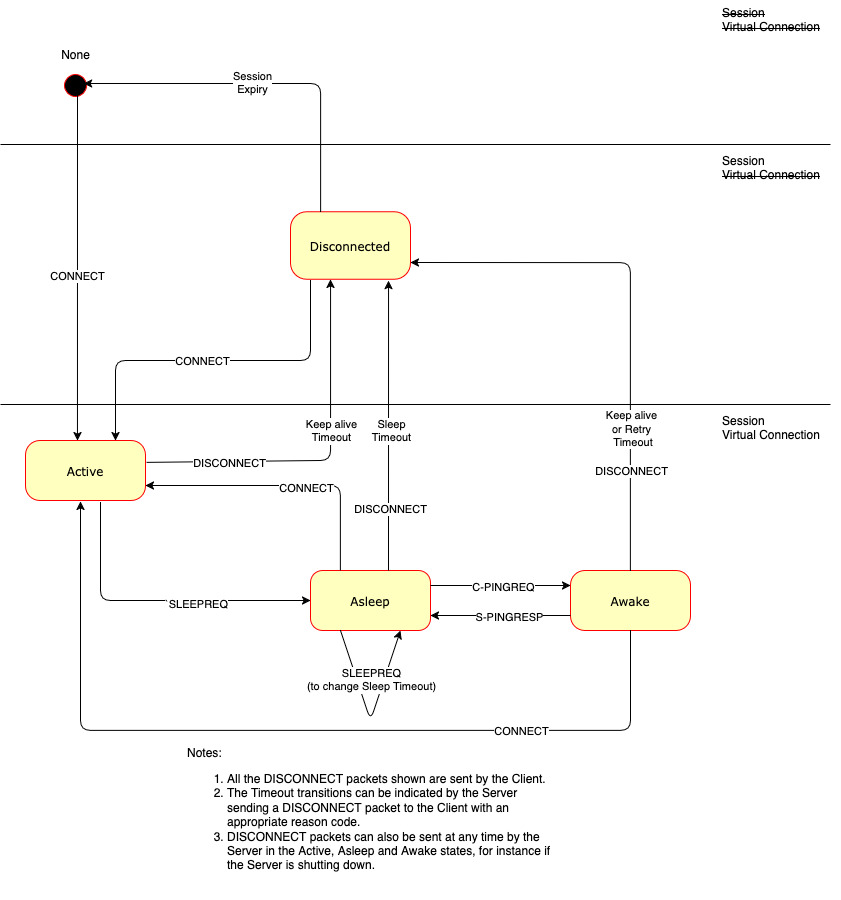{style="width: 624.00px; height: 668.00px; margin-left: 0.00px; margin-top: 0.00px; transform: rotate(0.00rad) translateZ(0px); -webkit-transform: rotate(0.00rad) translateZ(0px);"}]{style="overflow: hidden; display: inline-block; margin: 0.00px 0.00px; border: 0.00px solid #000000; transform: rotate(0.00rad) translateZ(0px); -webkit-transform: rotate(0.00rad) translateZ(0px); width: 624.00px; height: 668.00px;"}

------------------------------------------------------------------------

[Figure C-8 -- Server View of Client States - informative]{.c27 .c111
.c36 .c164 .c32 .c100}

[{style="width: 624.00px; height: 668.00px; margin-left: 0.00px; margin-top: 0.00px; transform: rotate(0.00rad) translateZ(0px); -webkit-transform: rotate(0.00rad) translateZ(0px);"}]{style="overflow: hidden; display: inline-block; margin: 0.00px 0.00px; border: 0.00px solid #000000; transform: rotate(0.00rad) translateZ(0px); -webkit-transform: rotate(0.00rad) translateZ(0px); width: 624.00px; height: 668.00px;"}

------------------------------------------------------------------------

## []{.c19 .c17} {#h.3zgec4ysq2bq .c83 .c234}

## C[.6 PUBLISH with QoS -1]{.c19 .c17} {#h.7bsjt8k2wcnj .c83}

[Figure C-9 -- PUBLISH Packet for QoS -1]{.c36 .c100}

[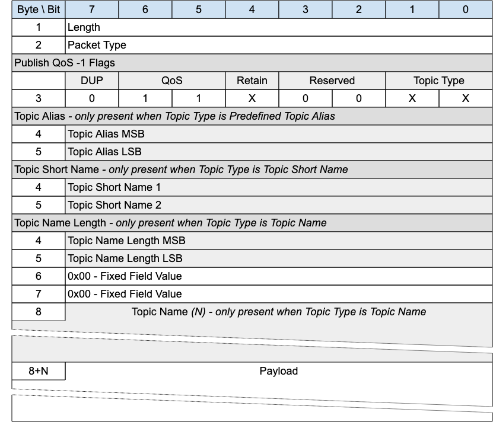{style="width: 624.00px; height: 534.67px; margin-left: 0.00px; margin-top: 0.00px; transform: rotate(0.00rad) translateZ(0px); -webkit-transform: rotate(0.00rad) translateZ(0px);"}]{style="overflow: hidden; display: inline-block; margin: 0.00px 0.00px; border: 0.00px solid #000000; transform: rotate(0.00rad) translateZ(0px); -webkit-transform: rotate(0.00rad) translateZ(0px); width: 624.00px; height: 534.67px;"}

[This packet is the MQTT-SN 1.2 equivalent of PUBWOS. It could be
supported by a ]{.c27}Server[ if there are existing MQTT-SN 1.2
transmitters that the ]{.c27}Server[ wants to listen to, or receivers it
wants to send to. Implementation of this packet is optional.]{.c2}

[This packet can be used by both Clients and ]{.c27}Server[s to publish
data to a topic without establishing a Virtual Connection or
Session.]{.c27}

### C.6.1 PUBLISH Header {#h.d1955xpjj9qi .c20}

[The first 2 or 4 bytes of the packet are encoded according to the
variable length packet header format. ]{.c27}[Refer to ]{.c27}[[2.1
Structure of an MQTT-SN Control Packet](#h.23ckvvd){.c4}]{.c6}[ for a
detailed description.]{.c27}

### [C.6.2 PUBLISH Flags]{.c38 .c17 .c32} {#h.z6s5szoqybu9 .c20}

[The PUBLISH Flags is a 1 byte field which contains flags specifying the
content of the packet and the ]{.c27 .c12}[Server]{.c12}[ behavior]{.c27
.c12}[. Bits 3-2 of the PUBLISH Flags are reserved and are set to
0]{.c27 .c12 .c121}[.]{.c3 .c17}

[The Client validates that the reserved flags in the PUBLISH packet are
set to 0. If any of the reserved flags is not 0 it is a Malformed
Packet.]{.c27}

#### [C.6.2.1 Topic Type]{.c17 .c89 .c75 .c44 .c32} {#h.k49fswnusgzd .c119 .c93 .c124 .c90}

[Position]{.c44}: bits 0 and 1 of the PUBLISH Flags.

[This determines the format of the Topic Data field. ]{.c2}

[The Topic Type in MQTT-SN 1.2 is different to that in MQTT-SN 2.0. The
values applicable to PUBLISH QoS -1 are:]{.c2}

- [0b00 - Topic Name. Its length is defined in the Topic Name Length
  field.]{.c2}
- [0b01 - Predefined Topic Alias.]{.c2}
- [0b10 - Short Topic Name. A two byte Topic Name, with the same
  syntax]{.c27}[ as Topic Name. However, some 1.2 implementations
  treated this as a binary field.]{.c2}

#### [C.6.2.2 QoS]{.c17 .c89 .c75 .c44 .c32} {#h.f8v6o4gdlqm1 .c119 .c93 .c124 .c90}

[Position]{.c44}: bits 5 and 6 of the PUBLISH Flags.

[Set this field to "0b11" for QoS -1. ]{.c2}

#### [C.6.2.3 DUP]{.c17 .c89 .c75 .c44 .c32} {#h.k1um9syapc89 .c119 .c93 .c124 .c90}

[Position]{.c44}: bit 7 of the PUBLISH Flags.

[Set to 0.]{.c2}

#### [C.6.2.4 Retain]{.c17 .c89 .c75 .c44 .c32} {#h.fdqzktr96rsl .c236 .c93 .c200 .c124 .c90}

[Position]{.c44}: bit 4 of the PUBLISH Flags.

[This flag signifies whether the message is published as a retained
message or not. See ]{.c27}[[4.13 Retained
Messages](#h.ly7c1y){.c4}]{.c6}[ ]{.c27}[for more information.]{.c2}

### [C.6.3 Topic Alias ]{.c38 .c17 .c32} {#h.vdd4u1anmq9 .c20}

[Only present if the Topic Type is Predefined Topic Alias. Contain a
Topic Alias which is preconfigured to be known to both the sender and
receiver.]{.c2}

### [C.6.4 Topic Short Name]{.c38 .c17 .c32} {#h.qpk20o16bg3e .c145 .c93 .c87 .c90}

[Only present if the Topic Type is Short Topic Name. ]{.c16 .c9}

This is a two byte Topic Name. This Topic Type does not exist in later
versions of MQTT-SN. It existed because the original MQTT-SN 1.2 did not
allow a Long Topic Name, so the only other option for this packet was a
Predefined Topic Alias.

### [C.6.5 Topic Name Length]{.c38 .c17 .c32} {#h.n3kci6se3415 .c20}

[Only present if the Topic Type is Topic Name.]{.c16 .c9}

[The length of the Topic Name field.]{.c16 .c9}

### [C.6.6 Topic Name]{.c38 .c17 .c32} {#h.fuo62t3iil3s .c20}

[Only present if the Topic Type is Topic Name.]{.c16 .c9}

Topic Name is a UTF-8 encoded string of length Topic Name Length.

### [C.6.7 Payload]{.c38 .c17 .c32} {#h.krzmgvozyfdn .c20}

The Payload contains the payload data of  the Application Message that
is being published. The content and format of the data is application
specific. It is valid for a PUBLISH packet to contain a zero length
Payload.

### [C.6.8 PUBLISH with QoS -1 Actions]{.c38 .c17 .c32} {#h.q6351elzwqpo .c176 .c93 .c87 .c78 .c90}

[The Client or Server uses a PUBLISH QoS -1 packet to send an
Application Message to a Network Address, for possible receipt by a
Server or another Client.]{.c2}

[If received by a Client or Server, the PUBLISH QoS -1 packet is treated
as if its QoS were 0]{.c27}[ ]{.c27 .c35}[as described in ]{.c27
.c12}[[3.6.3.7 PUBLISH Actions](#h.3hu8nopr74va){.c4}]{.c6}[.]{.c3 .c17
.c32}

------------------------------------------------------------------------

## []{.c19 .c17} {#h.em3zx8yhqijk .c155 .c93 .c87 .c90 .c234}

## [C.7 Gateway Advertisement and Discovery]{.c19 .c17} {#h.kble35c09nw4 .c155 .c93 .c87 .c90}

[Clients might have foreknowledge of how to reach a Gateway, but in
dynamic networks they may not. MQTT-SN supports mechanisms to allow
Clients to find available MQTT-SN Gateways. This support is optional -
it may not be needed. In some implementations, the underlying network
technology might be used for this purpose instead.]{.c3 .c17}

[In MQTT-SN there are two principal ways for Clients and Gateways to
find each other:]{.c3 .c17}

1.  [The Gateway can periodically transmit, or broadcast, an ADVERTISE
    packet to its neighborhood.]{.c3 .c17}
2.  [The Client can elicit a response from one or more Gateways, or
    Clients which know the network location of a Gateway, by
    broadcasting a SEARCHGW packet. The response, from either a Gateway
    or a Client on the Gateway's behalf, is a GWINFO packet.]{.c3 .c17}

[A Gateway should only advertise its presence, or respond to SEARCHGW
requests, if it is able to accept subscriptions and forward messages.
]{.c12}For instance, a [[Transparent
Gateway](#h.2b4f1fsjt2po){.c4}]{.c6}[ which is not currently connected
to an MQTT Server, should not advertise.]{.c2}

Multiple Gateways may be active at the same time in the same network, in
which case they will have different identifiers. It is up to the Client
to decide to which Gateway it wants to connect.

[A Client can maintain a list of active Gateways together with their
network addresses. This list is populated with the information from
ADVERTISE and GWINFO packets received.]{.c2}

The time until the Gateway sends the next ADVERTISE packet is indicated
in the [Duration ]{.c36}field of the ADVERTISE packet ([Advertise
Duration]{.c63 .c36}). A Client may use this information to monitor the
availability of a Gateway. For example, if it does not receive ADVERTISE
packets from a Gateway several times ([Advertise Count]{.c63 .c36}[)
consecutively, it may assume that the Gateway is down and remove it from
its list of active Gateways. Similarly, Gateways in stand-by mode can
become active (and start sending ADVERTISE packets) if they fail to
observe successive advertisements from a previously active
Gateway.]{.c2}

[If the ADVERTISE packets are broadcast into the whole wireless network,
the time interval between two consecutive ADVERTISE packets sent by a
gateway should be large enough (greater than 15 minutes for example) to
avoid bandwidth congestion in the network.]{.c2}

A large interval between ADVERTISE packets can lead to a long waiting
time for new Clients which are looking for a Gateway. To shorten this
waiting time a client may send a SEARCHGW packet. To prevent network
flooding when multiple clients start searching for a Gateway almost at
the same time, the sending of the SEARCHGW packet can be delayed by a
random time [SEARCHGW Delay]{.c63 .c36}[. A client can cancel its
transmission of the SEARCHGW packet if it receives during this delay
time a SEARCHGW packet sent by another client and identical to the one
it wants to send, and behaves as if the SEARCHGW packet was sent by
itself.]{.c2}

[Upon receiving a SEARCHGW packet a Gateway replies with a GWINFO packet
containing its identifier. Similarly, a Client can answer with a GWINFO
packet if it has at least one item in its active Gateway list. If the
Client has multiple Gateways in its list, it can select one Gateway out
of its list and include that information in the GWINFO packet.]{.c2}

To give priority to Gateways a client delays its sending of the GWINFO
packet for a random time [GWINFO Delay]{.c63 .c36}[. If during this
delay the Client receives a GWINFO packet it cancels the sending of its
own GWINFO packet.]{.c2}

If there is no response, the SEARCHGW packet may be retransmitted. In
this case the time intervals between consecutive SEARCHGW packets should
be increased by an exponential backoff algorithm such as that described
in [[C.4 Exponential Backoff](#h.x5dohv2o2038){.c4}]{.c6}.

# [Appendix D. Revision History (informative)]{.c17 .c120 .c75 .c44 .c30} {#h.ewpzaw2f211a .c280 .c192 .c200 .c87 .c90}

[\[Optional section.\]]{.c1 .c16}

[Revisions made since the initial stage of this numbered Version of this
document may be tracked here.]{.c1 .c16}

[Note: If revision tracking is handled in another system like github,
provide a link to it instead of using this table, if desired. Remove
this note before submitting for
publication.]{.c18}^[\[u\]](#cmnt21){#cmnt_ref21}[\[v\]](#cmnt22){#cmnt_ref22}^

+-----------------+-----------------+------------------+----------------------+
| [Revision]{.c1  | [Date]{.c1      | [Editor]{.c1     | [Changes Made]{.c1   |
| .c16}           | .c16}           | .c16}            | .c16}                |
+-----------------+-----------------+------------------+----------------------+
| [WD-01]{.c1     | [\[27th         | [\[Andrew        | [\[Merge Initial     |
| .c16}           | February        | Banks\]]{.c1     | Document and Input   |
|                 | 2020\]]{.c1     | .c16}            | Specification\]]{.c1 |
|                 | .c16}           |                  | .c16}                |
+-----------------+-----------------+------------------+----------------------+
| [WD-02]{.c1     | [\[4th April    | [\[Andrew        | [\[Terminology,      |
| .c16}           | 2020\]]{.c1     | Banks\]]{.c1     | DataTypes, CONNECT   |
|                 | .c16}           | .c16}            | packet\]]{.c1 .c16}  |
|                 |                 |                  |                      |
|                 |                 | [\[Rahul         | [\[Specification     |
|                 |                 | Gupta\]]{.c1     | Diagrams\]]{.c1      |
|                 |                 | .c16}            | .c16}                |
+-----------------+-----------------+------------------+----------------------+
| [WD-05]{.c1     | [\[21st         | [\[Simon         | [\[Packet Diagrams,  |
| .c16}           | February        | Johnson\]]{.c1   | Bit Tables, Field    |
|                 | 2021\]]{.c1     | .c16}            | Definitions\]]{.c1   |
|                 | .c16}           |                  | .c16}                |
+-----------------+-----------------+------------------+----------------------+
| [WD-06]{.c1     | [\[10th March   | [\[Simon         | [\[Sleeping client   |
| .c16}           | 2021\]]{.c1     | Johnson\]]{.c1   | operational          |
|                 | .c16}           | .c16}            | behavior,            |
|                 |                 |                  | Terminology changes, |
|                 |                 |                  | 13 JIRA resolutions  |
|                 |                 |                  | added to             |
|                 |                 |                  | specification,       |
|                 |                 |                  | Section numbering    |
|                 |                 |                  | changes\]]{.c1 .c16} |
+-----------------+-----------------+------------------+----------------------+
| [WD-07]{.c1     | [\[15th March   | [\[Simon         | [\[Added 4 byte (32  |
| .c16}           | 2021\]]{.c1     | Johnson\]]{.c1   | bit) integer         |
|                 | .c16}           | .c16}            | description\]]{.c1   |
|                 |                 |                  | .c16}                |
+-----------------+-----------------+------------------+----------------------+
| [WD-08]{.c1     | [\[26th March   | [\[Simon         | [\[Added max packet  |
| .c16}           | 2021\]]{.c1     | Johnson\]]{.c1   | size to CONNECT,     |
|                 | .c16}           | .c16}            | Added Session Expiry |
|                 |                 |                  | Interval to CONNACK, |
|                 |                 |                  | Removed ZigBee       |
|                 |                 |                  | references, Removed  |
|                 |                 |                  | capabilities flag    |
|                 |                 |                  | from CONNECT, AUTH   |
|                 |                 |                  | packet added along   |
|                 |                 |                  | with Authentication  |
|                 |                 |                  | operational          |
|                 |                 |                  | behavior.            |
|                 |                 |                  | Standardized page    |
|                 |                 |                  | margins\]]{.c1 .c16} |
+-----------------+-----------------+------------------+----------------------+
| [WD-09]{.c1     | [\[05th May     | [\[Simon         | [\[Added long topic  |
| .c16}           | 2021\]]{.c1     | Johnson\]]{.c1   | type to              |
|                 | .c16}           | .c16}            | topicIdTypes,        |
|                 |                 |                  | updated PUBLISH to   |
|                 |                 |                  | accommodate new      |
|                 |                 |                  | topic type, added    |
|                 |                 |                  | topic type           |
|                 |                 |                  | matrix\]]{.c1 .c16}  |
+-----------------+-----------------+------------------+----------------------+
| [WD-10]{.c1     | [\[October      | [\[Simon         | [\[Document format   |
| .c16}           | 2021\]]{.c1     | Johnson\]]{.c1   | aligned with core    |
|                 | .c16}           | .c16}            | specification,       |
|                 |                 |                  | removal of           |
|                 |                 |                  | introduction,        |
|                 |                 |                  | addition of packet   |
|                 |                 |                  | ID table, adding     |
|                 |                 |                  | error code\]]{.c1    |
|                 |                 |                  | .c16}                |
+-----------------+-----------------+------------------+----------------------+
| [WD-11]{.c1     | [\[October      | [\[Simon         | [\[MQTT-SN           |
| .c16}           | 2021\]]{.c1     | Johnson\]]{.c1   | Architecture moved   |
|                 | .c16}           | .c16}            | into operational     |
|                 |                 |                  | behavior, removal of |
|                 |                 |                  | variable integer     |
|                 |                 |                  | definition, addition |
|                 |                 |                  | of session state     |
|                 |                 |                  | section, normative   |
|                 |                 |                  | comments added to    |
|                 |                 |                  | sleeping client      |
|                 |                 |                  | operational          |
|                 |                 |                  | behaviour\]]{.c1     |
|                 |                 |                  | .c16}                |
+-----------------+-----------------+------------------+----------------------+
| [WD-12]{.c1     | [\[November     | [\[Andrew        | [Rework 1.5          |
| .c16}           | 2021\]]{.c1     | Banks\]]{.c1     | Background]{.c1      |
|                 | .c16}           | .c16}            | .c16}                |
+-----------------+-----------------+------------------+----------------------+
| [WD-13]{.c1     | [\[November     | [\[Simon         | [\[Move              |
| .c16}           | 2021\]]{.c1     | Johnson\]]{.c1   | Authentication and   |
|                 | .c16}           | .c16}            | Retained messages    |
|                 |                 |                  | into operational     |
|                 |                 |                  | behavior,            |
|                 |                 |                  | rationalized tables  |
|                 |                 |                  | and figures,         |
|                 |                 |                  | separated packet     |
|                 |                 |                  | definitions of       |
|                 |                 |                  | similar structures   |
|                 |                 |                  | into distinct        |
|                 |                 |                  | sections.\]]{.c1     |
|                 |                 |                  | .c16}                |
+-----------------+-----------------+------------------+----------------------+
| [WD-14]{.c1     | [\[Decmeber     | [\[Simon         | [\[First             |
| .c16}           | 2021\]]{.c1     | Johnson\]]{.c1   | implementation       |
|                 | .c16}           | .c16}            | attempt, Fixed table |
|                 |                 |                  | references, Fixed    |
|                 |                 |                  | PingResp             |
|                 |                 |                  | packet\]]{.c1 .c16}  |
+-----------------+-----------------+------------------+----------------------+
| [WD-15]{.c1     | [\[December     | [\[Simon         | [\[Tara added as     |
| .c16}           | 2021\]]{.c1     | Johnson\]]{.c1   | editor, return code  |
|                 | .c16}           | .c16}            | additions\]]{.c1     |
|                 |                 |                  | .c16}                |
+-----------------+-----------------+------------------+----------------------+
| [WD-15]{.c1     | [\[February     | [\[Tara          | [Changed Return Code |
| .c16}           | 2022\]]{.c1     | Walker\]]{.c1    | nomenclature to be   |
|                 | .c16}           | .c16}            | more consistent      |
|                 |                 |                  | w/5.0. Added Reason  |
|                 |                 |                  | Codes to each        |
|                 |                 |                  | control packet       |
|                 |                 |                  | type]{.c1 .c16}      |
+-----------------+-----------------+------------------+----------------------+
| [WD-16]{.c1     | [March          | [\[Tara          | [Updated WILL\*Types |
| .c16}           | 2022]{.c1 .c16} | Walker\]]{.c1    | to correct Packet    |
|                 |                 | .c16}            | Type. Added Global   |
|                 |                 |                  | Flags Table to       |
|                 |                 |                  | Section 2. Updated   |
|                 |                 |                  | each Control Packet  |
|                 |                 |                  | Flags in Section 3   |
|                 |                 |                  | adding missing Flag  |
|                 |                 |                  | Sections.            |
|                 |                 |                  | Formatting: Auto     |
|                 |                 |                  | update of Table      |
|                 |                 |                  | numbering, Auto      |
|                 |                 |                  | update of WD         |
|                 |                 |                  | Revision numbering   |
|                 |                 |                  | for footer.]{.c1     |
|                 |                 |                  | .c16}                |
+-----------------+-----------------+------------------+----------------------+
| [WD-17]{.c1     | [April          | [\[Simon         | [Updated use of      |
| .c16}           | 2022]{.c1 .c16} | Johnson\]]{.c1   | topic name and topic |
|                 |                 | .c16}            | filter to be aligned |
|                 |                 |                  | with MQTT 5. Topic   |
|                 |                 |                  | alias becomes topic  |
|                 |                 |                  | alias type. Added    |
|                 |                 |                  | quality of service   |
|                 |                 |                  | protocol flow as it  |
|                 |                 |                  | differed to MQTT 5   |
|                 |                 |                  | (inflight).          |
|                 |                 |                  | Conformance          |
|                 |                 |                  | references removed   |
|                 |                 |                  | as these will need   |
|                 |                 |                  | to be wholly owned   |
|                 |                 |                  | OR externally        |
|                 |                 |                  | referenced.]{.c1     |
|                 |                 |                  | .c16}                |
+-----------------+-----------------+------------------+----------------------+
| [WD-18 ]{.c1    | [June 2022]{.c1 | [\[Tara E.       | [Updated items based |
| .c16}           | .c16}           | Walker\]]{.c1    | upon the feedback    |
|                 |                 | .c16}            | from Alex            |
|                 |                 |                  | Kritikos.]{.c1 .c16} |
+-----------------+-----------------+------------------+----------------------+
| [WD-19]{.c1     | [August         | [\[Simon         | [Remove change       |
| .c16}           | 2022]{.c1 .c16} | Johnson\]]{.c1   | tracking as document |
|                 |                 | .c16}            | was becoming         |
|                 |                 |                  | unworkable.]{.c1     |
|                 |                 |                  | .c16}                |
+-----------------+-----------------+------------------+----------------------+
| [WD-20]{.c1     | [September      | [\[Simon         | [Integrate feedback  |
| .c16}           | 2022]{.c1 .c16} | Johnson\]]{.c1   | from committee       |
|                 |                 | .c16}            | meeting relating to  |
|                 |                 |                  | the work by Miroslav |
|                 |                 |                  | Prymek. Added        |
|                 |                 |                  | resolution of        |
|                 |                 |                  | CONNACK session      |
|                 |                 |                  | present per MQTT     |
|                 |                 |                  | 585]{.c1 .c16}       |
+-----------------+-----------------+------------------+----------------------+
| [WD-21]{.c1     | [October        | [\[Simon         | [Client States       |
| .c16}           | 2022]{.c1 .c16} | Johnson\]]{.c1   | section added to     |
|                 |                 | .c16}            | describe the 5       |
|                 |                 |                  | states.]{.c1 .c16}   |
|                 |                 |                  |                      |
|                 |                 |                  | [Updated the state   |
|                 |                 |                  | transition diagram   |
|                 |                 |                  | to accommodate new   |
|                 |                 |                  | disconnect field and |
|                 |                 |                  | new transitions      |
|                 |                 |                  | between Awake -\>    |
|                 |                 |                  | Lost and Asleep -\>  |
|                 |                 |                  | Disconnected.]{.c1   |
|                 |                 |                  | .c16}                |
|                 |                 |                  |                      |
|                 |                 |                  | [Security section    |
|                 |                 |                  | added.]{.c1 .c16}    |
|                 |                 |                  |                      |
|                 |                 |                  | [Figure 2 -- MQTT-SN |
|                 |                 |                  | Architecture diagram |
|                 |                 |                  | updated.]{.c1 .c16}  |
|                 |                 |                  |                      |
|                 |                 |                  | [Font updated to     |
|                 |                 |                  | Arial from bespoke   |
|                 |                 |                  | font.]{.c1 .c16}     |
|                 |                 |                  |                      |
|                 |                 |                  | [QoS -1 -- Section   |
|                 |                 |                  | added to the QoS     |
|                 |                 |                  | chapter (NOTE:       |
|                 |                 |                  | updated text to      |
|                 |                 |                  | allow for            |
|                 |                 |                  | bi-directional -1    |
|                 |                 |                  | PUBLISHING).]{.c1    |
|                 |                 |                  | .c16}                |
|                 |                 |                  |                      |
|                 |                 |                  | [Introduction of     |
|                 |                 |                  | Exponential backoff  |
|                 |                 |                  | algorithm.]{.c1      |
|                 |                 |                  | .c16}                |
|                 |                 |                  |                      |
|                 |                 |                  | [Applied issue issue |
|                 |                 |                  | 587 (max messages    |
|                 |                 |                  | set in CONNECT       |
|                 |                 |                  | flags).]{.c1 .c16}   |
+-----------------+-----------------+------------------+----------------------+
| [WD-22]{.c1     | [November       | [\[Simon         | [Integrate MQTT 591  |
| .c16}           | 2022]{.c1 .c16} | Johnson\]]{.c1   | (sleep               |
|                 |                 | .c16}            | behavior)]{.c1 .c16} |
|                 |                 |                  |                      |
|                 |                 |                  | [Replace instances   |
|                 |                 |                  | of "return code" to  |
|                 |                 |                  | "reason code"]{.c1   |
|                 |                 |                  | .c16}                |
|                 |                 |                  |                      |
|                 |                 |                  | [PINGREQ timeout     |
|                 |                 |                  | aligned with Tretry  |
|                 |                 |                  | (15 seconds) from    |
|                 |                 |                  | the ill defined      |
|                 |                 |                  | "reasonable amount   |
|                 |                 |                  | of time"]{.c1 .c16}  |
|                 |                 |                  |                      |
|                 |                 |                  | [Exponential Algo    |
|                 |                 |                  | fix (using the       |
|                 |                 |                  | factor n assuming it |
|                 |                 |                  | was the              |
|                 |                 |                  | product!)]{.c1 .c16} |
|                 |                 |                  |                      |
|                 |                 |                  | [Client Identifier   |
|                 |                 |                  | size                 |
|                 |                 |                  | clarification.]{.c1  |
|                 |                 |                  | .c16}                |
|                 |                 |                  |                      |
|                 |                 |                  | [Publish variants    |
|                 |                 |                  | added; distinguish   |
|                 |                 |                  | variant based on QoS |
|                 |                 |                  | field to save 2      |
|                 |                 |                  | bytes for single     |
|                 |                 |                  | flight PUBLISH       |
|                 |                 |                  | packets.]{.c1 .c16}  |
|                 |                 |                  |                      |
|                 |                 |                  | [Incorporated B4.    |
|                 |                 |                  | Into retry           |
|                 |                 |                  | timer.]{.c1 .c16}    |
+-----------------+-----------------+------------------+----------------------+
| [WD-23]{.c1     | [December       | [\[Simon         | [CONNECT Client      |
| .c16}           | 2022]{.c1 .c16} | Johnson\]]{.c1   | Identifier           |
|                 |                 | .c16}            | Informative and      |
|                 |                 |                  | Normative définition |
|                 |                 |                  | update.]{.c1 .c16}   |
|                 |                 |                  |                      |
|                 |                 |                  | [CONNACK Client      |
|                 |                 |                  | Identifier           |
|                 |                 |                  | Informative and      |
|                 |                 |                  | Normative définition |
|                 |                 |                  | update.]{.c1 .c16}   |
|                 |                 |                  |                      |
|                 |                 |                  | [CONNACK reason      |
|                 |                 |                  | codes updated.]{.c1  |
|                 |                 |                  | .c16}                |
|                 |                 |                  |                      |
|                 |                 |                  | [KeepAlive boundary  |
|                 |                 |                  | specified removing 0 |
|                 |                 |                  | as an option per the |
|                 |                 |                  | committee call.]{.c1 |
|                 |                 |                  | .c16}                |
|                 |                 |                  |                      |
|                 |                 |                  | [Added Session       |
|                 |                 |                  | Expiry "reasonable"  |
|                 |                 |                  | setting              |
|                 |                 |                  | statement.]{.c1      |
|                 |                 |                  | .c16}                |
|                 |                 |                  |                      |
|                 |                 |                  | [Added sequence      |
|                 |                 |                  | diagrams for         |
|                 |                 |                  | CONNECT, CONNECT     |
|                 |                 |                  | with WILL, CONNECT   |
|                 |                 |                  | with AUTH.]{.c1      |
|                 |                 |                  | .c16}                |
|                 |                 |                  |                      |
|                 |                 |                  | [Network Connection  |
|                 |                 |                  | Section (IANA        |
|                 |                 |                  | Omitted but we need  |
|                 |                 |                  | to add this to       |
|                 |                 |                  | agenda)]{.c1 .c16}   |
+-----------------+-----------------+------------------+----------------------+
| [WD-24]{.c1     | [December       | [\[Simon         | [Removal of Network  |
| .c16}           | 2022]{.c1 .c16} | Johnson, Davide  | Connection           |
|                 |                 | Lenzarini, Ian   | references.]{.c1     |
|                 |                 | Craggs\]]{.c1    | .c16}                |
|                 |                 | .c16}            |                      |
|                 |                 |                  | [Modified PUBLISH -1 |
|                 |                 |                  | & 0 tables to remove |
|                 |                 |                  | topic length         |
|                 |                 |                  | field]{.c1 .c16}     |
|                 |                 |                  |                      |
|                 |                 |                  | [Modified PUBLISH 1  |
|                 |                 |                  | & 2 tables to remove |
|                 |                 |                  | topic length         |
|                 |                 |                  | field]{.c1 .c16}     |
|                 |                 |                  |                      |
|                 |                 |                  | [Changed Data field  |
|                 |                 |                  | description on the   |
|                 |                 |                  | above]{.c1 .c16}     |
|                 |                 |                  |                      |
|                 |                 |                  | [Updated sleeping    |
|                 |                 |                  | device section]{.c1  |
|                 |                 |                  | .c16}                |
|                 |                 |                  |                      |
|                 |                 |                  | [Ensured the         |
|                 |                 |                  | references to the    |
|                 |                 |                  | Packet Length and    |
|                 |                 |                  | type section was     |
|                 |                 |                  | consistent in all    |
|                 |                 |                  | packet types.]{.c1   |
|                 |                 |                  | .c16}                |
|                 |                 |                  |                      |
|                 |                 |                  | []{.c1 .c16}         |
+-----------------+-----------------+------------------+----------------------+
| [WD-25]{.c1     | [January        | [\[Simon         | [Broken out PUBLISH  |
| .c16}           | 2023]{.c1 .c16} | Johnson\]]{.c1   | -1 into its own      |
|                 |                 | .c16}            | packet type]{.c1     |
|                 |                 |                  | .c16}                |
|                 |                 |                  |                      |
|                 |                 |                  | [Disconnect flags    |
|                 |                 |                  | field moved and      |
|                 |                 |                  | added existence      |
|                 |                 |                  | flags for optional   |
|                 |                 |                  | fields]{.c1 .c16}    |
|                 |                 |                  |                      |
|                 |                 |                  | [Introduction titles |
|                 |                 |                  | changed to better    |
|                 |                 |                  | sign post where the  |
|                 |                 |                  | information resides  |
|                 |                 |                  | in the document]{.c1 |
|                 |                 |                  | .c16}                |
+-----------------+-----------------+------------------+----------------------+
| [WD-26]{.c1     | [May 2023]{.c1  | [\[Simon         | [Backwards           |
| .c16}           | .c16}           | Johnson, Davide  | compatible PUBLISH   |
|                 |                 | Lenzarini\]]{.c1 | -1, new OOS Publish  |
|                 |                 | .c16}            | message to repace    |
|                 |                 |                  | it. Removal of       |
|                 |                 |                  | security section to  |
|                 |                 |                  | allow to             |
|                 |                 |                  | rewrite.]{.c1 .c16}  |
+-----------------+-----------------+------------------+----------------------+
| [WD-27]{.c1     | [November       | [\[Simon         | [Network Transport   |
| .c16}           | 2023]{.c1 .c16} | Johnson, Davide  | Layer chapter        |
|                 |                 | Lenzarini\]]{.c1 | updated to define    |
|                 |                 | .c16}            | the impact of lower  |
|                 |                 |                  | layers features on   |
|                 |                 |                  | the MQTT-SN          |
|                 |                 |                  | protocol.]{.c1 .c16} |
|                 |                 |                  |                      |
|                 |                 |                  | [Replaced the term   |
|                 |                 |                  | MQTT-SN "connection" |
|                 |                 |                  | with the term        |
|                 |                 |                  | "Virtual             |
|                 |                 |                  | Connection".]{.c1    |
|                 |                 |                  | .c16}                |
+-----------------+-----------------+------------------+----------------------+
| [WD-28]{.c1     | [December       | [\[Davide        | [Ensured document    |
| .c16}           | 2023]{.c1 .c16} | Lenzarini,       | structure is intact  |
|                 |                 | Stefan           | and replaced table   |
|                 |                 | Hagen\]]{.c1     | footnotes with       |
|                 |                 | .c16}            | simple text tags and |
|                 |                 |                  | a subsequent notes   |
|                 |                 |                  | listing.]{.c1 .c16}  |
+-----------------+-----------------+------------------+----------------------+
| []{.c1 .c16}    | [February       | [\[Ian Craggs,   | [Issue 560           |
|                 | 2024]{.c1 .c16} | Simon            | resolution - full    |
|                 |                 | Johnson\]]{.c1   | reason code table    |
|                 |                 | .c16}            | and add reason code  |
|                 |                 |                  | fields to PUBREC,    |
|                 |                 |                  | PUBREL and PUBCOMP.  |
|                 |                 |                  | Duplicate reason     |
|                 |                 |                  | code tables removed  |
|                 |                 |                  | from packet          |
|                 |                 |                  | descriptions.]{.c1   |
|                 |                 |                  | .c16}                |
|                 |                 |                  |                      |
|                 |                 |                  | [Will Data Sent in   |
|                 |                 |                  | CONNECT]{.c1 .c16}   |
|                 |                 |                  |                      |
|                 |                 |                  | [Auth Data Sent in   |
|                 |                 |                  | CONNECT &            |
|                 |                 |                  | CONNACK]{.c1 .c16}   |
|                 |                 |                  |                      |
|                 |                 |                  | [Suback granted QoS  |
|                 |                 |                  | 0,1,2 now reason     |
|                 |                 |                  | codes not            |
|                 |                 |                  | flags.]{.c1 .c16}    |
|                 |                 |                  |                      |
|                 |                 |                  | [Moved PUBLISH -1 to |
|                 |                 |                  | new Backward         |
|                 |                 |                  | compatibility        |
|                 |                 |                  | appendix]{.c1 .c16}  |
+-----------------+-----------------+------------------+----------------------+
| [WD-29]{.c1     | [March          | [\[Ian Craggs,   | [Update Terminology  |
| .c16}           | 2024]{.c1 .c16} | Davide           | section. Add         |
|                 |                 | Lenzarini, Simon | Operational Behavior |
|                 |                 | Johnson\]]{.c1   | sections from MQTT   |
|                 |                 | .c16}            | 5.0. Workshop        |
|                 |                 |                  | revisions to         |
|                 |                 |                  | Operational Behavior |
|                 |                 |                  | responding to        |
|                 |                 |                  | Davide's             |
|                 |                 |                  | review.]{.c1 .c16}   |
+-----------------+-----------------+------------------+----------------------+
| []{.c1 .c16}    | [June 2024]{.c1 | [\[Ian           | [Change CorrelId to  |
|                 | .c16}           | Craggs\]]{.c1    | Packet id. Move      |
|                 |                 | .c16}            | Virtual Connection   |
|                 |                 |                  | semantics to         |
|                 |                 |                  | Operational          |
|                 |                 |                  | Behavior. Clarify    |
|                 |                 |                  | MQTT-SN does not     |
|                 |                 |                  | deduplicate. Do not  |
|                 |                 |                  | preclude Unicast for |
|                 |                 |                  | PUBWOS.]{.c1 .c16}   |
+-----------------+-----------------+------------------+----------------------+
| []{.c1 .c16}    | [July 2024]{.c1 | [\[Ian           | [Add Actions         |
|                 | .c16}           | Craggs\]]{.c1    | sections for all     |
|                 |                 | .c16}            | packets. Add a       |
|                 |                 |                  | retained messages    |
|                 |                 |                  | section. Add a flow  |
|                 |                 |                  | control section.     |
|                 |                 |                  | ]{.c1 .c16}          |
+-----------------+-----------------+------------------+----------------------+
| []{.c1 .c16}    | [August         | [\[Ian Craggs,   | [Add WAKEUP packet.  |
|                 | 2024]{.c1 .c16} | Simon            | Update will firing   |
|                 |                 | Johnson\]]{.c1   | conditions. Update   |
|                 |                 | .c16}            | retained messages    |
|                 |                 |                  | terminology.]{.c1    |
|                 |                 |                  | .c16}                |
+-----------------+-----------------+------------------+----------------------+
| []{.c1 .c16}    | [September      | [\[Ian           | [Remove one index    |
|                 | 2024]{.c1 .c16} | Craggs\]]{.c1    | level from the       |
|                 |                 | .c16}            | packet chapter.      |
|                 |                 |                  | Disallow other       |
|                 |                 |                  | packets before       |
|                 |                 |                  | CONNACK. ]{.c1 .c16} |
+-----------------+-----------------+------------------+----------------------+
| []{.c1 .c16}    | [October        | [\[Ian           | [Add SLEEPREQ and    |
|                 | 2024]{.c1 .c16} | Craggs\]]{.c1    | SLEEPRESP packets -  |
|                 |                 | .c16}            | disconnect now has   |
|                 |                 |                  | no response. Rename  |
|                 |                 |                  | Enhanced             |
|                 |                 |                  | Authentication to    |
|                 |                 |                  | Authentication. Add  |
|                 |                 |                  | Gateway timer table. |
|                 |                 |                  | Add Security         |
|                 |                 |                  | Chapter.]{.c1 .c16}  |
+-----------------+-----------------+------------------+----------------------+
| []{.c1 .c16}    | [November       | [\[Ian           | [Add MQTT-BASIC      |
|                 | 2024]{.c1 .c16} | Craggs\]]{.c1    | authentication       |
|                 |                 | .c16}            | method. Move         |
|                 |                 |                  | Appendices to main   |
|                 |                 |                  | doc, except those    |
|                 |                 |                  | that exist in        |
|                 |                 |                  | MQTT.]{.c1 .c16}     |
+-----------------+-----------------+------------------+----------------------+
| []{.c1 .c16}    | [February       | [\[Ian           | [Make session expiry |
|                 | 2025]{.c1 .c16} | Craggs\]]{.c1    | in CONNACK           |
|                 |                 | .c16}            | optional.]{.c1 .c16} |
+-----------------+-----------------+------------------+----------------------+
| []{.c1 .c16}    | [March          | [\[Ian           | [Reformat all packet |
|                 | 2025]{.c1 .c16} | Craggs\]]{.c1    | diagrams. Remove     |
|                 |                 | .c16}            | Topic Short Name.    |
|                 |                 |                  | Simplify             |
|                 |                 |                  | UN/SUBSCRIBE packet  |
|                 |                 |                  | diagrams. Make       |
|                 |                 |                  | session expiry in    |
|                 |                 |                  | CONNECT              |
|                 |                 |                  | optional.]{.c1 .c16} |
+-----------------+-----------------+------------------+----------------------+
| []{.c1 .c16}    | [April          | [\[Ian           | [Make Topic Alias in |
|                 | 2025]{.c1 .c16} | Craggs\]]{.c1    | SUBACK optional.     |
|                 |                 | .c16}            | Move Retain          |
|                 |                 |                  | Registrations from   |
|                 |                 |                  | DISCONNECT to        |
|                 |                 |                  | SLEEPREQ. Move       |
|                 |                 |                  | informative          |
|                 |                 |                  | Operational Behavior |
|                 |                 |                  | sections to          |
|                 |                 |                  | Appendices.]{.c1     |
|                 |                 |                  | .c16}                |
+-----------------+-----------------+------------------+----------------------+
| []{.c1 .c16}    | [May 2025]{.c1  | [\[Ian           | [Move Advertise,     |
|                 | .c16}           | Craggs\]]{.c1    | GWINFO and SEARCHGW  |
|                 |                 | .c16}            | to the end of        |
|                 |                 |                  | Chapter 3. Move C.2  |
|                 |                 |                  | Advertisement and    |
|                 |                 |                  | Discovery Appendix   |
|                 |                 |                  | to end of Appendix   |
|                 |                 |                  | C. Redraft Client    |
|                 |                 |                  | States section. Add  |
|                 |                 |                  | Server Keepalive to  |
|                 |                 |                  | CONNACK.]{.c1 .c16}  |
+-----------------+-----------------+------------------+----------------------+
| []{.c1 .c16}    | [June 2025]{.c1 | [\[Ian           | [Changed link format |
|                 | .c16}           | Craggs\]]{.c1    | from section n.n to  |
|                 |                 | .c16}            | n.n xxxx. Updated    |
|                 |                 |                  | PINGREQ actions.     |
|                 |                 |                  | Reordered Control    |
|                 |                 |                  | Packet Type to align |
|                 |                 |                  | with MQTT. Clarify   |
|                 |                 |                  | definition and use   |
|                 |                 |                  | of Server and        |
|                 |                 |                  | Gateway terms.       |
|                 |                 |                  | Removed radius       |
|                 |                 |                  | fields from SEARCHGW |
|                 |                 |                  | and Forwarder        |
|                 |                 |                  | Encapsulation.       |
|                 |                 |                  | Limited sleep        |
|                 |                 |                  | duration to less     |
|                 |                 |                  | than session         |
|                 |                 |                  | expiry.]{.c1 .c16}   |
+-----------------+-----------------+------------------+----------------------+
| []{.c1 .c16}    | [July 2025]{.c1 | [\[Ian           | [In the CONNACK      |
|                 | .c16}           | Craggs\]]{.c1    | packet: moved        |
|                 |                 | .c16}            | Default Awake        |
|                 |                 |                  | Messages Flags to a  |
|                 |                 |                  | byte field; added    |
|                 |                 |                  | flags to allow       |
|                 |                 |                  | Network ID update    |
|                 |                 |                  | and Sleep Duration   |
|                 |                 |                  | on SLEEPRESP. Added  |
|                 |                 |                  | Sleep Duration and   |
|                 |                 |                  | Reason Code to       |
|                 |                 |                  | SLEEPRESP. Added     |
|                 |                 |                  | Connection           |
|                 |                 |                  | Encapsulation.]{.c1  |
|                 |                 |                  | .c16}                |
+-----------------+-----------------+------------------+----------------------+
| []{.c1 .c16}    | [August         | [\[Ian Craggs,   | [Removed Client ID   |
|                 | 2025]{.c1 .c16} | Davide           | from PINGREQ.        |
|                 |                 | Lenzarini\]]{.c1 | Changed Allow Sleep  |
|                 |                 | .c16}            | Duration changes     |
|                 |                 |                  | flag to apply to     |
|                 |                 |                  | Keep Alive and       |
|                 |                 |                  | Session Expiry too.  |
|                 |                 |                  | Updated Sender       |
|                 |                 |                  | Identifier           |
|                 |                 |                  | description in       |
|                 |                 |                  | Protection           |
|                 |                 |                  | Encapsulation. Made  |
|                 |                 |                  | Reason Codes         |
|                 |                 |                  | optional on all      |
|                 |                 |                  | ACKs.]{.c1 .c16}     |
+-----------------+-----------------+------------------+----------------------+
| []{.c1 .c16}    | [September      | [\[Ian           | [Added conformance   |
|                 | 2025]{.c1 .c16} | Craggs\]]{.c1    | statements to the    |
|                 |                 | .c16}            | Protection           |
|                 |                 |                  | Encapsulation        |
|                 |                 |                  | section. ]{.c1 .c16} |
+-----------------+-----------------+------------------+----------------------+
| []{.c1 .c16}    | [October        | [\[Ian Craggs,   | [Added Chapter 6 -   |
|                 | 2025]{.c1 .c16} | Davide           | Conformance. Updated |
|                 |                 | Lenzarini\]]{.c1 | Protection           |
|                 |                 | .c16}            | Encapsulation with   |
|                 |                 |                  | corrections and      |
|                 |                 |                  | conformance. Added   |
|                 |                 |                  | conformance          |
|                 |                 |                  | statement table to   |
|                 |                 |                  | Appendix B.]{.c1     |
|                 |                 |                  | .c16}                |
+-----------------+-----------------+------------------+----------------------+

# []{.c17 .c120 .c27 .c32} {#h.3jd0qos .c235 .c192 .c200 .c87 .c90 .c294}

::: {}
[mqtt-sn-v2.0-wd        ]{.c17 .c209 .c12 .c143}[Committee Specification
]{.c143}[Draft ]{.c17 .c209 .c12 .c143}[01]{.c143}[        ]{.c17 .c209
.c12 .c143}[09]{.c143}[ ]{.c17 .c209 .c12 .c143}[October]{.c209 .c12
.c143}[ 2025]{.c17 .c209 .c12 .c143}[        ]{.c12 .c143}

[Standards Track Draft        Copyright © OASIS Open 2025. All Rights
Reserved.        Page ]{.c17 .c12 .c143 .c209}[ of ]{.c17 .c209 .c12
.c143}
:::

::: c133
[\[a\]](#cmnt_ref1){#cmnt1}[Links not yet working. They will be created
once the files will be uploaded for final comments]{.c3 .c17}
:::

::: c133
[\[b\]](#cmnt_ref2){#cmnt2}[It has to be fixed]{.c3 .c17}
:::

::: c133
[\[c\]](#cmnt_ref3){#cmnt3}[The character encoding of the document does
not seem to support the CJK chars.]{.c3 .c17}
:::

::: c133
[\[d\]](#cmnt_ref4){#cmnt4}[Added an MQTT-SN specific success Reason
Code]{.c3 .c17}
:::

::: c133
[\[e\]](#cmnt_ref5){#cmnt5}[OK for me]{.c3 .c17}
:::

::: c133
[\[f\]](#cmnt_ref6){#cmnt6}[Ian to verify if this reservation is
possible and confirmed]{.c3 .c17}
:::

::: c133
[\[g\]](#cmnt_ref7){#cmnt7}[I\'m wondering if it would be better for
MQTT-SN specific reason codes to start from 255 and work backwards? In
any case, we need to take the proposal to the full MQTT TC for
discussion and approval.]{.c3 .c17}
:::

::: c133
[\[h\]](#cmnt_ref8){#cmnt8}[OK for me]{.c3 .c17}
:::

::: c133
[\[i\]](#cmnt_ref9){#cmnt9}[Should we add also 0x1A \"Topic Alias
Exists\"?]{.c3 .c17}
:::

::: c133
[\[j\]](#cmnt_ref10){#cmnt10}[we need to add a range for positive
MQTT-SN reason codes]{.c3 .c17}
:::

::: c133
[\[k\]](#cmnt_ref11){#cmnt11}[Is the intent of these statements that all
of the packets exchanged in a Virtual Connection must be protected, or
none at all? That is, you can\'t mix protected and unprotected in the
same Virtual Connection. What about the Session?]{.c3 .c17}
:::

::: c133
[\[l\]](#cmnt_ref12){#cmnt12}[From
https://issues.oasis-open.org/browse/MQTT-604: MQTT reserved both the
UDP and TCP ports but prohibits the use of UDP,]{.c3 .c17}

[We should approach the MQTT TC to get this redesignated as
MQTT/MQTT-SN.]{.c3 .c17}
:::

::: c133
[\[m\]](#cmnt_ref13){#cmnt13}[IANA 8883 and 1883 for both TCP and UDP
are already registered to "Secure MQTT" and "MQTT" since 2015, so I
suppose the UDP ports we can be reused for MQTT-SN]{.c3 .c17}

[Furthermore in MQTT 5 specs on chapter 4.2: "Connectionless network
transports such as User Datagram Protocol (UDP) are not suitable on
their own because they might lose or reorder data.". So there is no risk
of impacting any MQTT service over UDP.]{.c3 .c17}
:::

::: c133
[\[n\]](#cmnt_ref14){#cmnt14}[If a packet was transmitted in an
authenticated connection, also the new connection should be
authenticated (AUTH messages)]{.c3 .c17}
:::

::: c133
[\[o\]](#cmnt_ref15){#cmnt15}[It was agreed that this applies to MQTT as
well as MQTT-SN so should be discussed at the TC level.]{.c3 .c17}
:::

::: c133
[\[p\]](#cmnt_ref16){#cmnt16}[We nmeed to talk thru if there are
semantics that mean CONNECt is changing something that the client may
oth3erwise want]{.c3 .c17}
:::

::: c133
[\[q\]](#cmnt_ref17){#cmnt17}[Does making it clear that CONNECT creates
a new Virtual Connection using all the data in the CONNECT satisfy your
concern?]{.c3 .c17}
:::

::: c133
[\[r\]](#cmnt_ref18){#cmnt18}[I\'ve changed the text to hopefully make
this clear.]{.c3 .c17}
:::

::: c133
[\[s\]](#cmnt_ref19){#cmnt19}[If a packet was transmitted in an
authenticated connection, also the new connection should be
authenticated (AUTH messages)]{.c3 .c17}
:::

::: c133
[\[t\]](#cmnt_ref20){#cmnt20}[It was agreed that this applies to MQTT as
well as MQTT-SN so should be discussed at the TC level.]{.c3 .c17}
:::

::: c133
[\[u\]](#cmnt_ref21){#cmnt21}[In MQTT 5 this section is a list of
changes from the previous version, rather than a revision history of
this document. What would we like to see here?]{.c3 .c17}
:::

::: c133
[\[v\]](#cmnt_ref22){#cmnt22}[There is another section to contain the
changes from 1.2]{.c3 .c17}
:::
